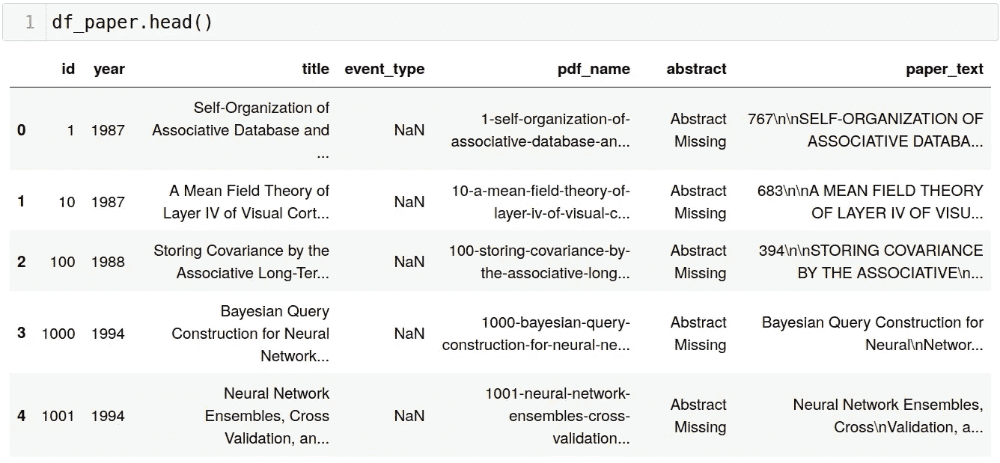

# 为什么先用 SQL 再用熊猫？

> 原文：<https://towardsdatascience.com/why-use-sql-before-using-pandas-c0be893e7774?source=collection_archive---------20----------------------->


大西洋海岸线，石头，数据，更多石头。葡萄牙 2019。(作者供图)

我想把这项工作扩展成一系列教程视频。如果你感兴趣，请**订阅**我的[时事通讯](https://landing.mailerlite.com/webforms/landing/j5y2q1)保持联系。

# 介绍

数据分析是任何数据相关项目中最重要的步骤之一。不考虑上下文(例如，商业、机器学习、物理等。)，有很多种方法可以弄对…或者弄错。毕竟，决策往往取决于实际发现。同时，在你找到之前，没有人能告诉你要找什么。

由于这些原因，尽可能保持过程平稳是很重要的。一方面，我们想快速进入本质。另一方面，我们不想让代码变得复杂。如果清理代码的时间比清理数据的时间长，您就知道有些事情不对劲。

在本文中，我们主要关注**获取数据。**更准确地说，我们展示了如何使用 Python 的两个关键分析库，即 **Pandas** 和 **SQL** ，获得相同的结果。使用一个示例数据集(见后面)，我们描述一些与准备和数据分析相关的**常见模式**。然后我们解释如何用它们中的任何一个得到相同的结果，并讨论哪一个可能是优选的。因此，不管你是否知道一种方法，但不知道另一种，或者你对两种方法都很熟悉，我们都邀请你阅读这篇文章。

## 示例数据集

来自 [Kaggle](https://www.kaggle.com/benhamner/nips-papers) 的“NIPS Papers”将作为一个示例数据集。出于以下原因，我们特意选择了这个数据集:

*   它以 SQLite 文件的形式提供，因此我们可以模拟一个常见的场景，其中数据是从关系数据库(例如数据仓库)中获得的。
*   它包含不止一个表，所以我们还可以展示如何组合数据，这是一个经常遇到的问题。
*   它是不完美的:会有 nulls、NaNs 和其他一些常见的问题……生活；)
*   它很容易理解，只包含两个数据表(“作者”和“论文”)，加上第三个来建立它们之间的*多对多*关系。由于这一点，我们可以专注于**方法**而不是实际内容。
*   最后，数据集也以 CSV 文件的形式出现。

欢迎你自己去探索。然而，由于我们关注的是**方法**，我们将讨论的内容限制在最低限度。让我们开始吧。

# 获取数据

选择数据的方式取决于数据的格式和存储方式。如果格式是固定的，我们在如何选择上就没有什么选择了。然而，如果数据位于某个数据库中，我们有更多的选择。

最简单也可能是最天真的方法是一个接一个地获取它，并将它们作为 CSV 文件存储在本地。这不是最好的方法，主要有两个原因:

*   总数据量不必要地变大。你必须处理不是信息的多余数据(索引、辅助列等)。).
*   根据数据的不同，笔记本电脑将包含大量的清理和处理代码开销，从而影响实际的分析。

这些你都不想要。然而，如果您对数据毫无头绪，那么获取所有数据是最安全的选择。

让我们看看“NIPS”有哪些表和列。

## 表格`authors`

```
import pandas as pddf_authors = pd.read_csv("data/authors.csv")
df_auhtors.info()# returns
<class 'pandas.core.frame.DataFrame'>
RangeIndex: 9784 entries, 0 to 9783
Data columns (total 2 columns):
#   Column  Non-Null Count  Dtype 
---  ------  --------------  ----- 
 0   id      9784 non-null   int64 
 1   name    9784 non-null   object
dtypes: int64(1), object(1)
 memory usage: 153.0+ KB
```

## 表`papers`

```
df_papers = pd.read_csv("data/papers.csv")
df_papers.info()# returns
<class 'pandas.core.frame.DataFrame'>
RangeIndex: 7241 entries, 0 to 7240
Data columns (total 7 columns):
 #   Column      Non-Null Count  Dtype 
---  ------      --------------  ----- 
 0   id          7241 non-null   int64 
 1   year        7241 non-null   int64 
 2   title       7241 non-null   object
 3   event_type  2422 non-null   object
 4   pdf_name    7241 non-null   object
 5   abstract    7241 non-null   object
 6   paper_text  7241 non-null   object
dtypes: int64(2), object(5)
memory usage: 396.1+ KB
```

## 表`paper_authors`

如前所述，该表使用`author_id`和`paper_id`外键链接前两者。另外，它有自己的主键`id`。



图一。显示“论文”表中数据的前 5 行。(图片由作者提供)。

正如我们从图像中看到的(当我们更深入地分析时也是如此)，考虑到`title`列，`pdf_name`列多少有些多余。此外，通过调用`df_papers["event_type"].unique()`，我们知道该列有四个不同的值:`'Oral', 'Spotlight', 'Poster'`或`NaN`(这表示出版物实际上是一篇论文)。

比方说，我们想要过滤掉`pdf_name`以及任何代表非普通报纸的出版物的条目。在 Pandas 中这样做的代码看起来像这样:

```
df = df_papers[~df_papers["event_type"] \
            .isin(["Oral", "Spotlight", "Poster"])] \
        [["year", "title", "abstract", "paper_text"]]
```

这条线由三部分组成。首先，我们传递`df_papers["event_type"].isin(...)`，这是一个*条件*给我们一个二进制掩码，然后我们将它传递给`df_papers[...]`，本质上是过滤行。最后，我们将一个列列表`["year", "title", "abstract", "paper_text"]`附加到剩下的部分(再次使用`[...]`)，从而指出我们想要保留的列。或者，我们也可以使用`.drop(columns=[...])`来指示不需要的列。

实现相同结果的更好的方法是使用 Pandas 的`.query`方法，而不是使用二进制掩码。

```
df = df_papers \
      .query("event_type not in ('Oral', 'Spotlight', 'Poster')") \
      .drop(columns=["id", "event_type", "abstract"])
```

代码看起来更干净，关于`.query`的一件好事是，我们可以使用`@`-符号来引用另一个对象，例如`.query("column_a > @ass and column_b not in @bees")`。另一方面，这种方法有点慢，所以当不得不过度重复时，您可能希望坚持使用二进制掩码方法。

# 使用 SQL 获取数据

熊猫完成了任务。然而，我们有数据库是有原因的。它们经过优化，可以高效地搜索表并根据需要提供数据。

回到我们的问题，我们在这里实现的只是对列和行的简单过滤。让我们将任务委托给数据库本身，并使用 Pandas 来获取准备好的表。

Pandas 提供了三个可以帮助我们的函数:`pd.read_sql_table`、`pd.read_sql_query`和`pd.read_sql`，它们既可以接受查询，也可以接受表名。不支持 For SQLite `pd.read_sql_table`。这不是问题，因为我们对查询数据库级别的数据感兴趣。

```
import sqlite3  # or sqlalchemy.create_engine for e.g. Postgrescon = sqlite3.connect(DB_FILEPATH)
query = """
select
    year,
    title,
    abstract,
    paper_text
from papers
where trim(event_type) != ''
"""df_papers_sql = pd.read_sql(query, con=con)
```

我们来分解一下。

首先，我们需要连接到数据库。对于 SQLite，这很容易，因为我们只提供了一个数据库文件的路径。对于其他数据库，还有其他的库(例如，Postgres 的`psycopg2`或者更通用的:`sqlalchemy`)。重点是创建*数据库连接*对象，该对象将熊猫指向正确的方向并对认证进行排序。

一旦解决了这个问题，剩下的唯一事情就是构造正确的 SQL 查询。SQL 通过`select`语句过滤列。类似地，用`where`子句过滤行。这里我们使用`trim`函数从空格中删除条目，留下所有内容，只留下一个空字符串。我们使用`trim`的原因是针对这个例子的数据内容，但一般来说`where`是放置条件的地方。

使用`read_sql`时，数据会自动`DataFrame`过滤，所有行和列都会进行预过滤，如上所述。

很好，不是吗？

让我们继续前进…

# 加入，合并，收集，组合…

数据通常存储在多个表中。在这些情况下，拼接数据集成为分析之前的附加步骤。

这里的关系相当简单:在`authors`和`papers`之间有一个*多对多*关系，两个表通过第三个，即`papers_authors`链接。让我们来看看熊猫是如何处理案件的。为了便于讨论，让我们假设我们希望找到发表论文最多的“多产”作者。

```
df_authors \
    .merge(
        df_papers_authors.drop(columns=["id"]),
        left_on="id",
        right_on="author_id",
        how="inner") \
    .drop(columns=["id"]) \
    .merge(
        df_papers \
          .query("event_type in ('Oral', 'Spotlight', 'Poster')") \
          [["id", "year", "title", "abstract", "paper_text"]],
        left_on="paper_id",
        right_on="id",
        how="left") \
    .drop(columns=["id", "paper_id", "author_id"]) \
    .sort_values(by=["name", "year"], ascending=True)
```

…对于 Python 来说，这只是一行代码，但这里为了清楚起见，我们将其分成了几行。

我们从表`authors`开始，想要分配`papers`。Pandas 为“组合”数据提供了三个功能。

*   `pd.concat` -按行或列连接表格。类似于 SQL 的`union`。
*   `pd.join` -就像 SQL 的`join`一样连接两个表，但是要求索引是实际的 DataFrame 索引。
*   `pd.merge` -相同，但更灵活:可以使用索引和列进行连接。

为了“得到”到`papers`，我们首先需要将*内*连接到`papers_authors`表中。但是，两个表都有一个`id`列。为了避免冲突(或自动前缀)，我们在加入之前删除了`papers_authors.id`列。然后，我们在`authors.id == papers_authors.author_id`上连接，之后我们也从结果表中删除`id`。进入`papers_id`，我们再次执行连接。这一次，是一位*左派*——加入为我们不想消灭的“无纸化”作者。我们也借此机会过滤前面描述的`df_papers`。然而，保持`papers.id`是必要的，否则熊猫会拒绝加入他们。最后，我们删除所有索引:`id, paper_id, author_id`，因为它们没有带来任何*信息*，并且为了方便起见对记录进行排序。

# 使用 SQL 进行组合

现在，使用 SQL 也有同样的效果。

```
query = """
    select
        a.name,
        p.year,
        p.title,
        p.abstract,
        p.paper_text
    from authors a
    inner join paper_authors pa on pa.author_id = a.id
    left join papers p on p.id = pa.paper_id
        and p.event_type not in ('Oral', 'Spotlight', 'Poster')
    order by name, year asc
"""
pd.read_sql(query, con=con)
```

这里，我们从线`8.`开始“向外”构建它，随后连接其他表，第二个表使用线`11.`修剪。剩下的只是使用`a, p, pa`作为别名进行排序和过滤。

效果是一样的，但是使用 SQL，我们避免了必须管理索引，这与分析无关。

# 数据清理

让我们来看看结果数据集。


图二。组合表的前五行。(图片由作者提供)

新创建的表包含*缺失值*和编码问题。这里，我们跳过修复编码，因为这个问题是特定于数据内容的。但是，缺少值是一个非常常见的问题。Pandas 提供了`.fillna(...)`和`.dropna(...)`等，根据约定，我们可以用不同的值填充 nan。

# 使用 SQL 进行数据清理

数据库也有自己的方式来处理这个问题。这里，`fillna`和`dropna`的对应词分别是`coalesce`和`is not null`。

使用`coalesce`，我们的查询处理数据集，注入任何值以防丢失。

```
"""
select
    a.name,
    coalesce(p.year, 0) as year,
    coalesce(p.title, 'untitled') as title,
    coalesce(p.abstract, 'Abstract Missing') as abstract,
    coalesce(p.paper_text, '') as text,
from authors a
join paper_authors pa on pa.author_id = a.id
left join papers p on p.id = pa.paper_id
    and p.event_type not in ('Oral', 'Spotlight', 'Poster')
order by name, year asc
"""
```

# 聚集

我们的数据集是使用 SQL 准备、“修复”和获取的。现在，让我们假设我们想根据作者每年写的论文数量对他们进行排名。此外，我们还想计算每个作者每年“产出”的总字数。

同样，这是另一个标准的数据转换问题。让我们来看看熊猫是如何处理的。起点是关节和干净的桌子。

```
df["paper_length"] = df["paper_text"].str.count()df[["name", "year", "title", "paper_length"]] \
    .groupby(by=["name", "year"]) \
    .aggregate({"title": "count", "paper_length": "sum"}) \
    .reset_index() \
    .rename(columns={"title": "n_papers", "paper_length": "n_words"}) \
    .query("n_words > 0") \
    .sort_values(by=["n_papers"], ascending=False)
```

我们通过计算空格来计算文章的长度。虽然认为论文中的每个单词都被一个空格分隔是幼稚的，但它确实给了我们一些估计。第`1.`行通过`.str`属性实现，同时引入一个新列。

稍后，我们通过应用一系列操作来形成一个新表:

1.  我们将表缩小到感兴趣的列。
2.  我们使用`name`和`year`列聚合该表。
3.  当我们对剩下的两列应用不同的聚合函数时，我们使用接受带有指令的字典的`.aggregate`方法。
4.  这种聚集导致了双重索引。行`6.`将`name`和`year`恢复到列。
5.  其余列的名称保持不变，但不再反映数字的含义。我们在第`7.`行进行了修改。
6.  对于以前缺失的值，可以安全地假设它们的字数等于零。为了建立排名，我们使用`.query`来消除它们。
7.  最后，为了方便起见，我们对表格进行了排序。

总表如图 3 所示。


图 3。排名是一个汇总表格。(图片由作者提供)

# 使用 SQL 进行聚合

现在，让我们再一次使用 SQL 实现相同的结果。

```
"""
select
    d.name,
    d.year,
    count(title) as n_papers,
    sum(paper_length) as n_words
from (
    select
        a.name,
        coalesce(p.year, 0) as year,
        coalesce(p.title, 'untitled') as title,
        length(coalesce(p.paper_text, ''))
            - length(replace(coalesce(p.paper_text, ''), ' ', '')
            as paper_length
    from authors a
    join papers_authors pa on pa.author_id = a.id
    left join papers p on p.id = pa.paper_id
        and p.event_type not in ('Oral', 'Spotlight', 'Poster')
    ) as d
    group by name, year
    having n_words > 0
    order by n_papers desc
"""
```

这个查询可能看起来比 Pandas 代码更麻烦，但事实并非如此。我们将所有的工作和聚合结合在一个步骤中。多亏了子查询和函数，在我们的特定示例中，我们甚至可以在开始分析之前得到结果。

该查询包含一个*子查询*(第`8.-18.`行)，除了删除`abstract`和引入`paper_length`列之外，几乎所有内容都保持不变。SQLite 没有与`str.count()`等价的词，所以我们使用`length`和`replace`来计算空格和所有其他单词之间的差异。稍后，在第`19.`行，我们将`d`指定为引用子查询表的别名。

接下来，结合了`count`和`sum`的`groupby`语句是我们使用 Pandas 的`.aggregate`方法所做的。这里，我们也使用`having`应用第`21.`行的条件。`having`语句的工作方式与`where`相似，只是它在聚合的“内部”操作，而`where`则应用于一个表，该表是为了删除它的一些记录而制定的。

同样，结果表是完全相同的。

# 结论

熊猫和 SQL 可能看起来很像，但本质是很不一样的。Python 是一种面向对象的语言，Pandas 将数据存储为类似表格的对象。此外，它提供了多种方法来以任何可能的方式转换它们，这使它成为一个优秀的数据分析工具。

另一方面，Pandas 制定数据集的方法只是 SQL 的另一个“化身”。SQL 是一种声明性语言，自然适合于获取、转换和准备数据集。如果数据驻留在关系数据库中，让数据库引擎执行这些步骤是更好的选择。这些引擎不仅针对这一点进行了优化，而且让数据库准备一个干净方便的数据集有助于分析过程。

SQL 的缺点是，在创建数据集之前，可能很难阅读和确定要丢弃的数据和要保留的数据。运行在 Python 上的 Pandas 允许我们将数据集的一部分分配给变量，检查它们，然后做出进一步的决定。

尽管如此，这些临时变量经常会使工作空间变得拥挤不堪…因此，除非您有疑问，否则有充分的理由使用 SQL。

你如何分析你的数据？；)

# 还会有更多…

我计划把文章提升到一个新的水平，并提供简短的视频教程。

如果您想了解关于视频和未来文章的更新，**订阅我的** [**简讯**](https://landing.mailerlite.com/webforms/landing/j5y2q1) **。你也可以通过填写[表格](https://forms.gle/bNpf9aqZJGLgaU589)让我知道你的期望。回头见！**