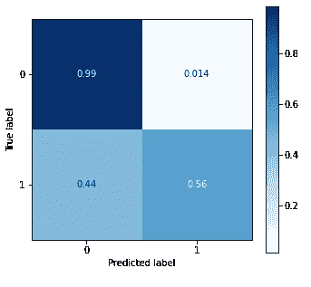
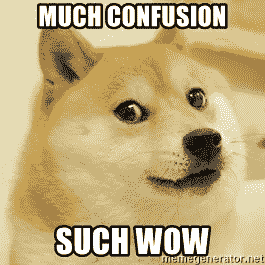
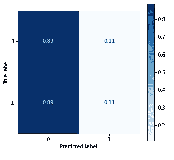
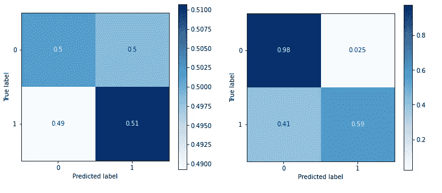

# 为什么使用虚拟分类器是明智之举

> 原文：<https://towardsdatascience.com/why-using-a-dummy-classifier-is-a-smart-move-4a55080e3549?source=collection_archive---------11----------------------->

## *建立基线，将您的模型性能与虚拟模型进行比较*

Y 你早上醒来，点燃你最喜欢的香味蜡烛，煮些咖啡和早餐，打开 Spotify 听些果酱，开始新的一天。在享受早晨的例行公事时，你突然有了一个想法:如果有一种方法可以在一首流行歌曲真正流行起来之前准确预测它，会怎么样？


由[拍摄的罗兰·德内斯](https://unsplash.com/@denesroland?utm_source=medium&utm_medium=referral)在 [Unsplash](https://unsplash.com?utm_source=medium&utm_medium=referral)

因此，像任何其他数据科学家一样，你打开笔记本电脑，从 Spotify 找到一些数据，在预处理数据后，建立一个随机森林模型。你很快扫了一眼你的初始模型的准确度分数，并不期望它很高——因为，让我们面对它，你什么时候第一次就有过一个伟大的模型——但是，那是什么？

```
from sklearn.ensemble import RandomForestClassifier
from sklearn.metrics import accuracy_score#building Random Forest model
clf_rf = RandomForestClassifier(random_state=42)
clf_rf.fit(X_train, y_train)#making predictions and printing accuracy score
y_pred = clf_rf.predict(X_test)
print(accuracy_score(y_test, y_pred)) #0.9371
```

哇，准确率高达 93.7%！牛逼！嗯…也许不是。当我们查看该模型的混淆矩阵(更多信息见下文)时，我们看到了我们最初期望看到的情况:我们的模型的预测能力没有那么强。该模型只在 56%的情况下正确预测了一首流行歌曲，但它正确识别了 99%的不受欢迎的歌曲。这就是为什么我们的准确性分数是倾斜的！



**让我们倒回去一分钟……**

混淆矩阵是什么？它的目的是什么？还有，我们怎么知道 56%的人气预测对我们掌握的数据不好？

**输入虚拟分类器(dun dunnnn…)**

为了能够真正理解并改进我们模型的性能，我们首先需要为我们拥有的数据建立一个基线。毕竟，如果我们不知道我们的模型相对于基线表现如何，我们如何改进它呢？

> *“如果你不能衡量它，你就不能改进它”——开尔文爵士*

这就是为什么建立一个基线模型，我们可以比较我们的模型的性能是如此重要，这就是虚拟分类器发挥作用的地方。

**什么是虚拟分类器？**

伪分类器就像它听起来的那样！它是一个分类器模型，无需尝试在数据中寻找模式即可做出预测。默认模型本质上是查看哪个标签在训练数据集中出现频率最高，并基于该标签进行预测。但是，在我们继续构建虚拟分类器之前，我们需要知道如何将手头的模型与虚拟分类器进行比较。

**那么，我如何比较我的模型和虚拟分类器呢？**

我们可以查看许多指标和图像来比较我们的模型与基线模型的性能。其中一个指标是准确性得分，这是我们之前兴奋不已的 93.7%。

**精度= TP+TN / (TP+FP+TN+FN)**

其他指标包括精确度、召回率和 f1 分数:

**精度= TP/(TP+FP)**

**回忆= TP/(TP+FN)**

**F1 = 2*(召回率*精度)/(召回率+精度)**

一般来说，您使用哪个分数取决于您试图回答的问题和您正在处理的数据类型。在这个预测歌曲流行度的例子中，我们主要关心正确识别流行歌曲，因此回忆分数变得更加重要。有关指标的更多信息，请参考此[文章](/accuracy-precision-recall-or-f1-331fb37c5cb9)。所有这些指标及其组合平均值可从 sklearn 的分类报告中获得:

```
from sklearn.metrics import classification_report
```

**等等，你提到了视觉效果，但我看到的都是分数。你说的是混淆矩阵吗？**

是的。你可以使用的最容易理解的视觉效果之一(我推荐你使用)是混淆矩阵。



图片由 memegenerator.net 提供

混淆矩阵显示矩阵上模型预测的真阳性(TPs)、假阳性(FPs)、真阴性(TNs)和假阴性(FNs)的原始计数或百分比(您可以根据自己的喜好更改下面的 normalize 参数)。你可以使用 scikit-learn 的 plot_confusion_matrix 来创建这个视觉效果。这是我们初始模型的混淆矩阵:


正如我上面提到的，在这里我们可以看到，模型在 99%的时间里正确预测了不受欢迎的歌曲(TNs，左上象限)，但对流行歌曲(TPs，右下象限)的预测为 56%。

现在我们知道了如何通过使用不同的度量和混淆矩阵来比较我们的模型和虚拟分类器，让我们构建一个虚拟分类器。

```
from sklearn.dummy import DummyClassifier
from sklearn.metrics import plot_confusion_matrixclf_dummy = DummyClassifier(random_state=42) 
#establishing random_state for reproducibilityclf_dummy.fit(X_train, y_train)
y_pred = clf_dummy.predict(X_test)
plot_confusion_matrix(estimator=clf_dummy, X=X_test, y_true=y_test,
                      normalize=’true’, cmap=’Blues’)
```



好吧，我们的虚拟分类器似乎把我们的大部分数据归类为不受欢迎的。让我们看一下我们的数据的 value_counts，看看我们是否能找出为什么会出现这种情况。

```
y_train.value_counts(normalize=True)#0 0.885503
#1 0.114497
#Name: is_popular, dtype: float64
```

啊哈！在我们的数据集中，冷门歌曲比流行歌曲多得多，所以虚拟分类器预测冷门歌曲比流行歌曲多。

这解释了为什么我们的随机森林分类器在正确识别不受欢迎的歌曲方面如此出色，但在识别流行歌曲方面却不太成功，而这正是我们最终要做的。

**那么，我们能做些什么来解决这个问题呢？**


Elena Mozhvilo 在 [Unsplash](https://unsplash.com?utm_source=medium&utm_medium=referral) 上的照片

出击救援！这个问题被称为“类不平衡问题”，解决这个问题的一种方法是使用 SMOTE 进行过采样。本质上，我们使用 SMOTE 创建与实际数据相似的合成样本来均衡我们的类。但是，因为我们的数据集中有分类列，所以使用 SMOTENC 会产生更好的结果。

```
from imblearn.over_sampling import SMOTE, SMOTENCsm = SMOTENC(categorical_features=cat_cols, random_state=42)
X_train_sm, y_train_sm = sm.fit_resample(X_train, y_train)
y_train_sm.value_counts(normalize=True)#1 0.5
#0 0.5
#Name: is_popular, dtype: float64
```

**阶级失衡根除了，现在怎么办？**

完美！既然我们已经解决了类不平衡问题，让我们更新我们的虚拟分类器和随机森林分类器。更新虚拟分类器是必要的，因为我们使用它作为基线；它需要基于与我们所有其他模型相同的精确数据。

```
#updating Dummy Classifier with SMOTE’d data
clf_dummy_sm = DummyClassifier(random_state=42)
clf_dummy_sm.fit(X_train_sm, y_train_sm)
y_pred = clf_dummy_sm.predict(X_test)#fitting RF Classifier to SMOTE’d data
clf_rf = RandomForestClassifier(random_state=42)
clf_rf.fit(X_train_sm, y_train_sm)
y_pred = clf_rf.predict(X_test)
```

现在，由于虚拟分类器，我们可以真正解释我们的模型的性能。这是并排的新混淆矩阵(左:虚拟分类器，右:随机森林)。



类别不平衡后虚拟分类器(左)和随机森林(右)的混淆矩阵用 SMOTENC 解决。

我们可以看到，与虚拟分类器相比，随机森林模型在预测不受欢迎的歌曲方面表现出 48%的优势，在预测流行歌曲方面表现出 8%的优势。似乎我们的随机森林模型过度拟合了(哈！有什么新鲜事？).

但是，嘿，回去享受你的早晨吧；您可以调整您的随机森林模型，并在以后尝试一些其他模型！

*如果你想查看我在这里作为例子使用的歌曲人气预测项目，你可以在*[*GitHub*](https://github.com/ebtezcan/dsc-phase-3-project)*上查看。*