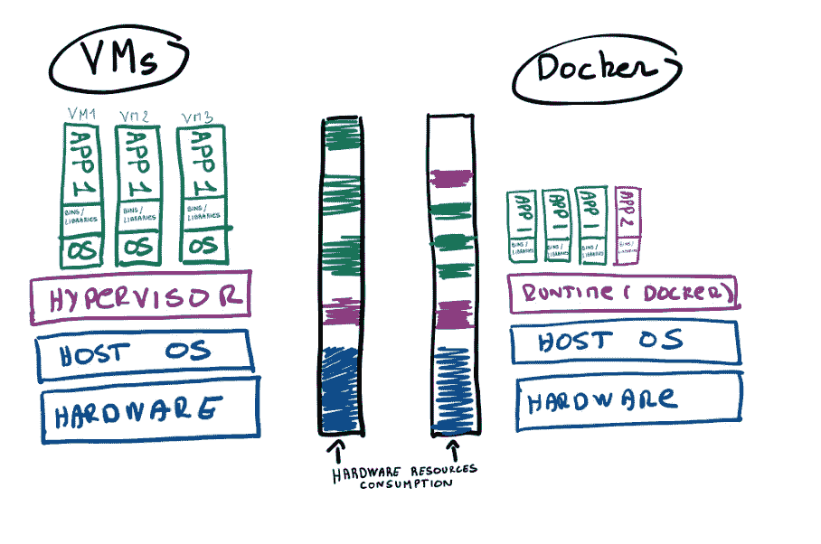

# 为什么要用 Docker 容器进行机器学习？

> 原文：<https://towardsdatascience.com/why-using-docker-for-machine-learning-74c927ceb6c4?source=collection_archive---------6----------------------->

## 解决“Tt 在我的机器上工作”的问题

Annamária Borsos 摄影

# 首先:微服务

在谈论容器化之前，首先要理解微服务的概念。如果一个大的应用程序被分解成更小的服务，那么这些服务或小进程中的每一个都可以被称为微服务，它们通过网络相互通信。微服务方法与难以扩展的整体方法相反。如果一个特定的特性出现了一些问题或崩溃，所有其他的特性也会遇到同样的问题。另一个例子是，当对特定功能的需求严重增加时，我们被迫增加资源，例如不仅用于该特定功能而且用于整个应用程序的硬件，从而产生不必要的额外成本。如果采用微服务方法，将应用程序分解成一组更小的服务，那么这个成本可以降到最低。应用程序的每项服务或功能都是以某种方式隔离的，我们可以在不影响其他应用程序功能的情况下进行扩展或更新。为了将机器学习投入生产，让我们考虑应用程序需要分解为更小的微服务，如摄取、准备、组合、分离、训练、评估、推理、后处理和监控。

# 集装箱化

微服务架构也有它的缺点。当您在一台服务器上开发您的机器学习应用程序时，您将需要与包含依赖关系的微服务相同数量的虚拟机(VM)。每个虚拟机将需要一个操作系统、库和二进制文件，并消耗更多的硬件资源，如处理器、内存和磁盘空间，即使微服务没有真正运行。这就是码头工人进来的原因。如果一个容器没有运行，剩余的资源将成为共享资源，可供其他容器访问。您不需要在容器中添加操作系统。让我们考虑一个由应用程序 1 和应用程序 2(分别为。APP 1 和 APP 2)。如果您想要横向扩展 APP 1 或添加其他应用程序，如下面的方案所示，您可能会受到可用资源的限制，只能使用虚拟机而不是容器。如果你决定向外扩展，只有 APP1 而不是 APP 2(只保留一个)，APP 2 将成为所有容器进程的共享。

虚拟机与容器化(作者图片)

# Docker 和机器学习:解决“它在我的机器上工作。”

创建一个在我们的计算机上工作的机器学习模型并不复杂。但是，当您与想要大规模使用该模型的客户合作时，这种模型可以在全球所有类型的服务器上扩展和运行，这就更具挑战性了。开发完模型后，它可能在您的笔记本电脑或服务器上运行得很好，但在其他系统上就不太好了，比如当您将模型转移到生产阶段或其他服务器时。许多事情都可能发生，如性能问题、应用程序崩溃或没有得到很好的优化。另一个具有挑战性的情况是，我们的机器学习模型当然可以用 python 等单一编程语言编写，但应用程序肯定需要与用其他编程语言编写的其他应用程序进行交互，以进行数据摄取、数据准备、前端等。Docker 允许更好地管理所有这些交互，因为每个微服务可以用不同的语言编写，允许可伸缩性和独立服务的轻松添加或删除。Docker 带来了可复制性、可移植性、易部署性、粒度更新性、轻便性和简单性。

当一个模型准备好了，数据科学家的焦虑是这个模型不能再现真实生活的结果，或者当工作与队友分享时。有时，这不是因为模型，而是因为需要复制整个堆栈。Docker 允许在任何地方轻松复制用于训练和运行机器学习模型的工作环境。Docker 允许将代码和依赖项打包到容器中，这些容器可以移植到不同的服务器上，即使是不同的硬件或操作系统。训练模型可以在本地机器上开发，并且可以通过额外的资源(如 GPU、更多内存或强大的 CPU)轻松移植到外部集群。通过将模型封装到容器中的 API 中，并使用 OpenShift(一个 Kubernetes 发行版)之类的技术部署容器，可以很容易地将模型部署到全球。这种简单性也是支持机器学习应用容器化的一个很好的论据，因为我们可以使用模板自动创建容器，并访问包含现有用户贡献容器的开源注册表。Docker 允许开发人员跟踪容器映像的不同版本，检查谁用什么构建了一个版本，并回滚到以前的版本。最后，另一个论点是，即使它的一个服务正在更新、修复或关闭，你的机器学习应用程序也可以继续运行。例如，如果您需要更新嵌入在整个解决方案中的输出消息，就没有必要更新整个应用程序并干扰其他服务。

## **来源**

https://www.ibm.com/cloud/learn/docker