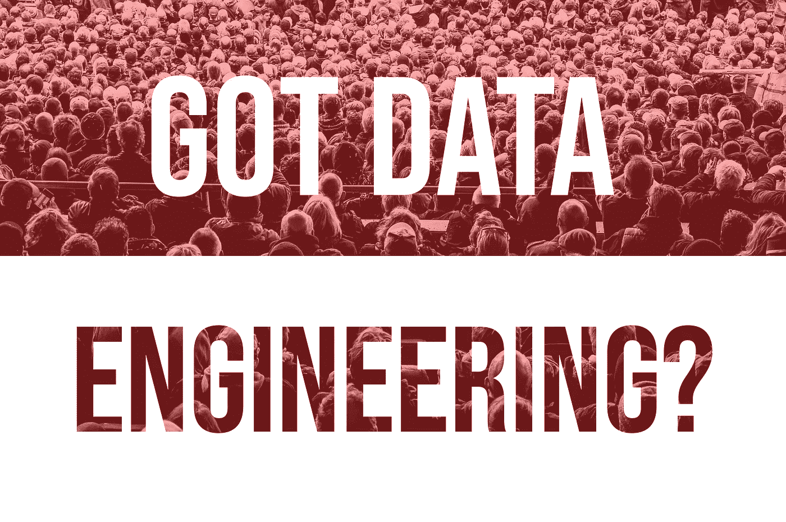

# 为什么数据工程在数据科学之前不流行？

> 原文：<https://towardsdatascience.com/why-wasnt-data-engineering-popular-before-data-science-f4b7ba5ab67a?source=collection_archive---------8----------------------->

## 推动数据工程成为焦点的力量分析

当我在研究数据科学的前景时，我发现了一个有趣的发现:**数据工程现在比数据科学发展得更快，这可能会造成数据工程师的大量短缺。这让我开始思考。这对整个 data domain 意味着什么？这是好事吗？为什么现在发生了？**

由[大卫·拉古萨](https://unsplash.com/@davideragusa?utm_source=unsplash&utm_medium=referral&utm_content=creditCopyText)在 [Unsplash](https://unsplash.com/@davideragusa?utm_source=unsplash&utm_medium=referral&utm_content=creditCopyText) 上拍摄

在很大程度上，数据工程是数据科学的上游。数据工程师构建数据仓库和数据管道的工作使数据分析师、数据科学家和机器学习工程师能够构建模型并从数据中获得洞察力。**为什么这个应该先于数据科学的领域在数据科学越来越受欢迎之后变得越来越受欢迎？**

在这篇文章中，我提供了我对这些问题的看法，并给出了我对在可预见的未来你应该成为数据工程师还是数据科学家的想法。如果你认为数据工程是适合你的职业，我也给你一些数据工程资源(来自真正的专家)。

如果您喜欢视频格式，请在此观看:

## **问题**

不管是好是坏，世界并不总是线性运转的。数据科学变得很性感，因为许多顶尖的科技公司都在用它赚钱。非科技公司看到了数据科学和机器学习提供的价值，他们很快跟进。

不幸的是，对于许多追随这一趋势的公司来说，他们没有数据基础设施来恰当地利用数据科学家。他们招聘的许多数据科学职位最终都涉及到数据工程工作，而他们并不一定是这方面的专家。我个人认为这个错误给这些公司造成了数百万甚至数十亿美元的损失。这也导致了市场上关于数据科学家做什么的许多困惑(这是另一篇文章的主题)。

顶级科技公司在描述他们的机器学习模型的成功时忽略了一点，**他们已经建立了支持数据科学的基础设施。**多年来，他们的员工中一直有数据工程师或类似的角色，有时甚至从公司成立之初就有，以确保数据可以被复杂的工具利用。

这并不是说顶级科技公司只是在更早的时候雇佣了这些角色，他们也是在考虑数据和可扩展性的情况下建立业务的。他们花了大量时间预先考虑如何存储他们的数据，并使其长期对他们有用。这是许多大型科技公司普遍存在的一个主题。他们建立系统在他们特定的商业环境中为他们工作。

例如，脸书、谷歌、微软和相当多的其他巨头都有自己的内部使用的机器学习工具套件。你认为他们没有独特的方法来管理他们收集的大量数据吗？对于这些技术公司中的大多数来说，如果他们不能一致地监控他们的数据，他们的业务根本就不会运转。

## **校正**

这些大型科技企业很早就雇佣了数据工程师，但他们那些不太懂技术的同行呢？

我认为，数据工程的受欢迎程度大幅上升，是因为这些不太注重技术的公司意识到他们犯了一个巨大的错误。在雇用所有这些数据科学家之前，他们需要雇人来修复他们的数据。与尖端科技公司和初创公司不同，大多数其他公司都没有明确设计成规模化。他们需要大量的帮助来升级他们的数据基础设施，使其可用于分析、机器学习，并最终用于人工智能。

可以想象，这不是一个小任务。数据工程的繁荣是对公司在意识到他们还没有准备好之前就直接加入数据科学潮流的一种纠正(如果你对你的公司是否准备好数据科学感兴趣，你可以看看我的视频，[数据科学采用的 5 个阶段](https://www.youtube.com/watch?v=BXmEmIK5aqI))。

## **这是什么意思？**

那么，我对此的看法是积极的、消极的还是矛盾的呢？

我个人认为这对数据科学和 AI 的未来非常好。拥有更好数据的公司可以构建清晰的基础设施，专注于构建有用的模型，而不是临时任务。在我看来，这可能是真正的数据科学或人工智能革命的跳板。

这也有助于进一步明确该领域的角色。数据科学家是该领域许多角色的统称。更清晰地区分他们的工作和数据工程师的工作，为公司和求职者消除了模糊性。

**最重要的是，这向我表明，在可预见的未来，数据科学将变得更加流行**。同样，如果公司在数据科学家的上游管道上投入如此巨大，当他们最终将现有的数据基础设施置于一个好位置时，对数据科学家、机器学习工程师和人工智能研究人员的需求会有多大？

## **为什么是现在？**

需要说明的是，对于许多公司来说，数据工程师并不是一个全新的角色。他们被称为数据架构师、ETL 开发人员、数据库开发人员，甚至 SQL 开发人员。那么，为什么现在会特别流行呢？

老实说，这些都只是猜测，但我认为有几个因素相当重要:

1.  数据科学已经腾飞了这么多。许多公司已经有足够的时间来组建完整的数据科学团队。公司也有足够的时间意识到，这些团队没有创造出预期的价值，因为他们缺乏高质量的数据。
2.  雪花和其他几家大公司已经公开了重点明确的数据项目。其他公司正在意识到市场对数据相关项目的重视程度。
3.  很难不自私地对待最后一个问题，但我认为数据社区正在强调高质量数据的重要性。我在 LinkedIn 上看到过很棒的谈论这个的帖子，我看到过信息化的视频和文章(比如这篇叫做，[为什么数据工程现在很流行？](https://medium.com/bitgrit-data-science-publication/why-is-data-engineering-popular-now-4e41b9f80cf4)，还有这个[类似主题的 Reddit 帖子](https://www.reddit.com/r/dataengineering/comments/o0z8s5/why_is_data_engineering_popular_now/)，我也有不少伟大的嘉宾在[我的播客](https://www.youtube.com/c/KensNearestNeighborsPodcast/featured)上讨论这些事情。我认为，疫情鼓励人们在 LinkedIn 这样的平台上发表更多意见，这真的有助于传播关于数据质量的观点。

## 你应该成为一名数据工程师吗？

既然我在这篇文章中谈论了这么多数据工程的价值，那么一个问题可能会自然而然地出现，**你应该成为一名数据工程师吗？你甚至应该考虑这一点，而不是作为一名数据科学家吗？**

老实说，这真的取决于你的兴趣和能力。首先，您应该探索 data domain 中不同角色之间的差异。我的视频[(由一位数据科学家讲解的)不同的数据科学角色](https://www.youtube.com/watch?v=BZFfNwj7JhE)，应该会给你一些这方面的额外信息。

毫无疑问，我认为对大多数人来说，现在获得一个数据工程的职位比获得一个数据科学的职位更容易。如果你觉得你会喜欢它，那么尽一切办法去做吧。从我的角度来看，大多数数据工程角色比其他数据角色有更多的结构和更清晰的期望。数据工程仍然有许多分析成分，但是，顾名思义，与软件工程相比，数据分析和数据科学确实有更多的相似之处。

尽管如此，从数据工程师到数据科学家肯定是可行的，特别是如果你发现你更喜欢模型构建和探索活动。这是我的朋友 Sundas Khalid 在她的旅程中做的一个视频，名为[为什么我离开数据工程进入数据科学](https://www.youtube.com/watch?v=wN_eu04kXhk&t)。

我不是数据工程师，所以对我的想法有所保留。对于那些有兴趣了解这个职业的人，这里有一个来自西雅图数据工程师的视频，关于如何进入数据工程，名为[数据工程路线图——如何快速学习数据工程(由 FAANG 数据工程师制作)](https://www.youtube.com/watch?v=SpaFPPByOhM&list=PLXRKPZRrlvE5DEOn2LsCMld8F0TsFc_Dh)。

我希望这篇文章能帮助您更好地理解数据环境，尤其是当它与数据工程相关时。如果您喜欢这篇文章，记得在 Medium 上关注我以获取更多类似的内容，并且[注册我的简讯](https://www.kennethjee.com/newsletter)以获得我的内容创作和数据科学行业其他学习资源的每周更新！

下次再见，祝您的数据科学之旅好运！

肯