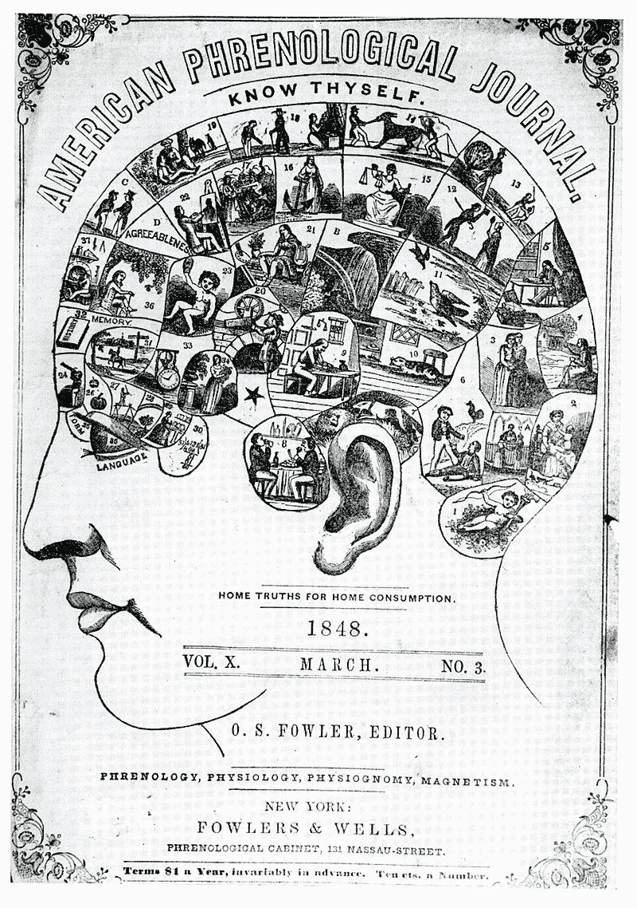

# 为什么我们可能以错误的方式看待大脑

> 原文：<https://towardsdatascience.com/why-we-might-be-looking-at-the-brain-in-the-wrong-way-7c17fb11c259?source=collection_archive---------14----------------------->

## …对人工智能有重要影响

大脑试图从概念的角度来理解世界，其中大部分是用语言，在某些情况下是用数学来表达的。

但我们对世界的概念理解遭遇了一个先有鸡还是先有蛋的问题:这种理解所依据的概念首先来自哪里？你如何用旧的术语建立一个新的理论，并确保它不会受到术语中固有的隐含假设的影响？

洛克、休谟和贝克莱周围的 18 世纪经验主义者仍然对现代科学的思维方式和思考方式施加着强大的影响。根据经验主义，世界是一个等待被发现的客观地方。我们的传感器找到这种客观现实的真实描述，并用概念和抽象的语言表达出来。但是这真的抓住了我们大脑的运作方式吗？

> 哲学是通过语言与我们智力的蛊惑进行的战斗。
> 
> ***路德维希·维特斯坦根***

**

*公共领域。*

*认知神经科学是一个相对年轻的领域，但它所依赖的许多术语都非常古老，其中一些可以追溯到古希腊。19 世纪的伪科学学派 ***颅相学*** 表明了类似的研究大脑的方法是多么危险。 ***颅相学*** 描述了不同的大脑区域负责不同的专门任务的想法，因此左上方的一部分负责编织，而右下方的一部分写诗(见图)。*

*这听起来像是伪科学，但有些人认为现代认知神经科学是在一个不同的、更微妙的层面上实践“新颅相学”，该领域中许多最受欢迎的概念，如注意力、记忆、推理或想象，可以追溯到 19 世纪有影响力的美国心理学家威廉·詹姆斯，如果不是在他之前的思想家的话。我们仍然在寻找大脑中概念的特定功能和算法实现 ***在任何人对大脑实际上如何工作有丝毫线索之前很久就被发明出来了*** 。*

*大卫·马尔的范式 ***概括了这一点，即我们首先从信息处理的角度考虑一个函数，然后寻找一个算法，然后找到完成该工作的算法的神经实现*** (然而，我不想在这里误导任何人，因此必须指出，计算神经科学之父之一的马尔一直强调所有三个组成部分之间的相互作用，并从解剖学层面开始了他的职业生涯)。*

*尽管如此，这种观点在该领域仍然具有广泛的影响力，相应地，我们仍然大多认为大脑是从 ***外到*** 的:这与 ***冯·诺依曼的*** 隐喻大脑是一个信息处理器密切相关。我们认为大脑是一台计算机，它处理感官输入，并根据计算后获得的洞察力采取行动。*

*但是正如神经学家 ***捷尔吉·布扎基*** 在他的巨著 [***中所主张的，大脑从里到外***](https://buzsakilab.com/wp/2019/02/06/the-brain-from-inside-out-by-buzsaki-g/) ，这一观点至少可以说是有局限性的。本文的其余部分将基于****s***书中的观点，探索这种观点如何影响神经科学和人工智能，当前的观点如何不足以捕捉大脑实际在做什么，以及远离它如何可以帮助我们更好地了解大脑。**

> **赢的事情都做了；快乐的灵魂在于行动。
> ***特洛伊罗斯和克瑞西达，第一幕，第一场*****

**输入对我们来说是如何获得意义的？我们如何确定我们感知的事物对我们是否重要？**

**buzáki 的答案非常简单:以对有机体有意义的方式将输入结合在一起的唯一方法是通过行动。 ***行动在意义上奠基我们的感官*** 。生物体对感觉输入做出反应的能力是这种生物体首先发展出传感器的唯一原因。大脑不关心客观世界的真相，只关心帮助它满足需求的信息。大脑不仅处理和权衡证据，而且积极探索。*没有行动就没有感知，感知往往是一个主动的过程，无论是嗅嗅、头部运动、回声定位还是微扫视。***

***儿童最初通过随意踢来了解他们身体的物理特性，并通过无意义的牙牙学语开始了解他们说话的运动技能，这些无意义的牙牙学语包含了人类嘴巴能够发出的所有音节。他们采取行动，当他们的行为通过父母的鼓励性反馈或踢椅子的痛苦反馈与世界上的结果联系在一起时，他们的行动就会以一种有意义的方式扎根。***

***甚至可以说，科学只是随着实验者的进步，扮演了世界的主动操纵者的角色，才真正开始的。伽利略就是一个很好的例子，他从比萨斜塔投掷物体来探索重力的奥秘。***

******

***亚历克斯·瓦西在 [Unsplash](https://unsplash.com?utm_source=medium&utm_medium=referral) 上的照片***

***相应地，一个有机体能够行动的 ***速度*** 决定了其感知的 ***相关时标*** :当你不能足够快地行动时，了解某事是没有意义的，这正是我们在自然界观察到的。树木不能移动，所以用扫视的眼睛实时捕捉周围环境是没有意义的。我们的肌肉速度与我们的认知速度密切相关，有一个进化的论点认为肌肉速度是限制因素。***

***Buzsáki 声称，这里可以为神经科学得出一些基本结论，挑战所谓的以表征为中心的范式:不要问某个神经元或神经元组合计算什么以及这种计算代表什么，我们应该问它做什么。***

***从务实的角度来看，解决这个问题也很重要。当前的神经科学范式塑造了每天设计和进行实验的方式。在许多研究中，例如在记忆研究中，通常给受试者提供刺激，并在处理这些刺激时记录他们的神经活动。然而，从由内而外的角度来看，仅仅记录这种神经活动是不够的，因为它没有任何依据。***

***这就像记录一种失落的语言的文字，而罗塞塔石碑并不存在。***

***根据 buzáki 的说法，大脑的词汇库是由 ***内部生成的动力序列组成的。单词*** 可以被认为是神经元集合水平上的序列。 ***学习不是在暴露于外部刺激的过程中创造新的序列，而是选择哪些预先存在的内部序列需要被补充，以最匹配新的体验*** 。大脑不是一开始就像一张白纸，而是具有预先存在的、稳定的动力。这些动态序列组成了一个字典，里面充满了最初没有意义的单词， ***学习意味着为这些单词创建一个开始有意义的上下文。******

***在不深入研究神经科学细节的情况下，一个例子是海马体和前额叶皮层之间新记忆的形成(海马体在记忆形成中的强烈参与令人印象深刻[表现为海马体损伤的患者显示出完全无法形成新记忆](https://www.youtube.com/watch?v=T80wIGZSYoc&t=10s)):这里海马体充当序列生成器，新皮层学习挑选出那些与经历相关联的序列的子集，将短期序列(海马体)转化为长期记忆(皮层)。***

******

***由[马库斯·温克勒](https://unsplash.com/@markuswinkler?utm_source=medium&utm_medium=referral)在 [Unsplash](https://unsplash.com?utm_source=medium&utm_medium=referral) 上拍摄***

***这里有一个有趣的类似于人工智能中的一些概念。***

***在人工智能的早期，社区专注于基于符号的方法来构建智能系统:世界的抽象符号表示被硬编码到计算机中，教它们获得关于世界的常识和抽象推理。这是一种非常优秀的由外而内的方法，但事实证明，这根本行不通，部分原因是不可能从抽象的推理表得出任何真实世界的行为。***

> ***上面写着:“最初是一个字！”现在我犹豫了！谁来帮我达成一致？
> 不可能，*字*这么高的奖，
> 我必须翻译出来，否则(……)
> 天助我！我现在明白了我所需要的
> 并写下保证:在开始是*契约！* ***——歌德、浮士德******

***同样，很有可能从抽象开始，向下移动到行动，最终无法解释大脑。***

***人工智能和由内向外方法之间的另一个有趣的相似之处是以一种称为 ***储层计算*** 的神经网络架构的形式存在。油藏计算机由一个输入层、一个隐藏层和一个输出层组成，很像普通的[递归神经网络](/the-power-of-recurrent-neural-networks-1ef056dae2a5?source=friends_link&sk=d3978892e19707bb619184b4abeb6b10)。但是，由于所谓的丢失和爆炸梯度问题，递归神经网络很难通过反向传播进行训练。***

***规避这些梯度问题的一个聪明的方法是简单地 ***根本不训练隐藏层，在随机初始化之后保持它固定*** 。模型 的 ***库于是构成了一个固定的、非线性的动力系统，包含了大量不同的预先连线的动力序列(你可以把它想象成一群相互交流的神经元)。然后 ***学习的目的不是从零开始*** 学习动态，而只是教会网络的输出层 ***巧妙地将油藏中已经存在的动态匹配到数据中的相关序列*** 。******

**请注意与 buzáki 观点的相似之处:根据他的说法，大脑已经通过其预先布线和数十亿神经元在数百万亿个连接中耦合在一起的疯狂组合财富，将大量复杂的非线性动力学带到了桌面上。当我们学习行动时，我们不需要从零开始，而是通过将它们与现实世界中有用的结果相匹配，让它们获得意义。**

**这也是一种规避神经网络中经常面临的 ***灾难性遗忘*** 问题的方法:当学习新的东西时，他们倾向于破坏他们以前学习的能力，即使新任务原则上与旧任务相对相似。从由内而外的大脑的角度来看，如果学习新的东西意味着学习全新的动态，这将破坏旧的动态，但如果这意味着将新学到的东西整合到预先存在的动态模式中，灾难性的遗忘就会自然避免得多。**

**深度学习中另一个指向[类似方向的有趣的最新发展是边缘弹出算法](/5-exciting-deep-learning-advancements-to-keep-your-eye-on-in-2021-6f6a9b6d2406):这种算法不是通过调整权重，而是通过简单地删除对网络性能没有任何意义的连接来训练一个足够大的随机初始化的网络(类似于[彩票假设](https://arxiv.org/abs/1803.03635))，有效地 ***发现一个预先配置的子网执行网络任务，而不需要任何训练。*****

**必须指出的是，储层计算近年来已经过时，LSTMs 和 GRUs 等架构是建模顺序数据的更受欢迎的选择。然而，我认为由内向外方法的想法仍然可以为人工智能和机器学习社区提供一些灵感。谁知道呢:类似的架构可能会在未来的某个时候卷土重来。**

> **"强有力的理由产生强有力的行动。"
> ***约翰王，第三幕，第四场*****

****

**胡安·鲁米姆普努在 [Unsplash](https://unsplash.com?utm_source=medium&utm_medium=referral) 上的照片**

**buzáki 走得更远，认为我们的许多高级推理能力，如思维和认知，最终可以被视为内化的行为。**

**记忆可以通过世界上的事件被映射到预先存在的动态模式来建立，这些动态模式构成了与其内容最接近的匹配。未来的计划甚至可能被理解为 ***对反向*** 行动的片断记忆。**

**内化行为给人类带来了巨大的进化优势 [***想象一个假想的未来***](/the-bayesian-brain-hypothesis-35b98847d331#362f) ***。*** 我们想象中的计划是 ***假设的行动序列，不需要在现实中表演，而是可以在模拟的世界内部表征中尝试。这允许足够复杂的大脑根据对其后果的 ***预测*** 来选择行动，整合过去的经验以及来自环境的感官输入。行动的可能结果变得越复杂，大脑增加的循环和复杂程度就越多，但最终目的是一样的。*****

**抽象思维可能进一步作为空间思维的副产品出现(正如我在关于[思维的几何学的文章](/the-geometry-of-thought-700047775956)中更深入地讨论的那样，以及芭芭拉·特沃斯基在她的书《运动中的思维》中论证的那样)，并且与海马体和内嗅皮层中物理位置和导航的空间处理有关。**

**这一点得到了以下事实的支持:前额叶皮层(通常被认为负责所有使我们成为人类的东西)是建立在与运动皮层相似的神经架构上的。虽然初级运动皮层直接投射到脊髓和肌肉，但前额叶皮层却间接投射到边缘系统的大脑区域，如下丘脑、杏仁核和海马，从而作用于我们负责情绪调节的高级大脑区域，而不是直接作用于我们的肌肉。**

> **"我一直认为人们的行为是他们思想的最好诠释者."
> ― ***约翰洛克*****

**大脑已经变得非常擅长思考和理解现实。但是，如果大脑存在的主要原因是计算积分或炫耀他们的一般知识，他们就不会在这里了。**

**这就是为什么我认为 Buzsáki 提出了这样一个令人信服的案例:如果我们将大脑视为一个巨大的动态库，其主要目标是通过行动与有意义的经验相匹配，这直接使得大脑在实践中实际上是有用的，这使他的理论植根于进化论。**

**我们对行动和智力的超脱可能被视为一个世纪以来身体和精神之间笛卡尔式分裂的副产品。现在是时候克服这一概念分歧了，因为行动可能真的是智力的核心。观察神经科学和人工智能的下一次突破是否真的会是行动驱动的，将更强的由内而外的方法整合到它们的中心概念中，这仍然是更加令人兴奋的。**

**最后一点，我必须强调，在本文的范围内，我不得不省略许多有趣的细节，我只能建议更深入地阅读 buzáki 的书或在 Youtube 上看到他的一个演讲(例如[这里](https://www.youtube.com/watch?v=5ZDfXxDfj74&feature=youtu.be)或[这里](https://www.youtube.com/watch?v=pJhlMsc2UKQ))。我最近还在我的播客上和他交谈过，更详细地探讨了他的许多想法(和一些神经科学)。**