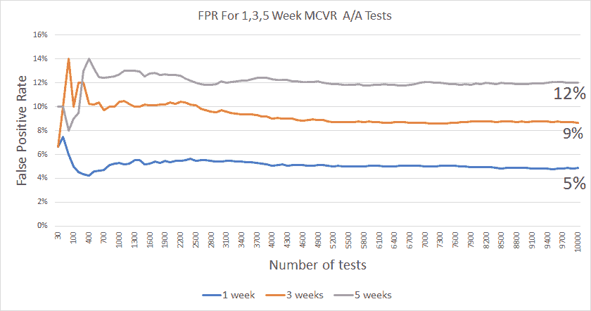

# 为什么我们不再将转换率作为主要指标

> 原文：<https://towardsdatascience.com/why-we-moved-away-from-conversion-rate-as-a-primary-metric-14b2d6cb5996?source=collection_archive---------29----------------------->

## 违反 AB 测试的独立性假设和改变贵公司的主要度量标准的影响

乔纳森·彼得森在 [Unsplash](https://unsplash.com?utm_source=medium&utm_medium=referral) 上拍摄的照片

改变任何公司的主要指标都不是一件简单的事情。为什么你会问？原因有很多，但我想到了其中的一些:

*   该公司长期以来一直使用这一指标
*   预测是根据历史值做出的
*   团队 okr 包括反对它的目标
*   人们理解指标和推动指标的杠杆
*   很容易发现与期望值的偏差
*   可以快速确定指标变化的原因

单是这份候选名单就足以让任何人大汗淋漓了！所以想象一下，当我在 Gousto 的第一个月，我们菜单部落的产品负责人建议我们的主要指标，菜单转换率(MCVR)可能是我们在实验中使用的错误指标，因为它违反了统计独立性的假设时，我有多惊讶。

## 现在用什么侵犯了谁？？？

当你使用转化率作为实验的衡量标准时，你会有意识地或下意识地这样做，假设你有一个独立观察的样本。

这基本上意味着一个事件的结果对另一个事件的结果没有影响。

> 例子:想象掷骰子两次。第一轮的结果不会影响第二轮的结果，因此我们可以说这些事件是独立的。

任何一家拥有“粘性”产品的公司，如果其商业模式依赖于客户每周的回访，都有违背这一假设的风险。这不是您可以选择忽略的“最佳实践”类型的决策。用于分析 AB 检验结果的大多数推断性统计检验(如 2 样本 t 检验)的基础是假设观察值相互独立。

也许这还不清楚，或者你认为这对你的测试没有影响。让我向你保证，即使是最轻微的依赖也会导致严重的结果偏差

## 为什么我们违反了独立的假设(AOI)

我们是一项基于订阅的服务，客户每周都会回来订餐，因此我们很自然地将每周 MCVR 作为我们的主要 KPI。我们没有考虑每日或基于时段的 MCVR，因为大多数客户一周订购一次，所以即使这发生在多个时段，也可以在该周只统计一次。接下来的一周，顾客(有些是新顾客，有些是前一周的顾客)会回来下订单，我们会再次把他们视为独特的顾客。在整个实验过程中，我们会一遍又一遍地这样做，通常是 3-5 周。在实验结束时，我们将对每周独立访客和订单的总数求和，然后除以其他，得出我们的 MCVR*。

**注意:计算 MCVR 的另一种方法是，只取整个实验期间的唯一用户和唯一订单，并将前者除以后者。这种方法也不是没有局限性。虽然观察是独立的，但你忽略了订单频率，但这超出了本文的范围。*

起初这似乎是一个合理的方法，如果我们没有一个粘性的产品，并且从第 1 周、第 2 周开始的用户再也看不到(至少在测试期间)，这可能是一个合理的方法。但是随着用户一周又一周的回来，我们的观察并不是独立的。为什么你会问？

> *好吧，想想看——如果我们开发了一个功能或降低了我们的价格或做了其他事情，说服你购买，*我们做的那件事*，它已经在你身上起作用了，所以一次又一次地计算你将意味着我们对你作为一个数据点的观察是不独立的，我们正在偏向我们的结果。换句话说，客户在某一周做的事情会影响他们在下一周做的事情。我们在 MCVR 的主要 KPI 无效。*

照片由[乔丹·罗兰](https://unsplash.com/@yakimadesign?utm_source=medium&utm_medium=referral)在 [Unsplash](https://unsplash.com?utm_source=medium&utm_medium=referral) 上拍摄

## 这有什么影响，实际上严重吗？

它增加了你的假阳性率，FPR(或 1 型错误率)，所以是的，它是严重的！Frequentist 统计已经依赖于接受基于你设置的显著性水平，所有获胜结果的某个百分比将是假的——通常是 5% (α=0.05)。用不独立的观察来运行测试会导致你的 1 型错误率的膨胀。

> 假阳性率是假设无效(对照)假设为真时拒绝该假设的概率。如果你运行了 100 个显著性水平为 5%的实验，并且有 10 个获胜者。其中 5 个可能是假阳性*。问题是，哪 5 个。概率不是婊子吗！

我知道我们的假阳性率高于我们根据我在别处读到的论文研究而设定的阈值。我只是不知道差了多少。

这是对世界的一种简化的看法，实际上，它们可能都是假阳性，或者都不是，或者介于两者之间。

## 发现我们真正的假阳性率

如果我们要改变实验的主要指标，我们需要证明这是错误的指标，并且我们正在做出错误的决定。

我们证明这一点的方法是获取一些历史数据，并对其进行 A/A 测试模拟，以显示我们真正的假阳性率是多少。使用一个随机的和最近的数据集，我模拟了 30，000 个 A/A 测试，用于 1，3 和 5 周的“实验”。

对于 1 周的模拟，我预计误报率为 5%，因为我们只计算一次用户(独立的)，我将显著性水平设置为 5%。除此之外，我唯一的期望是，我们会看到超过 5%的“成功测试”，因为我们在一次又一次地计算回来的用户。

## 结果

正如我预期的那样，我们 1 周的假阳性率是 5%，但是我发现我们 3 周测试的假阳性率高达 9%，5 周测试的假阳性率接近 12%(如下图 1 所示)。

> 把这个放在上下文中。成功测试的行业平均水平在 20–25%之间，这意味着可能有高达 50%的成功测试有可能是假成功，而不是只有 20%。

下面的图 1 开始时有点“起伏不定”，但随着模拟次数的增加，假阳性率开始稳定，我们可以看到，在我们的随机数据集上，即使没有进行任何实验，我们也将找到“赢家”。

图 1:1、3 和 5 周 A/A 测试的假阳性率

有了这个新的世界观，我们开始寻找新的度量标准。

## **新指标——每用户平均订单数(AOPU)**

我之前提到过，我们忽略了订单频率，只关注转化率(不正确的从属版本)，所以我们的目标是找到某种类型的混合(复合)指标，来考察独特的转化率和订单频率。我知道这个标准是什么，奥普，我只是需要帮助每个人理解它。接下来是痛苦的几个月，我写了一些关于我们为什么远离皈依的内部文章。新的衡量标准是什么？是怎么算出来的？为什么会更好？TL；我论文的博士版本是:

> **AOPU =总订单数/独立用户数=转化率 x 订单频率**
> 这一提议的指标允许我们监控转化率**和**订单频率**的灵敏度和变化，而**不会违反独立性假设，从而为我们提供一个更全面、统计上更合理的指标。

我们已经成功地使用了 AOPU 将近 8 个月了。会议中的对话、OKRs、分析和实验都是基于这个新的标准。围绕菜单转换的讨论已经成为过去。

这很可能是我一生中做过的最恐怖的作品之一，但我必须承认，这是最有收获的作品之一。

## 最后的想法

我们不是世界上唯一一家依靠用户一次又一次回来的基于订阅的企业。你甚至不需要订阅模式就能拥有“粘性”产品。超市、亚马逊、Spotify、Slack、网飞等都有定期回头客。无论你的商业模式是什么，如果你有定期回头客，并且你像我们一样关注每日/每周的转换率，对你自己的数据进行一些 A/A 测试，看看你自己的 FPR 是什么样的。谁知道呢，你甚至可能需要改变你自己的主要指标。

你可以在 [**Twitter**](https://twitter.com/DodoNerd) 上关注我，或者用最少的努力在 Medium 上关注我和 [**废话连篇**](https://medium.com/crap-talks) 。