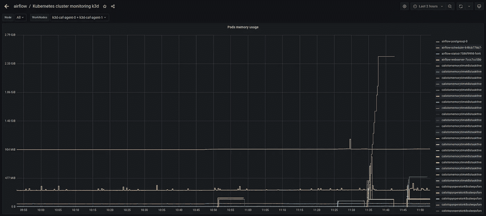

# 为什么我们必须选择 Kubernetes 气流执行器

> 原文：<https://towardsdatascience.com/why-we-must-choose-kubernetes-executor-for-airflow-28176062a91b?source=collection_archive---------2----------------------->

## 在生产环境中部署气流的技巧

尼科沃尔波尔[皮克斯拜](https://pixabay.com/pt/?utm_source=link-attribution&utm_medium=referral&utm_campaign=image&utm_content=3382863)

首先，我说的是一个坚实的、可扩展的气流基础设施。

> 如果你需要一点气流，最多 50 个 Dag，最多 2 个开发者建造 Dag。你不需要在意我会说什么，只要用 docker-compose，ec2，或者局部用芹菜来调配你的气流，你就开心了。

以下是我在生产中部署气流的黄金法则:

*   使用头盔进行气流展开
*   创建外部数据库。不要使用 PostgreSQL 容器。
*   在托管云中部署 Kubernetes。
*   **使用 Kubernetes 执行程序**

在这篇文章中，我将集中在最后一个。

**我关心的哪些问题有解决方案:**

1 —控制 Kubernetes 集群上的资源(内存、CPU)。
2 —许多开发人员从事不同的项目，并有不同的认可级别。所以他们使用不同的运营商和方式来建立数据管道。
3 —等幂和一致性 Dag

**让我们一起去解决问题:**

**我们在云端一般会付出什么？**资源(内存、CPU)

因此，当有人使用 PythonOperator 创建一个包含许多任务的 DAG 来构建数据框时。您知道这个 DAG 使用了多少内存和 CPU 吗？如果你正在处理芹菜，那就复杂了，因为我们在同一个 worker 中运行许多任务。在 Kubernetes 中，每项工作都是一个 pod，因此您需要预先设置工人资源，这是一个问题，因为我们有多个任务需要不同的资源。

然后，最好使用 **Kubernetes executor** 和 **REQUIRE** 当有人编写 DAG 时，他们必须设置资源。这样，每个任务都是 Kubernetes 上的一个 pod，具有不同的请求资源。

请看这个简单的示例(您可以在气流默认示例中找到更多信息):

酷，所以你问我:我怎么能强迫某人设置资源？当然是利用你的说服力。不，这可以工作，但您可以在您的 CI 管道上使用阿德单元测试并进行验证。这个比第一个选项容易=)。

现在，有人会对我说:在我的公司，我们使用气流只是为了编排。我们使用芹菜，我们只使用 KubernetesPodOperator，我们不在 DAGs 中进行转化。然后，当我们需要使用其他操作符时，首先我们测量 de 资源消耗，我们知道使用它是安全的，因为任务使用低资源，并且我们可以通过并行度限制来控制同一工作机上的任务数量。

**PLUS:**air flow Kubernetes executor 比 celery 更具可伸缩性，即使我们使用 KEDA 来伸缩 celery(另一篇文章的主题)。如果你理解了最后一段，你可以想象为什么我能保证它。如果您使用默认 HPA 进行气流缩放，您就不了解 celery (scheduler、Redis、worker)是如何工作的。做一个测试，用一个使用高 CPU 的任务构建一个 dag，您将看到 HPA 扩展更多的工作线程。但我们没有更多的任务，我们有一个任务运行使用更多的 CPU，另一个工人不会帮助我们。

最后同样重要的是，**监控**是关键。我用 Prometheus 和 Grafana，它得到所有吊舱指标和气流 Postgres 指标。指标在本地开发和生产环境中非常重要。
开发者需要本地的这些度量来设置初始资源。该公司需要监控以下问题的答案:
哪些任务(pod)消耗更多内存(max)？哪些任务(pod)消耗更多 CPU(最大值)？
哪些任务(pod)花费了很长的时间和资源(max)？
我的任务消耗 ABC 曲线(max)是多少？
有了这些答案，公司可以为 Dag 校准资源，并知道他们需要优先处理哪些任务，以及根据资源消耗进行重构排序。
不同的公司有不同的必需品问题，你可以和团队交流，了解必需品。

通过这种部署，开发人员需要更多地关注幂等性。他们需要创建一致的任务，每次执行都花费相同的资源，因此，当运行这些任务时，他们通常会获得相同的结果。

气流 Grafana 仪表板—自行创建

图表中的这条红线是当我们不设置任务中的资源限制时可能发生的情况。这个任务需要更多的资源，如果库伯内特需要这些资源来完成其他任务，他会杀死这个豆荚。我们可以有一个全局配置来创建 pod 限制，但重要的是:任务不能完成工作，或者它会花费不必要的资源。

因此，我建议您可以优化您的资源，因为这是我们向云支付的费用。您可以确切地知道哪些任务是瓶颈，并且可以对监控您的集群有更深入的了解。
***我并不是说使用 Kubernetes executor 更容易，您的团队需要更多的 Kubernetes 和容器知识，规则流只是一个批处理编排。因此，流式传输或批处理间隔最长可达一分钟，还有其他更好的解决方案，也许您只能创建管道来监控这些流式传输管道。

来源:

[阿帕奇气流舵图——舵图文档](https://airflow.apache.org/docs/helm-chart/stable/index.html)

[气流执行者解释|阿帕奇气流指南(天文学家. io)](https://www.astronomer.io/guides/airflow-executors-explained)

[文档|阿帕奇气流](https://airflow.apache.org/docs/)