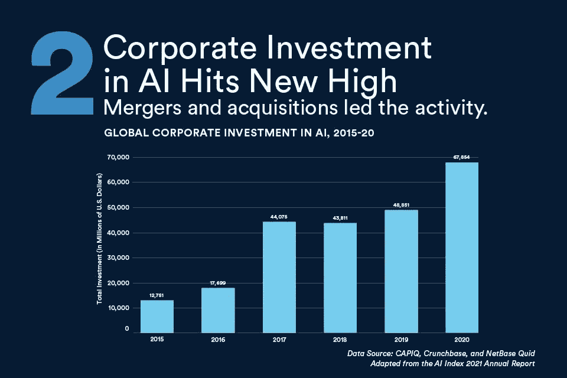
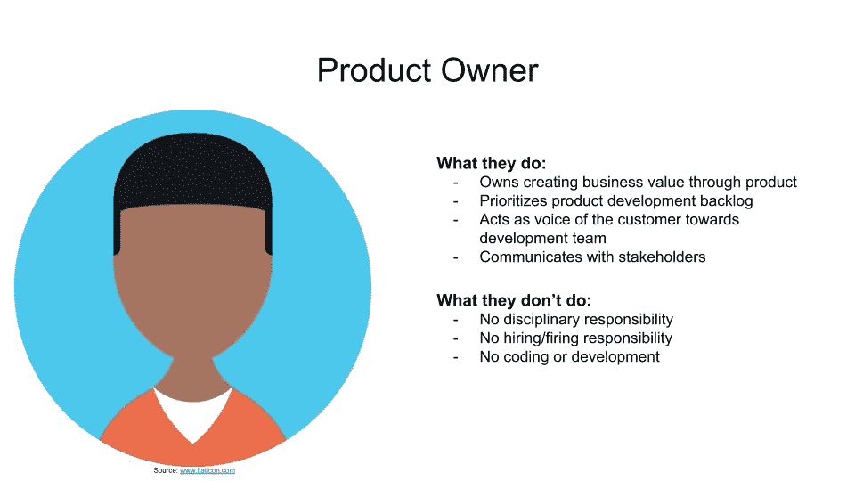
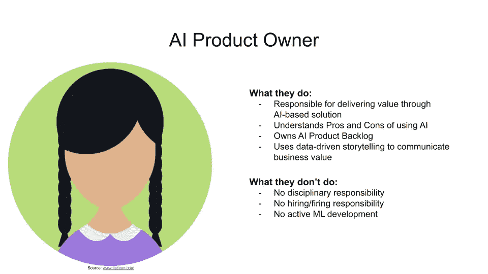
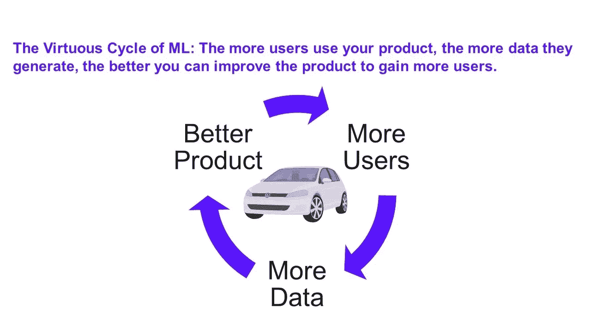
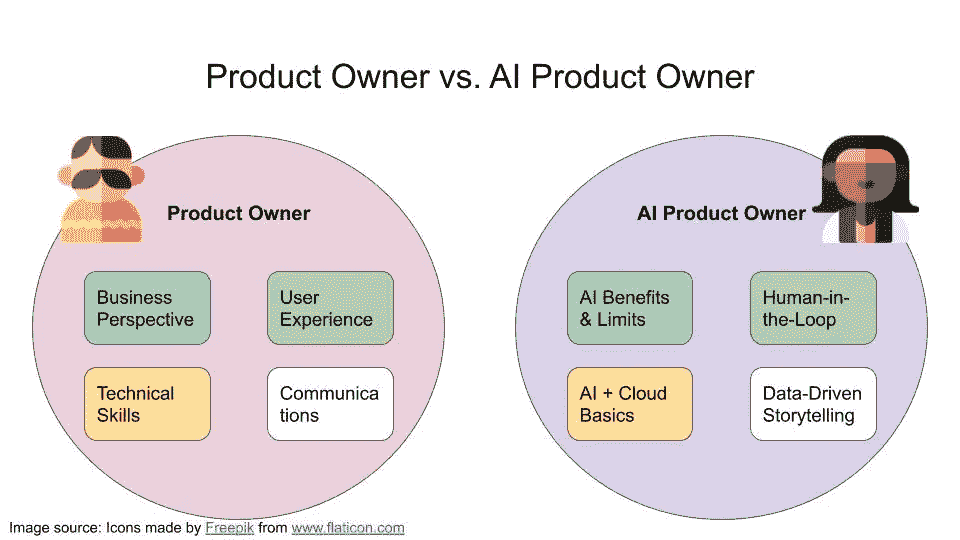
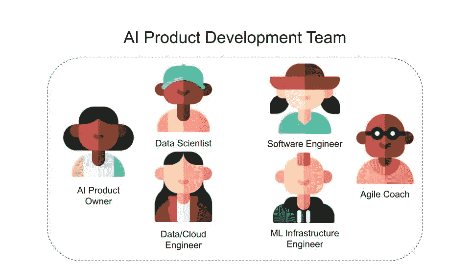
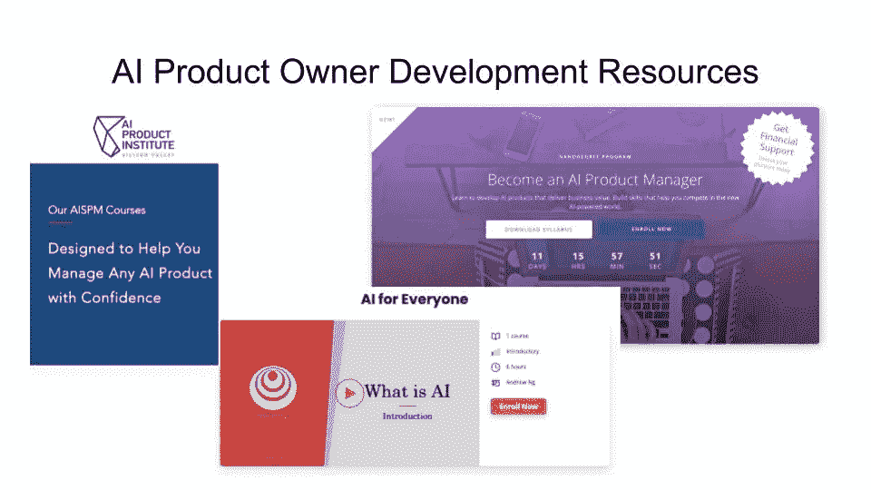

# 为什么我们需要更多的人工智能产品所有者，而不是数据科学家

> 原文：<https://towardsdatascience.com/why-we-need-more-ai-product-owners-not-data-scientists-e481cef39b90?source=collection_archive---------1----------------------->

## 关于人工智能产品开发中一个至关重要但未被充分利用的角色

如果你认为人工智能(AI)是昙花一现的炒作，那就再想想吧。斯坦福 2021 年人工智能指数显示，全球企业人工智能投资达到创纪录的 670 亿美元。去年的人工智能投资甚至超过了 2019 年的历史最高水平 40%。根据[普华永道第 22 届全球首席执行官调查](https://www.pwc.de/de/ceosurvey2019/pwc-22nd-annual-global-ceo-survey-report.pdf)，77%的财富 500 强首席执行官计划开始或已经采用人工智能计划。鉴于对人工智能的投资稳步增加，数据科学面临交付切实成果的压力。

来源:[10 大排行榜 AI 状态](https://hai.stanford.edu/blog/state-ai-10-charts)。

将人工智能集成到你的业务中的潜在回报是巨大的。根据 [2020 年麦肯锡全球人工智能调查](https://www.mckinsey.com/business-functions/mckinsey-analytics/our-insights/global-survey-the-state-of-ai-in-2020)，人工智能为一个精英人工智能从业者群体贡献了超过 20%的 EBIT。此外，这些人工智能高绩效者比竞争对手在人工智能计划上花费更多的预算。他们也有能力在内部开发人工智能解决方案，而不是依赖外部供应商。

安迪·凯利在 [Unsplash](https://unsplash.com/?utm_source=unsplash&utm_medium=referral&utm_content=creditCopyText) 上的照片

随着数据科学的成熟，该领域真正实现宣传的压力也越来越大。该领域需要提供切实的业务优势。人工智能产品成功的一个重要但未被充分利用的角色是人工智能产品所有者(AI PO)。

在这篇文章中，我分享了我对 AI POs 的重要性和所需技能的看法。AI POs 不是只给 AI 产品开发团队配备数据科学家，而是增加了成功开发 AI 产品的机会。文章描述了如何建立成功的 AI 产品团队，AI PO 的角色，以及学习成为 AI PO 的资源。

首先，我们来分析一下一个传统产品负责人和一个 AI 产品负责人的角色。

# 产品负责人 vs. AI 产品负责人

产品负责人的角色在 [Scrum](https://www.scrum.org/resources/what-is-scrum) 框架中定义。Scrum 是一种流行的敏捷开发方法。该框架需要产品所有者、Scrum Master 和开发人员的角色。

Scrum 非常注意在 Scrum 主管和产品所有者之间划分产品和人员的职责。产品负责人负责[最大化 Scrum 团队的价值](https://scrumguides.org/)。她创建了一个产品愿景，与利益相关者沟通，并对[产品积压](https://www.scrum.org/resources/what-is-a-product-backlog)进行优先排序。Scrum alliance 声明 PO 需要业务、用户体验、技术和沟通技巧。

作者图片

AI PO 角色是常规 PO 角色的扩展、专门化版本。AI POs 继承普通 PO 的职责。他们扩展它们以最大化基于人工智能的产品的影响。

基于人工智能的产品不同于传统的软件产品。首先，AI 使用数据隐式地学习模式，而不是开发者显式地实现规则。其次，基于人工智能的产品有机会随着输入数据不断改进。第三，机器学习让我们能够建造这种质量的产品，像[语音助手](https://www.wired.com/story/amazon-alexa-2018-machine-learning/)、[自动驾驶](https://www.dfki.de/en/web/research/competence-centers/autonomous-driving/)或[医疗诊断](https://emerj.com/ai-sector-overviews/machine-learning-medical-diagnostics-4-current-applications/)。因此，销售点需要调整他们的技能来提供基于人工智能的产品。

作者图片

那么，AI POs 需要哪些技能呢？首先，人工智能 POs 需要了解基于人工智能的应用程序的潜力和缺陷。AI 擅长什么，奋斗在哪里？基于人工智能的解决方案可以解决哪些业务问题，它被放错了位置？

接下来，AI POs 需要特别注意监控 AI 模型的预测。人工智能基于统计假设，因此预测总是带有一定程度的不确定性。根据上下文，一个错误的预测可能会导致严重的后果。人工智能 POs 应该能够设计人工智能应用程序，以便在需要时包括人类决策。

> 在生产环境中以 ML 为核心的产品仍然是一个新生的学科，因此在这个领域运营的项目经理和企业家都在学习很多东西。—[Mor](https://medium.com/u/c21e7057df95?source=post_page-----e481cef39b90--------------------------------)，AI 创业者

另外，基于人工智能的产品是动态的。他们衡量顾客对他们预测的反应。人工智能产品还需要考虑对数据的持续调整。在设计基于 AI 的产品时，AI POs 需要牢记 AI 的良性循环。智能产品的真正力量来自于它们基于新数据不断改进的能力。

人工智能飞轮允许基于人工智能的产品不断改进。作者图片

技术方面，AI POs 的技术知识越多越好。AI POs 既不需要以前是开发者，也不需要拥有计算机科学硕士学位。然而，很难理解用人工智能实现什么是容易的，什么是几乎不可能的。如果没有适当的技术背景，人工智能产品的可行性很难评估。请注意，这里有不同的意见，其他人认为技术知识既不需要采购订单也不需要人工智能采购订单。

最后但同样重要的是，AI POs 理解 AI 开发不同于软件开发工作流。AI 开发测试不同的假设，快速迭代。传统的软件开发可以遵循更加模块化和结构化的方法。理解 ML 开发不像传统软件开发那样是线性的，这对于与涉众交流期望和按时交付价值是至关重要的。

> *“由于人工智能项目的开发生命周期是基于“搜索”而不是“规划”，公司需要受过训练的专业人士将产品视为优化问题，而不是编程问题。”*——[阿德南·博兹](https://medium.com/u/bba6e2793c3a?source=post_page-----e481cef39b90--------------------------------)，艾产品管理学院创始人

普通采购订单与人工智能采购订单的重点领域。作者图片

在理解了 AI PO 的角色之后，让我们来分析 AI PO 在 AI 产品团队中是如何工作的。

# 构建数据产品团队

交付基于人工智能的产品取决于组建跨职能团队。跨职能团队由具有互补技能和角色的专家组成。我经常看到一心一意的数据科学团队努力实现他们的模型。要求数据科学家完成将基于人工智能的产品带给客户所需的所有角色是失败的秘诀。

模范人工智能产品开发团队。作者图片

相反，AI PO 通过最大化商业价值来支持数据科学家。上图展示了一个由跨职能专家组成的原型人工智能产品开发团队。不要纠结于角色，它们可以从一个产品变成另一个产品。有些产品可能需要 AI UI/UX 设计师，有些可能不需要。但是，我确实相信所有的 AI 产品团队至少应该有一个 AI PO。您还可以看到，数据科学家只是团队中的一个角色，还有许多其他角色。

现在你知道人工智能程序是做什么的了，继续读下去，看看你能从哪里学到成为人工智能程序的技能。

# 人工智能 POs 的资源

正如你所看到的，人工智能 POs 可以在人工智能产品的生产中发挥重要作用。幸运的是，有很多资源可以教你成为一名 AI PO:

*   [AI 解决方案产品管理](https://www.aiproductinstitute.com/courses)由[阿德南·博兹](https://www.linkedin.com/in/adnanboz/)
*   [AI 产品经理](https://www.udacity.com/course/ai-product-manager-nanodegree--nd088) Nanodegree by [Udacity](/www.udacity.com)
*   [AI for every one](https://www.coursera.org/learn/ai-for-everyone)by[deep learning . AI](https://www.deeplearning.ai/)

首先我要推荐的是[阿德南·博兹](https://medium.com/u/bba6e2793c3a?source=post_page-----e481cef39b90--------------------------------)的 AI 产品管理学院。Adnan 在斯坦福大学从事教学工作，在英伟达工作，成绩斐然。他还创办了人工智能产品管理研究所，开发人工智能 POs。Adnan 帮助有抱负的产品所有者进入人工智能领域，并收到了非常积极的学生反馈。

上面提到的爱宝资源。作者图片

Udacity 纳米学位看起来很全面，很有价值。我听到了关于该计划的良好反馈。该计划需要两个月的时间，涵盖了各种人工智能 PO 技能，以及数据集创建、模型构建和人工智能产品监控。

最后，我是 [deeplearning.ai](http://deeplearning.ai/) 内容的热心推广者，并在“AI for Everyone”课程发布前亲自审阅了该课程。它并不完全针对开发人工智能产品所有者，但该课程有助于您了解人工智能产品的内部工作原理、优势和局限性。对于人工智能 POs 来说，理解人工智能的非技术基础是至关重要的，这是本课程教给你的。

请注意，这不是赞助帖，是我个人推荐。

# 关键要点

看完这篇文章，希望你明白，我们需要的不是更多的数据科学家，而是更多的 AI POs。AI PO 支持人工智能产品团队，而不是要求数据科学家覆盖所有产品开发阶段。AI PO 专注于通过基于人工智能的产品创造价值。

*   人工智能 POs 对于成功开发基于人工智能的应用程序至关重要
*   人工智能 POs 了解人工智能的优势和缺陷，设计使用人工智能飞轮的产品，并了解人工智能开发工作流程
*   人工智能产品团队需要各种技能，不仅仅是数据科学家

看完这篇帖子，你对 AI POs 的需求和它们的作用有了更好的理解。如果你想听更多关于商业、项目管理和数据科学的交集，**在[媒体](https://medium.com/@janzawadzki)、 [LinkedIn](https://www.linkedin.com/in/jan-zawadzki/) 或 [Twitter](https://twitter.com/janmzawa) 上关注**我。

# 来源

Daniel Zhang、Saurabh Mishra、Erik Brynjolfsson、John Etchemendy、Deep Ganguli、Barbara Grosz、Terah Lyons、James Manyika、Juan Carlos Niebles、Michael Sellitto、Yoav Shoham、Jack Clark 和 Raymond Perrault，“人工智能指数 2021 年年度报告”，人工智能指数指导委员会，斯坦福大学人工智能研究所，斯坦福，加利福尼亚州，2021 年 3 月。

斯坦福大学的《人工智能指数 2021 年度报告》在 Attribution-no derivatives 4.0 International 下获得许可。要查看本许可证的副本，请访问[http://creativecommons.org/licenses/by-nd/4.0/.](http://creativecommons.org/licenses/by-nd/4.0/.)

Tara Balakrishnan，Michael Chui，Bryce Hall，Nicolaus Henke，“全球调查:2020 年人工智能的状况”，*麦肯锡* *分析*，2021 年 3 月从 McKinsey.com 检索。