# 为什么我们在回归分析中使用最小二乘法

> 原文：<https://towardsdatascience.com/why-we-use-the-least-square-method-in-regression-analysis-b7873e03b253?source=collection_archive---------15----------------------->

## 背景

简单的线性回归非常简单。这是人们在探索机器学习领域时遇到的第一个算法。然而，它的起源在于统计。从业者后来将其应用偷偷带入机器学习和其他几个领域，如商业和经济学。任何上过概率统计本科一年级的人都可以做简单的线性回归。它所需要的是通过一堆数据点找到最佳拟合线的方程。为此，您需要遵循一个标准协议，计算实际目标值和预测值之间的差值，对它们求平方，然后最小化这些差值的平方和。表面上，回归和概率之间没有明显的联系。更多的是和微积分有关。但是，回归分析还有更激动人心的一面，它被导入 python 库的满足感和便利性所掩盖。

## **放大回归**

让我们思考一个关于假想数据集的简单回归问题，其中 X 和 Y 保持它们惯用的身份——解释变量和目标变量。简而言之，回归的圣杯是发掘一条擅长以最小误差逼近目标变量(y 值)的线。但是，忍住。与其寻找直线，不如考虑所有标绘在 x 轴上的 x 值。考虑穿过每个 x 轴的平行于 y 轴的线。如果有帮助的话，画在纸上，如下所示。

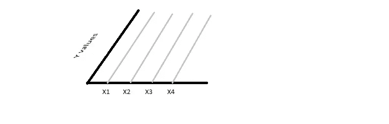

(在 MS Paint 中创建)

灰色线条代表什么？嗯，如果你考虑到现实世界中存在的动荡因素，那么 Y 可以是给定 x 的任何值。例如，尽管学习了相同的小时数，但你可能在两次独立的月度测试中得分不同。因此，所有的线都指定了 Y 的值域，对于每个 x 都是实数。

如果我现在要求你估计给定 x 的目标变量，你会怎么做？答案将揭开回归的概率全景。如果我给你一个给定 X-P(Y|X)的条件概率分布，会不会有帮助？当然，它会，但没有办法提取一个准确的分布函数。所以，我们做了一个假设，许多假设中的第一个。假设给定 X，P(Y|X)的 Y 的概率遵循正态分布。为什么正常？根据您正在处理的数据集的先验知识，您可以自由选择任何合适的分布。然而，由于很快就会清楚的原因，我们将求助于正态分布。

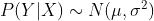

我们将在上面绘制的图的 z 轴上表示这个概率分布。如下图所示，P(Y|X)遵循正态分布。红点是每个 P(Y|X)的平均值。原谅图像的质量。我用 MS paint 制作了它们，以便于展示。

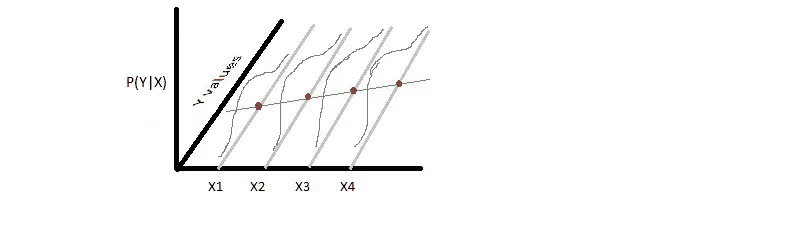

(在 MS Paint 中创建)

## 解开正态分布的参数

好吧，我们建立了分配的类型。它的参数——均值和方差呢？为了做出合理的估计，我们需要数据集中每个给定 X 的 Y 的均值和方差。此时，开始摆弄回归线 a+bX 是明智的。

如前所述，我们希望找到系数 a 和 b，使得计算 a+bx 可以得到实际 y 值的最佳估计值。考虑到 y 呈正态分布，最佳估计值是多少？请注意，在从正态分布中随机抽取值时，大多数情况下会得到平均值。所以，明智的做法是赌 a+bX 是 Y|X 的均值或期望值。

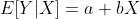

由乳胶制成

这是一个明显而低调的事实。因为我们假设 a+bx 是 Y|X 的期望值，所以我们也猜想所有的均值都位于回归线 a+bx 上。这是使用回归模型的必要条件。这么想吧，如果真实的均值没有躺在一条线上，用线性回归是否明智？现在你可能想知道人们是如何确定线性度的？我们不能，因为真正的价值是一个谜。那我为什么要拿这个来烦你？在实际的机器学习中，人们认为线性的存在是理所当然的，并继续进行建模。无论如何，建模后测试可用于确定线性回归模型的准确性。这里重要的是了解潜在的假设。

好的，如何处理方差？为了保持同质性，我们假设所有 Y|X 的方差值都是常数。同质性意味着方差的同质性。这个概念应该有一个单独的位置。然而，对我们来说，知道最小二乘估计在它不存在时是错误的就足够了。一直读到最后，你会发现为什么。

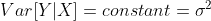

由乳胶制成

## **贝叶斯回归全景图**

理解超过这一点的东西需要贝叶斯定理的知识。我的本科教授曾经说过，“同学们，如果不知道贝叶斯定理，你们将无法进行任何有价值的机器学习。”因此，我将跳过它的详细解释，希望作为人工智能的爱好者，你对 Bayes 和他的思想很熟悉。

让我们概括一下到目前为止我们所做的事情。我们从一个由解释变量和目标变量 X 和 Y 组成的假想数据集开始。然后，我们试图计算出给定 X 时 Y 的概率。为此，我们假设 Y|X 遵循均值为 a+bX 的正态分布。因此，我们还建立了所有 Y|X 的平均值位于回归线上。

太好了，是时候开始寻找圣杯了。我们需要找到 a 和 b 的最佳估计值，是什么决定了这些估计值？你猜对了——手头的数据。参数 A 和 B 应该使得概率 P(a=A，b=B|data)最大。

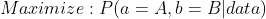

由乳胶制成

怎么做呢？贝叶斯来拯救我们了。根据贝叶斯定理:

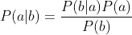

由乳胶制成

因此，我们可以写

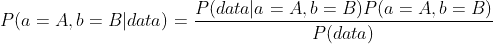

由乳胶制成

在本文的其余部分，我将把上面的等式称为贝叶斯。

注意，没有可靠的数据，a 和 b 是不确定的。它们可以从实数集中取任何值。P(a=A，b=B)是得到 a=A 和 b=B 的概率，与手头的数据值无关。假设我们想用每日最高温度来模拟冰淇淋销售的回归。

由乳胶制成

你的朋友托马斯·贝叶斯，碰巧也是甜点行业的专家，欣然同意为这项研究提供任何帮助。根据他的经验，他建立了(A，B)的概率分布模型。很好，你现在对(A，B)最可能的值有了更好的了解。然而，在许多情况下，你不会得到托马斯的支持。在这样无可奈何的条件下，假设(A，B)的任何一个集合都是同样可能的。从概率上讲，P(A=a1，B=b1)，也称为先验概率或只是先验，假设是均匀分布的。

总而言之，先验不受数据的影响，顾名思义，它们反映了我们对回归模型的初步概念。

回到我们的问题。我们也假设先验分布是均匀的。我们的目标是最大化贝叶斯的右边。因为 P(a=A，b=B)在(A，B)的所有集合中都是常数，所以我们可以忽略该项。

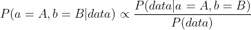

由乳胶制成

接下来，认识到 P(数据)仅仅是一个常数。为什么？它是在所有 A，B 对中获得数据的总概率，一组特定的 x，y。对于每对 A，B，P(data| a=A，b=B)是一个介于 0 和 1 之间的实数(你很快就会明白为什么)。因此，这些概率的总和 P(data)是一个常数。

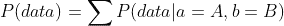

由乳胶制成

比例两边的常数都可以去掉。

P(data|a=A，b=B)是得到数据的概率，给定参数 A 和 B，所有提供的值集(X，Y)也可以写成 P(X，Y|a=A，b=B)。根据条件概率的规则，这个我就不深究了，P(X，Y|a=A，b=B)可以进一步简化为 P(Y|X，a=A，b=B)。

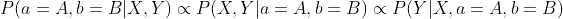

由乳胶制成

我们的问题归结为最大化 P(Y|X，a=A，b=B)。假设 P(Y|X)服从正态分布，平均值为 a+bX，方差为σ。在提供的数据中，Y 可能不同于 a+bX。因此，对于 P(Y|X，a=A，b=B)，我们的目标是找到从均值为 a+bX 且方差为σ的正态分布中得到 Y=y 的概率。

由于所有的 Y|X 都是独立的，我们可以把 P(Y|X，a=A，b=B)简化为所有个体 P(Y=y|X=x，a=A，b=B)的乘积。

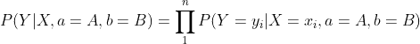

由乳胶制成

## 挖掘最小二乘逼近函数

正态分布的概率密度函数 pdf 为:

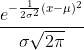

由乳胶制成

与离散分布不同，连续分布不定义特定点的概率。你只能在一个数值范围内对 pdf 进行积分，比如说 x1

在我们的例子中，我们可以通过在一个相当小的范围内对 pdf 进行积分来近似计算下面的概率。

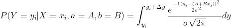

由乳胶制成

通过计算，我们可以进一步写出

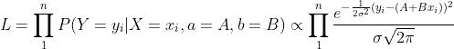

由乳胶制成

我向数学专家道歉，我耍了一个卑鄙的手段。为了简单起见，我取消了积分运算，引入了比例符号而不是等式。这些都是在被积函数 dy 对所有 x，y 都相同的假设下完成的。

只剩下一些数学运算了。为了最大化令人望而生畏的 L，让我们首先在两边取一根圆木。

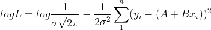

由乳胶制成

右边的第一项是常数。因此，代数要求最大化 log(L)，我们需要最小化第二项。现在，看看第二学期。你发现什么了吗？答对了。你发现了著名的最小二乘近似项。

最大化 L 需要最小化第二项，这恰好是最小平方逼近函数。

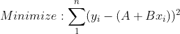

由乳胶制成

认识到最小二乘近似是在以下条件下进行回归分析的适当程序:

1.  对于给定的 x，目标变量 y 遵循正态分布
2.  回归参数的所有值都是同等可能的。也就是说，先验服从均匀分布
3.  对于所有的 Y|X，方差值被假定为常数。否则，我们不可能从求和项中取出它

与这些条件的任何偏差都将导致必须遵循替代程序。在这种情况下，你必须重复整个练习。

# 结论

我写这篇文章的目的是为了分享为什么我们在做回归分析时会求助于最小化平方差的和。当我第一次看到这个启示时，我大吃一惊。为了在机器学习中做一些很酷的事情，许多人经常掩盖底层的数学。也许，一个人可能永远不会专业地要求这种知识。但是对它视而不见，你就错过了美丽的机器学习。真是满眼都是。