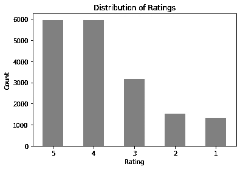
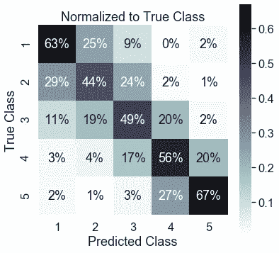

# 为什么体重？平衡数据集训练的重要性

> 原文：<https://towardsdatascience.com/why-weight-the-importance-of-training-on-balanced-datasets-f1e54688e7df?source=collection_archive---------9----------------------->

## 如何在 Scikit-Learn 管道中实现用于分类的样品重量


照片由[埃琳娜·莫日维洛](https://unsplash.com/@miracleday?utm_source=medium&utm_medium=referral)在 [Unsplash](https://unsplash.com?utm_source=medium&utm_medium=referral) 上拍摄

想象一下被问到一个熟悉的谜语——“一磅铅和一磅羽毛哪个更重？”当你准备自信地宣布它们一样重时，你意识到询问者已经从你的后口袋偷走了你的钱包。

## 为什么平衡很重要？

在监督机器学习中，重要的是在平衡数据上训练估计器，以便模型在所有类别上都是平等的。

设置权重是评估者特有的。许多 Scikit-Learn 分类器都有一个`class_weights`参数，可以设置为“balance”或给定一个自定义字典来声明如何对不平衡数据的重要性进行排序。

这种方法类似于[过采样](https://www.svds.com/learning-imbalanced-classes/)。我们可以通知估计器调整其计算损失的方式，而不是实际上过采样(使用更大的数据集在计算上更昂贵)来平衡类。使用权重，我们可以迫使 as 估计器基于给予特定类的或多或少的重要性(“权重”)来学习。

## 砝码是如何使用的？

[权重缩放损失函数。](https://stats.stackexchange.com/questions/362987/how-do-sample-weights-work-in-classification-models)当模型在每个点上训练时，误差将乘以该点的权重。估计器将尝试最小化权重更大的类的误差，因为它们对误差有更大的影响，发送更强的信号。如果没有设置权重，模型会将每个点视为同等重要。

> 平衡不是你找到的，而是你创造的
> 
> ―贾娜·金斯福德

## 不平衡数据集的示例

这个样本数据集来自我的一个文本分类项目。我开始按等级对酒店评论进行分类，详见我的 GitHub。数据强烈支持正面评价(否则酒店将需要认真重新审视他们的商业模式)。



```
Class Distribution (%)1     7.431961
2     8.695045
3    17.529658
4    33.091417
5    33.251919
```

## 计算类别权重

Scikit-Learn 具有从其`.utils`库中计算[类别权重](https://scikit-learn.org/stable/modules/generated/sklearn.utils.class_weight.compute_class_weight.html?highlight=class_weight#sklearn.utils.class_weight.compute_class_weight)和[样本权重](https://scikit-learn.org/stable/modules/generated/sklearn.utils.class_weight.compute_sample_weight.html)的功能。自定义权重也可以作为格式为`{class_label: weight}`的字典输入。我计算了上述情况下的平衡重量:

```
Class Weights: 5 classes{1: 2.691079812206573,
 2: 2.3001605136436596,
 3: 1.140923566878981,
 4: 0.6043863348797975,
 5: 0.6014690451206716}
```

如您所见，较重的权重应用于少数类，表明模型必须给予这些类更多的重要性。降低多数类的权重，使其重要性降低。权重为 0 意味着没有影响或不重要(如果你需要静音一个类)。


*(左侧表格)*我已经结合了类的归一化分布和计算的权重。“平衡”栏是重量乘以分布。我们看到每个类都有相同的数字，加起来是 1。这相当于看到任何一个类的概率相等(1/5 = 0.2)。

## 计算样品重量

平衡类权重可以在样本权重函数中自动计算。设置`class_weight = 'balanced'`自动调整输入数据中与类别频率成反比的权重(如上表所示)。

```
**from** sklearn.utils **import** class_weightsample_weights **=** compute_sample_weight(class_weight = 'balanced', 
                                                  y **=** y_train)
```

样本权重作为一个数组返回，类权重映射到目标数据(y_train)中的每个样本。示例:

```
Sample Weights: 14330 samplesarray([0.60146905, 2.30016051, 0.60438633, ..., 0.60438633, 1.14092357, 1.14092357])
```

要在 Scikit-Learn 多项式朴素贝叶斯管道中使用样本权重，必须在拟合步骤中添加权重。对于这个演示，我不会探究 NLP，这只是对加权样本的奇异效果的比较。所以不要把重点放在整体表现上。

```
pipeline **=** Pipeline(steps**=**[("NLP", TfidfVectorizer(),
                           ("MNB", MultinomialNB())
                          ])pipeline.fit(X_train, 
             y_train, 
             ******{'MNB__sample_weight': sample_weights})
```

## 非加权模型性能


非加权样本数据，强烈倾向于多数类

比较在没有样本权重的情况下训练的上述模型的结果:未加权的模型达到 55%的准确度。

预测非常倾向于多数阶级。这种模式几乎完全忽略了少数民族阶层。

## 加权模型性能



加权样本数据，更好地训练少数民族班级

在拟合步骤中，通过添加平衡的样本权重来训练完全相同的模型。这个模型达到了 58%的准确率。

沿着真正的正对角线(左上到右下)，我们可以看到该模型更适合预测少数民族类别。

这两种模型的精确度只有 3%的差异，但预测能力却大相径庭。准确性有偏差，因为测试类与定型数据具有相同的分布。所以这个模型只是用相同的比例进行猜测，并且用大多数类达到足够的次数。这就是为什么准确性本身并不是模型成功的一个好的衡量标准！但是那是另一天的话题，或者你可以看看这篇关于不平衡的类分布的分类准确性的[失败的文章](https://machinelearningmastery.com/failure-of-accuracy-for-imbalanced-class-distributions/)。

## 结论

在平衡数据集上训练模型是很重要的(除非有一个特殊的应用来加权某个更重要的类),以避免预测能力的分布偏差。一些 Scikit-Learn 模型可以用`class_weights = 'balance'`自动平衡输入类。贝叶斯模型需要一组样本权重，可以用`compute_sample_weight()`来计算。

感谢您的阅读！你可以在我的 [GitHub](https://github.com/anna-dang/mod05-capstone-NLP) 上查看这个博客开发的文本分类项目。