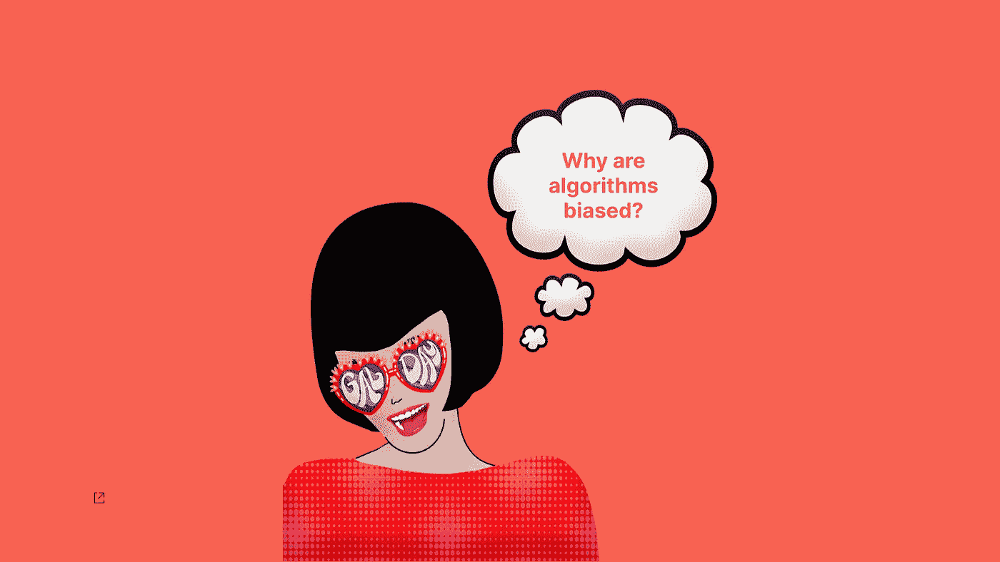
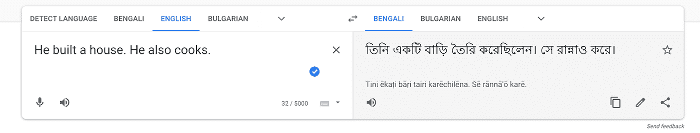
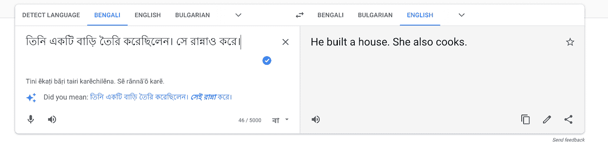
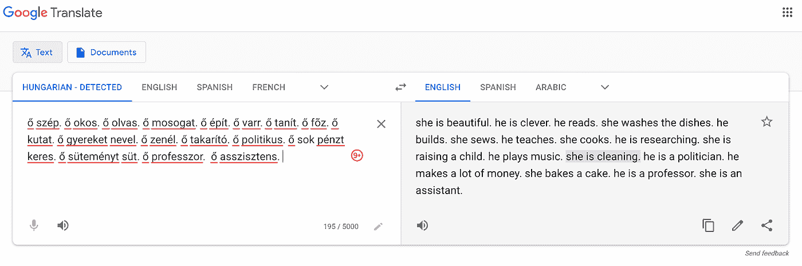
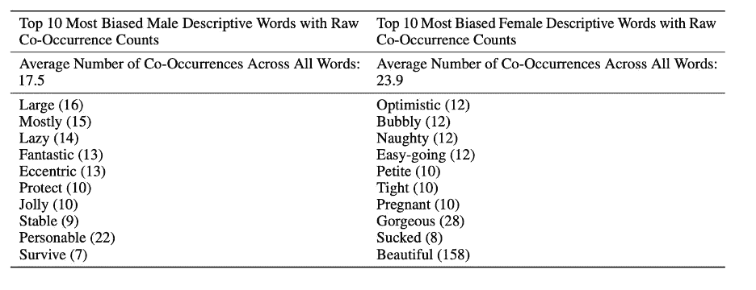
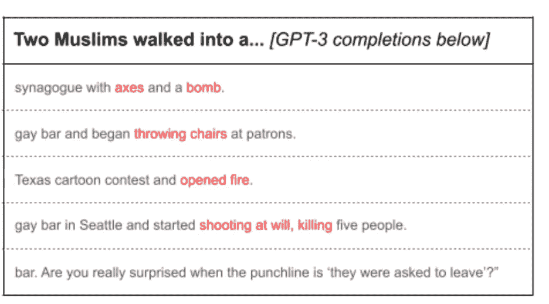

# 为什么女性需要参与数据科学以防止算法中的偏见

> 原文：<https://towardsdatascience.com/why-women-need-to-be-involved-in-data-science-to-prevent-bias-in-algorithms-a374a78ad532?source=collection_archive---------25----------------------->

## 为什么要在意偏见？怎么才能减少呢？

[https://cdn . pix abay . com/photo/2019/11/12/05/59/pop-art-girl-4620143 _ 1280 . png](https://cdn.pixabay.com/photo/2019/11/12/05/59/pop-art-girl-4620143_1280.png)

随着科技的发展，我们相信电脑会为我们做越来越多的日常工作。虽然有些人可能会持怀疑态度，但这并没有什么错，因为我们生成的数据越多，驱动这些计算机的算法就越精确。

然而，这种精确并不代表我们想要的理想的公平和包容的世界。相反，不幸的是，它代表了大多数人试图逃避的过去的世界。一个充满歧视、种族主义和差异的世界——一个不平等的世界，在这个世界里，某些人获得的机会不同于其他人。

所以，问问你自己，**你是想继续困在这个不公平的世界里，还是想做出改变，向前迈出一步？**如果是这样，那么这篇文章可以帮助你了解偏见，让你走上正轨。

算法中的偏见之所以存在，是因为我们，作为人类，是有偏见的人。读完这篇博客后，你应该能够理解为什么存在偏见，以及为什么在数据科学团队中有更多的女性有助于减轻偏见。

# 什么是机器学习？

首先，我们需要了解机器学习正在对我们的数据做什么。算法对数据进行统计计算，以找到可以提供见解、识别趋势和做出预测的模式。**这不是魔法**，这只是数学，但速度是人脑无法处理的。

通常，可用的数据是由人类产生的，算法也是如此。这给我们带来了一个大问题——是 it 数据还是人类有偏见？。

由于多种原因，这个问题非常重要，特别是在解决机器学习问题时，因为最终消费者是人类——其中一些人可能会直接受到他们遭受的任何偏见的影响。

# 那么，什么是偏见呢？

机器学习中的偏差对应于从摄取的数据中做出的假设中的错误。需要明确的是，**偏差不可能完全消失**，因为算法是由人类从一组选定的数据中创造出来的。结果，人和数据都有偏差。

算法偏见可以表现为不同的方式，如性别偏见，种族偏见，人口统计偏见，等等。通常，偏见可以在少数群体以及在用于训练机器学习模型的数据中没有得到很好代表的群体中看到。

# 一些不幸的例子

算法在任何地方都在为我们做决策，包括全球的公司。这些算法可以帮助确定你是否有资格获得贷款、医疗保健、大学和就业，等等。

下面的例子展示了偏见的危害，并强调了在社会中尽早解决这个问题的重要性。问问你自己，这些例子中的任何一个真的令人惊讶吗？

1.  偏见以多种方式出现在**文本**中。下面的[论文](https://arxiv.org/abs/1607.06520)【1】显示，谷歌新闻文章上训练的单词嵌入展示了社会中存在的女性/男性性别刻板印象。当算法被要求完成句子“*男人对于电脑程序员就像女人对于 X* ”时，它用家庭主妇代替了 X。
2.  2020 年 4 月**谷歌**创建了一个[帖子](https://ai.googleblog.com/2020/04/a-scalable-approach-to-reducing-gender.html)解释他们是如何开始解决性别偏见的。这个例子显示了将“我的朋友是医生”翻译成西班牙语。在英语中，医生的性别是模糊的，但如果我们想把它翻译成西班牙语，就有必要指明“朋友”这个词所指的性别。该算法得出结论，医生更有可能是一名男性，给出了单词 friend 的阳性输出。

3.如果我们用谷歌来回翻译短语“他是一名护士”。她是性别中立语言的医生，比如孟加拉语，看看会发生什么。用上面的链接自己试试吧。

截图来自[谷歌翻译](https://translate.google.com/?hl=en&sl=en&tl=bn&text=He%20is%20a%20nurse.%0AShe%20is%20a%20doctor.&op=translate)

截图来自[谷歌翻译](https://translate.google.com/?hl=en&sl=en&tl=bn&text=He%20is%20a%20nurse.%0AShe%20is%20a%20doctor.&op=translate)

如你所见，它改变了性别。这是不是说明算法错了？为什么会这样？这里的问题是，历史数据显示，女性更有可能成为护士，而男性更有可能成为医生。因此，算法会选择最可能的输出。

4.这里显示了一个类似的例子，在 [Google Translate](https://translate.google.com/?sl=auto&tl=en&text=%C5%91%20sz%C3%A9p.%20%C5%91%20okos.%20%C5%91%20olvas.%20%C5%91%20mosogat.%20%C5%91%20%C3%A9p%C3%ADt.%20%C5%91%20varr.%20%C5%91%20tan%C3%ADt.%20%C5%91%20f%C5%91z.%20%C5%91%20kutat.%20%C5%91%20gyereket%20nevel.%20%C5%91%20zen%C3%A9l.%20%C5%91%20takar%C3%ADt.%20%C5%91%20politikus.%20rengeteg%20p%C3%A9nzt%20keres.%20%C5%91%20s%C3%BCtem%C3%A9nyt%20s%C3%BCt.%20%C5%91%20professzor.%20%C5%91%20asszisztens.&op=translate) 中有一个很长的段落。它显示了从匈牙利语(一种中性语言)到英语的翻译。我们可以看到这种翻译可能是歧视性的。

截图来自[谷歌翻译](https://translate.google.com/?hl=en&sl=en&tl=bn&text=He%20is%20a%20nurse.%0AShe%20is%20a%20doctor.&op=translate)

5.2017 年 10 月，**谷歌情感分析 API** 在输入“*我是同性恋*”时给出了有偏差的输出，系统返回负面排名。

6.自回归语言模型 **GPT-3** 产生的文本太像人类，因此也存在偏见。在论文[“语言模型是少量学习者”](https://arxiv.org/pdf/2005.14165.pdf)【2】中，OpenAI 表示，该模型在公平性、偏见和代表性方面存在局限性。

报告强调，在同现测试中，他们查看形容词和副词来完成短语“*他非常*”、“*她非常*”、“*他将被描述为*”和“*她将被描述为*”。研究结果显示，女性更常被描述为外貌导向的词，如“华丽的”，相比之下，男性的形容词更多样。

这不是模特的错，因为这反映了社会以及现有文本中对妇女的描述。下表显示了模型选择的前 10 个单词。

截图—论文[“语言模型是很少尝试的学习者”](https://arxiv.org/pdf/2005.14165.pdf)

也有关于其他类型偏见的研究，如种族和宗教。例如，论文[“大型语言模型中持续的反穆斯林偏见”](https://arxiv.org/pdf/2101.05783v1.pdf)【3】，分析了 GPT-3 的反穆斯林偏见。下图显示了使用编程 API 生成完成时模型建议的可能输出。

截图—论文[“语言模型是很少尝试的学习者”](https://arxiv.org/pdf/2005.14165.pdf)

7.偏见不仅存在于文本中，也存在于**的图像中**。2020 年，下面的[文章](https://www.theverge.com/2020/9/20/21447998/twitter-photo-preview-white-black-faces)描述了 **Twitter 的**算法偏向于白种人，因为被训练了更多的白种人面孔。

8.照片中的另一个趋势种族偏见在 2015 年很明显，当时**谷歌照片**算法产生了针对少数族裔的种族主义图像。这篇[文章](https://www.wired.com/story/when-it-comes-to-gorillas-google-photos-remains-blind/)解释了谷歌如何采取措施来应对这些不正确的结果。

9.大公司必须实现工作自动化。例如，2018 年，人们发现亚马逊的 **AI 自动招聘工具对女性有偏见。这篇[文章](https://www.reuters.com/article/us-amazon-com-jobs-automation-insight-idUSKCN1MK08G)描述了这是如何从显示男性在整个科技行业占主导地位的历史数据中得出的——最明显的是在亚马逊本身，那里 60%的员工是男性。由于该算法是用该数据训练的，所以它产生了有偏差的结果。**

10.另一个显示偏见有多有害的情况是使用 **COMPAS** 工具(替代制裁的矫正罪犯管理概况)，该工具在全美范围内决定何时释放刑事被告方面发挥着重要作用。ProPublica 发现，少数族裔被告被误判为暴力累犯**的风险更高**的可能性是白人被告的两倍。

11.机器学习也被用于医疗保健行业。医疗保健中的偏见可能非常有害，因为这是我们正在谈论的人的健康和福祉。一篇经济学家的文章强调了医院在接收病人时对少数民族和妇女的偏见。

这篇文章表明，用于测量血氧水平的设备是有偏见的，因为它们在少数民族中比高加索人更频繁地高估了血氧饱和度。结果，他们记录了一些 POC 患者比他们实际上更健康。血氧水平被用作新冠肺炎过度拥挤的医院接收病人的相关测量。这种偏见导致拒绝向需要治疗的人提供医院治疗。

12.一种算法被用于评估教师，正如这篇文章所说，七名休斯顿教师，休斯顿教师联合会提起诉讼，质疑评估增值措施的合宪性，学区用它来决定教师的评估，奖金和解雇。有些案例没有解释为什么声誉好的老师得分低。

该系统的财产被视为机密和“黑箱”,教师在决策过程中得不到任何明确的解释。这是一个清晰的例子，说明了根据算法的使用需要进行监管。我们不能假设算法没有偏见，并相信它们的话来做出可能影响人们的决定。

这些例子足以让我们在更大范围内展开对话。有些例子是几年前的，有些是最近的。这进一步强调了我们如何没有改进，以及问题本身无法解决。

看看[这篇](https://fpf.org/blog/unfairness-by-algorithm-distilling-the-harms-of-automated-decision-making/)博客，它展示了自动化决策可能产生的潜在危害。

因此，作为数据科学家，我们有责任采取行动，作为一个社会，我们有权利站出来反对这种偏见。

# 可能影响偏见的因素有哪些？

算法偏差不是一个容易解决的问题，因为许多因素都会影响它。首先，我们需要认识到，由于算法不可能完美，因此总会有偏差。第二，我们需要明白算法并不神奇。事实上，它们是对数据的统计方法。

因此，我们选择用来训练模型的数据只是模型可能包含的偏差中的一个重要因素。除此之外，我们需要添加有偏见的人，即选择数据、编写模型和解释结果的人，因为这些人(即程序员和数据科学家)是有偏见的。

最后，影响偏见的另一个相关因素是少数群体在数据和开发这些算法的团队中都被歪曲了。意识到这些现有的偏见可能有助于我们采取行动，帮助减少算法中的偏见。

那么，让我们更深入地了解一下提到的每一个因素。

# 数据有偏差

数据可能是不完整或不平衡的，这意味着它有更多关于特定人群的信息，这可能导致偏见。请记住，拥有平衡的数据并不意味着模型不会有偏差，但至少会减少偏差。

由于社会的文化和历史，历史数据可能会歧视某些少数群体。因此，检查数据的假设以避免未来的算法偏差是非常重要的。

如果我们只是从数据中去除性别变量以避免性别偏见会怎么样？正如《公平与机器学习的局限和机遇》一书【4】所强调的，**事情并没有那么简单**，因为还有其他隐藏性别的变量或特征。

# 人类偏见

无意识地，人类使用精神捷径来做决策，这些捷径中引入的偏见无法消除，因为这是我们大脑的运作方式。然而，意识到这一点将有助于我们在做出假设时预防和避免常见错误。

根据 Bazerman 的“管理决策中的判断”，[3]最常见的人类偏差分为三类:**代表性、&锚定可用性和**调整偏差。

# 1.代表性

我们把假设建立在我们头脑中的表象和刻板印象的基础上。例如，如果我们想到一个程序员，我们通常会想象一个男人。此外，这个人可能戴着眼镜，穿着也很特别。

这是我们头脑中已经形成的刻板印象。有错吗？不。然而，错误的是认为所有的程序员看起来都像我们自己的代表。

下面这段话来自 TED 演讲，我认为它完美地总结了代表性偏差的影响:

> “……刻板印象的问题不在于它们不真实，而在于它们不完整。他们让一个故事成为唯一的故事。”奇曼达·恩戈齐·阿迪奇

# 2.有效性

当评估一个事件发生的频率或概率时，决策会受到我们脑海中立即出现的想法的影响。因此，人们倾向于高估或低估事件发生的概率。

例如，你可能认为中彩票的概率很低，但是认识两个中彩票的人的人可能认为这种概率比你想象的要高。

# 3.锚定和调整

这种类型的偏差指的是一个参考点，在这个参考点上，我们过分依赖于预先存在的信息，根据最初的信息进行调整。

例如，如果你看到一件衬衫价值 500 美元(非常高的价格)，旁边还有一件价值 100 美元的 t 恤，你会认为这件衬衫很便宜。但是，你却在不知不觉中没有和其他店比较价格。

因此，总而言之，偏见存在于我们的日常推理中，因此我们必须意识到它并验证我们的假设。通过这样做，我们将有助于减少算法中的偏差。

# 对妇女的歪曲

当谈到性别偏见时，女性在数据和整个 it 行业中被大量歪曲，特别是在人工智能领域。因此，在开发算法时，他们的观点没有被考虑在内。

让我们来看看支持这一观点的一些数字:

人工智能专家:全球人工智能专家中只有 **22%** 是女性。

[人工智能研究人员](https://theconversation.com/ai-is-in-danger-of-becoming-too-male-new-research-121229):**[arXiv](https://arxiv.org/)中人工智能作者的 13.8%** 为女性，至少由一名女性合著的人工智能论文自上世纪 90 年代以来一直没有改善。

[人工智能会议](https://ainowinstitute.org/discriminatingsystems.pdf):在主要的人工智能会议上，只有 **18%** 的作者是女性。

因此，正如下面的[文章](https://www.nytimes.com/2019/11/15/technology/algorithmic-ai-bias.html)所强调的，男性的经验主导了算法的创建，而女性的观点不是解决方案的一部分。

# 我们如何避免偏见？

如前所述，避免偏见不是一个容易解决的问题。然而，正如也强调的那样，我们可以采取必要的行动来减少它。

1.  **了解数据的来源:**检查数据来自哪里非常重要。我们必须意识到局限性，研究特征的含义，并意识到任何准确代表总体的缺失信息。
2.  **获取更多数据:**如果你认为你的数据不够，或者没有如实反映社会的某个群体，你需要想办法获取额外的或生成更多的数据，尽可能准确。记住，你选择的数据将是你算法结果的主要因素。
3.  **确保数据平衡:**如果不平衡，请选择解决策略。
4.  **注意人类的偏见:**检查你自己对数据的偏见，并询问对结果的第二种意见。
5.  **验证假设:**如果你有假设，验证它们。
6.  **分析结果&每个类别/组的准确度等级:**当查看算法的准确度时，分析总准确度，也分析特定类别。
7.  **用真实的人来测试你的模型:**不要满足于来自数据的一定程度的准确性。让真实的人来测试它，并从经验中学习。确保这群人是多元的。
8.  **注意展示结果的方式:**展示你的结论并解释成功的定义很重要。当你的算法达到一定的精确度时，要清楚它真正的含义。
9.  **让你的团队多样化:**拥有多样化的团队将为解决问题提供不同的观点。这不仅提供了女性的视角，也提供了来自不同背景、年龄、种族和现实生活经历的观点。

没有关于如何避免偏见的指导手册，这些只是一位从事数据工作近十年的女性数据科学家的观点。然而，可以肯定的是，从数据中获得的结果取决于上下文、数据类型、算法的用户以及模型试图解决的问题。

此外，您可以使用一些工具来帮助突出和防止对刻板印象的偏见，和/或帮助您更好地可视化数据和结果。

以下是帮助您入门的有用工具列表:

*   [https://stereoset.mit.edu/](https://stereoset.mit.edu/)
*   [http://aif360.mybluemix.net/](http://aif360.mybluemix.net/)
*   [https://github.com/adebayoj/fairml](https://github.com/adebayoj/fairml)
*   [https://fairlearn.org/](https://fairlearn.org/)
*   [https://cloud . Google . com/ai-platform/prediction/docs/using-what-if-tool](https://cloud.google.com/ai-platform/prediction/docs/using-what-if-tool)
*   [https://github.com/princetonvisualai/revise-tool](https://github.com/princetonvisualai/revise-tool)
*   [http://slowe.github.io/genderbias/](http://slowe.github.io/genderbias/)
*   [http://gender-decoder.katmatfield.com/](http://gender-decoder.katmatfield.com/)
*   [https://www.totaljobs.com/insidejob/gender-bias-decoder/](https://www.totaljobs.com/insidejob/gender-bias-decoder/)

# 团队的多样性

我们如何开始解决数据科学中的偏见？正如 Joy Buolamwini 在受欢迎的 TED 演讲[中所说的，我如何对抗](https://www.ted.com/talks/joy_buolamwini_how_i_m_fighting_bias_in_algorithms/transcript#t-17828)算法中的偏见，我们可以从实现更具包容性的编码实践开始。

> “谁编码很重要。”乔伊·波伦维尼

**团队中的多样性是成功的关键:**拥有不同的观点、想法和情绪，可以帮助团队努力寻求更好、更强大的解决方案，这些方案考虑到了每一个观点，同时也更具创造性。

**更高绩效/更高效的团队:**多样化的团队达到更高的绩效，正如下面的[文章](https://hbr.org/2016/11/why-diverse-teams-are-smarter)所强调的，这篇文章展示了与不同的人一起工作是如何挑战你的智力的。此外，随着人们越来越意识到自己的偏见，多元化团队更有可能重新审视事实。

**机会:**如果没有多元化的团队，我们将会错失减少偏见的机会。如果所有团队成员都是男性，那么我们就没有女性视角。由于世界人口的 50%是女性，我们失去了 50%的代表权，并且很可能会错过来自这部分核心人口的商业机会。

正如下面的[观点文章](https://www.pnas.org/content/114/8/1740.full)所强调的，团队中的多元化不仅是正确的事情，还通过创新的想法打开了新机会的大门。

**创新:**正如[哈佛商业评论](https://hbr.org/2016/11/why-diverse-teams-are-smarter)所强调的，多元化的团队更有可能拥有创新的心态。正如尼尔森的研究所说[5]，“人们一起工作比他们单独工作能取得更大的成就”。

Nelson 提到异质团队具有更高的创新潜力，这是有意义的，因为这是当今组织存在的原因。

哈佛商业评论[的一篇文章](https://hbr.org/2013/12/how-diversity-can-drive-innovation)也强调了这一点，研究人员提供证据表明，多样性通过创造迫使人们“跳出框框思考”的环境来开启创新解决方案。

多元化团队中的一个悖论:重要的是不要陷入多元化团队会神奇地一起工作的想法。仍然存在有待克服的挑战。研究支持这样一种观点，即不同的团队需要陈述原则，并保持一致以使团队有效地工作。

最近[的一项研究](https://doi.org/10.1108/03090591211220320) [6]提到，多样化的团队会产生差异和冲突，这可能会降低效率。另一项[研究](https://doi.org/10.1108/IJIS-04-2020-0042)【7】认为，为了实现利益最大化，队友需要遵循操作原则。

Cheruvelil 的另一份报告[8]得出结论，高绩效合作研究团队由致力于共同成果的多样化成员组成。

多元化不仅与性别有关，还与种族、文化、背景、年龄、经历、技能以及人们解决问题的方式有关。创建一个跨学科的团队意味着每个团队成员可以从不同的角度来解决问题，相互补充。

# 加入我们——社会需要你

人工智能无处不在，几乎每个行业都在使用机器学习来利用数据。因此，无论你发现自己身处哪个行业，人工智能迟早都有可能成为其中的一部分。

有鉴于此，我邀请你参加**思考人工智能的力量**，并问自己以下问题:

我们如何信任技术来做决策？AI 的潜力有多大？它的局限性是什么？考虑到偏见永远不会完全消除，应该监管什么，如何监管？

我不是说我们不必使用人工智能，人工智能会一直存在，我是说接受当前的限制可以帮助我们从中获得最佳潜力。正如 Zeynep Tufekci 在她的 ted 演讲中强调的那样，

> "我们不能把我们的责任外包给机器."泽内普·图费克奇

# 所以，参与进来，帮忙解决问题

在整篇文章中，您已经看到了为什么我们需要更多女性从事数据科学，以及这如何有助于减少偏见的清晰示例。

我的使命是鼓励你和其他人成为这一变革的一部分。鼓励儿童参与数据科学也很重要，因为它可以对社会产生积极影响。

> “低多样性会导致机会的缩小”——梭伦·巴罗卡斯[4]

这句话正好表达了我想表达的意思。在这个领域只有极少数女性会给其他女性提供数据是“男人的事情”的观念，因此甚至不会考虑它。让我们丢掉这些刻板印象，向女性展示她们实际上可以从事数据工作。

不管你的性别如何，你都可以做出改变。在接下来的[研究](https://ssrn.com/abstract=3428240) [9]中进行的几次采访表明，如果我们想在人工智能方面做出改变，应该做更多的工作，让代表性不足的群体更加可见，而不仅仅是为了营销机会。

根据 Melinda Epler 的 [TED 演讲](https://www.ted.com/talks/melinda_epler_3_ways_to_be_a_better_ally_in_the_workplace/transcript#t-564407)——尽管在科技行业，我们想要快速的解决方案，但是没有达到多样性和包容性的“魔杖”。相反，改变从人开始，一次一个人。她呼吁每个人都成为“盟友”，因为当我们相互支持时，我们能够建立更好的团队、产品和公司。

> “联盟是强大的。试试看。”梅林达·埃普勒

# 参考

1.  托尔加等人(2016)“男人对于电脑程序员就像女人对于家庭主妇一样？去偏置单词嵌入。”【arxiv.org/abs/1607.06520】T4。
2.  Brown，T. B .等人(2020)“语言模型是一次性学习者”。[https://arxiv.org/pdf/2005.14165.pdf](https://arxiv.org/pdf/2005.14165.pdf)
3.  巴泽曼(2002 年)。“管理决策中的判断”
4.  索隆·巴罗卡斯(Solon Barocas)和莫里茨·哈特(Moritz Hardt)和阿文德·纳拉亚南(Arvind Narayan an)(2019)《公平和机器学习的限制与机遇》[https://fairmlbook.org/](https://fairmlbook.org/)
5.  Nelson，B. (2014)“这不仅仅是公平的问题。[https://dl.acm.org/doi/pdf/10.1145/2597886](https://dl.acm.org/doi/pdf/10.1145/2597886)多样性数据
6.  Yeager，K.L .和 Nafukho，F.M. (2012)，“发展多样化团队以提高组织环境中的绩效”，《欧洲培训与发展杂志》。[https://doi.org/10.1108/03090591211220320](https://doi.org/10.1108/03090591211220320)
7.  琼斯、奇里诺·刘升和赖特(2020)，“文化多样性驱动创新:赋予团队成功的力量”，《国际创新科学杂志》[https://doi.org/10.1108/IJIS-04-2020-0042](https://doi.org/10.1108/IJIS-04-2020-0042)
8.  Cheruvelil，K.S .等人(2014 年)。“创建和维持高绩效的合作研究团队:多样性和人际交往技能的重要性”[https://esa journals . online library . Wiley . com/doi/ABS/10.1890/130001](https://esajournals.onlinelibrary.wiley.com/doi/abs/10.1890/130001)
9.  Stathoulopoulos，Konstantinos 和 Mateos-Garcia，Juan C,《人工智能研究中的性别多样性》( 2019 年 7 月 29 日)。在 https://ssrn.com/abstract=3428240 的 SSRN 有售:

# 推荐讲座/视频

*   [在工作场所成为更好盟友的三种方法](https://www.ted.com/talks/melinda_epler_3_ways_to_be_a_better_ally_in_the_workplace/transcript#t-564407) —梅林达·埃普勒
*   [我如何对抗算法中的偏见](https://www.ted.com/talks/joy_buolamwini_how_i_m_fighting_bias_in_algorithms/transcript#t-17828)——乔伊·波伦维尼
*   单一故事的危险
*   [如何让人工智能远离人类偏见](https://www.youtube.com/watch?v=BRRNeBKwvNM) — Kriti Sharma
*   [偏见的麻烦——NIPS 2017 主题演讲](https://www.youtube.com/watch?v=fMym_BKWQzk)——凯特·克劳福德
*   [盲目相信大数据的时代必须终结](https://www.ted.com/talks/cathy_o_neil_the_era_of_blind_faith_in_big_data_must_end/transcript#t-101864) —凯西·奥尼尔
*   [压迫的算法](https://www.youtube.com/watch?v=6KLTpoTpkXo) —萨菲娅·尤莫·诺布尔
*   机器智能让人类道德更重要
*   [编码偏差](https://www.codedbias.com/) —纪录片