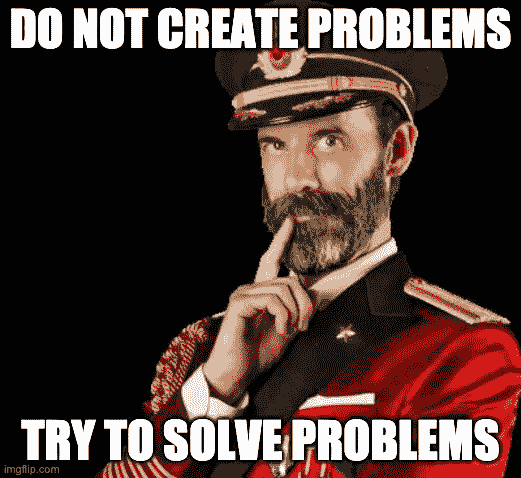

# 为什么从事咨询工作对数据科学家如此重要

> 原文：<https://towardsdatascience.com/why-working-in-consulting-is-so-valuable-for-data-scientists-710f3a4cc2d0?source=collection_archive---------23----------------------->

## 年轻专业人士的职业建议——观点

## 职业见解可能有助于您在数据科学领域的职业发展

他的文章不同于我通常写的技术含量很高的数据科学教程。今天，我回顾了我在一家大型通信公司担任数据科学顾问的时光，并讨论了为什么值得这么做的原因。我并不认为我的观点是详尽的和普遍适用的，但我希望它对那些面临职业选择或刚刚开始职业生涯的人有所帮助。本文提出的所有观点均为本人观点。

在 [Unsplash](https://unsplash.com/?utm_source=unsplash&utm_medium=referral&utm_content=creditCopyText) 上由[Christina @ wocintechchat.com](https://unsplash.com/@wocintechchat?utm_source=unsplash&utm_medium=referral&utm_content=creditCopyText)拍摄的照片

首先，我提供了几个关于我自己的词作为背景。我最初是一名软件工程师，在各种数据和分析领域工作，主要是销售和营销相关的领域。2014 年，我决定完全转向数据科学，并在德国获得了相关领域的硕士学位。之后，我加入了全球最大的营销和通信公司之一，担任数据科学顾问，在接下来的三年里，我在两个不同的业务部门工作:营销(媒体)和咨询。

# 为什么是媒体？

## 一个惊人的原因是:

你可能会问，当医学研究或自动驾驶等令人着迷的领域吸引着最聪明的人才时，为什么一个年轻的数据科学毕业生应该考虑在 2021 年加入一家媒体公司。为了回答这个问题，我想引用塔勒布对他为什么对股票交易感兴趣的问题的回答(他又引用了曼德尔布洛特的话):

> [原因是数据，数据的金矿。](https://www.amazon.com/Black-Swan-Improbable-Robustness-Fragility/dp/081297381X/ref=sr_1_1)

事实上，媒体有大量的数据，成吨的数据，堆积如山的数据，这些数据最好的部分是它是真实世界的数据。这意味着它是肮脏的、稀疏的、不平衡的，并且在所有可能的方面都是破碎的。这些数据 99%都不是很有见地，但却是关于真实人类行为的真实数据。在这些数据中找到 1%的黄金，对于一个好奇的数据科学家来说，是挑战，也是祝福。处理大量组织混乱的数据是学习如何有效处理来自不同来源、不同格式的数据(通常是实时数据)的最佳方式。

对于数据科学家应该做什么，有不同的观点。然而，在机器学习算法的应用之外，看到更大的图景也无妨。了解如何构建能够产生收入的实际工作应用程序至少与深入的数据科学知识一样有价值。没有多少公司采取这一额外的生产部署和维护步骤，因为大多数非数字行业的数据科学项目从未通过概念验证阶段。

当我在 2019 年参加一个工业 4.0 会议时，我来自非数字行业的同事们正在讨论，可能需要一年多的时间才能获得购买传感器的批准，安装传感器，然后收集足够的数据来训练第一个分类模型。在媒体中没有这样的限制。数据太多了，收集起来很便宜。当然，媒体和股票交易一样，不能提供一个自我实现的使命，而你会很乐意与你的朋友分享。

图片来源[knowyourmeme.com](https://knowyourmeme.com/memes/dog-smothering-owner)，经作者允许编辑。

相反，它能给你提供一次无价的经历。

# 为什么咨询？

## 原因一:

> 咨询教会你关注并承担结果的所有权。

在科隆参加 Data 和 AI Meetup 时，我与一对来自当地大学的学生交谈，他们向我提出挑战，说他们的教授认为咨询不是实践真正数据科学的地方。坦率地说，教授说对了一部分，但只是一部分。你不应该指望当你加入咨询公司时，有人会教你如何编写 Python 或运行 A/B 测试。这可能不会发生。将会发生的是，你将被扔在一个项目上，需要自己解决技术部分。当然，你可以询问周围的一些人，但大多数决定你需要自己做出。这是一个巨大的动力，让你不断提高自己的技能，以便在与客户交谈时更加自信。然而，提高你的资格和跟上新的发展将是你自己的责任。同时，各种各样的客户、项目、身边的人会创造一个完美的训练环境，去练习那些自己不容易学会的基础软技能。

事实是，如果你有敏锐的技术技能，你可以在一段时间内发展你的职业生涯，但在某个时刻后，软技能真的开始变得重要，咨询是获得它们的最佳场所。

## 原因二:

> 咨询教会你正直。

还记得我在“为什么是媒体？”部分约 99%的不深刻的数据？这仍然适用。有时数据不是我们所期望的，或者更糟的是，有时数据会阻止我们实现我们的承诺。在这种情况下，经验法则是对自己、同事和客户诚实。隐瞒事实很容易失去客户的信任，而重新赢得客户的信任要困难得多。也许不仅仅是咨询，生活中最重要的规则是:

图片来源[imgflip.com](https://imgflip.com/memegenerator/19420047/Captain-Obvious)，经作者允许编辑。

也就是说，如果您发现数据、基础架构等存在问题。，找到并提出解决方案，千万不要只针对问题。总会有一些变通办法让你乐在其中。这条规则也适用于与同事的关系。如果你想在咨询行业取得成功，不要把你面临的问题带给你的上司，而是提出解决方案。这似乎是一条显而易见的建议，但是团队成员总是认为人事经理的存在是为了解决他们的经理的问题。事实上，这不是他们存在的理由。

## 原因三:

> 与当地市场相关的正确专业选择将确保你未来几年的就业。

大型咨询公司通常拥有来自多个行业的各种客户。因此，有机会从事一些项目，无论是建立一个推荐系统，自动实体提取算法，还是时间序列预测。在咨询行业工作时，你有一个独特的机会找到你最感兴趣的领域。除此之外，你还将了解当地市场的行业需求。因此，你不仅可以根据个人喜好，还可以根据特定地区的市场需求来选择未来的专业。

例如，我的本地市场是德国，该市场由四个部门主导:汽车、机械工程、化学和电气工业。我工作过的大多数客户来自汽车行业，有时来自为汽车行业供货的化学行业。汽车客户需要的是用结构化数据构建的各种模型，如需求预测、库存优化、推荐系统等。以及基于非结构化数据(如对象和声音识别模型)构建的模型。然而，我碰巧拿到了语义网和知识图的硕士学位。因此，我决定将我的资格改为时间序列分析和结构化数据的机器学习，以适应上述市场背景下公司的需求。

# 结论

回顾过去的几年，我对自己的职业选择非常满意。很难找到另一个行业能提供如此多的学习和成长机会。让它特别有价值的是可以访问几乎无限的数据和基础设施，各种各样的客户和项目，以及能够培养沟通技能的环境。我不想错过所有这些经历，因为它们让我能够从事我梦想中的新工作。