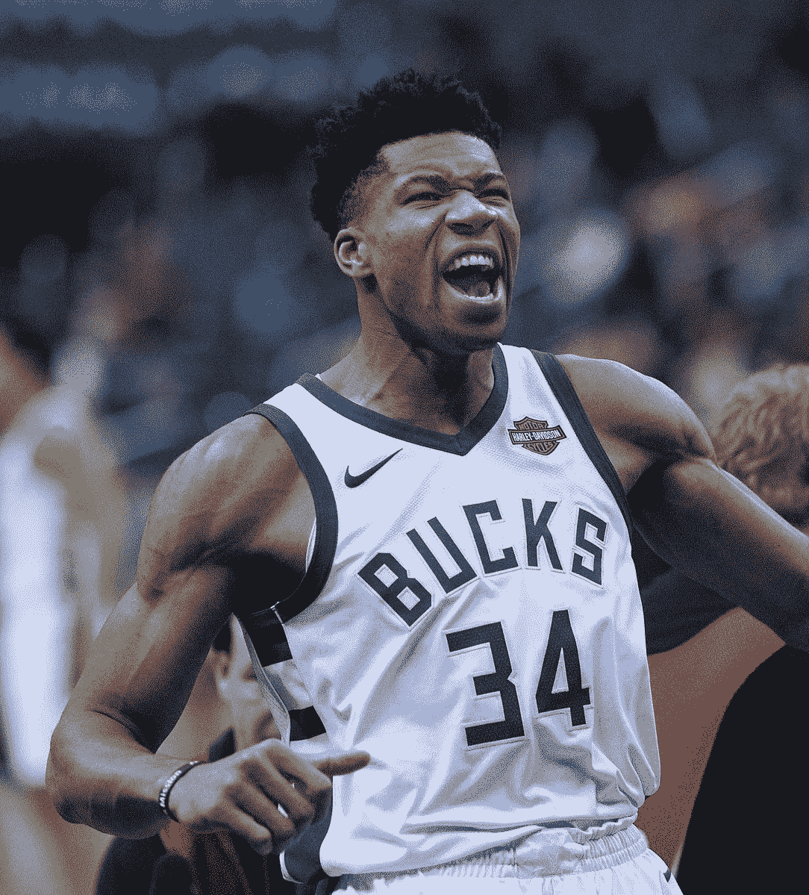
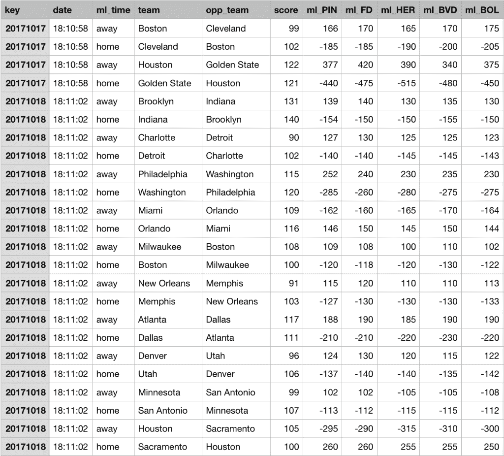
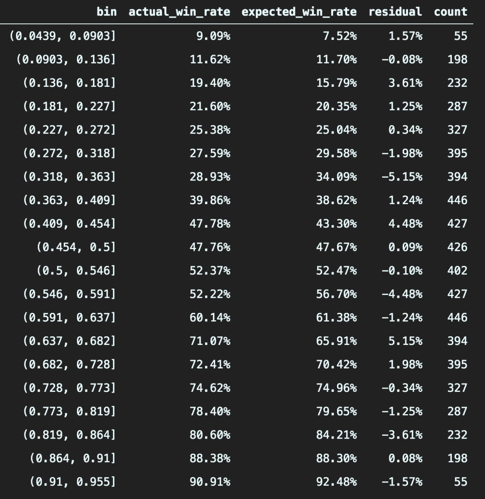
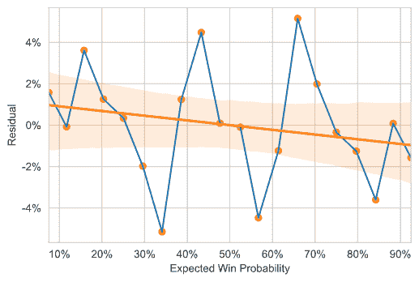
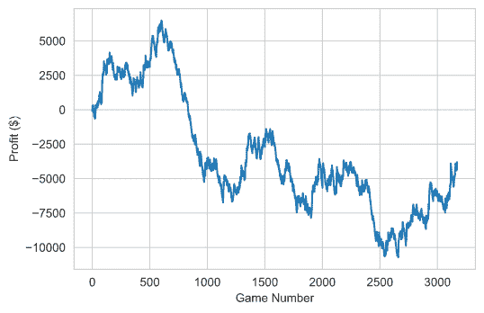
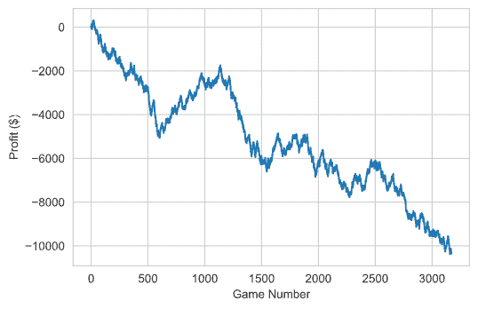
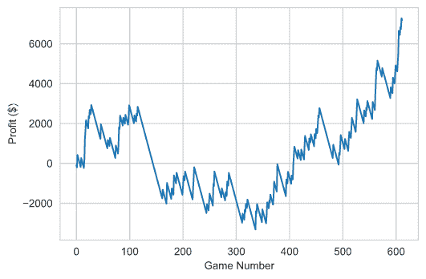

# 为什么你赌错了 NBA 球队

> 原文：<https://towardsdatascience.com/why-you-are-betting-on-the-wrong-nba-teams-39e2bf98588?source=collection_archive---------21----------------------->

你可能会惊讶地发现，赢得最多比赛的 NBA 球队并没有赢得最多的赌注！

在这篇文章中，我将分析 NBA 的博彩数据并进行模拟，向你展示为什么这在历史上是正确的——并解释你应该赌哪支球队。你甚至不需要篮球知识来成功实施这个策略。

虽然你不需要成为 NBA 专家，这篇文章假设你有一些体育博彩概念和术语的知识。如果你对它们不熟悉，可以看看这个[简短指南](https://www.actionnetwork.com/how-to-bet-on-sports/general/sports-betting-for-beginners-10-things-to-know)作为入门。

# 投注赔率有多准确？

让我们从基础开始——当两支 NBA 球队相互比赛时，一支球队被认为更有可能获胜(最受欢迎)，而另一支球队更有可能失败(不被看好)。如果你将[的金钱线赌注](https://www.actionnetwork.com/education/moneyline)押在处于劣势的一方，你将比押在最受欢迎的一方赢得更多的钱；毕竟，你应该得到更大的奖励，因为你选择了不太可能获胜的人。根据体彩设定的奖金，你可以计算出每个队赢得比赛的[隐含概率](https://www.investopedia.com/articles/dictionary/042215/understand-math-behind-betting-odds-gambling.asp)。

理论上，赢得赌注的隐含概率应该与你的团队赢得比赛的概率相同。事实上，体育博彩不会这样设定赔率。相反，他们邀请双方都采取行动，这样一来，处于风险中的资金数量就会平衡，从而降低风险，实现利润最大化。

例如，让我们说密尔沃基雄鹿队(去年战绩最好的球队)正在与纽约尼克斯队(战绩… *不是*最好的球队)比赛。如果投注者急于在雄鹿身上下注，那么如果雄鹿赢了，体育博彩公司可能会对支付一大笔钱感到紧张。因此，他们决定减少对雄鹿队的支出，增加对尼克斯队的支出，从而激励更多的钱投向尼克斯队。

扬尼斯·阿德托昆博，密尔沃基雄鹿队的明星，可能对赢得打赌感到兴奋。来源:[Wikimedia.org](https://commons.wikimedia.org/wiki/File:Giannis_Antetokounmpo_(24845003687)_(cropped).jpg)

这些支出可能会波动，这样雄鹿队获胜的隐含概率是 90%，而实际上他们的“真正获胜概率”可能只有 80%。在这种情况下，我们有一个价值赌注，从长远来看，在尼克斯队身上下注是有利可图的。

当然，所有投注者面临的最大挑战是找到每一次投注的真实获胜概率，并在其他人之前计算出来。不可能确切知道这些赢的概率，但是我们能找到隐含赔率更可能是无效率的游戏吗？这可能有助于我们发现价值投资的机会。

# 步骤 1:获取数据

首先，我们需要一个大的数据集来进行分析。我们需要以下数据:

1.  每场比赛的赔率。我们利用这些信息来决定赌哪个队赢，如果我们赢了，我们赢的金额。
2.  每场比赛的赢家。我们需要知道我们是否赢了赌注。

我最终使用了 [Sportsbook Review](https://www.sportsbookreview.com/betting-odds/nba-basketball/) ，这是一个汇集了许多不同体育书籍的历史博彩赔率的网站。从那里，我找到了一个开源的存储库，其中有一个脚本，可以有效地从任何历史 NBA 比赛中收集投注数据。[我修改了剧本](https://github.com/lambertchu/SBRscraper/pull/1)，也是为了刮出每场比赛的最终比分，并运行整个 NBA 赛季，我在 2017-18、2018-19 和 2019-20 三个常规赛季都是这样做的(只包括疫情暂停赛季之前的比赛)。这是数据集的快照:

有很多不同的方式在 NBA 比赛中下注，如货币线、点差、总点数等。因为这篇文章的缘故，我将专门关注货币线的盈利能力。同样，有许多不同的体育书籍可以用来下注。为了简单起见，我将只关注[顶峰](https://www.pinnacle.com/en/)，它被认为是业内赔率最准确的。

# 步骤 2:寻找隐含概率的差异

这里的目标是检查过去 NBA 比赛的隐含赔率，并确定它们是否是历史上准确的。如果有很大的差异，那么就可能有赚钱的机会。

我根据他们的货币线赔率计算了每笔赌注的隐含获胜概率。你可能会注意到每场比赛的获胜概率之和大于 1，这是不可能的！然而，体育博彩公司这样做是为了从整个博彩活动中获利。为了调整这一点，我将获胜概率标准化为 1，这就产生了每一次下注的实际隐含获胜概率。

接下来，我创建了“箱”,以便将所有隐含获胜概率相似的赌注组合在一起。为什么要这么做？

假设我们有一个隐含获胜概率为 11.7%(或+755 moneyline)的赌注。很难找到许多其他赌注有这种确切的金钱线。但是如果我们把它包括在 10%到 15%的所有赌注中，那么我们在每个仓位中有相当多的数据点要看。然后，我们计算每个仓位的*实际胜率*(实际胜率除以游戏总数)和*预期胜率*(仓位中所有赌注的平均隐含胜率)。

在此基础上，我们可以计算实际胜率和预期胜率之间的差异，我称之为残差，看看是否有大的差异。以下是将所有赌注分成 20 个仓位时的结果。每个箱覆盖大约 5 个百分点的隐含获胜概率区间。

列中的 *b* 以小数形式显示概率区间。 *co* unt 列显示每个框中的下注总数。注意，计数在中间一行是对称的，除了( *0.456，0.5】*区间有 12 场比赛(24 注)，赔率正好是 50/50。

事实证明，隐含的获胜概率(以及货币线)是非常准确的！一般来说，实际和预期的获胜概率相差不会超过 5%。但是，剩余胜率和预期胜率之间存在轻微的负相关关系。看起来，大输家被略微低估了，而大热门被略微高估了。

# 步骤 3:模拟策略

现在，是时候把我的(想象中的)钱放到我该说的地方了。在上一节中，我们发现巨亏股实际上可能被略微低估了。如果我们在过去的三个 NBA 赛季中模拟对失败者下注会发生什么？我们将使用 2016-17 至 2019-20 赛季的实际游戏结果和 Pinnacle moneylines 进行回溯测试。

我写了一个功能，模拟一个赌博策略，并随着时间的推移跟踪我们的奖金。我们首先必须设置一个下注金额，为了简单起见，每次都是 100 美元。我们还必须设置一个“获胜概率阈值”，它决定了我们要下注的处于劣势的球队。如果我们将其设置为 0.5，那么我们将赌注押在任何一个获胜概率低于 50%的球队(又名每场比赛的失败者)。如果我们将其设置为 0.2，那么我们只对不平衡游戏的大输家下注，这些游戏的获胜概率低于 20%。

我们现在准备走了。如果我们以 0.5 的阈值运行模拟，在每场比赛的失败者身上下 100 美元的赌注，会发生什么？

哦不，我们赔钱了！**三个赛季后，我们输掉了****【3，903** 美元，赌注从 600 美元猛增至 1，000 美元。

值得注意的是，每次下注的期望值都是负的。正如我前面提到的，体育博彩通过 [virgorish](https://en.wikipedia.org/wiki/Vigorish) 或“vig”抽取每一笔赌注的一部分。Pinnacle 的 vig 约为 2–3%，实际上相当低。任何有利可图的策略都必须比盈亏平衡至少好 3%!

接下来，让我们试试*完全相反的*策略，赌每场比赛的*最喜欢的*。在对我的模拟器功能进行了微小的调整后，我们得到了以下结果:

真是一场噩梦！采用这种策略，**我们** **损失了 10352 美元**。将这张图与上一张图比较，我们可以看到趋势向相反的方向移动(正如它们应该的那样)，但是盈利完全被亏损的幅度所抵消。

最后，让我们测试一下我们大肆宣传的押注巨大劣势的策略。如果我们以 0.2 的阈值运行模拟会发生什么？

我们的总利润是 7182 美元！！一点都不差！

一个真正重要的警告是，我们在后来盈利之前损失了近 3000 美元。为了在这种策略下生存，你需要有一大笔资金和/或下小注。否则，很容易陷入长时间的亏损，并完全耗尽现金。

如果你想看看我完整的 Jupyter 笔记本，你可以在这里找到它。

# 结论:找到大时代的失败者

基于这种分析，历史上一直有一种通过押注于大输家而获利的策略。你可以把每一次下注想象成一张彩票，输的可能性很大，但收益很大。

我确实认为，这些失败者相对“定价过低”，而大热门却“定价过高”是可行的。对于很多下注者来说，可能有一个心理上的解释；人们可能希望以长期货币回报为代价赢得更多的回报。

总之，这种弱势策略需要耐心忍受长时间的亏损，下小注，并拥有足够大的资金。然而，如果 NBA 的底层玩家能够获得足够多的稀有 Ws，你就有可能赚到钱。

顺便说一下，尼克斯队本赛季已经击败了雄鹿队，尽管那场比赛只有 12%的隐含获胜概率！也许是未来的征兆。

***注来自《走向数据科学》的编辑:*** *虽然我们允许独立作者根据我们的* [*规则和指导方针*](/questions-96667b06af5) *发表文章，但我们不认可每个作者的贡献。你不应该在没有寻求专业建议的情况下依赖一个作者的作品。详见我们的* [*读者术语*](/readers-terms-b5d780a700a4) *。*