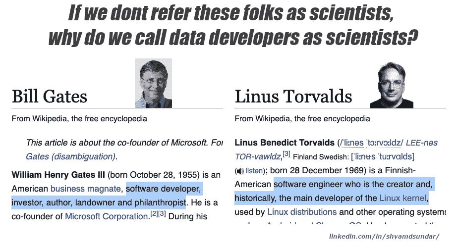
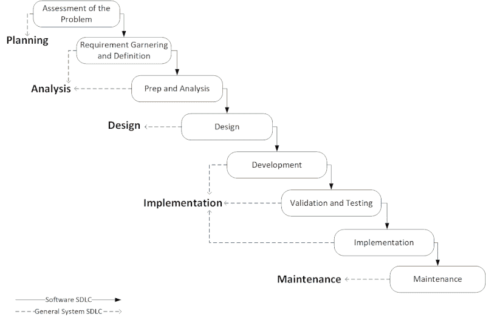

# 为什么你不是(数据)科学家

> 原文：<https://towardsdatascience.com/why-you-are-not-a-data-scientist-f56b5dee68f4?source=collection_archive---------8----------------------->

## 现在是我们明确区分数据科学领域的工程和科学研究的时候了

比尔·盖茨是科学家吗？莱纳斯·托沃兹怎么样？难道他们没有造出独一无二的东西吗？他们实际上做的不止这些！他们以自己的方式用他们“发明”的东西影响了整个世界。如果我们不称他们为科学家，那为什么我们称大三毕业生为“数据科学家”？？

图片来自维基百科文章的截图

到目前为止，您已经知道我对“数据科学家”这个术语有一个基本的问题，以及它如何模糊了完成这项工作所需的细微差别和复杂性。

让我们看看什么是数据科学的一些定义:

> **数据科学**是一个跨学科领域，它使用科学方法、流程、算法和系统从结构化和非结构化数据中提取知识和见解，并将数据中的知识和可行见解应用于广泛的应用领域。数据科学与数据挖掘、机器学习和大数据相关。—维基百科

什么是计算机科学？

> **计算机科学**是对算法过程、计算机器和计算本身的研究。作为一门学科，计算机科学涵盖了从算法、计算和信息的理论研究到在硬件和软件中实现计算系统的实际问题的一系列主题。—维基百科

在我看来，非常宽泛地说，数据科学处理的是“什么”,而计算机科学处理的是计算的“如何”。但是，我们没有遇到太多的“计算机科学家”的个人资料。相反，我们称他们为软件开发人员、全栈开发人员、数据库工程师等。

不要误解我。我本人来自科学背景，我在数据领域。十多年来，甚至在数据科学兴起之前，我就已经建立并发明了数值算法。我确实明白，数据科学需要科学家的严谨，需要基于事实的严格过程，加上对自己结果的极端猜测。但是，就我们正在做的事情而言，几乎没有未探索的领域。实际上，我们做的和我们所说的适当的软件开发生命周期(SDLC)是一样的！

来源:[https://commons . wikimedia . org/wiki/File:General _ System _ SDLC _ % 26 _ Software _ SDLC . gif](https://commons.wikimedia.org/wiki/File:General_System_SDLC_%26_Software_SDLC.gif)

当在软件工程、用户研究等方面做出科学严谨和基于事实的决策时。我们不会草率地称他们为科学家，对吗？也许有些人会这么做，但这不是常态。

虽然我们都认为数据科学是炒作，但在我看来，“数据科学家”的角色是近年来被炒作并变得非常抽象的角色。科学家一词适用于对科学原理有深入了解和敏锐理解的人，但不适用于工作经验不足一年的初级候选人。

此外，数据领域中有许多角色与高级数据科学同等重要，甚至更重要。“数据科学”这个术语本身就非常模糊，导致了许多角色定义的混乱。

> 现在找一个数据架构师比找一个数据科学家难多了！

围绕数据科学家这一角色的大肆宣传正导致被误导的有志之士涌向这些头衔，而不了解业务的真正挑战。有太多的求职者认为自己是科学家，并以此来证明高薪的合理性。但在现实中，每当我建立一个团队时，数据科学家(AI/ML)成员通常是最后被聘用的，因为我们需要首先组织数据。根据我的经验，现在找一个数据架构师比找一个数据科学家要难得多！随着公司意识到数据科学是垃圾进垃圾出，他们现在重新发现了管理数据的重要性。随着该领域需求的增加，以及由于人们涌向数据科学家职位而导致的供应减少，一名优秀数据工程师的工资要求现在与一名优秀数据科学家相当或更高。

我们都知道数据科学的追求者正在用 Kaggle 数据集创造奇迹，大学也在发布突破性的算法。但是，当你绞尽脑汁从稀缺的数据和相关的约束中提取有意义的价值时，真正的挑战和创造力就来了。复杂性和随之而来的研究不仅仅在于算法，还在于数据争论以及将问题分解成更小的基本问题。

> 只有极少数的实践数据科学家能够对“但是，当你完全没有数据开始时，你怎么能做出贡献呢？”

最好的科学研究是从足够的基础工作开始的**在**我们写一行 Python 代码之前。作为一名优秀的科学家，你应该通过对复杂性和可行性的基于证据的推理来远离潜在的陷阱和失败。我很少看到数据科学人员对如何解决问题进行彻底的研究，甚至帮助重新解释问题陈述。只有极少数的实践数据科学家能够对“但是，当你完全没有数据开始时，你怎么能做出贡献呢？”。这种解决问题的心态和对问题领域和陈述进行基础研究的意愿在当前时代严重缺乏。

如果给你一个要实现的技术问题，而你只是在机器学习方面应用现有的过程、代码或解决方案，我宁愿称你为“ML 开发者”或“ ***数据科学开发者*** ”。如果你是科学家，告诉我你正在解决的问题，让我相信它是独特的或困难的，用你如何解决它的故事吸引我。

现实世界的数据科学家需要意识到他们的“对业务的影响”,并阐明数据科学如何增加价值。核心数学或计算机科学专家和商业分析师之间的差距需要积极地融合。业务实体中的数据科学家的期望是构建满足业务痛点的解决方案和 POC。我们已经 ***过了构建酷酷的算法的宣传期*** ，这些算法在技术上很复杂，可行性存疑，商业价值有限。

如果你想成为一名数据科学家，问自己一个问题“为什么我需要成为一名数据科学家？”通常情况下，数据分析师或 ML 开发人员的工作是你所追求的，但在这个狂热的世界里，一切都指向数据科学家。如果你不参考互联网就不能建立一个简单的回归算法，你就已经辜负了成为科学家的期望。但是，即使您通过了测试，您也需要能够找到适用于现实世界场景的合适方法。如果你不能做到这一点，如果你不是一个初级候选人，你再次没有通过评估，因为你需要有人为你构建问题。

错不在想成为数据科学家的有志之士。相反，随着越来越多的职位空缺以数据科学家的头衔出现，他们是行业成熟状态的受害者。像我这样的大多数招聘经理也陷入了这种动态之中。然而，事情正在发生变化，随着大多数数据科学工程的自动化，真正的“科学”角色将很快出现。与此同时，让我们脚踏实地，根据我们能做的而不是标题所说的来寻找位置。

因此，如果你需要成为一名数据科学家，了解数学和统计数据，理解基本原理，足智多谋并专注于交付，知道业务需求是什么，并最终知道为什么你想被称为科学家而不是工程师或开发人员！

如果你已经深入数据科学领域，或者是一名非常优秀的数据科学工程师，对商业价值的产生有敏锐的感觉，请联系我。我一直在寻找有能力的候选人加入我的团队。:)

# 作者信息

Shyam 是 Yara SmallHolder solutions 的数据团队负责人，他的团队负责数据管理和工程、BI、产品分析、营销分析、市场情报、战略洞察和数据科学。他在建立技术和数据领域的全功能团队方面拥有丰富的经验。他本人也是一名实践数据科学家，拥有为大型企业提供数据科学战略咨询的经验。

请在 [**LinkedIn 这里**](https://www.linkedin.com/in/shyamdsundar/) 随意连接和联系聊天。

# 你可能喜欢的其他文章

<https://shyamdsundar.medium.com/guiding-organizations-by-value-amidst-uncertainty-part-1-1a26e65ac049>  <https://medium.com/the-innovation/prioritising-the-scientific-way-507d4200b6b8> 