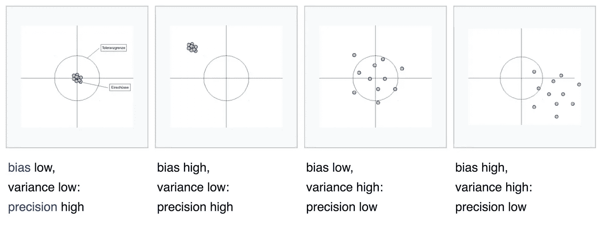
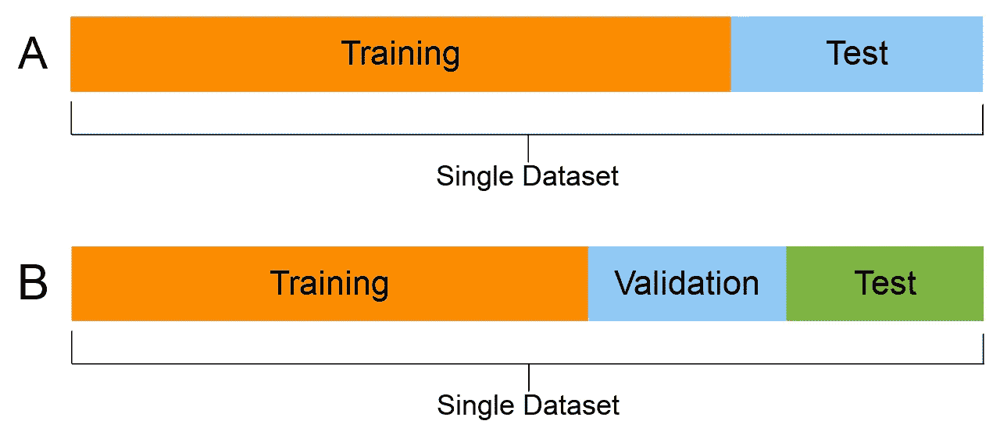
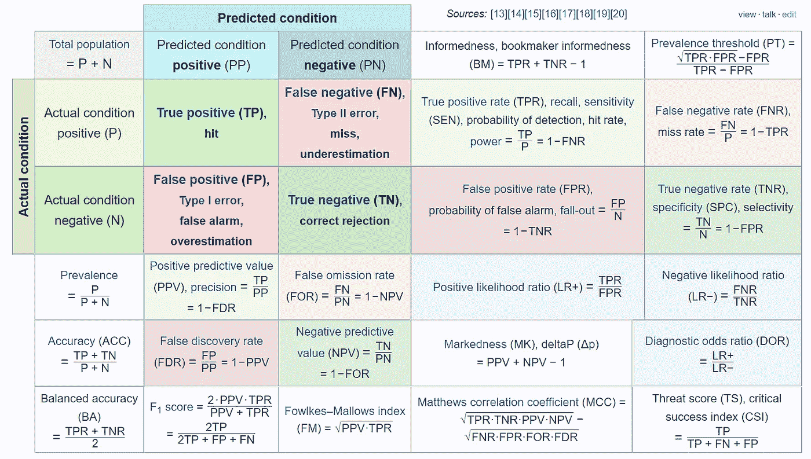

# 你为什么没有通过机器学习面试

> 原文：<https://towardsdatascience.com/why-you-failed-your-machine-learning-interview-5ebb02b9f69c?source=collection_archive---------16----------------------->

## 我在 ML 面试过程中的经验。11 个典型问题及回答方法

背景图片来自 [Envato](https://elements.envato.com/hands-on-laptop-bright-lights-and-numbers-visualiz-AG3AETR) ，作者通过他们持有许可证

不久前，我带着计算机科学的硕士学位离开了大学。
我非常清楚我必须在机器学习和数据科学领域找到一份工作。我的简历上有一些数据科学和数据工程方面的工作经验以及一所顶尖大学的硕士学位。但这只是一个开端，要得到这份工作，你需要 T4 在面试中为他们提供便利。

确保你得到你梦想的工作或雇佣你梦想的团队。我将与您分享我在面试过程中被问到的问题和问题类型。这样你就不会再失败，也可以避免我的错误。

我参加了大约 8 次面试，都是多阶段的过程。通常从编码挑战到几次“放大”采访(流行病时间)

一般来说，有 4 种类型的问题，编程问题，数据科学/机器学习问题，编码挑战和行为问题。根据工作的不同，你应该有针对性地准备回答那些更有可能出现的问题。

# 偏差方差权衡/困境

到目前为止，这是我遇到的最常见的问题，似乎我在每一次复试中都遇到过，这肯定是你应该回顾的事情。偏差-方差权衡是通过增加估计参数的偏差可以减少参数估计的 [v](https://en.wikipedia.org/wiki/Variance) 方差。

这个问题的另一个变体是偏差-方差难题。即同时最小化测试集的偏差和方差的问题。

在这两种情况下，我会提到另一个，并额外给出如何减少高偏差(例如，增加模型复杂性)和高方差(例如，选择较少的特征进行训练)的示例。

偏差方差，来源[维基百科](https://en.wikipedia.org/wiki/Bias%E2%80%93variance_tradeoff)

# 培训、测试、验证集之间的差异

另一个你在面试中会遇到的非常常见的 ML 特有的问题。我发现自己在大约 30%的面试中回答了这个问题。

虽然答案可能非常简短:训练集用于拟合/训练/构建模型，验证集用于估计过度拟合发生的点(提前停止)或用于超参数调整，测试集用于估计泛化误差。

我会鼓励你继续说下去，直到脸上显示出满意为止。您可以添加关于每个数据集使用多少%数据的讨论。其他相关主题，如交叉验证或如何处理具有自然时态联系的数据集，可以给你一些提示。

拆分数据集的示例，来源[维基百科](https://en.wikipedia.org/wiki/Training,_validation,_and_test_sets#Validation_dataset)

# 你喜欢什么型号？

假设您有数据集的结果，神经网络(NN)的准确率为 93%，决策树的准确率为 91%，您倾向于哪种模型？

虽然这里没有正确或错误的答案，但这是一个谈论可解释性和准确性之间权衡的好机会。如果这是一个股票交易模型，1-2%可能是一大笔钱。如果它是一个接受或拒绝贷款申请的模型，并且客户支持必须解释为什么模型得出这个结论，那么答案是完全不同的。

其他值得讨论的考虑因素包括训练、开发、预测和再训练神经网络的实际成本，与决策树相比，这是非常不同的。

# 一大堆 SQL 问题

老实说，我对 SQL 问题的数量感到惊讶。某种形式的问题总是会出现，有时伪装成熊猫问题，例如不同类型的连接。有时直接向我说出一个 SQL 谜语(这个查询会输出什么，或者给我写一个..)以及偶尔询问视图、主键、规范化等概念。

这里要吸取的教训是，他们不会期望您编写优化的查询，但是了解基础知识是必须的。

简单的 SQL 问题，由作者创建

# 行为问题

如果你需要告诉涉众他认为最适合 ML 模型的特性并不是最好的，你会怎么做？

如果你的利益相关者在选择他们提供给你的数据时存在偏见，你会如何表达？(如果他们是数据科学家，则一次；如果他们来自企业，并且只知道基本的 excel，则一次)

行为问题比我最初想的更普遍，但这很大程度上取决于职位。一旦这个职位面对一些非技术的利益相关者，他们将会是这个过程的一个重要部分。尤其是在咨询行业，他们会占用很多面试时间。

在一家大型科技公司的系列面试中，这类问题甚至被问了我 4 个小时。不同的评论者一遍又一遍地问同样的问题，这是一次相当累人的经历，绝对不是我准备好的。你可以做得更好！

# 你会如何处理一个没有标签的问题？

有时候提问的目的是想弄清楚你是否知道一个概念。在这里，它的目的是让你谈论无监督学习和有监督学习之间的区别。

其他可能的解决途径包括让某人注释数据或构建标注软件。提及和解释特定版本的聚类算法，如 K-最近邻或高斯混合模型，并对其进行潜在的阐述可能是一个额外的收获。确保你的回答适合你申请的行业，向他们展示你是这份工作的合适人选。

监督与非监督学习，来源[维基百科](https://en.wikipedia.org/wiki/Unsupervised_learning#/media/File:Task-guidance.png)

# Pep8 是什么

而实际面试中针对特定语言的编程问题并不常见。这是 Python 的一个例子，成为一名优秀的软件工程师总是一个巨大的优势。

Pep8 是 Python 代码最常见的风格指南，它规定了参数后面应该有多少个空格，或者如何构造导入。

这可能会因你所擅长的语言而有很大差异，比如 C++、Scala 等等。他们会问非常不同的问题。我会检查你是否知道至少一个风格指南和一些与测试相关的东西。

# 如果你有一个 API，你会如何加载一个 CSV？

我回答说你应该把它装上熊猫，因为他们比我做得更好，可能没有更好的方法了…

他说，大家都是这么想的，这是不对的(真为我感到羞耻)。显然，加载熊猫需要 7 秒，而他们在 300 毫秒内实现了。

我用这个问题想教会你的是，在回答一些看似琐碎的事情时，不要过于自信。请确保至少包括您将首先测试它并验证附加的东西，比如可能是 parquet 或者将它加载到内存中(或者甚至可能是 Cython).

# 解释一个混淆矩阵？

也称为误差矩阵。对于这样一个简单的问题，你不应该列出所有可能的答案，但一定要简要说明它包含真阳性、假阳性，并且你可以从中计算诸如精确度和召回率之类的东西。

如果非要细说的话，你应该考虑看他们的脸。找到适量的信息呈现给他们将永远是一个平衡的行为。

混淆矩阵示例，截图来自[维基百科](https://en.wikipedia.org/wiki/Confusion_matrix)

# 异常检测？

这是一个非常宽泛的问题。我要做的第一件事是谈论离群值和异常值之间的区别。虽然不是所有的人都有这种差异，但这表明你对这个领域的“文化”差异有所了解。那些有影响的人通常认为异常是数据中的“错误”,不是来自分布，异常值是来自分布，但它们并不常见。

还可以讲隔离林，高斯混合模型，甚至只是标准差等各种统计方法。谈论完这些话题后，你很容易就能完成 5-6 分钟，考虑到面试通常包含更多的问题，这应该绰绰有余。

# 实现一个机器学习 API？

机器学习面试的另一个很大的部分是实际的编码挑战。我被要求训练一个数据模型，并使用该模型构建一个服务请求的 API。

包括 docker、加载模型和测试。虽然我不能在这篇文章中充分讨论我的答案。幸运的是，我制作了一个完整的视频，向你展示了一个非常真实的例子，告诉你如何在合理的时间内完成这样的练习，以及需要注意什么。

# 结论

虽然面试过程在技术上和心理上都要求很高，但我相信现在你已经确切地知道该期待什么了。当然总会有意想不到的问题，你不知道答案。通过使用我们在这篇文章中讨论的技术，并成为一名伟大的数据科学家、软件工程师和机器学习工程师，我相信你会找到你梦想的工作。

如果你喜欢这篇文章，我会很高兴在 Twitter 或 LinkedIn 上联系你。

一定要看看我的 [YouTube](https://www.youtube.com/channel/UCHD5o0P16usdF00-ZQVcFog?view_as=subscriber) 频道，我每周都会在那里发布新视频。