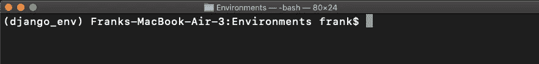

# 为什么需要 Python 虚拟环境以及如何设置它

> 原文：<https://towardsdatascience.com/why-you-need-a-python-virtual-environment-and-how-to-set-it-up-35019841697d?source=collection_archive---------5----------------------->

## 这样做是为了避免将来在 Python 中处理不同项目时出现问题


[JESHOOTS.COM](https://unsplash.com/@jeshoots?utm_source=medium&utm_medium=referral)在 [Unsplash](https://unsplash.com?utm_source=medium&utm_medium=referral) 上拍照

如果你刚刚开始学习 Python 或者已经写了好几个月的 Python 代码，大概你已经在电脑上安装了几十个库了。尽管每个库都可能是获得新 Python 技能的证明，但是如果所有这些库都安装在同一个环境中，它们可能会破坏系统工具或以前的项目，这些项目有自己的依赖关系。

每个项目可能都需要自己独特的第三方 Python 包。这就是为什么每次我们开始一个新项目时，我们都应该用一个特定的 Python 版本和项目的所有依赖项来建立一个新的虚拟环境。如果您以前从未这样做过，请不要担心，在本指南中，我将带您完成 Python 虚拟环境的设置，以便您在使用 Python 处理不同项目时避免将来的问题。

```
**Table of Contents** 1\. [What’s a Virtual Environment?](#db7f)
2\. [How to Create a Virtual Environment with venv](#cdd0)
3\. [Sharing Python Projects](#1bb9)
4\. [Alternative to venv](#87af)
```

# 什么是虚拟环境？

虚拟环境是一种工具，有助于保持所需的依赖关系和项目隔离。如果你想安装一个新的库并在终端上写`pip install name_of_library` 而不激活一个环境，所有的包将被全局安装，如果你在你的计算机上处理不同的项目，这不是一个好的做法。

如果这听起来有点复杂，不要太担心，因为虚拟环境只是一个目录，其中包含我们的项目运行所需的所有文件。

# 如何用 venv 创建虚拟环境

假设我们想在 Python 中处理两个不同的项目。一个是数据科学项目，其中有一些科学库(NumPy、Pandas、Matplotlib 等)，而第二个是 web 开发项目，其中我们将主要使用 Django。

假设数据科学项目的目录树是这样的。

```
data-science-project/
├── dataset1        
├── dataset2
└── dataset3
```

如果我们将所有这些库安装在同一个默认环境中，不仅会出现一些错误，而且默认环境也会变得有点乱，所以我们将使用 Python 3 附带的`venv`安装一个新环境(还要确保安装了 pip)。

要创建一个新的环境，打开一个新的终端，并找到您希望存储项目的文件夹。在该目录中运行命令`python3 -m venv name_of_the_environment`

对于我们的例子，我将通过终端转到`data-science-project`目录，然后运行前面提到的命令来创建一个名为`data_science_env`的虚拟环境

```
cd data-science-project/             # change directory
python3 -m venv data_science_env     # creates the environment
```

我们刚刚创建了一个文件夹，其中包含运行最新版本 Python 的虚拟环境。现在我们的项目目录树看起来像这样。

```
data-science-project/
├── dataset1        
├── dataset2
├── dataset3                  
└── data_science_env                  # our new environment
```

现在是时候激活创建的环境了。为此，我们在终端中运行以下代码。

```
# mac
source data_science_env/bin/activate
# windows
data_science_env\scripts\activate.bat
```

在这之后，您将会看到如下图所示的括号中的环境名称(这次是 Django 环境`django_env`)



作者图片

既然环境已经激活，那么就可以为我们的项目安装特定的库了。比如我要装熊猫。

```
(data_science_env) pip install pandas
```

现在，如果您运行`pip list` ，您应该会看到已安装软件包的列表。由于我们刚刚创建了环境，我们将只找到熊猫。

```
(data_science_env) pip listPackage    Version
---------- -------
pandas      1.2.4
pip        19.0.3
setuptools 40.8.0
```

如果您想要停用当前环境，请运行以下代码

```
(data_science_env) deactivate
```

运行代码后，您应该不会再看到括号内的环境名称。

如果您想要删除创建的环境，请编写以下内容。

```
# mac
rm -rf data_science_env
# windows
rmdir data_science_env /s
```

[](https://betterprogramming.pub/4-books-i-read-as-a-self-taught-data-scientist-380d13d8bb0c) [## 作为一名自学成才的数据科学家，我读了 4 本书

### 涵盖成为数据科学家所需的大部分内容的书籍

better 编程. pub](https://betterprogramming.pub/4-books-i-read-as-a-self-taught-data-scientist-380d13d8bb0c) 

# 共享 Python 项目

创建的环境不仅有助于组织我们的项目，还能让我们轻松地与任何人共享项目。有了虚拟环境，就有可能保留我们项目中的所有信息，比如依赖关系，这样任何人都可以复制我们正在使用的相同环境。

为此，请运行以下命令。

```
(data_science_env) pip freeze > requirements.txt
```

`pip freeze`命令列出了环境中安装的第三方包和版本。输出存储在一个名为`requirements.txt`的文件中

我们可以与任何希望重建特定项目运行环境的人共享该文件。一旦其他人收到该文件，他/她所要做的就是在他们的机器上按照本指南中说明的步骤创建一个新环境，然后激活该环境并运行以下代码。

```
pip install -r requirements.txt
```

这样，环境就在第二台机器上被复制了。要确保所有库都安装了您想要的版本，请编写以下代码。

```
pip list
```

# venv 的替代品

在本文中，我们使用 venv，因为它预装了 Python 然而，还有其他值得一试的选择。

## pipenv

这是一个将包和环境管理支持合并到一个工具中的工具，因此它使用`pip`、`venv`和`requirementes.txt`简化了典型的工作流

不幸的是，它没有预装在 Python 中，所以您必须通过 pip 单独安装它。只需在您的终端上运行以下命令。

```
$ pip install --user pipenv
```

有关该工具的更多信息和设置指南，请查看此处的可用文档[。](https://pipenv.pypa.io/en/latest/)

*就是这样！现在您已经准备好开始一个新的 Python 项目了！下面你可以找到一些我做的关于数据科学中使用的库的指南(Matplotlib/Seaborn，Pandas 和 Scikit-Learn)。*

*   【Excel 用户熊猫指南
*   [如何用 Matplotlib 和 Seaborn 制作漂亮的可视化效果](/a-simple-guide-to-beautiful-visualizations-in-python-f564e6b9d392)
*   [sci kit-Learn 的简单指南—用 Python 构建您的第一个机器学习模型](/a-beginners-guide-to-text-classification-with-scikit-learn-632357e16f3a)

[**与 3k 以上的人一起加入我的电子邮件列表，获取我在所有教程中使用的 Python for Data Science 备忘单(免费 PDF)**](https://frankandrade.ck.page/bd063ff2d3)