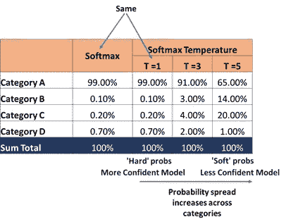
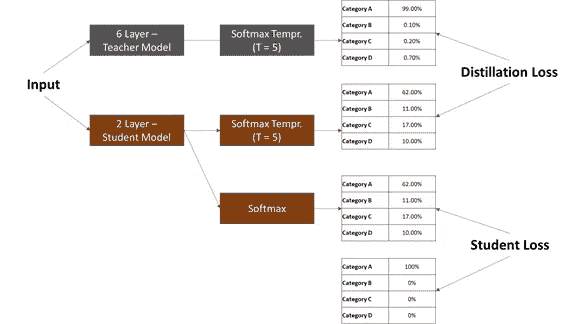

# 为什么你需要停止使用庞大的神经网络模型

> 原文：<https://towardsdatascience.com/why-you-need-to-stop-using-bulky-neural-network-models-d43681d9916f?source=collection_archive---------36----------------------->

## …而是提取他们的知识。

[国家癌症研究所](https://unsplash.com/@nci?utm_source=medium&utm_medium=referral)在 [Unsplash](https://unsplash.com?utm_source=medium&utm_medium=referral) 上拍摄的照片

在大学期间，一个人会接触到各种各样的人。在所有的种类中，我特别羡慕一种特殊的类型。这些人整个学期都不会学习。在考试的前一天，他们会下载一个高水平的主题，最后在考试中创建一个有针对性的答案视图，以成功通过考试。

我一直以为他们是被祝福的。拥有从高水平的学习中提取精华的能力，以及将这种能力转化为具体观点的能力，简直令人钦佩。

我永远做不到，甚至没有勇气去尝试。

最近，在我遇到的一个基于学生和教师的框架中，感觉就像一个赵雨菁。一次具有相同个性的替代性会面。

简单来说，在学生-教师框架中，学生模型(一个轻型神经网络)从教师模型(一个复杂的神经网络)中学习“提炼”的知识。这导致“轻”学生模型具有“重”教师模型的知识，具有相似或稍低的准确度水平。

在这篇文章中，我们将讨论对这样一个框架的需求，蒸馏过程是如何工作的，以及最后学生模型是如何被微调的。

**为什么是师生框架？**

*“如果它不适合你的口袋，它就没有销路”*

随着迁移学习模型和其他复杂神经网络(NN)模型的出现，模型的准确性显著提高。毫不奇怪，这是有代价的。多个神经网络层和众多参数通常会导致庞大的模型，这需要高计算能力来部署。这极大地限制了它们的使用和销售。

显然需要具有相似精确度的更轻的模型。需要一种方法将这些庞大复杂的模型压缩成更小的尺寸，而不显著降低精度。

这就是学生-教师框架的目标。

**什么是师生框架，它是如何运作的？**

在学生-教师框架中，利用复杂的 NN 模型(新的或预训练的)来训练较轻的 NN 模型。从复杂的 NN(老师)到较轻的 NN(学生)传授知识的过程叫做**“蒸馏”**

在深入了解蒸馏过程之前，理解两个术语非常重要:

1.  Softmax 温度:这是 Softmax 的调整版本。Softmax 函数创建跨分类类别的模型输出的预期概率分布，确保概率总和为 1。Softmax 温度做同样的事情，但是另外它*将概率更多地分散在类别中。(见下图)扩散程度由参数“T”定义。T 越高，概率在类别间的分布就越高。T = 1 与正常的 Softmax 相同。*

作者图片

请注意，虽然与直觉相反，但在许多情况下，为了获得各种潜在的结果，“软”概率是首选的。例如，在文本生成中，人们期望有更大的潜在选项集来生成多样化的文本。

在蒸馏过程中，模型中不使用 Softmax，而是使用 Softmax 温度。

2.**暗知识:**在 Softmax 温度的例子中，由于 Softmax 参数“T”的变化，我们从概率分布中获得的所有“额外知识”被称为暗知识。换句话说，通过使用 Softmax 温度(T > 1)而不是 Softmax 获得的增量知识是暗知识。

**蒸馏过程**工作如下:

1.**训练(或使用预训练)复杂(比方说 10 层)“老师”模型**。不出所料，这是一个计算密集型步骤。教师模型的输出将是跨类别/标签分布的 Softmax 温度输出概率。

2.**以“学生层”的 Softmax 温度输出尽可能接近“教师”模型的方式，创建并训练一个更简单的(假设 2 层)“学生”模型**。为此，学生和教师之间称为**“蒸馏损失”**的交叉熵损失应最小化。这就是所谓的“**软瞄准”。通过这种方式，我们将“黑暗知识”从老师传递给学生。注意，这里的知识是跨各个层面传递的，而不仅仅是最后的损失。**

这里出现的一个显而易见的问题是，我们为什么要瞄准软目标(一个展开的概率分布)。这是因为软目标比硬目标提供更多的信息。这导致更小的模型更有知识，从而需要更少的额外培训。

3.同时，使用 Softmax 激活(不是 Softmax 温度)训练“学生”模型，以使模型输出尽可能接近实际值。为此，学生和实际之间的交叉熵损失被称为**“学生损失”**被最小化。这叫**“硬瞄准”。**

4.对于#2 和#3，**最小化总损失-** ，即蒸馏损失和学生损失的加权和，**。**

> ***损耗= a *学生损耗+ b *蒸馏损耗***

概略地说，所提到的过程可以描述如下:

作者图片

**结论**:蒸馏(学生-教师框架)是一个很棒的模型无关工具，可以在没有太多计算能力的边缘设备上部署模型。虽然理论上该框架可以应用于任何大型神经网络模型；我个人已经看到它被用于一个 6 层 CNN 模型和蒸馏伯特。随着大量边缘设备的出现，我预计这个框架很快就会无处不在。

快乐学习！！

PS:为那些帮助我为这篇文章动笔的了不起的大学名人干杯！

*免责声明:本文表达的观点是作者以个人身份发表的意见，而非其雇主的意见*