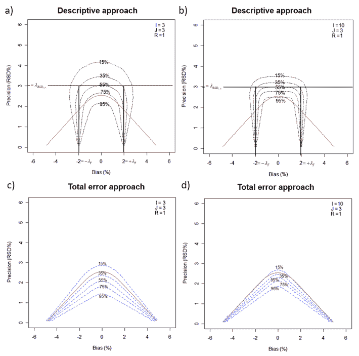
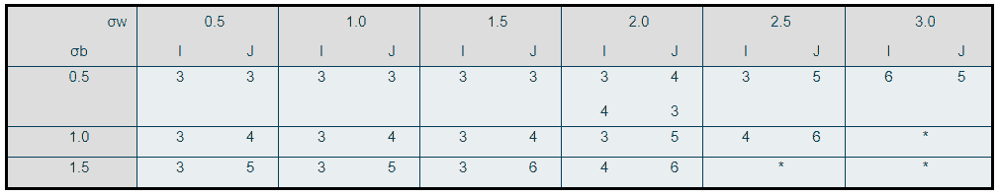

# 为什么你从来没有真正验证你的分析方法，除非你使用总误差方法

> 原文：<https://towardsdatascience.com/why-you-never-really-validate-your-analytical-method-unless-you-use-the-total-error-approach-part-a5be360e1563?source=collection_archive---------52----------------------->

## 第二部分:生产者和消费者风险

照片由比尔牛津在 Unsplash。

*Thomas de March in(pharm Alex 统计和数据科学高级经理)、Milana Filatenkova(pharm Alex 统计和数据科学经理)和 Eric Rozet(pharm Alex 统计和数据科学总监)*

这是分析方法验证中总误差方法系列文章的第二篇。如果你错过了第一篇文章，我鼓励你阅读它，以熟悉总误差概念和我们下面要讨论的内容:[https://towardsdatascience . com/why-you-never-true-validate-you-analytical-method-unless-you-use-the-total-error-approach-part-CB 2247874 CD](/why-you-never-really-validate-your-analytical-method-unless-you-use-the-total-error-approach-part-cb2247874cd)

现状是——验证结果经常被过度信任。通过验证评估的方法通常被认为足以声称其性能可靠。然而，重要的是要记住，在统计学中，没有什么可以保证 100%的信心。一个概率标签必须被放在任何陈述上，以便给它冠上一定程度的信任。100%的置信度可能仅归因于在研究了所有可能样本后做出的陈述——这是一种理想的情况，在现实中是不可能的。在分析方法验证的背景下，在整个人群中测试一种方法意味着进行无数次测量。实际上，方法的性能是根据一个样品的一些测量值来估计的，该样品是无限个可能样品(即总体)中的一个，因此是不确定的。

让我们用图 1 来解释这个概念。假设我们有一个方法，它的相对偏差为+1.5%，精确度 CV 为 2.5%。你永远不会知道真正的价值是什么，因为它需要进行无数次的测量来确定真正的价值。相反，您将尝试通过仅进行几次测量来评估您的分析方法的性能(假设每个浓度水平 3 个系列 3 次重复，这是行业中常用的有限设计)。如图 1 所示，每次做这个练习，您都会得到不同的真实度和精确度的估计。实际上，这种练习只进行一次，希望估计值接近真实值。

现在，让我们假设您的验证标准是真实度±2%的相对偏差和精密度±3%的 CV(制药行业中常见的值)。上述示例中真实度为+1.5%且 CV 为 2.5%的方法应该有效，因为这些参数的真实值包含在各自的验收标准中。然而，由于我们是在样本上估计这些参数，我们可能会意外地得到高于接受标准的估计值，如图 1 中的第二个例子。在这种情况下，您将声明您的方法无效，而它实际上是有效的。另一方面，可能会发生相反的情况。您可能有一个实际偏差和/或精度高于验证标准的方法，并且意外地获得了可接受限度内的估计值。在这种情况下，您应该声明该方法有效，而实际上它无效。第一种情况是生产者风险(拒绝有效方法的风险)，而第二种情况是消费者风险(接受无效方法的风险)。

图 1:根据从样本中获得的信息对总体进行推断的过程。图片作者。

Bouabidi 等人(2010 年)调查了与使用经典描述性方法(即分别评估精确度和真实性)和总误差方法(即同时评估精确度和真实性)相关的风险。图 2 用已知精度 CV 和已知偏差的不同组合对计算机模拟方法的模拟验证实验说明了这些风险。已知偏差范围为 5 至+5%，已知中间精度 CV (RSD)范围为 0%至 5%。重复的数量固定在 *J* = 3，使用的系列 *i* 的数量为 3 和 10。接受标准设定为相对偏差 2%，描述性方法的 CV 为 3%，总误差为 5%，风险为 5%。这些值是药物制剂中活性成分一致性评价框架内使用的典型限值。

图 2:使用描述性(a，b)和总误差(c，d)方法的模拟结果——在方法的可能精度和偏差范围内绘制的等概率曲线。接受一种方法的概率沿着等概率曲线保持不变，因为真实精度和偏差是变化的。左图和右图显示了每次模拟中测量次数不同的模拟设置的结果。I 是系列数，J 是重复数，R 是系列间方差与重复性方差的比值(此处设置为 1)。[−λτ;+λτ]是真实度的接受极限，λRSDIP 是精度的接受极限。在 95%的概率下，总误差的可接受极限为 5%。所有图中出现的连续红色钟形曲线是一条理论曲线，它界定了方法确保 95%的结果在总误差的 5%验收限值内的区域。图从 Bouabidi 等人(2010 年)处复制并修改。

模拟过程如图 1 所示。每次迭代都是从给定精度和真实度的分布中选取样本。然后，基于这些样本估计精度和真实度(对于描述性方法)或总误差(对于总误差方法),并与预定义的标准进行比较，以评估方法的有效性。这一过程重复数千次，根据估计的真实性和偏差(“描述性”方法)或总误差(“总误差方法”)确定方法有效性。接受具有给定精度和偏差的模拟分析方法为有效方法的概率计算为该方法成功验证的实验与进行的实验总数的比率。

图 2 中绘制的曲线是等概率曲线，沿着这些曲线，方法的精度和准确性是变化的，但是成功验证的概率保持不变。例如，在图 2a 中，标有 75%的等概率曲线显示了所有可能的精度和真实度的组合，这些组合导致相关方法有 75%的机会使用描述性方法被宣布为有效。

为了评估这些等概率曲线，我们需要一个比较参考——一条 100%等概率曲线(图中以红色显示)。对于沿着该曲线的偏差和精度的每个组合，执行完美的验证过程，其中包括至少 95%的无限数量的样品测量落在 5%的总误差限度内。在这个理想的设置中，不是从有限的样本量来估计偏差和精度，而是采用真实值来产生测量值。

现在让我们看看我们能从这些数字中学到什么。

在描述性方法的框架内，任何已知偏差和精度的组合超出验收限值所定义的矩形的方法都应被宣布为无效。然而，由于偏差和精度估计的不确定性，通常使用 3 个系列 3 次重复的实验设计(图 2a ),这种方法也以 35-55%的显著概率接受真实性或精度值略大于各自接受极限的有效方法。这种验证设计会导致两个验证中有一个被错误地分类为有效。这个例子表明，描述性方法可能与相当大的消费者风险有关。另一方面，任何验证参数落在接受矩形内的方法都应该被声明为有效。然而，在图 2 中，我们看到有很大的几率(25–45 %)剔除在各自接受范围内具有已知真实度和精度值的方法。这个例子表明，大量完全可以接受的方法最终可能会因为使用这种方法而被丢弃——这是一个生产者面临重大风险的场景。

在样本量相同的情况下，与描述性方法相比，总误差方法提供的消费者风险较小，但生产者风险较高。在总误差法下，消费者风险得到更好的控制，因为对于小样本量，错误声明方法有效的风险低于 35%(图 2c)，而对于描述性方法，这一风险高达 55%。另一方面，总误差法的生产者风险更高，因为我们看到这种方法拒绝有效方法的概率达到 65%以上。相比之下，描述性方法的最大生产者风险为 45%。对于总误差法，当增加样本量时(图 2d)，消费者和生产者的风险都会降低，因为这些方法的参数估计得更好。

通过增加样本量，有可能减少真实性和精确度估计的不确定性，这将导致等概率曲线收敛到 100%的理想等概率曲线，其中生产者和消费者的风险最小。事实上，在样本量很小的情况下，您可能会意外地选取几个极端样本，得到的估计值与真实值相差甚远。通过增加样本量，可以降低挑选极端样本的风险

值得注意的是，增加样本量，从而降低消费者/生产者的风险，在实现验证目标方面对描述性方法的影响有限，验证目标是保证未来的测量值接近真实值。事实上，当测量次数趋于无穷大时，在全逼近下生成的等概率曲线向理想验证曲线收敛(图 2c 和图 2d 中的等概率曲线具有非常接近红色连续双曲线的形状),而在描述性逼近下生成的曲线向验收极限定义的矩形收敛。在与接受极限相对应的值下，对于具有无限样本量的描述性方法，错误接受或拒绝有效分析方法的风险为 50%。换句话说，描述性方法的可接受范围与验证的目标不一致，验证的目标是保证至少 95%的由宣布有效的方法产生的结果在总误差的 5%可接受范围内，无论用于测量的样本大小如何。

在开始验证阶段之前，可以(也建议)确定要执行的最佳实验数量(系列数量和系列重复次数),以确保做出正确的决策。这些最佳数字将基于对该方法的精确度和真实性的猜测。这些猜测可以通过分析分析方法的预验证、开发或优化阶段的结果来获得。正如我们在上面看到的，进行太少的实验会导致拒绝一个可接受的分析方法。相反，过多的实验会导致功率过大，使验证阶段比必要的时间更长，成本更高。在这两个极端之间找到一个平衡点是很重要的，也就是要进行的实验的最佳数量。表 1 显示了使用总误差方法在 95%的情况下实现验证所需的最小推荐样本量的示例，未来测量超出验收限值的风险小于 5%(此处设置为 10%)。在本例中，系列 I 和系列重复次数 J 的推荐数量是系列间σb 和系列内σw(或重复性)期望值的函数，均以%CV 表示。如果预期分析方法具有 1%的已知σw 和 1%的已知σb，则在 95%的情况下达到成功的最小系列数和每个系列的最小重复数分别为 3 和 4。当预期具有 3%的已知σw 和 0.5%的已知σb 时，则最小系列数为 6，每个系列的最小重复数为 5。

表 1:当验收限值设置为 10%且预期相对偏差约为 2%时，系列 I 和系列 J 的推荐数量作为系列间σb 和系列内σw(重复性)%CV 期望值的函数。该表是使用 Enoval 软件([https://www.pharmalex.com/enoval](https://www.pharmalex.com/enoval))生成的。

总之，本文展示了与验证相关的两个风险:将无效方法声明为有效的风险(消费者风险)和将有效方法声明为无效的风险(生产者风险)。我们已经看到，如果样本量为 3 个系列，每个系列 3 个重复，这是行业中常用的设计，这些风险可能非常高。为了控制生产者的风险，建议在进行验证之前确定要进行的实验的最佳数量。当比较描述性方法和总误差方法时，已经表明无论样本大小如何，与前者相比，后者的消费者风险明显较低。对于总误差法，可以控制在可接受范围内获得结果的概率，即了解分析方法结果的可靠性。这是用描述性方法得不到的重要信息。当增加样本量时，总误差方法的生产者风险降低。最后，在考虑的两种方法中，只有总误差方法有潜力实现验证的目标:你能相信你的结果在整个产品生命周期中做出充分的关键决策吗？

# 文献学

布阿比迪、a、e .罗泽、m .菲莱、e .齐蒙斯、e .查普泽、b .默滕斯、r .克林肯伯格、a .塞卡托、m .塔尔比、b .斯特雷尔、a .布克卢泽、b .布朗热和 Ph .休伯特。2010."在符合目的概念的框架内对几种分析方法验证策略的批判性分析."色谱杂志 A 1217(19):3180–92。doi: 10.1016/j.chroma