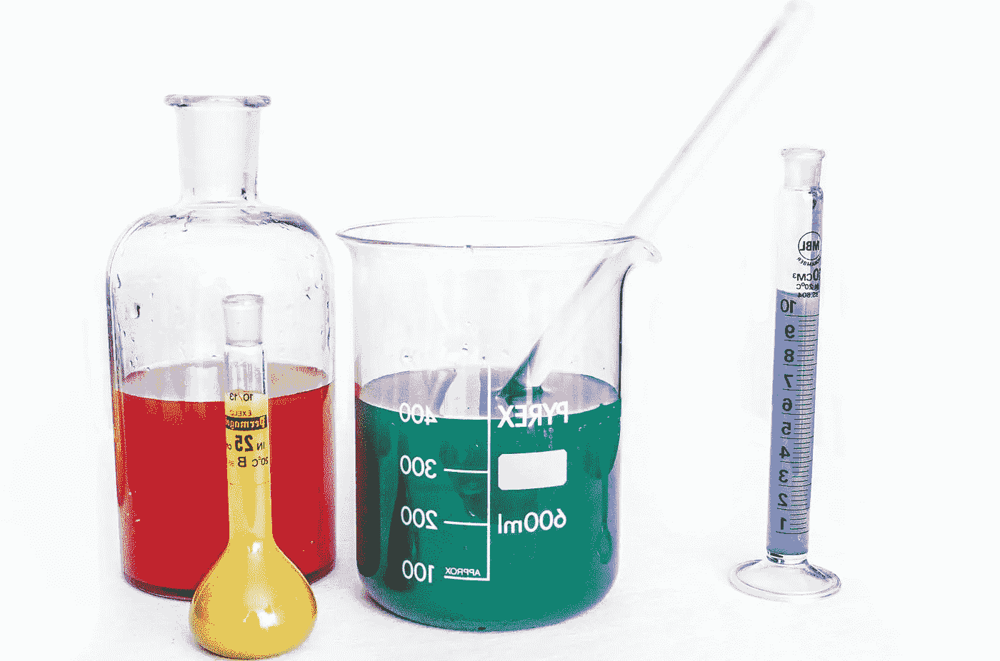
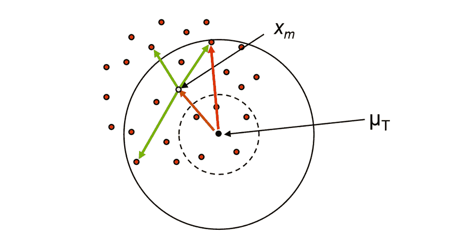

# 为什么你从来没有真正验证你的分析方法，除非你使用总误差方法

> 原文：<https://towardsdatascience.com/why-you-never-really-validate-your-analytical-method-unless-you-use-the-total-error-approach-part-cb2247874cd?source=collection_archive---------58----------------------->

## [意见](https://towardsdatascience.com/tagged/opinion)

## 第一部分:概念

图片来自 Pixnio。

*Thomas de March in(pharm Alex 统计和数据科学高级经理)、Milana Filatenkova(pharm Alex 统计和数据科学经理)和 Eric Rozet(pharm Alex 统计和数据科学总监)*

任何分析方法的一致和有效使用都需要在使用前了解其可靠性。因此，每个实验室都有必要验证他们的分析方法。验证不仅是监管机构[ICH、FDA、GxP]或为了获得认证[ISO 17025]的要求，也是常规使用该方法前的必要步骤。分析方法验证的作用是为实验室生成的结果提供信心，这些结果将在以后用于做出关键决策。

验证必须给出信心，即在常规中产生的每个未来测量值将足够接近真实值。这项工作通常通过评估方法性能的不同特征来进行，例如真实性(在 ICH Q2 中也称为准确性)、精密度(重复性和中间精密度)、特异性、检测限、定量限、线性、范围和稳定性。为了确定方法是否有效，将验证实验中获得的这些参数的测量值与预定义的验收标准进行比较。

在这里，我们将重点讨论真实和精确的概念。分析误差通常分为两部分(图 1):随机误差(在此称为“精度”)和系统误差(在此称为“真实度”)。分析误差的这两个要素可以通过对同一样品的多次重复测量来估算。值得注意的是，在多个独立的重复测量系列上测量的精度可以进一步分为重复性和系列间可变性，并被定义为“中间精度”。精度计算为重复测量的标准偏差(SD ),真实度计算为重复测量的平均值(Xm)和参考值(T)之间的差值。在实践中，在验证这两种类型的误差时最常报告的指标是:精确度的%CV (SD/ T*100)和真实性的相对偏差((Xm- T )/ T*100)。

图 1:分析误差分量的示意图；橙色箭头:系统误差或偏差；绿色箭头:随机误差或标准差；红色箭头:总误差。Xm 是结果(红点)的平均值，T 是样本的真实值。图片作者。

如上所述，通常的做法是将验证过程中获得的指标与一些预定义的验收标准进行比较(例如，精确度为 15% CV，真实性为 10%相对偏差)，以确定方法是否有效。这就是所谓的“描述性”方法。但是等等…让我们回到验证的最初目标:*验证必须给出信心，即在常规中进行的每个未来测量将接近真实值*。本声明关注单个*未来*测量，而非重复测量的平均值或离差。如图 1 所示，单次测量取决于其总分析误差(本文也称为准确度)，*，即*误差的系统部分和随机部分的同时组合。因此，这两部分各自的影响是不相关的。事实上，一种分析方法的准确性差还是精度差并不重要，只要两种误差成分的组合是可接受的。

由于评估精确度和真实性并将其与预定义的标准进行比较并不能回答验证的问题，因此程序应根据其总误差进行鉴定。如果样品的每个未来测量值(Xi)与其“真实值”(T)之间的差异极有可能(“保证”)在分析员预定义的接受限度内，则可认为分析方法的性能是可接受的。具有已知风险的“良好分析程序”的概念可以转化为以下等式:

p 表示任何未来结果在验收限值内的概率，验收限值由分析员根据方法目标事先确定(λ，例如+-30%)，应大于最低质量水平β(假设为 0.95)。

但是如何表示这种可能性，以及如何决定标准呢？准确度剖面可作为该决定的适当规则(Hubert et al . 2004 休伯特、阮胡夫、布朗热、查普塞特、恰普等人，2007 年；休伯特、阮胡夫、布朗热、查普塞特、科恩等人，2007 年)。图 2 显示了一个精度曲线的例子。对于每个浓度水平，计算预测区间(也称为β-预期公差区间)以评估未来 95%测量的预期相对误差范围。这个区间是根据分析方法的偏差和精度的估计值计算出来的。然后，一方面的预测区间的下限和另一方面的上限被连接。图 2 中的绿色区域描述了剂量间隔，在该剂量间隔内，该程序能够产生具有已知准确度的测量值和由分析员确定的风险水平。例如，如果分析员预设了 5%的可接受风险水平，该验证方法将保证其分析方法给出的未来结果的平均 95%将包含在根据要求确定的可接受限度内(*例如*:散装 1%或 2%，特殊药品 5%，生物分析 15%，)。

图 2:作为决策工具的精确度分布图。在本例中，在 5 个浓度水平下进行了 3 系列测量。每个测量的相对误差由点表示。两条蓝色虚线之间的区域表示预测区间，在该区间内，我们预计未来测量值的 95%。浅绿色区域代表有效剂量范围。这个数字是使用 Enoval 软件(【https://www.pharmalex.com/enoval】T2)生成的。

如图 2 所示，如果准确度分布图的一个子部分超出了可接受的限度，则需要定义新的定量限度，因此需要定义新的剂量间隔。图 2 显示了这些新的限值 ULOQ(定量上限)和 LLOQ(定量下限),它们与该标准的定义完全一致，*即*可分别以规定的准确度(真实度+精密度)测量的待分析物质的最高和最低量。

使用准确度剖面作为单一决策工具，不仅可以使验证的目标与分析方法的目标相一致，还可以直观地掌握程序实现其分析目标的能力[Hubert et al . 2004；休伯特、阮胡夫、布朗热、查普塞特、恰普等人，2007 年；休伯特、阮胡夫、布朗热、查普塞特、科恩等人，2007 年】。随着即将发布的 USP 1220 和 ICH Q14 中开发出新的分析质量设计(aQbD)和分析程序生命周期概念，这最后一点变得更加重要。为了证明分析方法符合其预期目的，USP 1220 规定验证标准应符合产品和工艺需求的质量标准。在这种情况下，总误差方法的使用极大地方便了在其使用环境中对该方法性能的解释。事实上，结果的最终用户将它们的质量与它们到真实值(即总误差)的距离联系起来，而不是与它们各自的离差或偏差联系起来。同样值得一提的是，USP 1210 建议使用预测区间来评估分析方法是否适合其预期目的。

总之，我们看到总误差法是一种合适的方法，可以满足验证的目标，并证明该方法适合目的。它是实施 aQbD 和分析程序生命周期概念的关键工具。

在第二部分中，我们将看到，与传统的验证方法相比，总误差方法在降低商业和消费者风险方面也有很大的优势。

# 文献学

USP 第<1210>章用于程序验证的统计工具

USP 草案章节<1220>分析程序生命周期

休伯特博士、阮胡杰、布朗热、查普泽、基亚普、科恩、孔波尼翁、杜维、范伯格、拉利耶、劳伦提、梅塞尔、穆扎德、尼维特和瓦拉特。2004.“定量分析程序验证策略的协调:SFSTP 建议—第一部分”，*药物和生物医学分析杂志*36(3):579–86。2004 年 7 月 27 日

休伯特博士、阮胡杰、布朗热、查普泽、基亚普、科恩、孔波尼翁、杜维、范伯格、拉利尔、劳伦提、梅塞尔、穆扎德、尼维特、瓦拉特和罗泽。2007."定量分析方法验证策略的协调:SFSTP 建议-第二部分."*药物和生物医学分析杂志*45(1):70–81。2007 年 6 月 13 日

休伯特博士、阮胡杰、布朗热、查普泽、科恩、孔波尼翁、杜韦、范伯格、劳伦提、梅塞尔、穆扎德、瓦拉特和罗泽。2007."定量分析方法验证策略的协调:SFSTP 建议-第三部分."药物和生物医学分析杂志 45(1):82–96。2007 年 6 月 32 日