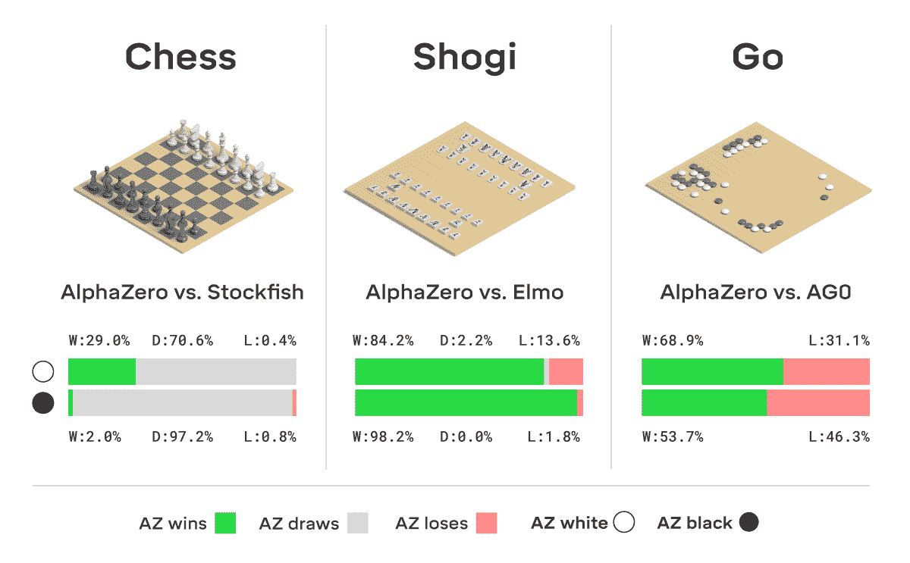

# 为什么应该将强化学习添加到您的数据科学工具箱中

> 原文：<https://towardsdatascience.com/why-you-should-add-reinforcement-learning-to-your-data-science-toolbox-f6d4728afe66?source=collection_archive---------13----------------------->

## 以及从哪里开始学习。

由[谷仓图片](https://unsplash.com/@barnimages?utm_source=medium&utm_medium=referral)在 [Unsplash](https://unsplash.com?utm_source=medium&utm_medium=referral) 上拍摄

**作为一名数据科学家，你可以学到很多东西。我敢打赌，你学到的第一件事是关于统计学、数据分析、可视化、编程、数据库、机器学习和深度学习。当你熟悉这些主题时，你可以继续学习更具体的主题，比如 GANs、NLP、云、容器化、软件工程等等。你根据自己喜欢的东西和需要的技能来选择方向。这篇博客文章解释了为什么将强化学习(RL)添加到您的数据科学工具箱中是一个不错的选择。**

如果你对 RL 一无所知，想看看应用，可以看[这篇文章](/snake-played-by-a-deep-reinforcement-learning-agent-53f2c4331d36)。简单回顾一下:代理通过选择动作与环境进行交互。代理接受观察和奖励。代理人的目标是最大化报酬的总和。这个过程是一段一段发生的，代理人不断学习，越来越擅长自己的工作。

在现实生活中，学习也是如此。当你教狗听命令时，当它表现出正确的行为时，你就给了它一份奖励。如果他没有，他什么也得不到。你可以把这种情况翻译成 RL。状态是它听到的命令，动作是狗对命令做出的任何反应，奖励是款待。如果狗喜欢吃零食，它会越来越听话:)

照片由 [Camylla Battani](https://unsplash.com/@camylla93?utm_source=medium&utm_medium=referral) 在 [Unsplash](https://unsplash.com?utm_source=medium&utm_medium=referral) 上拍摄

*警告:如果你刚刚开始你的数据科学生涯，我不建议你从 RL 开始！这是一个高级话题，你应该了解数学和深度学习。*

# 学习 RL 的三个主要原因

为什么要学 RL？

## **1。许多商业问题可以用 RL** 解决

RL 增加了有价值的知识，你可以用在许多商业案例中。一些例子是:

*   您可以构建一个次优行动推荐系统。假设你有客户，你想为每个客户找到最有利可图的行动。您可以为您的客户定义状态，如新客户、老客户或忠实客户。通过测试销售和营销行为，你可以找到与州相关的最有利可图的行为。
*   调度作业是另一项有趣的任务。您可以指定作业集、每个作业所需的资源和时间。代理将找到优化作业完成时间的方法。
*   自动化和机器人技术。通过使用 RL，机器人可以学习完美地执行一项任务。有些任务很难设计，RL 可以帮助完成这些任务。一个很好的例子是控制交通灯信号网络:通过奖励 RL 代理较少的延迟，代理找到了组织信号的最佳方式。它们比普通的交通灯控制机制表现得更好。

由 [Eliobed Suarez](https://unsplash.com/@eliobedsuarez?utm_source=medium&utm_medium=referral) 在 [Unsplash](https://unsplash.com?utm_source=medium&utm_medium=referral) 拍摄的照片

还不信服？让我们继续下一个原因。

## 2.你不需要带标签的数据

尽管带标签的数据在 RL 问题中很有用，但这不是必需的。你可以从零开始建立一个 RL 环境，代理会找到一种方法来最大化奖励的总和。

这是一件大事。数据准备和收集是数据科学家面临的挑战，一项调查显示，这消耗了他们几乎 80%的时间。更糟糕的是，这些是数据科学家最不喜欢的任务。通过使用 RL，可以跳过这一部分。代理可以从头开始学习，不一定需要带标签的数据。另一方面，创建一个环境可能很困难，尤其是当您刚刚开始使用 RL 并想要解决一个复杂的问题时。在这种情况下，你可以从简单开始(用最少的可行产品),并通过添加特性和试验状态、动作和奖励的不同定义来扩展你的问题。

AlphaZero ，只通过自我游戏训练，只知道国际象棋、日本象棋和围棋的规则。它超越了所有以前发明的算法，并展示了玩这些游戏的酷新方法。

来源:DeepMind

## 3.脱颖而出

网上有很多数据科学学习途径。你可以在 Coursera、DataCamp、Udacity 或 deeplearning.ai 等网站开始你的旅程。或者你可以拿到学士或硕士学位。这些学习路径中的大多数课程将教你如何编程，以及如何分析、可视化和建模数据。在开始的时候，这是可以的，但是在你能够执行这些任务之后，你就可以开始将自己与“普通的”数据科学家区分开来。学习强化学习可以帮助你做到这一点。

RL 不是在标准的数据科学认证项目中教授的，掌握起来真的很酷。你可以提出一个新的独特的解决方案，从不同的角度处理问题。如果你能够开发与业务问题相关的 RL 解决方案，你就能让自己从其他数据科学家中脱颖而出。

除此之外，RL 问题就像一个谜题。思考如何定义状态、奖励和行动很有趣。工作解决方案带来了积极的氛围。尝试是很好的，因为只要报酬有一点点变化，代理人就可以做非常奇怪的事情(你可能想看看这里的)。

# 从哪里开始学习

希望你被说服了，想开始学习 RL！以下是一些你可以在旅途中使用的资源。

## [强化学习，第二版:简介](https://web.stanford.edu/class/psych209/Readings/SuttonBartoIPRLBook2ndEd.pdf)

萨顿和巴尔托的这本书被广泛使用，包含了你需要知道的关于 RL 的一切。

## [强化学习专精](https://www.coursera.org/specializations/reinforcement-learning)

由阿尔伯塔大学开发的这一系列课程是一个很好的资源。它从基础开始，帮助你真正掌握书中解释的概念和算法。完成本专业后，您将能够创建自己的环境并解决 RL 问题。

## [强化学习课程| DeepMind & UCL](https://www.youtube.com/playlist?list=PLqYmG7hTraZBKeNJ-JE_eyJHZ7XgBoAyb)

这一系列讲座来自 deep mind(alpha zero 的创造者)并从基础开始，但也谈论高级话题。

享受学习！

如果你想在我发表新文章时收到电子邮件，别忘了订阅。 ❤