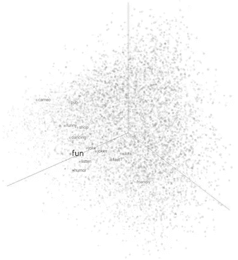
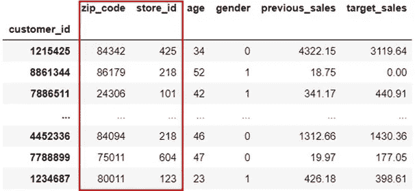
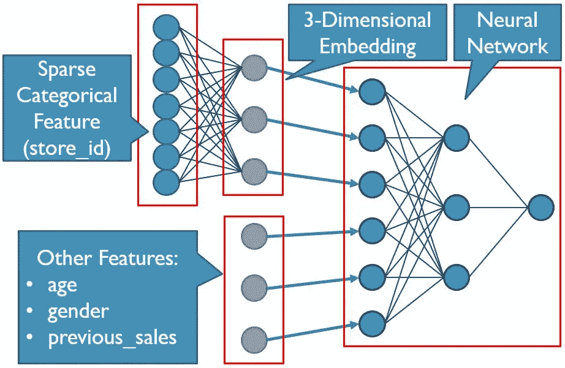

# 为什么应该总是对结构化数据集使用要素嵌入

> 原文：<https://towardsdatascience.com/why-you-should-always-use-feature-embeddings-with-structured-datasets-7f280b40e716?source=collection_archive---------4----------------------->


*图片经由* [*iStock*](https://www.istockphoto.com/) *授权给迈克尔·马林*

## 一个简单的技术来提高你使用的任何模型的准确性

在表格数据表上训练神经网络时，特征嵌入是最重要的步骤之一。不幸的是，这种技术很少在自然语言处理(NLP)设置之外教授，因此对于结构化数据集几乎完全被忽略。但是跳过这一步会导致模型准确性的显著下降！这导致了一种错误的理解，即梯度增强方法(如 XGBoost)对于结构化数据集问题总是更优越。不仅嵌入增强的神经网络通常胜过梯度增强方法，而且当提取这些嵌入时，两种建模方法都可以看到重大改进。本文将回答以下问题:

*   什么是特征嵌入？
*   它们是如何用于结构化数据的？
*   如果它们如此强大，为什么它们不更加普遍呢？
*   嵌入是如何实现的？
*   我如何使用这些嵌入来增强其他模型？

# 解释了特征嵌入

神经网络难以处理稀疏分类特征。嵌入是减少这些特征以提高模型性能的一种方式。在讨论结构化数据集之前，理解嵌入通常是如何使用的是有帮助的。在自然语言处理环境中，您通常会处理成千上万个单词的词典。这些字典被一次性编码到模型中，这在数学上等同于为每个可能的单词设置单独的一列。当一个单词输入到模型中时，相应的列将显示 1，而所有其他列将显示 0。这导致了一个非常稀疏的数据集。解决方案是创建一个嵌入。



作者照片，由 [TensorFlow 嵌入式投影仪](https://projector.tensorflow.org/)创作

嵌入本质上将基于训练文本对具有相似含义的单词进行分组，并返回它们的位置。因此，举例来说，“乐趣”可能与“幽默”、“跳舞”或“机器学习”等词具有类似的嵌入价值。实际上，神经网络在这些代表性特征上表现得更好。

# 结构化数据的嵌入



作者数据框示例

结构化数据集通常也包含 sparce 分类特征。在上面的示例客户销售表中，我们有邮政编码和商店 ID。因为这些列可能有成百上千个不同的唯一值，所以利用它们会产生与上面的 NLP 问题相同的性能问题。那么为什么不以同样的方式使用嵌入呢？

问题是，我们现在处理的不止是一个特性。在这种情况下，两个单独的稀疏分类列(邮政编码和商店 ID)以及其他强大的功能，如销售总额。我们不能简单地将我们的特征嵌入。然而，我们可以在模型的第一层中训练我们的嵌入，并在这些嵌入旁边添加正常的特性。这不仅将邮政编码和商店 ID 转换成有用的特性，而且现在其他有用的特性也不会被成千上万的列冲淡。



作者嵌入图示例

# 为什么嵌入被忽略

在最大的以 ML 为中心的公司中，这种技术是绝对使用的。问题是这些大公司之外的绝大多数数据科学家从未听说过以这种方式使用嵌入。这是为什么呢？虽然我不会说这些方法很难实现，但它们已经超出了典型在线课程或专业的复杂程度。大多数有抱负的机器学习实践者根本不知道如何将嵌入与其他非分类特征合并。因此，像邮政编码和商店 ID 这样的特性通常会直接从模型中删除。但这些都是重要的功能！

一些特征值可以通过像均值编码这样的技术来捕获，但是这些改进通常是微不足道的。这导致了完全跳过神经网络的趋势，因为梯度增强方法可以更好地处理这些分类特征。但是如上所述，嵌入可以改进这两个模型，这将在下一节中看到。

# 如何实现嵌入

这个过程中最困难的部分是熟悉 TensorFlow 数据集。虽然它们远不如 pandas 数据框直观，但如果您计划将模型扩展到大规模数据集或想要构建更复杂的网络，它们是一项很好的学习技能。

对于这个例子，我们将使用上面假设的客户销售表。我们的目标是预测目标月份的销售额。为简单起见，我们将跳过工程步骤，从预分割的 pandas 数据帧开始。对于较大的数据集，您可能不会从数据框开始，但这是另一篇文章的主题。

第一步是将这些数据框转换成张量流数据集:

```
trainset = tf.data.Dataset.from_tensor_slices((
    dict(X_train),dict(y_train))).batch(32)validationset = tf.data.Dataset.from_tensor_slices((
    dict(X_val),dict(y_val))).batch(32)
```

需要注意的一点是，这些张量流数据集及其后的变换不会像 pandas 数据帧那样存储到内存中。它们本质上是一个管道，数据将一批一批地通过，允许模型在太大而无法放入内存的数据集上有效地训练。这就是为什么我们输入的是数据框架的字典，而不是实际的数据。请注意，我们现在还定义了批量大小，而不是像您通常使用 Keras API 那样在训练时定义。

接下来，我们想要为邮政编码和商店 id 创建一个所有唯一值的列表。这将用于稍后创建和提取嵌入。

```
zip_codes = X_train['zip_code'].unique()store_ids = X_train['store_id'].unique()
```

现在，我们可以使用 TensorFlow 特征列来定义数据管道。根据表中要素的类型，有许多选项可供选择。请查看 [TensorFlow 的 feature_column 文档](https://www.tensorflow.org/api_docs/python/tf/feature_column)了解更多信息。

```
# numeric features being fed into the model:
feature_columns = []
feature_columns.append(
    tf.feature_column.numeric_column('gender')
feature_columns.append(
    tf.feature_column.numeric_column('age)
feature_columns.append(
    tf.feature_column.numeric_column('previous_sales')

# categorical columns using the lists created above:
zip_col = tf.feature_column.categorical_column_with_vocabulary_list(
    'zip_code', zip_codes)
store_col = tf.feature_column.categorical_column_with_vocabulary_list(
    'store_id', store_ids)

# create an embedding from the categorical column:
zip_emb = tf.feature_column.embedding_column(zip_col,dimension=6)
store_emb = tf.feature_column.embedding_column(store_col,dimension=4)

# add the embeddings to the list of feature columns
tf.feature_columns.append(zip_emb)
tf.feature_columns.append(store_emb)

# create the input layer for the model
feature_layer = tf.keras.layers.DenseFeatures(feature_columns)
```

注意，在嵌入步骤中，我们必须指定维度的数量。这是指我们希望将分类列减少到多少个特征。经验法则是，您通常将特征减少类别总数的 4 次方根(例如，1000 个唯一的邮政编码减少到大约 6 个嵌入列)，但这是另一个可以在您的模型中调整的参数。

现在让我们建立一个简单的模型:

```
model = tf.keras.models.Sequential()
model.add(feature_layer)
model.add(tf.keras.layers.Dense(units=512,activation=’relu’))
model.add(tf.keras.layers.Dropout(0.25))# add any layers that you want hereModel.add(tf.keras.layers.Dense(units=1))# compile and train the model
model.compile(loss='mse', optimizer='adam', metrics=['accuracy'])
model.fit(trainset, validation_data=valset, epochs=20, verbose=2)
```

祝贺您，您现在已经训练了一个具有嵌入的模型！现在，我们如何从这个模型中提取这些嵌入，以提供给其他模型？只需从模型中抓取重量:

```
zip_emb_weights = model.get_weights()[1]
store_emb_weights = model.get_weights()[0]
```

请注意，嵌入图层的顺序可能会改变，因此请检查权重图层的长度是否与上面定义的唯一值的长度相匹配，以确保获取正确的图层。现在将权重保存到数据框中。

```
# create column names for the embeddings
zip_emb_cols = ['zip_emb1', 'zip_emb2', 'zip_emb3', …]
store_emb_cols = ['store_emb1', 'store_emb2', 'store_emb3', …]# create a pandas data frame:
zip_emb_df = pd.DataFrame(columns=zip_emb_cols,
                          index=zip_codes,data=zip_emb_weights)store_emb_df = pd.DataFrame(columns=store_emb_cols,
                            index=store_ids,data=store_emb_weights)# finally, save the data frames to csv or other format
zip_emb_df.to_csv('zip_code_embeddings.csv')
store_emb_df.to_csv('store_id_embeddings.csv')
```

# 结论

既然嵌入已经存储，我们可以将它们合并回原始数据集中。我们甚至可以使用相同的分类特征将它们合并到其他数据集中。我还没有发现一个案例，这些新的增强数据集没有提高利用它们的所有模型的准确性。试试看，我向你保证，这个过程将成为你标准机器学习工作流程的一部分。