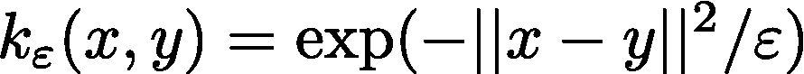
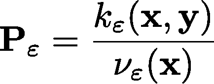
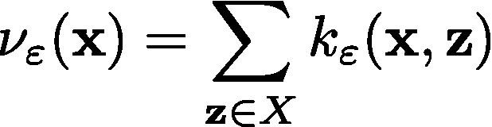
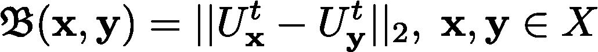
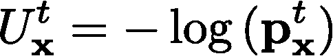
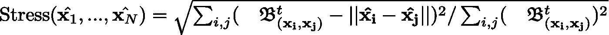
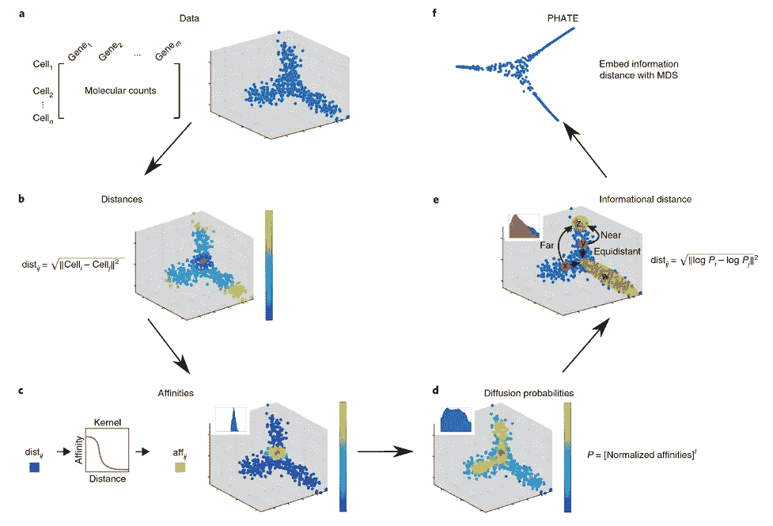
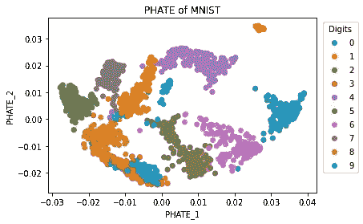
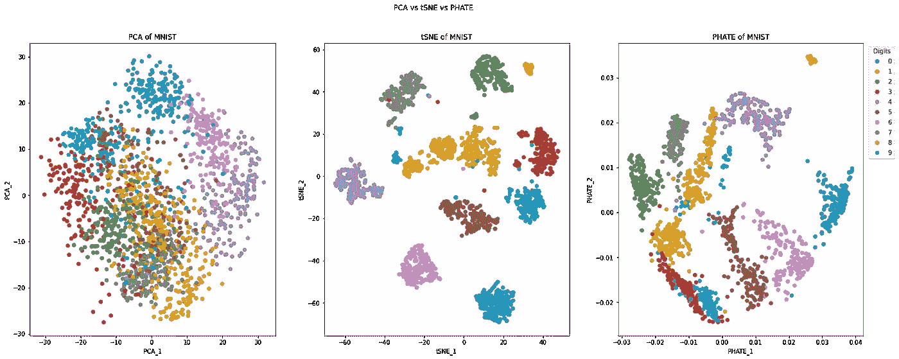

# 为什么应该使用 PHATE 进行降维

> 原文：<https://towardsdatascience.com/why-you-should-be-using-phate-for-dimensionality-reduction-f202ef385eb7?source=collection_archive---------5----------------------->

## [思想和理论](https://towardsdatascience.com/tagged/thoughts-and-theory)

作为数据科学家，我们经常处理具有 3 个以上感兴趣的特征或维度的高维数据。在受监督的机器学习中，我们可以使用这些数据进行训练和分类，并且可以减少维度以加快训练。在无监督学习中，我们使用这种类型的数据进行可视化和聚类。例如，在单细胞 RNA 测序(scRNA-seq)中，我们积累了超过一百万个细胞的每个细胞数万个基因的测量值。这是一组*数据，为细胞的身份、状态和其他属性提供了一个窗口。更重要的是，这些属性使它与数据集中无数的其他单元格相关联。然而，这创造了一个由 1，000，000 个细胞和 10，000 个基因组成的巨大矩阵，每个基因代表一个维度或轴。我们如何解读这样的数据？作为生活在三维世界中的人类，我们看不到三维以外的任何东西，需要一种方法来捕捉像这样的数据集的本质，同时又不丢失任何有价值的东西。*

我们如何将这个数据集压缩到 2 或 3 维，以便保留必要的信息？您的第一反应可能是使用 PCA 或 tSNE 将数据集投影到二维嵌入中。但是，每种方法都有一些关键的权衡，可能会在下游分析过程中导致有关数据集的错误结论。使用 PCA，您会丢失数据点之间的局部关系(在我们的例子中是细胞),代价是捕获全局表示。此外，PCA 是一种线性方法，它不能准确地捕获复杂的数据集，如单细胞 RNA 测序数据，其中我们可以有由不同的基因表达组合定义的无数细胞类型，同时还经历各种过程，如细胞分裂、分化(干细胞特化为更成熟的细胞类型，如神经元)、代谢等。另一方面，tSNE 是一种非线性方法，它在保持局部关系方面做得更好，但代价是破坏了全局。例如，在干细胞分化中，干细胞不会在开关(或这种情况下的一组基因)的轻弹下自动转变为神经元，而是经历由其转录谱逐渐变化所定义的连续变化。我们经常把这个连续体描述为一个轨迹。tSNE 的问题在于，它粉碎了这些轨迹，导致细胞群脱节，几乎没有关于一种细胞类型如何与另一种细胞类型相关的信息。

那么现在我已经说明了这个权衡的下游问题，我们如何解决它呢？这就是法特的切入点。PHATE——代表基于亲和力的转换嵌入的热扩散潜力——是降维领域的新人。像 tSNE 一样，它是一种非线性、无监督的技术。然而，与 tSNE 不同，它通常以全局结构为代价保留高维数据的局部结构，PHATE 捕捉了 PCA 和 tSNE 的两个世界的最佳之处，保留了数据点之间的局部和全局关系，以准确地反映所讨论的高维数据集。

我们将继续使用 scRNA-seq 数据作为例子。有了这个数据集，我们基本上有了一个 m×n 的矩阵，由 m 个细胞(行)和 n 个基因(列)组成，代表了信使 RNA 分子的离散计数。我们首先计算这些单元之间的欧几里德距离的方阵，欧几里德距离是基于笛卡尔坐标的两点之间的线段的长度。在 scRNA-seq 的情况下，这些笛卡尔坐标是基因表达测量值，因此直观地，我们会预期相距很短距离的细胞在基因表达上非常相似，因此是相似的细胞类型，而相距较远的细胞具有非常不同的基因表达模式，因此反映了完全不同的细胞类型(例如，神经元和红细胞)。然而，这种度量并不总是适合这种解释。这是因为[维度的诅咒](/the-curse-of-dimensionality-50dc6e49aa1e)，过多的维度会导致数据集中的数据点看起来与所有其他数据点等距，从而难以得出数据趋势的结论，导出有意义的聚类和局部邻域，并确定其他类型的模式。为了解决这个问题，我们将我们的距离转换为亲和力，这量化了我们数据中观察值之间的局部相似性。(这就是 PHATE 中“基于亲和力”的“A”的来源！)这些亲和力与距离成反比，使得两个观察值在欧几里得空间中相距越远，它们的亲和力越小；同样，它们越接近，它们的亲和力越大。亲和力通常是通过使用核函数来转换欧几里得距离来计算的。简而言之，这是您的概率质量或密度函数减去归一化因子/系数，以确保概率介于 0 和 1 之间。它们经常用于其他机器学习问题，如支持向量机。你可以猜到一个流行的核是高斯核:



其中 X 和 y 是高维空间中的坐标 *X* ，而ε是测量由该内核捕获的邻域的“扩散”或半径的带宽度量。PHATE 论文的作者使用了一个稍微高级一点的核函数，它在量化相似性方面做得更好，为了简洁起见，我将省略其细节。虽然这是保存数据集局部结构的一个方便的技巧，但是仅仅嵌入它们就会破坏全局结构，就像 tSNE 的情况一样。因此，除了保留本地结构，PHATE 的另一个目标是维护数据的全局关系。为了实现这一点，PHATE 通过马尔科夫随机游走，使用亲和力来“扩散”数据。当我们说扩散时，我们指的是从高浓度区域到低浓度区域的净扩散。在亲和力的上下文中，这可以被认为是从高亲和力(即，我们的高维数据集中的一簇细胞)到较低亲和力(即，更分散的细胞)。更直观地说，我们可以认为这是一个房间中的热量从一个温暖的来源(例如，一个壁炉)传播到一个不太温暖的区域(例如，你在你的沙发上)，这可以在数学上建模为热量方程，其解是热核。这就是 PHATE 中“H”的来源，热扩散。至于随机行走，这代表了通过我们的高维空间的连续随机步骤的轨迹(即，从一个单元到另一个单元的转换)，其中每个可能的步骤或转换具有沿着所述路线前进的确定概率。你可以认为这是房间里的热量随机向房间的一个角落扩散，然后转换方向。这被更广泛地称为随机过程。在我们的上下文中，单元 I 到单元 j 的概率取决于我们访问的最后一个单元。现在，所有的术语都已经说完了，让我们来看看它是如何工作的！

我们首先通过归一化我们先前计算的亲和力来计算我们随机行走的初始概率。这会产生以下结果:



在哪里



这给出了在单个时间步长内从小区 x 移动到小区 y 的 N 乘 N 转移概率矩阵。

在论文中，这种矩阵的一个简单术语是扩散算子。在数学上，为了获得有效的扩散，我们将扩散算子提高到最佳的步骤数 t，以学习数据的全局结构。这给了我们在 t 时间步长内从单元 x 转换到单元 y 的概率。使用更大的 t，我们可以在高维空间中覆盖更多的距离，并了解更多关于全局结构的信息，而不会被我们基于单时间步长亲和力的概率的局部性所束缚。你可以把这想象成寻找一条徒步旅行路线来构建周围的地图:每走几步，你就放下一个标记来记录你之前的位置，通常是在显著的地方(例如，一棵大树，一条河岸，等等)。)，而不是每一步都设置标记。这可以让你建立一个该地区的总地图，而不会被每一个单独的树枝和树枝所拖累。为了简洁起见，我将省略如何计算这个最佳步长 T 的技术细节，这在 PHATE 论文中有描述，使用冯诺依曼熵，但这都要加入到我们的“转换”算法的“T”中。

好了，我们一方面用我们的亲和力来捕捉附近细胞之间的局部关系，另一方面用一个强大的扩散算子来学习我们的全局空间。现在怎么办？嵌入这个幂扩散算子？没那么快。一个限制是，通过该算子得到的基于概率的细胞间距离(或扩散距离，如作者定义的那样)对远距离点之间的距离不太敏感，当我们考虑高维空间的边界点时，可能会遇到稳定性问题(本文将更详细地讨论这些缺点)。不过，这可以通过首字母缩写“P”来解决，P 代表潜力。作者定义了这个聪明的度量，称为潜在距离，受信息论和随机动力学的启发，我们从幂扩散算子测量对数转换概率之间的距离。这增加了我们的结果距离的敏感性，并使 PHATE 能够保存本地和全球架构的可视化目的。数学上，这定义如下:



在哪里



pₓᵗ指的是我们的扩散算子的 x 行，你会记得这是我们的转移概率矩阵的 t 次方。

当我们说这个距离度量更敏感时，假设从小区 a 到小区 b 的转移概率是 0.04，而从小区 a 到小区 c 的转移概率是 0.05。在这些扩散距离下，它们对折叠变化不是很敏感。距离 0.01 在试图将这种关系封装在较低维度的投影中时可能会遇到敏感性问题。然而，如果我们对这些概率进行对数变换并计算它们的距离，我们会得到一个更大的距离 0.223，这与这些概率分别为 0.4 和 0.5 是一样的(回想一下 log a - log b = log (a/b))。相当整洁！

好了，我们已经准备好“嵌入”了！通常，使用这些扩散度量，我们通常进行特征分解(即，通过所讨论的矩阵的特征向量将其分解，在这种情况下，我们的动力扩散算子)以导出数据的扩散图，这是用于研究 scRNA-seq 数据中分化轨迹的流行方法。然而，这种方法的问题在于，它将轨迹分解成无数反映扩散分量的特征向量。因此，这种高固有维度使得它们不适合可视化。为了绕过这个限制，作者使用公制多维标度(公制 [MDS](/multidimensional-scaling-d84c2a998f72) )嵌入了潜在距离矩阵。这是一种嵌入方法，通过最小化所谓的“压力”函数，为作为输入的距离矩阵定制:



虽然这个等式可能看起来令人生畏，但它本质上是在测量拟合度，在这种情况下，嵌入的坐标与我们寻求可视化的高维数据的拟合程度。压力越小，吻合度越大。因此，如果这些嵌入点的应力为零，那么数据已经在 MDS 嵌入中被成功捕获。由于噪声或少量的 MDS 维数(即 m = 2 或 3)，可能出现小的非零值。然而，只要轨迹和其他关键特征得以保留，这种程度的失真通常是可以容忍的。

到目前为止，我所讨论的一切都可以从 PHATE 论文作者的这张图中直观地总结出来:



Moon 等人，Nature Biotechnology 2019，高维生物数据中的可视化结构和转换

如果你坚持了这么久，恭喜你！我们现在准备学习如何用 Python 实现 PHATE，并看看它的实际效果！为了简单起见，我们将使用流行的 MNIST 数据集的较小版本，其中我们有 8 乘 8 的手绘数字图像(你可以从论文作者那里找到一个例子，将 PHATE 应用于真实的 scRNA-seq 数据[这里](https://nbviewer.jupyter.org/github/KrishnaswamyLab/PHATE/blob/master/Python/tutorial/EmbryoidBody.ipynb))。

使用 pip 或 pip3 安装 PHATE 库:

```
pip install phate
```

在您最喜欢的编辑器中创建一个新的 Python 文件，或者在 Jupyter 笔记本中创建一个笔记本，然后运行以下命令:

让我们运行这个程序来看看结果

```
python3 mnist_phate.py
```



作者图片

查看 PHATE 嵌入，您可以看到我们通常有清晰的数字分离，而簇本身有独特的形状和分布。让我们看看它与 PCA 和 tSNE 相比如何



作者图片

主成分分析(左)数据过于拥挤，难以得出具体结论。另一方面，tSNE (center)做得很好，将它们分离成一团簇，代价是数字如何与另一个数字相关的清晰全局结构，以及抑制簇内数据的独特传播。PHATE(右)调和了这些问题，在这里你可以清楚地分辨出聚类，并了解它们之间的关系(例如，3 和 9 有很多相似之处)。对于数字来说，这并不是什么大不了的事情，但是对于单细胞生物学来说，当我们研究诸如将干细胞转化为神经元的连续过程时，增加细胞如何从一种细胞类型转化为另一种细胞类型的细节是非常有用的。

在本文中，我们学习了 PHATE 算法，它是如何工作的，以及如何用 Python 实现它。如您所见，它很好地保存了数据的局部和全局方面。关于 PHATE 算法背后的数学的更多信息，以及更多的例子和与其他方法如 tSNE 和 UMAP 的比较，我鼓励你查看原始的[出版物](https://www.nature.com/articles/s41587-019-0336-3)以及一些来自作者的关于 PHATE 和单细胞数据分析的[教程](https://dburkhardt.github.io/tutorial/visualizing_phate/)。

我希望你喜欢这篇文章。感谢阅读和快乐编码！

参考资料:

[1] K. Moon，D. van Dijk，Z. Wang，S. Gigante，D. Burkhart，W. Chen，K. Yim，A. van den Elzen，M.J. Hirn，R.R. Coifman，N.B. Ivanova，G. Wolf，S. Krishnaswamy，[将高维生物数据中的结构和跃迁可视化](https://www.nature.com/articles/s41587-019-0336-3) (2019)，《自然生物技术》