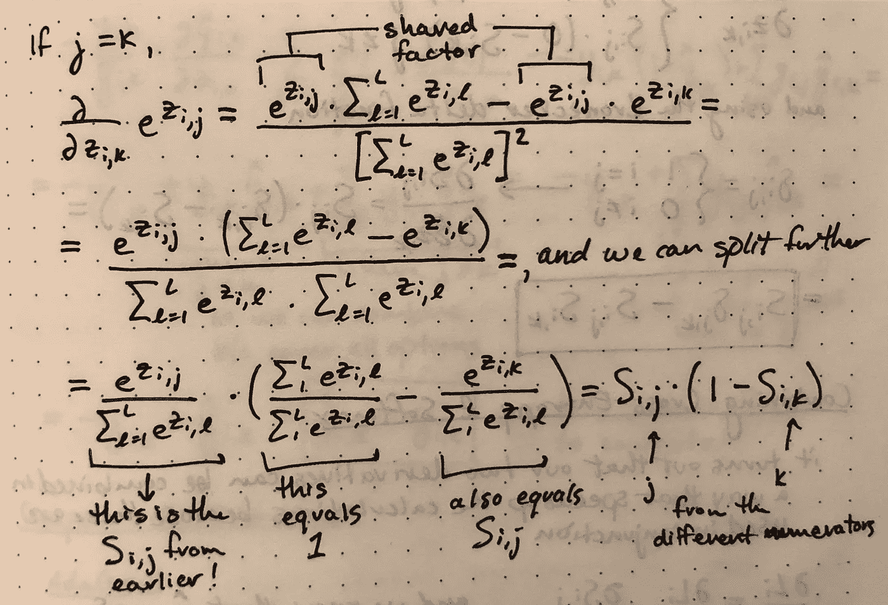
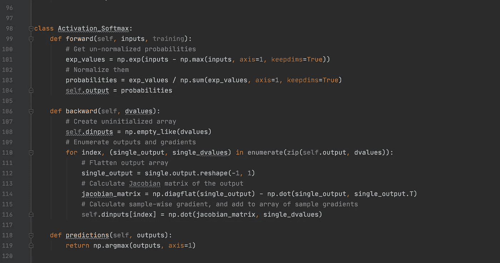

# 为什么你应该从头开始建立一个神经网络

> 原文：<https://towardsdatascience.com/why-you-should-build-a-neural-network-from-scratch-bdee4f265f08?source=collection_archive---------40----------------------->

## [机器学习](https://towardsdatascience.com/machine-learning/home)

## 超越“进口卡”

我相信你以前听过这个建议。我知道我做到了。我在其他博客上读到它，在许多播客和采访中听到它，甚至我自己也有这样的想法，“我真的应该这么做。”但是很长一段时间，我没有。

如果你想让自己从其他数据科学家中脱颖而出，这是一个很棒的项目。不仅仅是展示你对数学和编程的理解，它还表明你有另一种重要的无形的品质，**坚持到底**。团队需要一个说到做到并且愿意付出更多努力的同事！

[图片](https://unsplash.com/photos/yD5rv8_WzxA)由[尼克·希利尔](https://unsplash.com/@nhillier)提供

从零开始构建神经网络从未如此简单，而且您不必独自完成。我关注了哈里森·金斯利和丹尼尔·库基拉最近出版的*神经网络*，你可以在 [nnfs.io](https://nnfs.io/) 找到它，哈里森正在研究 [YouTube](https://www.youtube.com/playlist?list=PLQVvvaa0QuDcjD5BAw2DxE6OF2tius3V3) 上的章节。

媒体上还有大量其他免费指南，比如这里的、这里的和这里的。

# 为什么

Keras、PyTorch 和 MXNet 等软件包的成功使得机器学习比以往任何时候都更加可用和简单。即使对神经网络有基本的了解，人们也可以导入一个包，访问定制的神经网络、最先进的架构，并从大规模、预训练的网络中转移学习。

利用这种模型所需的复杂的数学和复杂的编程从你那里抽象出来，取而代之的是一个简单的。fit()和。predict()方法。这太棒了！这确实证明了这些包装的创造者的才华。这个 ***import Keras*** 调用中包含了大量的优化和先前的经验。

但是没有免费的午餐。尽管这些软件包非常有用和强大，但你总是要放弃一些东西作为交换。在这种情况下，控制和可定制性更加有限！这正是你作为初学者想要的，因为你可能不知道如何自己控制这个过程。同样，使用这些包没有任何问题。但是一旦你需要写一个定制的损失函数或者创建一个全新的架构，你可能会遇到一些麻烦。

更不用说使用这些包进行调试有时会很乏味，因为您必须通过许多层您不熟悉的方法调用来跟踪错误。最好快点失败！

> [这里有一个很好的指南，可以帮助你在喀拉斯和 PyTorch 之间做出选择。](/keras-vs-pytorch-for-deep-learning-a013cb63870d)

# 怎么做

## 基础知识

最好从基础开始。对于神经网络，这意味着点积、矩阵乘法、理解数组/矩阵/张量、复习导数等。有很多工作要做！这就是为什么我建议遵循一些指南或框架，在你需要的时候回顾主题。

请记住，这应该是一个针对 ***理解*** 而不是针对 ***结果*** 的项目。最终目标是真正理解你在做什么，为什么。记住这一点，在你真正理解之前不要离开这个话题，如果你能向别人解释就更好了。

就我个人而言，当我写下来的时候，我对数学的理解要好得多。所以对于损失和激活函数的所有导数，我都在笔记本上做了详细的描述。

我的笔记本供参考。图片作者。

在上面贴上小纸条，如果这有助于你理解发生了什么，没人会看到的！(除非你决定把它贴在博客上)此外，把它全部写出来，你会觉得自己是个数学天才，可以用你的知识打动一些朋友。

## 时间框架

这不是一个能尽快完成的项目。同样，花尽可能多的时间去理解你在做什么和为什么。我花了大约 2 周的时间，每天工作几个小时，从头开始研究神经网络，但这是因为我有数学/统计学背景，并且有许多使用 Keras/TensorFlow 的项目。

如果你愿意，这很容易成为一个持续几个月的项目！这没什么不对！慢慢来。

## 编码

在花了一些时间理解基础知识和数学之后，你将开始真正的编码！我设置了一个 GitHub repo，为每个单独的主题创建了一个新文件，并创建了一个运行文件，在其中我将所有的主题编译在一起。这让我可以在需要理解的时候摆弄小块的材料和实验。

我曾多次回去清理我的类，根据需要进行重构，并根据需要添加新的类。

Softmax 激活类。图片作者。

# 接下来的步骤

这些可以是你想要的任何东西。对于一些人来说，简单的练习通过材料和编码所有这些类和方法将是最终目标。就我个人而言，我的计划是继续从头开始构建特性，因为我需要它们用于项目，或者因为我想要构建对新想法的理解。这也给了我一个很好的借口来尝试创建我自己的包，并发布它用于我自己的附带项目。

# 连接

我一直在寻找连接和探索其他项目！

[LinkedIn](https://www.linkedin.com/in/aren-carpenter/)|[Medium](https://arencarpenter.medium.com/)|[GitHub](https://github.com/ArenCarpenter)