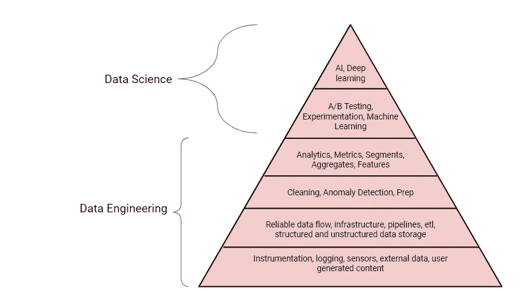
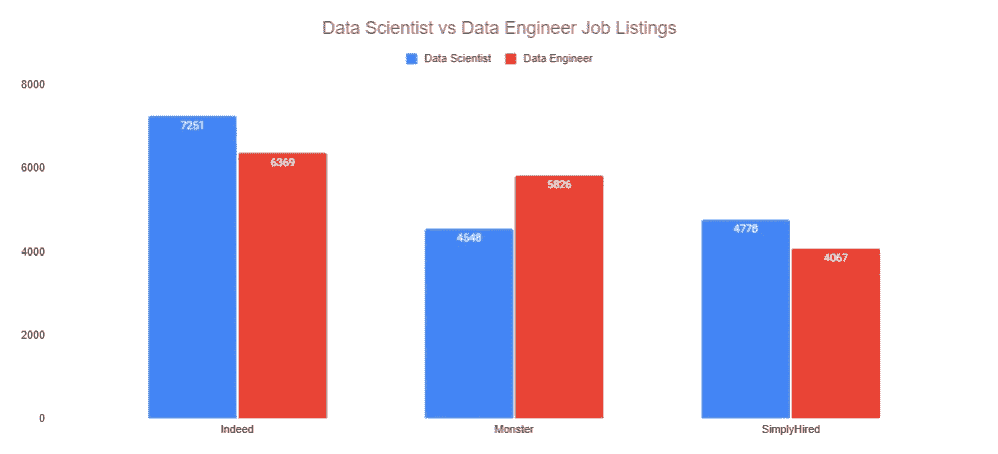

# 为什么你应该考虑成为一名数据工程师而不是数据科学家。

> 原文：<https://towardsdatascience.com/why-you-should-consider-being-a-data-engineer-instead-of-a-data-scientist-2cf4e19dc019?source=collection_archive---------1----------------------->

## 一个新的丛林之王出现了

瑞安·哈维在 [Unsplash](/s/photos/lion?utm_source=unsplash&utm_medium=referral&utm_content=creditCopyText) 上的照片

> ***如果您喜欢这篇文章，请务必*** [***订阅***](https://terenceshin.medium.com/subscribe) ***千万不要错过另一篇关于数据科学指南、技巧和提示、生活经验等的文章！***

我只想说，你选择数据科学还是数据工程，最终还是要看你的兴趣和激情所在。然而，如果你正犹豫不决，不确定选择哪一个，因为他们有同样的兴趣，那么继续读下去吧！

一段时间以来，数据科学一直是热门话题，但一个新的丛林之王已经到来——数据工程师。在本文中，我将与您分享为什么您可能想要考虑从事数据工程而不是数据科学的几个原因。

*注意，这是一篇自以为是的文章，从中拿取你想要的。话虽如此，我希望你喜欢！*

# 1.数据工程从根本上来说比数据科学更重要。

我们都听说过“垃圾进，垃圾出”这句话，但直到现在，公司才开始真正理解这句话的含义。机器学习和深度学习可能很强大，但只有在非常特殊的情况下。除了需要大量的数据和对 ML 和 DL 的实际使用，公司需要自下而上地满足**数据需求层次**。

作者创建的图像

就像我们在社会需求(即关系需求)之前有身体需求(即食物和水)一样，公司需要满足通常属于数据工程范畴的几个要求。注意数据科学，特别是机器学习和深度学习，是最不重要的事情。

简单来说，没有数据工程就没有数据科学。数据工程是成功的数据驱动型公司的基础。

# 2.对数据工程师的需求越来越大。

如我之前所说，公司意识到对数据工程师的需求。因此，目前对数据工程师的需求越来越大，这是有证据的。

根据 [Interview Query 的数据科学面试报告](https://www.interviewquery.com/blog-data-science-interview-report)显示，2019-2020 年数据科学面试人数仅增长 10%，而同期**数据工程面试人数增长 40%** ！

同样， [Mihail Eric 对 Y-Combinator 的招聘信息](https://www.kdnuggets.com/2021/02/dont-need-data-scientists-need-data-engineers.html)进行了分析，发现数据工程师的职位**比数据科学家的职位**多出大约 70%。

你可能会问，“当然，增长率要高得多，但是绝对数字呢？”

我冒昧地从 Indeed、Monster 和 SimplyHired 网站上搜集了所有数据科学家和数据工程师的招聘信息，我发现这两个网站上的职位列表数量差不多！

总共有 16577 个数据科学家职位列表和 16262 个数据工程师职位列表。

作者创建的图像

# 3.作为一名数据科学家，数据工程技能非常有用。

在更成熟的公司中，工作通常是分离的，以便数据科学家可以专注于数据科学工作，而数据工程师可以专注于数据工程工作。

**但大多数公司一般不会这样。我认为大多数公司实际上都要求他们的数据科学家了解一些数据工程技能。**

> 许多数据科学家最终需要数据工程技能。

作为一名数据科学家，了解数据工程技能也是非常有益的，我将举一个例子:如果你是一名不懂 SQL 的业务分析师，每次你想收集见解时，你都必须让数据分析师查询信息，这在你的工作流程中造成了瓶颈。类似地，如果你是一个没有数据工程师基础知识的数据科学家，那么肯定会有这样的时候，你不得不依靠其他人来修复 ETL 管道或清理数据，而不是自己做。

# 4.数据科学比数据工程更容易学。

在我看来，作为一名数据工程师学习数据科学比作为一名数据科学家学习数据工程技能要容易得多。为什么？有更多的资源可用于数据科学，**有许多工具和库可以让数据科学变得更简单**。

因此，如果你正在开始你的职业生涯，我个人认为花时间学习数据工程比数据科学更值得，因为你有更多的时间来投资。当你有一份全职工作，并且已经进入职业生涯几年的时候，你可能会发现你没有能力或精力投入同样多的时间在学习上。所以从那个角度来说，我觉得还是先学比较难的境界比较好。

# 5.它包含了一个尚未开发的机会市场。

我说的不仅仅是工作机会，而是创新的机会，用新的工具和方法让数据工程变得更容易。

当数据科学最初被大肆宣传时，人们发现了学习数据科学的几个障碍，如数据建模和模型部署。后来出现了 PyCaret、Gradio 这样的公司来解决这些问题。

目前，我们正处于数据工程的初始阶段，我预见到了一些使数据工程变得更容易的机会。

# 感谢阅读！

虽然这是一篇固执己见的文章，但我希望这能让你明白为什么你想成为一名数据工程师。我想重申一点，你选择数据科学还是数据工程，最终还是要看你的兴趣和你的激情所在。一如既往，我祝你在努力中好运！

不确定接下来要读什么？我为你挑选了另一篇文章:

 [## 你不应该成为数据科学家的 4 个理由

### 为什么数据科学工作可能不适合你

towardsdatascience.com](/4-reasons-why-you-shouldnt-be-a-data-scientist-e3cc6c1d50e) 

**又一个！**

 [## 想成为数据科学家？不要从机器学习开始。

### 有抱负的数据科学家最大的误解是

towardsdatascience.com](/want-to-be-a-data-scientist-dont-learn-machine-learning-28e418d9af2f) 

# 特伦斯·申

*   ***如果你喜欢这个，*** [***跟我上媒***](https://medium.com/@terenceshin) ***了解更多***
*   ***有兴趣合作吗？让我们连线上***[***LinkedIn***](https://www.linkedin.com/in/terenceshin/)
*   ***报名我的邮箱列表*** [***这里***](https://forms.gle/tprRyQxDC5UjhXpN6) ***！***