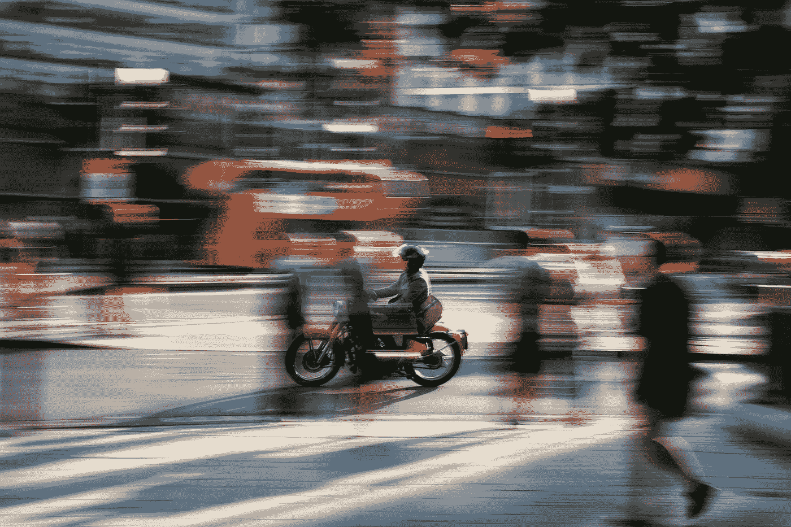
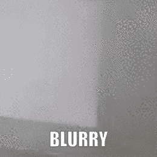
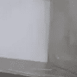
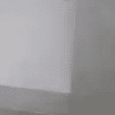
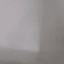
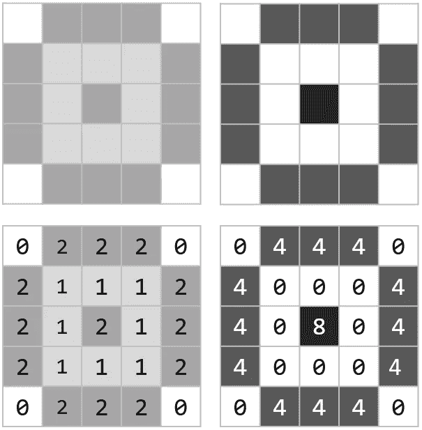
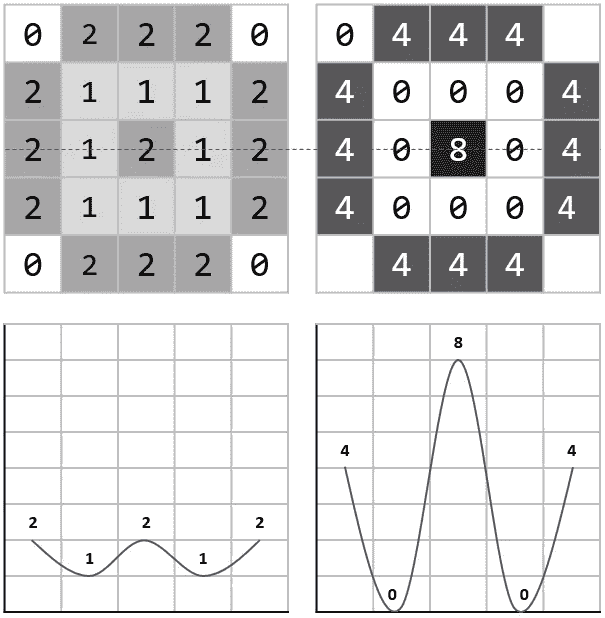
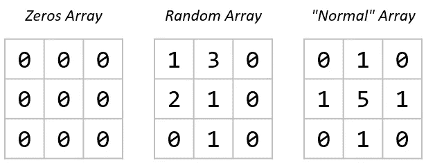
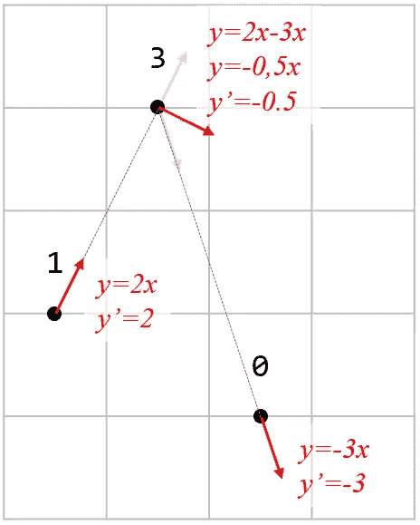
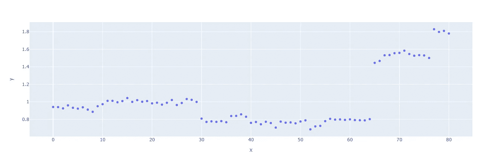

# 为什么在部署计算机视觉模型时应该监控图片的清晰度

> 原文：<https://towardsdatascience.com/why-you-should-monitor-your-pictures-sharpness-when-deploying-computer-vision-models-1e039c7aa08a?source=collection_archive---------47----------------------->

## 永久地评估你从一个设备上获得的图片的质量可能会帮助你保持一个健壮的模型而不是盲目的模型！



查理·伊根在 [Unsplash](https://unsplash.com?utm_source=medium&utm_medium=referral) 上的照片

# 听说过沸蛙综合症吗？


[杰克·汉密尔顿](https://unsplash.com/@jacc?utm_source=medium&utm_medium=referral)在 [Unsplash](https://unsplash.com?utm_source=medium&utm_medium=referral) 上拍照

如果你把一只青蛙扔进一锅沸水中，它会很快跳出来！

但是，如果你把青蛙放入冷水中，逐渐增加温度，青蛙会享受一会儿热水浴，不久，它就会毫无抵抗地让自己被煮死。

我们知道，当数据特征与用于训练模型的数据特征“轻微偏离”时，这同样适用于机器学习模型。

**这种现象被称为“畴变”。**

我最近遇到了一个有趣的域名迁移案例，我想分享一下，以及监控这种变化的潜在对策。

# 又一个失败了！



监控摄像头的延时拍摄(已剪辑)
作者制作的动画

在左侧，您可以观察到由监控摄像机广播的图片的裁剪部分的 50 天时间推移。

随着时间的推移，很容易发现由于灰尘沉积，照片变得多么模糊。

(注:我希望我能够分享整个图片，但由于明显的保密原因，我不能)

由于模型使用这一部分来推断制成品的一些特征，不用说，随着图片变得模糊，深度学习算法的性能开始缓慢下降，这可能比从清晰的图片到空白的图片更难检测(还记得青蛙的故事吗？).

在其“模糊性”的顶峰，该部分几乎不提供任何信息(见下文)。



同一区域的不同清晰度/模糊度级别—图片由作者提供

# 我们如何评价一张照片的清晰度？

因此，在这种特殊情况下，当摄像机提供的图片开始超过预定义的清晰度阈值并需要清洁时，提醒车间人员可能会很有意思。

唯一的问题是我们如何评估它？

您可能知道，图片被编码成 n 维数组(1 层用于灰度图片，3 层用于 RGB 图片)。如果你对这个概念不放心，我向你推荐这篇文章:

</better-visualizing-tensors-thanks-to-cities-b97e6b4ca2ca>  

例如，对于表格数据集，我们可以监控每个特征的统计特征(最小值、最大值、平均值、标准偏差等。)但是我们可以在下面看到，使用这些指标并不能让我们区分上面的 3 张图片:

```
Image_0: Min:  69 | Mean : 146 | Max : 187
Image_1: Min: 107 | Mean : 155 | Max : 192
Image_2: Min: 107 | Mean : 151 | Max : 181Image_0: Min:  #1 | Mean :  #1 | Max :  #2
Image_1: Min:  #3 | Mean :  #3 | Max :  #3
Image_2: Min:  #3 | Mean :  #2 | Max :  #1
```

*(文末链接源代码)*

然而，我们可以假设，当照片变得模糊时，每个像素之间的数值距离开始减小。

如下所示，当像素值与其周围的差异增加时，锐度将会更高:



作者对两种不同灰度图像的清晰度比较

# 救援的梯度！

因此，我们需要找到一种方法来计算图片中从一个像素到另一个像素的变化。

当我们根据以 x 为中心的轴绘制变化时，模糊图形和清晰图形之间的差异是显而易见的:



围绕 x 中心轴的两个图形的锐度比较—图片由作者提供

如果你之前一直在学习机器学习，那么你一定很熟悉梯度计算。基本上，这是所研究的函数在特定位置的导数(这对于定义成本函数的最优值非常有用)。

**我们如何计算梯度呢？当然，有一个 NumPy 函数可以做到这一点，但我很乐意提供它背后的解释！**

让我们以三个不同但简单的阵列为例:



三个简单的 3x3 阵列，具有不同的数字组织—图片由作者提供

让我们取随机数组的第一行:1，3，0，并考虑一个线性函数(y=θx)允许从一个像素到另一个像素。



作者对[1，3，0]矢量图像的梯度计算

*   从 1 到 3，函数是“y = 2x”，它的导数是“2”。
*   从 3 到 0，函数为“y = -3x”，其导数为“-3”。
*   在 3 处，梯度是前一个和后一个梯度的平均值:“-0.5”(=(2–3)/2)。

让我们将这些值与峰值最高的“正常”数组的第二行进行比较:

*   从 1 到 5，函数是“y = 4x”，它的导数是“4”。
*   从 5 到 1，函数是“y = -4x”，它的导数是“-4”。
*   值为 5 时，渐变将是前一个和后一个渐变的平均值，因此为“0”(=(4–4)/2)。

让我们平均这些梯度的绝对值:

*   [1，3，0]:(| 2 |+|-0.5 |+|-3 |)/3 =**1.83**
*   [1，5，1]:(| 4 |+| 0 |+|-4 |)/3 =**2.67**

结论:二线似乎更“犀利”！

并且，通过平均两个轴(x 和 y)周围的所有梯度，我们得到以下结果:

*   零点数组: **0** (这里不奇怪！)
*   随机数组: **1.89**
*   “正常”数组: **2.67**

# 我们去大的！

既然你理解了“为什么”和“如何”，我们可以从延时拍摄的照片中迭代，看看是否有我们可以研究的模式。这段时间从 1 月 19 日到 3 月 1 日。

车间团队可以在他们的控制屏幕上监控摄像机的清晰度，因此他们决定在此期间的某个时候清洗摄像机。我们能发现它吗？



梯度平均值从 2001 年 19 月变为 2003 年 1 月—图片由作者提供

清洗发生在指数 64 到 65 之间！很容易，因为我们看到梯度平均值(=锐度)从 0.8 增加到 1.4。

现在我们可以定义一个阈值(0.9 或者 1 呢？)系统地警告团队，并要求他们清洁相机以保存高质量的照片😀

像往常一样，您会找到相应材料的链接:

*   [样图](https://drive.google.com/drive/folders/1KeaiExDBvQz8xUcQvJxBf9G1mebwzjck?usp=sharing)
*   [源代码](https://colab.research.google.com/drive/1v8Nx4LOo4mjqriwgzeFdUSNPlYd_Uuk5?usp=sharing)

不要犹豫，在评论中分享你的经验或自己的做法吧！

皮埃尔-路易

<https://pl-bescond.medium.com/pierre-louis-besconds-articles-on-medium-f6632a6895ad> 