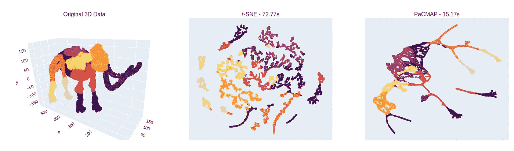
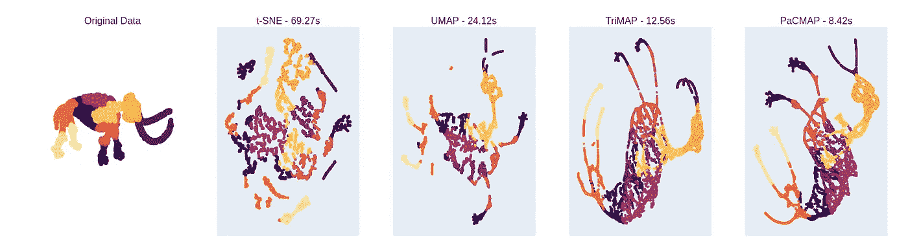
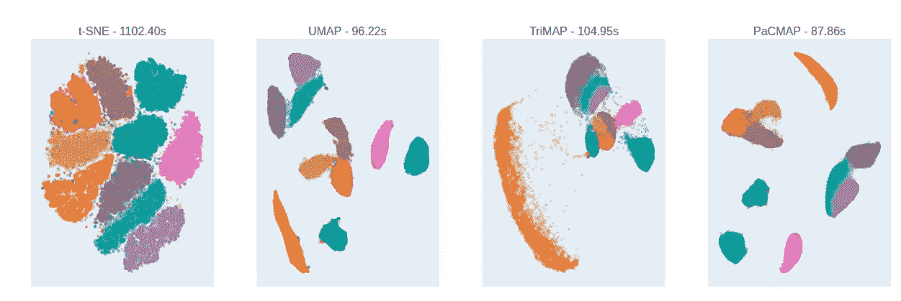

# 为什么你不应该依赖 t-SNE，UMAP 或 TriMAP

> 原文：<https://towardsdatascience.com/why-you-should-not-rely-on-t-sne-umap-or-trimap-f8f5dc333e59?source=collection_archive---------7----------------------->

## [理解大数据](https://towardsdatascience.com/tagged/making-sense-of-big-data)

## 使用 PaCMAP 来提高可解释性和速度

作者创作的情节

t-SNE、UMAP 和 TriMap 等降维技术在数据科学领域中无处不在，鉴于它们令人印象深刻的视觉性能(结合易用性)，它们因此可以在给定数据集的任何完整探索性数据分析中找到。然而，这些特定的方法(t-SNE、UMAP 和三分图)可能不应该是你降维的首选。在这篇文章中，我将解释为什么，并推荐最近发表的 2020 年的替代方案，它更容易理解，结果质量更高，运行速度更快，需要的手动调整更少——所有这些都是好东西👍 🍾

在我们开始之前，我要指出，我本人一直是(现在仍然是)t-SNE、UMAP 和 TriMAP 的忠实用户。可悲的是，这些技术的内部工作的技术细节经常被忽略，尤其是对于经验较少的从业者，这对于视觉结果的解释具有后果。具体来说，了解每个算法在保留*全局*与*局部*结构方面的权衡是很重要的。除了解释问题，t-SNE(如在`scikit-learn`中)等常用的实现可能会慢得令人恼火，导致浪费大量时间来设置算法，潜在地微调它们，最后随着人们不断重启他们的`everything_in_here.ipynb`笔记本，一遍又一遍地运行它们。最后，也许是最重要的，当我们已经知道最终的标签(例如，对于典型显示的基准，如 MNIST，Cifar10 等)时，许多算法可以在教程设置中进行调整，以产生超级令人印象深刻的视觉效果。)，但当在现实生活中对未知数据集使用它时，知道如何解释给定的可视化要困难得多，因为我们不一定事先知道关于数据集的全部信息——在这里，默认情况下更经常第一次就“正确”的算法无疑是一种优势。

在这篇文章中，我们简要回顾了各种降维技术背后的直觉，然后介绍并回顾了一种更新的 PaCMAP⁴算法。这种新算法设法改善了全局与局部的权衡，在没有参数调整的情况下表现良好，速度快，易于使用。此外，该算法的超参数非常直观，并且可以用于在关注局部结构和关注全局结构之间平滑过渡。我并不主张放弃诸如 PCA、t-SNE、UMAP、三分图等方法，但对于大多数意图和目的，我认为 PaCMAP 等算法应该是你的首选，尤其是如果你是一个新手或有急事。

PS。我与 PaCMAP 的创建者没有任何关系，但是我强烈建议您去阅读他们的论文，以获得更深入的介绍！

## 降维方法

降低高维数据集的维度(例如，如果我们在表格数据集中有超过 3 列)允许我们潜在地获得对数据集中底层聚类的更多理解，或者获得对数据分布的直觉(例如，用于比较训练和测试数据集)。目标是在数据中保留尽可能多的“结构”/信息，使得在原始高维空间中相距较远的点在低维空间中也相距较远，对于相距较近的点则相反。总的来说，这些算法可以分为两个主要原型；那些旨在保持*局部*结构(彼此非常相似的观察)和那些旨在保持*全局*结构(彼此非常不相似的观察)。

众所周知，用这些算法创建的可视化投影可能会产生误导，例如，反映不存在的聚类或暗示聚类彼此接近，尽管它们并不接近。因此，在解释使用降维算法进行的任何投影时保持非常保守的态度，并对算法本身有所了解是一个好主意。下面简要回顾几个著名算法的直觉。

**PCA:** 这里数据(潜在相关的)被重构为不相关的主成分，这些主成分包含由方差度量的数量递减的信息。使用这种方法仅可视化第一个初始组件(描述大部分方差)本质上是一种主要捕获数据的*全局*结构的方法。

**t-SNE:** 这里使用梯度下降来寻找低维嵌入，其中点 *i* 和 *j* 之间的相对距离与原始高维空间中的相对距离相匹配，在不太直观的*困惑度*参数的控制下，该参数确定用于高维空间中相对距离计算的条件分布的标准偏差。该方法主要关注*局部*结构，因为它在相对距离计算中关注最近的邻居。

**UMAP:** 这里构建一个最近邻的加权图，顶点是观测值/数据点，然后使用随机梯度下降优化一个低维图，使其在结构上尽可能与高维图相似。与 t-SNE 相比，UMAP 有很多优势，因为它更好地保留了全局结构，速度更快，并且具有稍微更多的可解释超参数，但其核心是在图形的构造中使用最近邻居之间的距离，因此专注于*局部*结构。

**三重图**:这里三元组(三个观察值的集合)主要是从最近的邻居创建的，但是一部分三元组也包含一个或两个随机采样点。然后，该算法尝试使用批量梯度下降来寻找较低维度的嵌入，这保持了三元组的距离排序。从理论上讲，这种方法设法同时包含了*局部*和*全局*结构，但在实践中，通常会发现它容易与局部结构发生冲突。

## PaCMAP 简介

在 [PaCMAP 论文](https://arxiv.org/abs/2012.04456)中，他们表明 t-SNE、UMAP 和 TriMAP 等方法都可以被视为基于图的算法，节点是观察值，边构成这些观察值之间的相似性度量——给定高维图，定义并优化损失函数，以找到结构相似的图的低维表示。基于这种认识，他们首先研究了已知算法的损失函数以及各种虚拟损失函数，并由此能够推导出构成“理想”损失函数的几个关键原则(论文第 4 节)。其次，他们研究如何优化低维图，以保持局部和全局图结构，再次表明大多数算法是如何*近视的*(即关注局部结构)。作者提出了一种使用中-近观察值对的方法，以及在收敛期间动态选择哪些图形元素被优化，使得算法最初获得正确的全局结构，随后细化局部结构(论文的第 5 部分)。

选择更好的损失函数和建议的图优化技术的结合构成了新方法 *PaCMAP* ，作者表明该方法在局部和全局结构上都具有良好的性能。此外，它们表明，所建议的算法对初始化相当鲁棒，并且通过使用默认超参数在所选数据集上工作良好，同时在所有 11 个测试数据集上明显快于最快的其他算法。

## 比较结果

让我们重新运行论文中的一些实验，比较几种算法的结果。运行 PaCMAP 就像运行任何其他降维算法一样简单——在我自己的比较中，我测试了以下 PyPi 包中的算法:来自`scikit-learn==0.24.1`的 t-SNE、`umap-learn==0.5.1`的 UMAP、`trimap==1.0.15`的 TriMAP 和`pacmap==0.3`的 PaCMAP。为了创建我的嵌入，我使用了下面的小代码片段——这里的要点是我使用了所有的默认设置，没有调整。

在论文中，他们有一个很好的可视化效果，他们使用不同的技术将一只猛犸象的 3D 图像还原到 2D。尝试重新创建，我得到了以下所有默认超级参数的结果:

作者创作的情节

很明显，t-SNE，至少在默认参数下，主要关注局部结构，UMAP 更好地捕捉了全局结构，TriMAP 在全局结构方面做得很好，但在局部结构方面失败了(参见 feet & horns)，而 PaCMAP 似乎捕捉了全局和局部结构。与此同时，PaCMAP 仅用时 8.4 秒，比 TriMAP 的 12.56 秒、UMAP 的 24 秒和 t-SNE 的 69 秒都要快。

我对算法进行了更多的压力测试，对经典的 MNIST 数据集(60，000 张训练图像，784 个像素列)进行了相同的测试。结果如下，同样使用所有默认超级参数:

作者创作的情节，颜色表示 MNIST 不同的数字图像

在这里，我们看到 t-SNE 将聚类均匀地分布在中心周围，这可能有助于保持局部结构，但似乎不包含太多关于全局结构的信息——此外，我们看到该算法实际上似乎也识别出一些错误的聚类(红色、棕色和紫色的聚类，我们只“知道”，因为我们有这些标签)。同样，这些结果与 PaCMAP 论文中看到的一致，表明 t-SNE 和 UMAP 主要关注本地结构，TriMAP 关注全球结构，而 PaCMAP 同时关注两者。

这两个例子与 PaCMAP 论文中显示的内容非常吻合——我鼓励每个人都去阅读这篇论文，看看更多的例子、量化和解释。

## 结论

如前所述，我并不主张放弃 PCA，t-SNE，UMAP，TriMAP 等。然而，时间往往是至关重要的，因此我认为 PaCMAP 提供了两个相当大的好处；1)默认情况下，局部和全局结构都被捕获，如果需要，可以很容易地使用超级参数在局部和全局结构之间改变焦点，2)速度更快。在降维不是分析的核心部分，并且您没有时间彻底调查大量超参数、算法等的情况下，这些好处尤其重要。

一个完整的分析应该包括多种算法和超参数，同时确保可以根据对特定算法的了解来解释每个实验之间的差异。

最后，感谢 PaCMAP 论文的作者。

[1]劳伦斯·范德·马腾和杰弗里·辛顿，使用 t-SNE 可视化数据(2008)，机器学习研究杂志 9，2579–2605

[2]利兰·麦金尼斯，约翰·希利，詹姆斯·梅尔维尔，UMAP:一致流形逼近与降维投影(2018)，[https://arxiv.org/abs/1802.03426](https://arxiv.org/abs/1802.03426)

[3] Ehsan Amid，Manfred K. Warmuth，TriMap:使用三元组进行大规模降维(2019)，【https://arxiv.org/abs/1910.00204 

[4]王英凡，，辛西娅·鲁丁，亚龙·沙波什尼克，理解降维工具如何工作:解读 t-SNE、UMAP、TriMAP 和 PaCMAP 用于数据可视化的实证方法(2020)，[，](https://arxiv.org/abs/2012.04456)