# 为什么不应该在幂 BI 中用 0 替换空白

> 原文：<https://towardsdatascience.com/why-you-should-not-replace-blanks-with-0-in-power-bi-f05a89456533?source=collection_archive---------26----------------------->

## 有人要求您在报表中用 0 替换空白值吗？也许你应该三思而后行


[照片由 Siora Photography 在 Unsplash 上拍摄](https://unsplash.com/photos/cixohzDpNIo)

就在最近，我作为 Reid Havens 的直播嘉宾观看了 [Jeffrey Wang，Jeffrey 与观众分享的十几个精彩内容之一是 DAX 引擎在为我们的措施创建最佳查询计划时执行的优化列表。](https://www.youtube.com/watch?v=KI2eYBI0lF0&list=WL&index=3)

引起我注意的一个问题是关于所谓的“稀疏措施”:

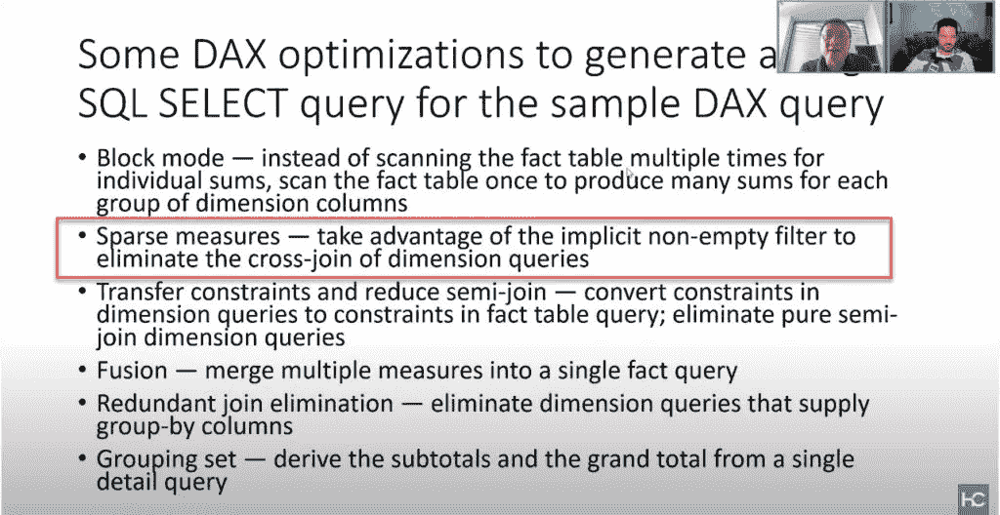

作者截图

简单地说，一旦定义了度量，VertiPaq 中的[公式引擎将向查询中添加一个隐式的非空过滤器，这将使优化器能够避免维度表的完全交叉连接，并且只扫描那些维度属性组合的记录确实存在的行。对于来自 MDX 世界的人来说，非空函数可能看起来很熟悉，但是让我们看看它在 DAX 中是如何工作的。](/how-to-reduce-your-power-bi-model-size-by-90-76d7c4377f2d)

最让我产生共鸣的事情是，当 Jeffrey 建议在幂 BI 计算中不要用零(或任何显式值)替换空白。我已经写了[如何处理空白并用零替换它们](/handling-blank-in-power-bi-90eed948d042)，但是在这篇文章中，我想把重点放在这个决定可能的性能影响上。

## 搭建舞台

在我们开始之前，一个重要的免责声明:不要用 0 替换空白的建议只是建议。如果业务请求是显示 0 而不是空白，并不一定意味着你应该拒绝去做。在大多数情况下，您可能甚至不会注意到性能下降，但这取决于多种不同的因素…

让我们从编写简单的 DAX 度量开始:

```
Sales Amt 364 Products =
CALCULATE (
    [Sales Amt],
    FILTER ( ALL ( 'Product'[ProductKey] ), 'Product'[ProductKey] = 364 )
)
```

使用这个度量，我想计算 ProductKey = 364 的产品的总销售额。而且，如果我将这个度量的值放入 Card visual 中，并打开 Performance Analyzer 来检查处理这个查询的时间，我会得到以下结果:

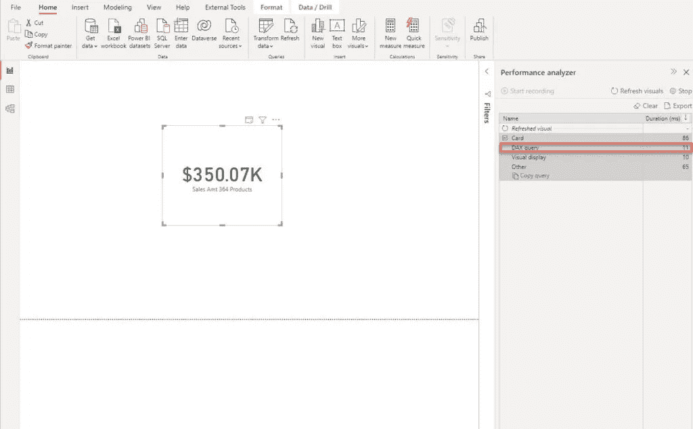

作者图片

执行 DAX 查询只花了 11 毫秒，一旦切换到 DAX Studio，公式引擎生成的 xmSQL 非常简单:

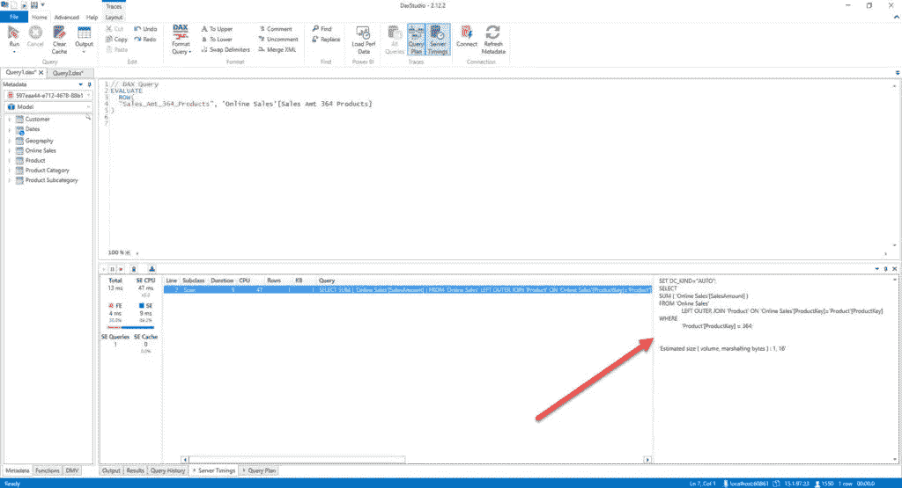

作者图片

而且，如果我看一下查询计划(物理的)，我可以看到存储引擎只找到 1 个现有的值组合来返回我们的数据:

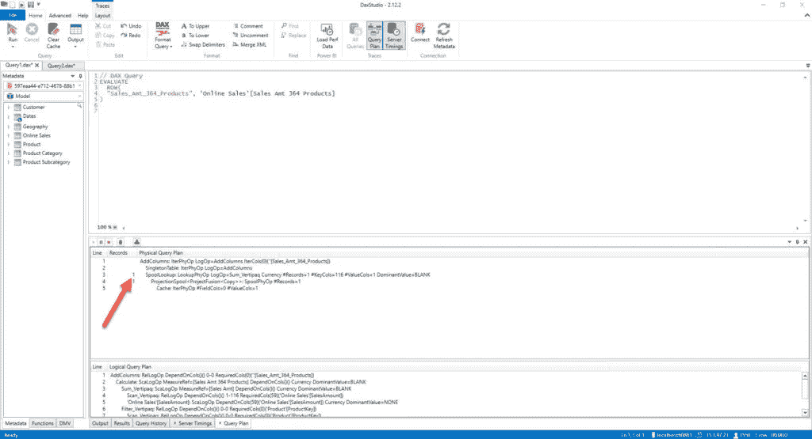

作者图片

## 添加更多配料…

然而，假设业务请求是在日常级别上分析产品关键字 364 的数据。让我们为我们的报告添加日期:

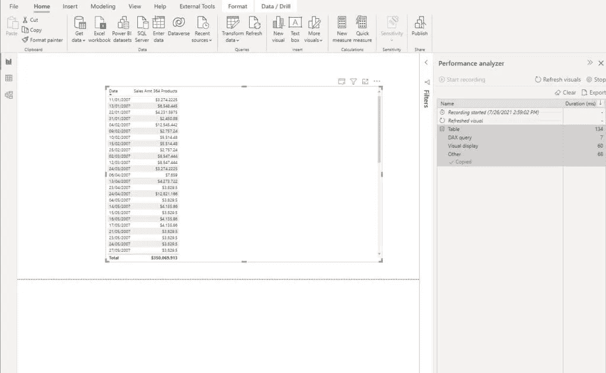

作者图片

这又一次非常快！我现在将检查 DAX Studio 中的指标:

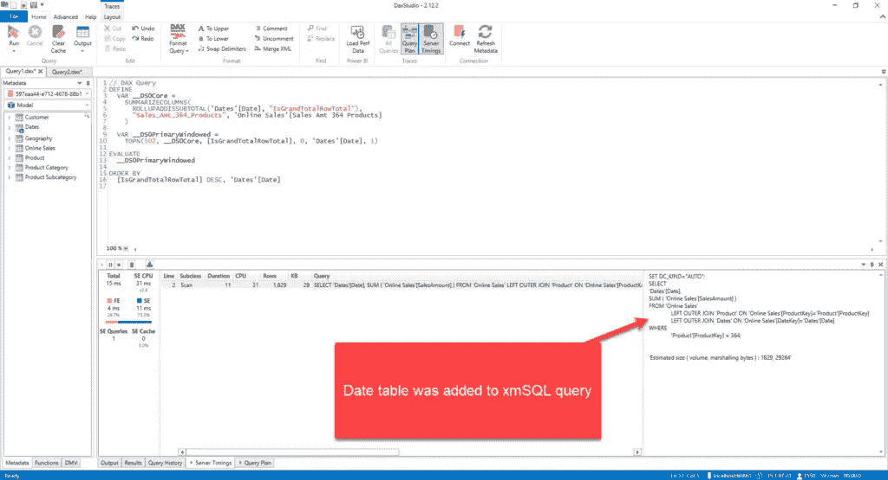

作者图片

这一次，查询扩展到包括日期表，这影响了存储引擎需要做的工作，因为这一次不是只找到一行，而是找到了不同的数字:

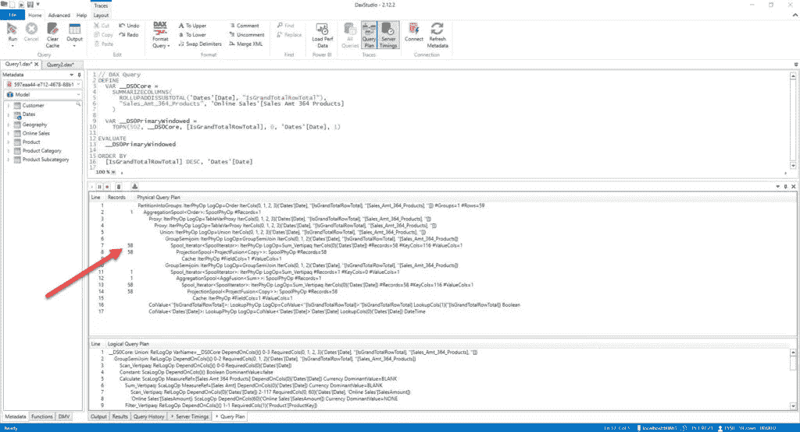

作者图片

当然，您不会注意到这两种场景之间的任何性能差异，因为差异只有几毫秒。

但是，这仅仅是一个开始，我们只是在预热我们的 DAX 引擎:)…在这两种情况下，正如您可能看到的，我们只看到“填充的”值—我们的两个要求都得到满足的行的组合—产品关键字是 364，并且只有我们销售该产品的那些日期—如果您仔细查看上面的插图，日期是不连续的，有些日期是缺失的，例如 1 月 12 日、1 月 14 日到 1 月 21 日，等等。

这是因为 Formula Engine 足够智能，可以使用非空过滤器消除产品 364 没有销售的日期，这就是为什么记录数为 58:我们有 58 个不同的日期，其中产品 364 的销售不为空:

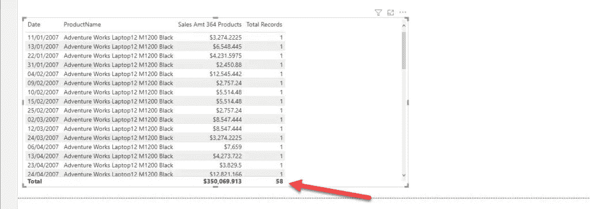

作者图片

现在，让我们假设商业用户也希望看到中间的那些日期，其中产品 364 没有取得任何销售。所以，我们的想法是显示所有这些日期的金额。正如在上一篇文章中已经描述的，有多种不同的方法来用零替换空格，我将使用 *COALESCE()* 函数:

```
Sales Amt 364 Products with 0 = COALESCE([Sales Amt 364 Products],0)
```

基本上，COALESCE 函数要做的是检查所有提供的参数(在我的例子中只有一个参数)，并用您指定的值替换第一个空白值。简单来说，它会检查销售金额 364 产品的值是否为空—如果不是，它会显示计算出的值—否则，它会用 0 替换空。

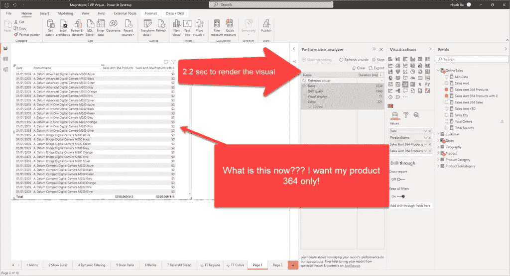

作者图片

等等，什么？！当我过滤掉除产品 364 之外的所有产品时，为什么我会看到所有产品？更不用说，我的表现在花了 2 秒多的时间来渲染！我们来看看后台发生了什么。

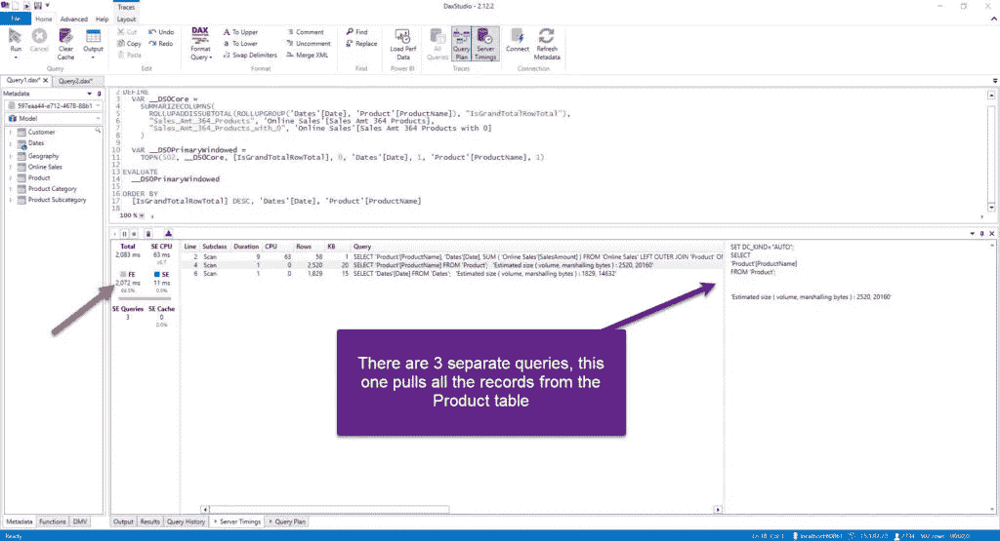

作者图片

现在我们有 3 个查询，而不是生成一个。第一个与前一个案例完全相同(58 行)。但是，其余的查询以 Product 和 Dates 表为目标，从这两个表中提取所有的行(Product 表包含 2517 行，而 Dates 表包含 1826 行)。不仅如此，请看一下查询计划:

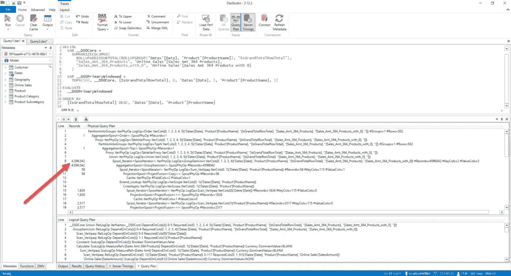

作者图片

460 万张唱片？！究竟为什么会这样？！让我给你算一下:**2.517 * 1.826 = 4 . 596 . 042**…所以，这里我们在产品和日期表之间有一个完整的交叉连接，强制检查每个元组(日期-产品的组合)！发生这种情况是因为我们强迫引擎为每个元组返回 0，否则将返回空白(并因此被排除在扫描之外)！

这是对所发生事情的简单概述:

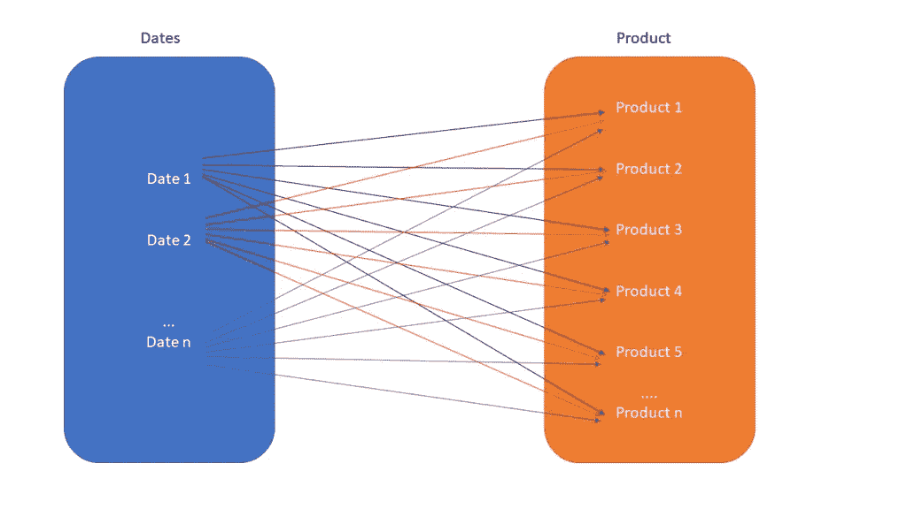

作者插图

信不信由你，有一个优雅的解决方案可以开箱即用地显示空白值(但是，不是用 0 代替空白)。您只需点击日期字段，并选择*显示没有数据的项目*:

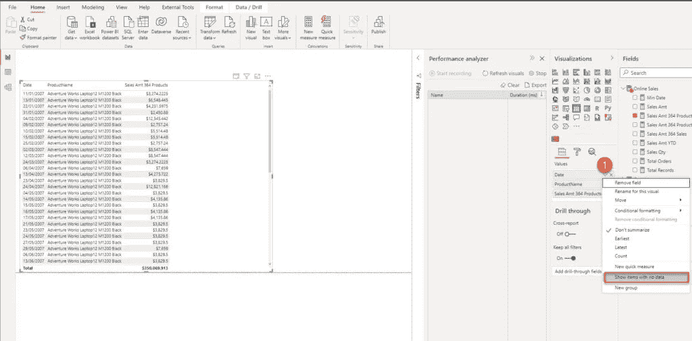

作者图片

这也将显示空白单元格，但不会在 Product 和 Dates 表之间执行完全交叉联接:

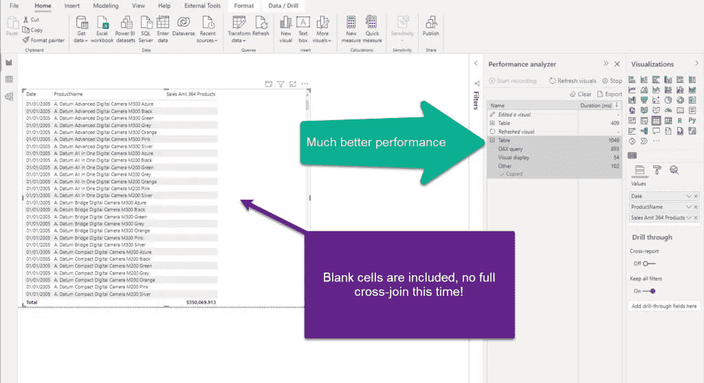

作者图片

我们现在可以看到所有的单元格(甚至是空白的),这个查询花费了前一个查询一半的时间！让我们检查由公式引擎生成的查询计划:

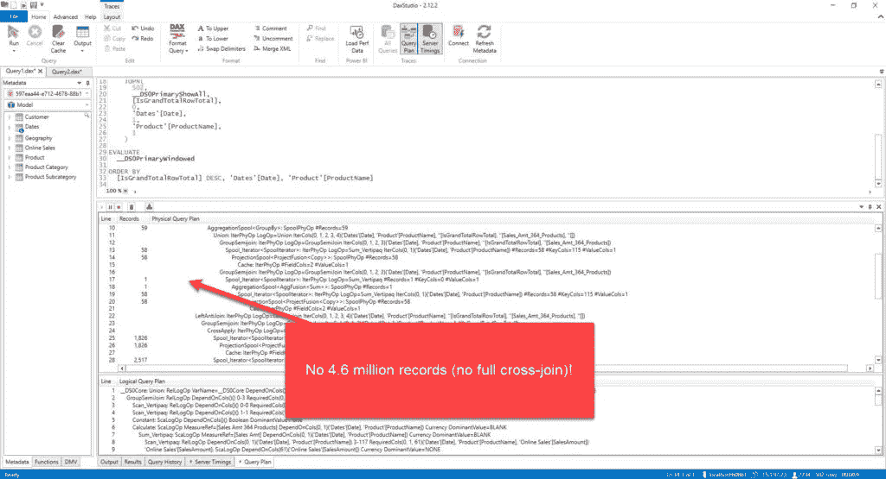

作者图片

## 并非所有场景都是灾难性的！

说实话，我们可以重写我们的方法来排除一些不需要的记录，但是这仍然不是引擎消除空记录的最佳方式。

此外，在某些情况下，即使用零替换空白也不会导致性能显著下降。

让我们来看看下面的情况:我们显示每个品牌的总销售额数据。我将添加产品 364 的销售额度量:

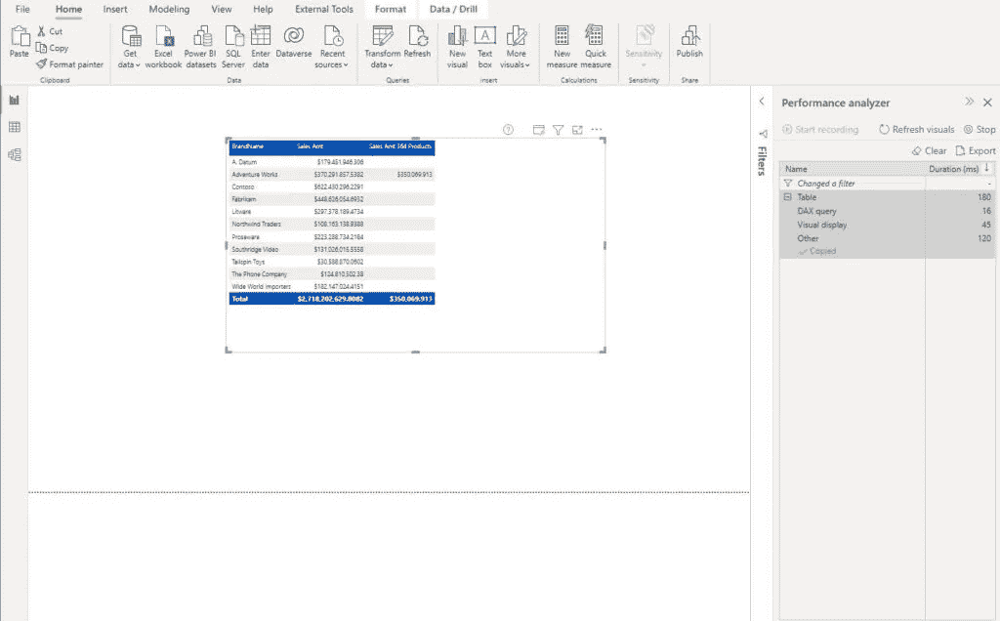

作者图片

正如你所料，这相当快。但是，当我添加用 0 替换空白的度量时会发生什么呢，这在前面的场景中造成了混乱:

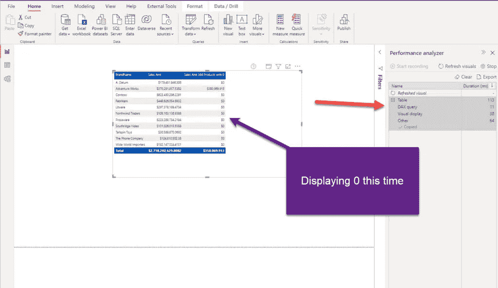

作者图片

嗯，看起来我们不用为性能付出任何代价。让我们检查一下这个 DAX 查询的查询计划:

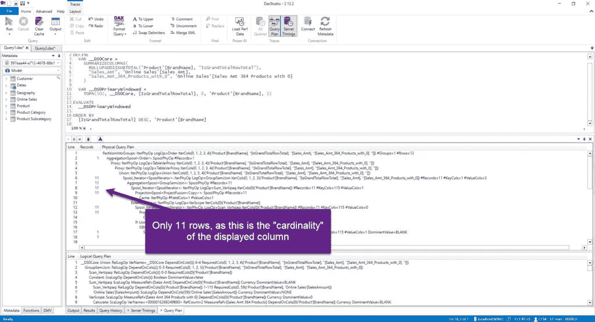

作者图片

## 结论

正如 Jeffrey Wang 所建议的，您应该避免用零(或任何其他显式值)替换空格，因为这将极大地影响查询优化器消除不必要的数据扫描的能力。但是，如果出于某种原因，您需要用一些有意义的值替换空白，请注意何时以及如何进行。

通常，这取决于许多不同的方面——对于基数较低的列，或者当您不显示来自多个不同表的数据时(就像在我们的示例中，当我们需要组合来自 Product 和 Dates 表的数据时),或者不需要显示大量不同值的可视化类型(即卡片可视化)——您可以在不付出性能代价的情况下获得成功。另一方面，如果您使用显示大量不同值的表格/矩阵/条形图，请确保在将该报告部署到生产环境之前检查指标和查询计划。

感谢阅读！

[成为会员，阅读媒体上的每一个故事！](https://datamozart.medium.com/membership)