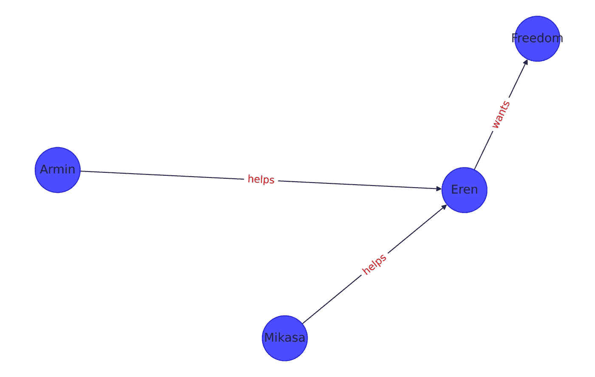

# 为什么你应该更加关注知识图表？

> 原文：<https://towardsdatascience.com/why-you-should-pay-more-attention-to-knowledge-graphs-ea88ba38e6c1?source=collection_archive---------29----------------------->

## 简而言之:建模和解决复杂的现实世界的问题。找出方法？继续读！

由 [Unsplash](https://unsplash.com/s/photos/connections?utm_source=unsplash&utm_medium=referral&utm_content=creditCopyText) 上的 [Pietro Jeng](https://unsplash.com/@pietrozj?utm_source=unsplash&utm_medium=referral&utm_content=creditCopyText) 拍摄

在这个数据时代，我们从多个不同来源生成大量数据，最近，知识图表的构建有了显著增长。现在，我们看到知识图表是几个领域的热门话题，如医学、电信甚至社交媒体。

这个想法很简单，我们将从一个领域收集的所有数据聚合到一个像 Graph 这样的数据结构中。我们更喜欢像图形这样的数据结构，因为它可以捕捉复杂的现实生活场景。通常，这个图的大小是巨大的，在这样的图中看到数百万或数十亿个实体并不罕见。

“知识图”一词是由谷歌引入的，并很快流行起来。广义地说，我们可以将任何包含一些知识/重要信息的相当大的图命名为知识图。

**示例:**一些非常流行的知识图表包括:

1.  [谷歌知识图谱](https://en.wikipedia.org/wiki/Google_Knowledge_Graph)拥有 5000 亿个事实和 50 亿个实体。
2.  亚马逊产品图。
3.  开源知识图: [DBpedia](https://www.dbpedia.org/) ， [Wikidata](https://www.wikidata.org/wiki/Wikidata:Main_Page) 等。

# 知识图构建

照片由 [Danist Soh](https://unsplash.com/@danist07?utm_source=unsplash&utm_medium=referral&utm_content=creditCopyText) 在 [Unsplash](https://unsplash.com/s/photos/construction?utm_source=unsplash&utm_medium=referral&utm_content=creditCopyText) 上拍摄

那么知识图的组成部分是什么呢？让我们来了解一下这些巨大的图形是如何构造的。

知识图通常被表示为有向图，因此该图的每个实体可以被称为一个**三元组。**

三元组，顾名思义，是由 3 个元素组成的元组，即:源节点、关系和目标节点。

**命名法:**

三元组的元素可以使用不同的名称，例如:

1.  (s，p，o):主语，谓语，宾语
2.  (h，r，t):头，关系，尾
3.  (s，r，t):源，关系，目标

让我用一个小例子来详细说明这一点。

图表示例(来源:作者)

在上图中，我们有 4 个节点和 3 条边，或者我们可以说有 3 个三元组。其中一个三元组是:

> (《额仁》《欲》《自由》)

其中 ***二人*** 是源节点， ***想要*** 是关系， ***自由*** 是目标节点，这是有向关系。正如我之前提到的，一个知识图将由几个这样的三元组组成。

# 知识图的重要性

我们已经了解了知识图以及它们是由什么组成的。那么，这种图表有什么用呢？

知识图可以以几种不同的方式使用。构建图表的每个领域都有自己的用例。

照片由 [Alina Grubnyak](https://unsplash.com/@alinnnaaaa?utm_source=unsplash&utm_medium=referral&utm_content=creditCopyText) 在 [Unsplash](https://unsplash.com/s/photos/biology-network?utm_source=unsplash&utm_medium=referral&utm_content=creditCopyText) 上拍摄

例如，在生物医学领域，我们有一个蛋白质相互作用(PPI)网络的例子，这是一个由人体中发现的蛋白质及其相互作用组成的图。这些类型的图用于识别重要的蛋白质复合物，也用于研究不同类型的药物测试或疾病感染中蛋白质相互作用的行为。简而言之，PPI 网络可以帮助我们发现针对现有疾病的新药或任何像新冠肺炎这样的新药。

[谷歌的](https://blog.google/products/search/introducing-knowledge-graph-things-not/)知识图是关于优化搜索引擎和向用户传递相关信息的。如果你在谷歌中使用关键字“星际”进行搜索，你会收到关于电影《星际穿越》的信息，以及类似于其他太空科幻电影的其他推荐。会有一些关于星际空间的科学文章，或者只是一本解释其含义的字典。谷歌希望了解用户试图搜索的内容的上下文，并在顶部显示最相关的信息。

Orange 正在开发自己的知识图谱，名为未来事物。这里，数据是从现实生活中存在的物理实体收集的，例如交通灯、地理位置数据、建筑数据、城市数据等。为此，采用了几个物联网连接设备，数据包含环境的结构和语义描述。这里的主要思想是将现实世界的实体映射到数字世界，并构建几个对最终用户有帮助的用例，如信息检索。

**鸣谢:**我曾在位于塞斯顿-塞维尼的 Orange Labs 实习，主题是未来*事物*知识图的数据质量改进，使用最先进的机器学习技术。

我已经提到了三个例子，但还有其他几种可能性，比如电影推荐(在网飞这样的网站上)，新朋友推荐(在脸书和 Instagram 这样的网站上)等等。

# 一些问题

照片由[印尼 UX](https://unsplash.com/@uxindo?utm_source=unsplash&utm_medium=referral&utm_content=creditCopyText)在 [Unsplash](https://unsplash.com/s/photos/design-thinking?utm_source=unsplash&utm_medium=referral&utm_content=creditCopyText) 上拍摄

这听起来不错，所以让我们构建知识图表并从中获益，对吗？

事情没那么简单。由于知识图本身的庞大规模，在处理该图时存在一些问题。其中一些问题列举如下:

1.  **缺失数据或质量差的数据**:当我们构建图形时，信息以三元组的形式注入数据库。很多时候，由于数据损坏或其他因素，会有一些信息丢失。解决这个问题的过程被称为知识图精化或知识图完成。
2.  **图的非欧几里德性质**:使用图数据结构的一个优点是我们可以从现实世界中捕捉复杂的交互。但是，由于图形的复杂性质，我们不能将它们直接用作机器学习算法的输入来建立预测模型。已经对图结构进行了一些研究，并且我们有诸如知识图嵌入的方法，其在低维空间中生成实体的数字表示。随后，这些嵌入可用于构建机器学习模型，但不是图本身。

我们还有图形神经网络(GNN ),这是一种可以应用于图形数据的神经网络方法。即使在这里，我们也需要用数字表示图中的节点来构建 GNN 模型。

我已经在图形神经网络上发表了两篇有趣的文章，解释了我们如何使用 PyTorch 几何 python 库构建 GNN 模型。如果您对基于图形的分析感兴趣，我建议您查看它们。

</a-beginners-guide-to-graph-neural-networks-using-pytorch-geometric-part-1-d98dc93e7742>  </a-beginners-guide-to-graph-neural-networks-using-pytorch-geometric-part-2-cd82c01330ab>  

我会写更多关于知识图及其嵌入技术的文章。敬请期待！

如果你看到了这篇文章的这一部分，感谢你的阅读和关注。我希望你觉得这篇文章内容丰富，如果你有任何问题，请随时通过 [LinkedIn](https://www.linkedin.com/in/rohithteja/) 、 [Twitter](https://twitter.com/RohithTeja15) 或 [GitHub](https://github.com/rohithteja) 联系我。