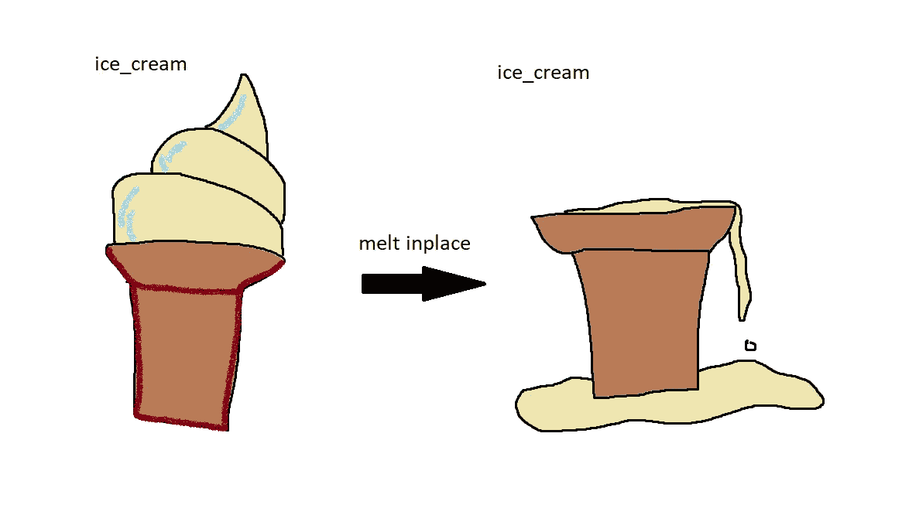
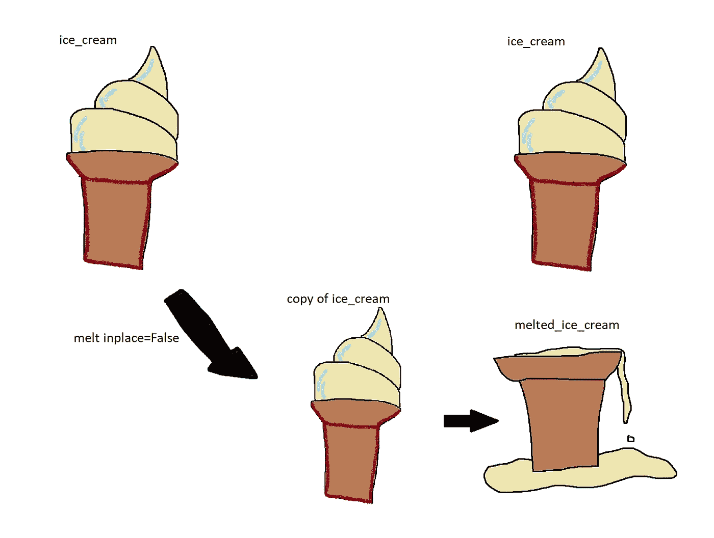

# 为什么你可能永远不应该在某个地方使用熊猫=正确

> 原文：<https://towardsdatascience.com/why-you-should-probably-never-use-pandas-inplace-true-9f9f211849e4?source=collection_archive---------1----------------------->

## 如果你使用它，它的确是图书馆的诅咒，也是你的祸根

本文将解释 pandas `inplace=True`关键字的含义，它的行为方式，以及为什么你可能永远不应该使用它。

熊猫是一个大图书馆；有许多不同的方法可以让你用熊猫写一个程序来达到同样的结果。然而，每种不同的方法在性能、可维护性，当然还有代码风格方面可能有很大的不同。我写了几篇关于熊猫图书馆其他领域的文章，如果你感兴趣的话，可以看看:

*   [避开熊猫。应用()](/avoiding-apply-ing-yourself-in-pandas-a6ade4569b7f)
*   [处理熊猫种类](/staying-sane-while-adopting-pandas-categorical-datatypes-78dbd19dcd8a)

这篇文章将涵盖有争议的`inplace=True`，如果你在代码中使用它，它(剧透警告)会给你带来负面影响。


熊猫是我能想到的最好的例子。我只能道歉。(熊猫的功劳归于露西·谢泼德)，其余的怪物是我自己的。

## 简介——什么是真实的？

如果你有使用`inplace`关键词的经验，这对你来说并不新鲜，只是简单回顾一下它是如何工作的。Inplace 是一个被许多 pandas 方法接受的参数，它影响方法如何运行的行为。您可能经常看到这个关键字的一些例子(但希望不要在您自己的代码中实现)是方法；`.fillna()`、`.replace()`、`.rename()`，不胜枚举。

## 原地=真

在 pandas 方法中使用`inplace=True`关键字会改变默认行为，这样 dataframe 上的操作不会`return`做任何事情，而是“修改底层数据”(稍后会详细介绍)。它改变了你应用它的实际对象。

这意味着引用此数据帧的任何其他对象(如切片)现在将看到数据的修改版本，而不是原始版本。

想象有一个冰淇淋，它是冷冻的，但你想融化它。如果你使用`inplace=True`，你改变对象的状态。你不能拿回你的未融化的冰淇淋。

下面是一个简单的例子，展示了熊猫的情况:

```
>>> ice_cream = pd.DataFrame({
        "state": ["frozen"], "flavour": ["vanilla"]
    })
>>> ice_cream state   flavour
0  frozen  vanilla
```

现在让我们做融化(在这种情况下，这是一个简单的字符串`.replace()`，不要与熊猫`.melt()`混淆)。

```
>>> ice_cream.replace({"frozen": "melted"}, inplace=True)
>>> ice_cream state   flavour
0  melted  vanilla
```

冰淇淋变凉了！



当我们就地融化时，我们改变了冰淇淋的基本结构。图片作者。

## 原地=假

或者，当使用`inplace=False`(这是默认行为)时，dataframe 操作返回 dataframe 的副本，保持原始数据不变。我们不再受物理定律的约束，我们可以鱼与熊掌兼得。让我想想…

因为有人融化了我们的冰淇淋，我们必须先重新做一次…

```
>>> ice_cream = pd.DataFrame({
        "state": ["frozen"], "flavour": ["vanilla"]
    })
>>> ice_cream state   flavour
0  frozen  vanilla
```

现在让我们再次熔化它，但是这次使用`inplace=False`(我们不一定要传递它，因为它是默认选项，但是为了便于说明，我们在下面已经这样做了)。

```
>>> melted_ice_cream = ice_cream.replace({"frozen": "melted"}, inplace=False)
>>> ice_cream state   flavour
0  frozen  vanilla
```

所以当我们回头看我们最初的冰淇淋时，我们看到它没有融化，但我们确实有一个融化的冰淇淋，现在我们两个都有了；两倍多的冰淇淋…

```
>>> melted_ice_cream state   flavour
0  melted  vanilla
```



当 inplace=False 时，首先制作数据的副本，以便原始冰淇淋/数据保持完整。图片作者。

如前所述，不仅仅是`.replace()`的关键字参数可用，您还会在许多不同的方法中看到它，例如`.fillna()`、`.sort_values()`、`.query()`、`.drop_duplicates()`、`.reset_index()`，等等。

## 使用 inplace 的动机=True

人们伸手拿`inplace=True`的原因有很多，我试着用以下几点来描述我多年来听到的许多事情。

1.  我不需要中间结果，只需要最终输出。为什么我要不断制作包含冗余数据的副本？这个程序应该像一个冰雕师，在同一块冰上凿来凿去，直到雕塑完成！
2.  我的计算机内存有限——不需要昂贵的副本，就地修改数据帧不是更高效、更快吗？
3.  我不想为所有这些中间步骤想出变量名…
4.  我真的没有想过，我只是把它当成一种习惯。

如果您认为还有其他原因需要使用`inplace=True`，请随意评论，我会将它们添加到列表中(希望有适当的反驳)。

## 对动机的反应

> 我不需要中间结果，只需要最终输出

这在快乐的道路上可能是正确的(当一切顺利时)，但是在开发/测试/调试期间，您可能想要在管道中的不同点检查一些中间值，当您的数据状态不随时间改变时，这更容易做到。

这种模式中真正危险的部分之一是对象的变异，这很容易让讨厌的 bug 爬进来。改变对象状态的代码被描述为具有“副作用”,因为运行代码的行为以某种方式改变了系统的状态；在这种情况下,`inplace=True`具有修改原始数据帧的副作用。让我们看一个简单的例子，看看这是如何导致问题的。

假设我们有一个表，其中包含每个城市的销售额，我们希望生成一个销售排名靠前的城市的排行榜，并计算所有城市的总销售额。

```
def create_top_city_leaderboard(df):
    df.dropna(subset=["city"], inplace=True)
    df.sort_values(by=["sales"], ascending=False, inplace=True)
    return dfdef calculate_total_sales(df):
    return df["sales"].sum()df = pd.DataFrame(
    {
        "city": ["London", "Amsterdam", "New York", None],
        "sales": [100, 300, 200, 400],
    }
)
```

我们运行这两个任务的顺序并不重要，因为它们在理论上是完全独立的。让我们试着运行这些函数，看看会发生什么。

```
>>> df = pd.DataFrame(
        {
            "city": ["London", "Amsterdam", "New York", None],
            "sales": [100, 300, 200, 400],
        }
    )>>> calculate_total_sales(df)
1000>>> create_top_city_leaderboard(df) city  sales
1  Amsterdam    300
2   New York    200
0     London    100
```

到目前为止，一切看起来都很好，但是让我们看看如果我们再次计算总销售额会发生什么:

```
>>> calculate_total_sales(df)
600
```

该死，我们刚刚损失了 400 英镑，这是一个昂贵的错误！如果你正在编写一些调用这个函数的代码，而你不熟悉`create_top_city_leaderboard`里面的代码，你肯定会感到非常沮丧，因为它破坏了你的数据帧，并在你的代码中引起了一个错误——这是一个令人讨厌的副作用。

这看起来像是一个虚构的例子，但是在更复杂的代码中，如果您依赖可变状态，这种反模式很容易出现。通常你想对一个数据帧做很多事情，如果你不仅要考虑数据帧是什么，还要考虑数据帧将处于什么状态，那么就很难编写安全的代码来做这些事情。如果你从不改变对象的状态，你可以保证它们在任何时候都处于完全相同的状态，这使得程序的行为更容易理解和推理。

为了完整起见，这里是同一函数的非变异方法:

```
def create_top_city_leaderboard(df):
    return (
        df.dropna(subset=["city"])
          .sort_values(by=["sales"], ascending=False)
    )
```

> 不需要昂贵的数据复制，就地修改我的数据帧不是更高效更快吗？

当我找到这个问题的答案时，我有点惊讶，实际上在大多数情况下，仍然会创建一个副本，执行操作，然后作为最后一步，用新转换的副本覆盖以前的引用。这意味着在大多数情况下使用`inplace=True`并不会更有效。

我认为这可能是使用`inplace=True`时最常见和最有害的误解，当它以性能的名义完成时，却没有提供任何性能，并带来了额外的负面影响。

**注意:**在某些情况下，通过避免复制，它确实提供了一些性能上的好处，但是要知道一个特定的方法是否通过`inplace=True`参数提供了任何好处，您可能需要检查 pandas 源代码，如果您依赖于必须检查库源代码，那么在您的应用程序代码中，您的决策背后的意图可能并不清楚和明显。

在以性能的名义尝试`inplace`之前，有很多方法可以优化 pandas 代码。

> 我不想为所有这些中间步骤想出变量名…

如果你使用链接(这给你主要的熊猫风格点)，那么你将不必！

`inplace=True`禁止使用链接，因为这些方法不返回任何内容。这是一个很大的风格上的打击，因为连锁是熊猫真正活起来的地方。

让我们比较一个糟糕的原地例子和一些漂亮的链接:

```
def create_country_leaderboard(df):
    country_df = df.groupby("country")[["sales", "refunds"]].sum()
    country_df.rename(index=str.lower, inplace=True)
    country_df.reset_index(inplace=True)
    country_df.sort_values(by="sales", inplace=True)
    return country_df
```

很恶心，我知道。现在，让我们看看如何美化它，也不必想出四个新的变量名。

```
def create_country_leaderboard(df):
    return (
        df.groupby("country")[["sales", "refunds"]]
          .sum()
          .rename(index=str.lower)
          .reset_index()
          .sort_values(by="sales")
    )
```

哦，耶，可爱，现在读起来像一场梦。

> 我真的没有想过，我只是把它当成一种习惯

很公平，现在你已经考虑过了，你终于可以停止这个习惯了。

## 停止就地使用的额外影响力=True

*   如果您忘记在您的一行中添加`inplace=True`(我在编写其中一个示例时这样做了)，您可能会错过数据帧上的一个操作，并且很难发现，因为您将有一个随机的行没有做任何有用的事情。
*   如果你使用 Jupyter 笔记本，它会使管理不同对象的状态变得更加困难——如果一个改变你的数据帧的函数中途出错(在我写一个例子时也发生过这种情况),你会得到一个半变异的数据帧。

此外，核心 pandas dev 团队建议不要使用这个参数，并且已经讨论了反对这种行为的计划(我已经准备了冰镇香槟)。

GitHub 上有一个关于这个话题的冗长而有趣的讨论([此处](https://github.com/pandas-dev/pandas/issues/16529))——所以如果你不相信我的话，请相信他们的。

# 结论

在软件工程中，当对你写的代码做设计决策时，经常要做出权衡。在`inplace=True`的案例中，使用这种模式几乎没有任何好处，但却有大量的成本:

*   它鼓励一种危险的有状态的、副作用的编码风格，这很可能导致错误。
*   它的行为不像人们普遍预期的那样(并且很少提供任何性能改进)。
*   它移除了使用链接的能力，而链接(在我看来)是编写漂亮的熊猫代码的最佳点。
*   该参数最终可能会被弃用(所以您可能已经习惯了不使用它)。

总之，`inplace=True`最好避免！