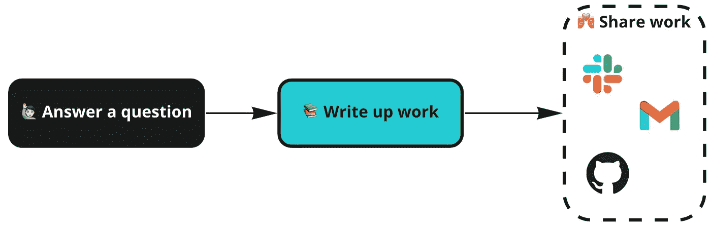
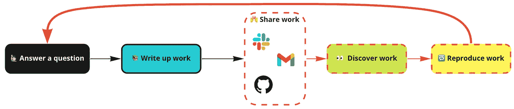
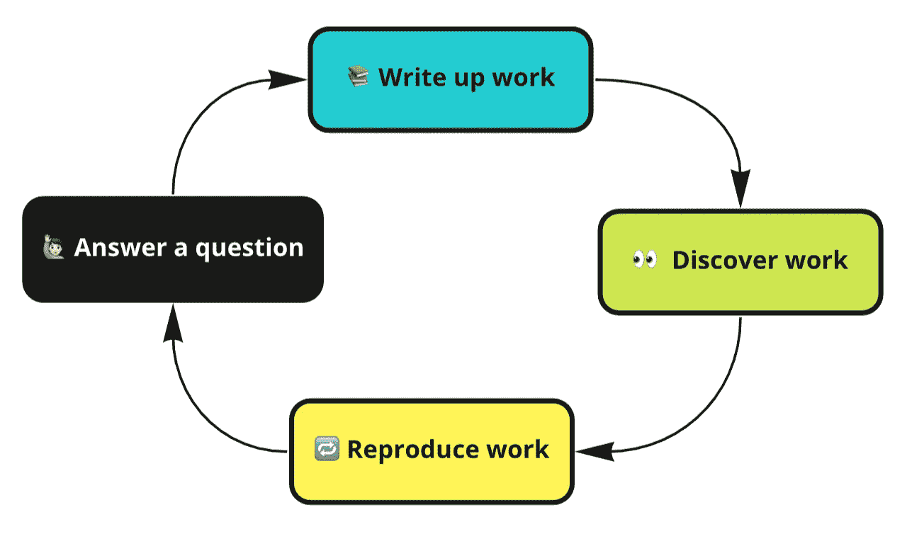

# 为什么您应该重新考虑在哪里编写 SQL

> 原文：<https://towardsdatascience.com/why-you-should-rethink-where-you-write-your-sql-bd0954191212?source=collection_archive---------9----------------------->

## 分析工作需要*可被发现*。让我们来谈谈如何到达那里[以及像 Hyperquery 这样的文档工作区如何能有所帮助]。

当我还是一名数据科学家时，我花了大量的时间做产品分析工作——确定机会大小、深入试验、特别检查。但是尽管我使用了各种各样的工具——Jupyter/Python、tidyverse、超集、内部工具，甚至 Java UDF——大部分工作实际上是在 SQL 中完成的。我会怎么做？我会在 Superset 的内置 IDE 中编写查询，调整它，直到得到我所提问题的答案，将它与其他发现一起转储到 Google doc 中，然后作为电子邮件/Slack 消息发送出去，永远消失在企业噪音的海洋中。

如您所料，几周或几个月后，我会面临一个类似的问题，并且无法找到我过去的工作，我会重写相同的查询。由此，我对这个工作流程有了一个清晰的认识:

> 分析工作最难的部分不是工作。下周它又在做这项工作。

我将在下面讨论如何解决这个问题。这是对分析团队内部有组织协作的长期被忽视的优点的赞美，是对现代文档工作空间的情书(a la concept，Dropbox Paper，Confluence 等。)，并一瞥我们自己的分析背后的动机——首先是文档工作空间、 [hyperquery](https://hyperquery.ai/?utm_source=medium&utm_medium=organic-content&utm_campaign=2021-10-07-why-you-should-rethink) 。但是我有点言过其实了——在我们试图修复它之前，让我们先讨论一下什么东西坏了。

# ✂️剖析破碎的工作流程

一旦你写了一些 SQL，发掘了一些见解，并写下了你的工作，你在灵魂深处知道你需要做什么(尽管你可能会不时地试图让这种声音沉默):**你需要让你的工作后代(或未来的你)理解这项工作**。因此，我们中最优秀的人会写一份谷歌文档，记录我们的过程、我们的疑问、我们的见解，然后通过电子邮件 Slack 分享给我们的同事，让他们高兴地观看。“学术协作，成就斐然！”你可能会想。该工作流程可以简单地想象如下:

标准的洞察交付工作流程:回答问题，撰写作品，分享[图片由作者提供]

但是在*分享工作*的过程中，事情开始变得不明朗(注意上图中不祥的虚线)。我们将 insight 移交流程的这一步骤归入非常适合时间点共享的工具，代价是后续的发现和再现工作。Slack，Gmail ( [别让我入门](/how-to-scale-your-analytics-org-by-ditching-git-3d8d4ce398d1)在 Github 上进行见解分享)？今天在这里，明天就不见了(更不用说完全缺乏复制基于 SQL 的工作的平台)。为什么这是一个问题？因为你工作的**生命周期很少在这里结束**——它作为未来分析项目发现过程的一部分继续存在。

因此，当我们认为我们的工作已经完成，给我们的团队(和我们自己)留下了一系列证据证明“是的！我们以前在这方面做过工作”，事实上，我们给他们留下的只是面包屑，当你的工作实际上与他们相关时，他们会再次发现你的工作。在[之前的博客文章](/how-to-scale-your-analytics-org-by-ditching-git-3d8d4ce398d1)中，我讨论了为什么可发现性和可再现性对于分析组织实现规模化至关重要，但这是痛苦的症结所在:知识丢失导致的浪费/重复努力。

标准洞察交付工作流程的真实面貌:回答问题，撰写作品，分享，在这一点上，它进入了其他人的洞察发现过程[图片由作者提供]

# 🛠用可发现的报道结束了比赛

任何中断循环的补救方法都很简单——关闭循环。这个循环可以通过简单地采用一个允许**组织和发现过去工作**的工具来完成。当然，有很多方法可以做到这一点，但请允许我滔滔不绝地说一会儿。也就是说，关于这篇文章的情书部分:虽然不新颖，但这个问题的一个很好的解决方案是现代文档工作区——像 Confluence、inconce、Dropbox paper、 [Hyperquery](https://hyperquery.ai/?utm_source=medium&utm_medium=organic-content&utm_campaign=2021-10-07-why-you-should-rethink) 这样的工具不仅为用户提供了写文章的能力，而且**可以组织结果，使其对更广泛的团队**有意义。此外，丰富的搜索功能比通过松散的文档或 git 支持的笔记本更容易发现。它可能看起来很小，但用户体验得到了极大的改善。

> 曾经只有一点点的闲言碎语导致一个模糊的 Google 文档，现在已经有了过去的 SQL 查询、见解和由此产生的业务决策的年鉴。

通过更强大的共享空间实现更优化的闭环[图片由作者提供]

虽然这是一个小小的变化，但这一工作流程提供的可发现性和可见性不仅仅是分析师生活中的一个小小的 UX 改进——如果您允许我发表一会儿意见，这是开启分析*协作*的关键。过去几年围绕协作的创新主要集中在使*技术*协作更加可行/可及/强大(例如 Google colab)，但这几乎不是协作。

> 协作不是两个用户在同一个地方，一起编写 SQL/Python/R。分析中的协作是关于**知识共享、可发现性和可再现性**。

也就是说，我承认对这个特殊的解决方案有点偏见。我们已经构建了自己的文档工作区，名为**[**Hyperquery**](https://hyperquery.ai/?utm_source=medium&utm_medium=organic-content&utm_campaign=2021-10-07-why-you-should-rethink)，它通过在单个生态系统中实现 SQL 编写和知识共享，进一步封闭了这个循环。但是如果我没有提到还有其他的选择，那我就失职了。如果你已经开始使用 Google docs，我已经和使用[库](https://github.com/nytimes/library)取得一些成功的团队谈过了，对于基于 Jupyter 的工作流，我个人在 Airbnb 使用过[知识回购](https://github.com/airbnb/knowledge-repo)来实现这个目的(尽管使用基于 git 的共享范例的摩擦有点令人痛苦地高)。但是，无论您选择使用什么工具，都要承认这些知识共享工作流程是减少冗余工作的关键一步。吃你的蔬菜——更仔细地考虑你在哪里储存你的工作，并提升你的分析团队。**

# **结束语**

**我最后的战斗召唤？**

*   ****写下你的 SQL 工作。****
*   ****放在可以被发现的地方(doc 工作区)。****

**减少重复工作的关键是使查找过去的工作变得容易，文档工作区是一个很好的方法。**

***推文*[*@ imrobertyi*](https://twitter.com/imrobertyi)*/*[*@*hyperquery](http://twitter.com/hyperquery)*来问好。👋
关注我们*[*LinkedIn*](https://www.linkedin.com/company/hyperquery/)*。🙂* **要了解更多关于 Hyperquery 的信息(并注册我们的私人测试版)，请访问**[**Hyperquery . ai**](https://hyperquery.ai/?utm_source=medium&utm_medium=organic-content&utm_campaign=2021-10-07-why-you-should-rethink)**。我们正在构建一种新的文档，将笔记、查询和数据整合到一个统一的、有组织的空间中。***(如果你有兴趣帮助我们建设，我们正在招聘——查看我们的* [*空缺职位*](https://www.notion.so/Careers-at-Dataframe-3e861dab875443269ee612e9159c2071) *)。)***