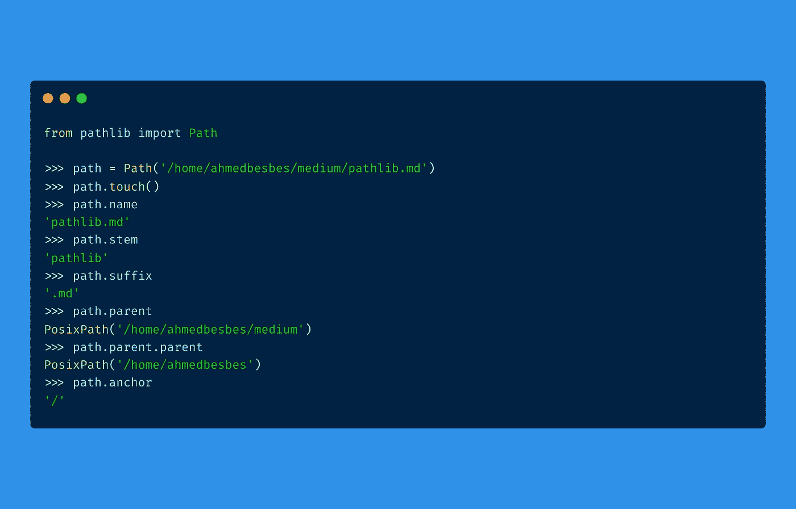

# 为什么应该开始使用 Pathlib 作为 OS 模块的替代

> 原文：<https://towardsdatascience.com/why-you-should-start-using-pathlib-as-an-alternative-to-the-os-module-d9eccd994745?source=collection_archive---------4----------------------->

## 第一个原因:面向对象编程



作者制作的图像

作为一名数据科学家，我每天都要操作路径和文件来读写数据。

为此，我通常使用`**os.path**` Python 模块来执行诸如连接路径、检查目录内容或创建文件夹之类的操作。

事实上，使用`**os.path**`模块似乎是访问文件系统的自然选择。

> ***在这篇文章中，我通过引入另一个名为 Pathlib 的*路径管理*库来挑战这种做法。
> 我们将了解这个库是如何工作的，它与 os.path 模块有何不同，它提供了哪些特性和优势，以及何时应该(或不应该)使用它。***

事不宜迟，让我们来看看🔍

# os 模块的“问题”

`os`模块很受欢迎:它已经存在一段时间了。然而，我一直认为它以一种不自然的方式处理路径。

这些是让我质疑其用途的原因:

*   `**os**`是一个大模块:它确实有一个`**path**`子模块来管理路径和连接它们，但是一旦你需要在这些路径上执行系统操作(创建一个文件夹，列出其中的内容，或者重命名和删除一个文件)，你将不得不使用其他方法，这些方法要么出现在包层次结构的其他地方:(`os.makedirs,` `os.listdir,` `os.rename,`等等。)或从其他模块如`**shutil**`
    或`**glob**`导入。经过一番挖掘，你仍然可以找到这些方法，但这似乎是不必要的努力
*   `**os**`以最原始的格式表示路径:字符串值。这是非常有限的:它不允许您直接访问诸如文件属性或其元数据之类的信息，也不允许您通过调用一些特殊的方法在文件系统上执行操作。
    例如，为了检查一条路径是否存在，你可以做一些类似`**os.path.exists(some_path)**`的事情。但是，如果通过类方法或属性更直接地从 path 对象访问这些信息，不是更容易吗？
*   `**os**`模块本身并不允许您在层次结构中找到匹配给定模式的路径。比方说，您想要递归地查找一个非常嵌套的文件夹结构中的所有`__init__.py`文件。为此，你必须将`**os**`与另一个叫做`**glob**`的模块结合起来。您当然可以习惯，但是您真的需要两个模块来执行这样的任务吗？
*   这更多的是个人偏好，但是我总是发现`os`语法有点笨拙。你可以读，你可以写，但是因为某些原因，我总觉得可以做一些改进，让它变得更轻。

# 什么是 Pathlib？

Pathlib 是标准 Python 库的一部分，从 Python 3.4(参见 [PEP 428](https://www.python.org/dev/peps/pep-0428/) )开始引入，目标是将路径表示为具有许多有用方法和属性的超级 Python 对象，而不是简单的字符串。

正如官方文件所述:

> 这个库的目的是提供一个简单的类层次结构来处理文件系统路径和用户在它们上面做的普通操作

Pathlib 旨在减轻前面提到的使用`os`模块时遇到的挫折。让我们来看看它的一些特性。

*这篇文章不是对 Pathlib 的深入概述。要了解这个库的更多信息，我推荐你查看官方的* [*文档*](https://docs.python.org/3/library/pathlib.html) *或者我在最后列出的参考资料。*

# 👉Pathlib 有更直观的语法

要用 pathlib 构造一个路径，基本上需要导入 Path 类并向它传递一个字符串。这个字符串指向文件系统上一个不一定存在的路径。

```
**from pathlib import Path****path = Path("/Users/ahmed.besbes/projects/posts")****path** **# PosixPath('/Users/ahmed.besbes/projects/posts')****print(cwd)****# /Users/ahmed.besbes/projects/posts**
```

现在您已经可以访问一个`Path`对象了。你会如何进行简单的操作？

*   ***加入路径***

`Pathlib`使用 **/** 操作符来连接路径。这可能看起来很有趣，但它确实使代码更容易阅读。

我们来做个对比。

要使用 with `os`模块连接路径，您应该这样做:

使用 Pathlib，相同的代码转换成:

实际上，Pathlib 已经增强了/操作符来执行路径连接。

*   ***获取当前工作目录/主目录***

已经实现了这样做的方法。

```
**from path import Pathlib****cwd = Path.cwd()
home = Path.home()**
```

*   ***看文件***

您可以像处理典型路径一样将`open`与上下文管理器一起使用，或者使用`read_text`或`read_bytes`。

```
**>>> path = pathlib.Path.home() / file.txt'
>>> path.read_text()**
```

显然有更多的功能要涵盖。让我们在接下来的章节中讨论最有趣的部分。

# 👉它很容易创建文件和目录

一旦创建了 Path 对象，它就可以通过调用它的内部方法自己执行文件系统操作。例如，它可以创建一个文件夹或弹出一个文件，只需调用`mkdir`和`touch`方法。

以下是路径对象创建文件夹的方式:

创建文件夹

文件也是如此:

创建文件

当然，您仍然可以使用`os`模块来执行这些操作，但是这需要调用另一个类似`makedirs`的函数。

# 👉它通过访问父文件系统来导航文件系统层次结构

每个 Path 对象都有一个名为`parent`的属性，它返回父文件夹的 Path 对象。这使得操作大型文件夹层次结构变得更加容易。事实上，由于路径是对象，所以我们可以将方法链接起来以到达所需的父对象。

如果您想避免链接`parent`属性来访问第 n 个先前的父文件夹，您可以调用`parent**s**`属性来返回当前文件夹之前的所有父文件夹的列表。

# 👉它允许您迭代目录并执行模式匹配

让我们假设您有一个指向目录的 Path 对象。

Pathlib 允许您轻松地遍历该目录的内容，并获取与特定模式匹配的文件和文件夹。

还记得您用来和`os`模块一起导入的`glob`模块吗，以便获得匹配模式的路径？

嗯，Path 对象有一个`**glob**`方法和一个递归版本(称为`rglob`)来执行类似的任务，但是语法要简单得多。

假设我想计算给定文件夹中 Python 文件的数量，你可以这样做:

# 👉每个路径对象都有多个有用的属性

每个 Path 对象都有多个有用的方法和属性，这些方法和属性执行以前由其他库而不是`os`处理的操作(想想`glob`或`shutil`)

*   `.exists()`:检查路径是否真的存在于文件系统中
*   `.is_dir()`:检查路径是否对应一个目录
*   `.is_file()`:检查路径是否对应文件
*   `.is_absolute()`:检查路径是否绝对
*   `.chmod()`:更改文件模式和权限
*   `is_mount()`:检查路径是否为*挂载点*
*   `.suffix`:获取文件扩展名

还有更多方法。你可以在这里查看所有列表[。](https://docs.python.org/3/library/pathlib.html)

# 资源

如果你想了解更多关于 Pathlib 和本机`os.path`模块的区别，你可以看看这个精选资源列表:它是 100%免费的，而且质量很好。我保证。

*   [https://docs.python.org/3/library/pathlib.html](https://docs.python.org/3/library/pathlib.html)
*   [https://trey hunner . com/2018/12/why-you-should-be-using-path lib/](https://treyhunner.com/2018/12/why-you-should-be-using-pathlib/)
*   [https://treyhunner.com/2019/01/no-really-pathlib-is-great/](https://treyhunner.com/2019/01/no-really-pathlib-is-great/)
*   [python.org/dev/peps/pep-0519/#standard-library-changes](http://python.org/dev/peps/pep-0519/#standard-library-changes)
*   [https://youtu.be/YwhOUyTxXVE](https://youtu.be/YwhOUyTxXVE)
*   [https://redna fi . github . io/decadequations/python/2020/04/13/python-path lib . html](https://rednafi.github.io/digressions/python/2020/04/13/python-pathlib.html)
*   [https://www . docstring . fr/blog/gerer-des-chemins-de-fichiers-avec-path lib/](https://www.docstring.fr/blog/gerer-des-chemins-de-fichiers-avec-pathlib/)(法语🥐帖子)
*   [https://realpython.com/python-pathlib/](https://realpython.com/python-pathlib/)

# 感谢阅读🙏

这是一篇关于 Pathlib 特性的快速文章。

如果你想迁移到这个库，并且假设你使用的是 Python +3.4，那就去做吧:从 **os** 迁移到 **Pathlib** 相当容易。

今天就这些了。直到下一次更多的编程技巧和教程。👋


由 [Unsplash](https://unsplash.com/@karsten116?utm_source=unsplash&utm_medium=referral&utm_content=creditCopyText) 上的 [Karsten Winegeart](https://unsplash.com/@karsten116?utm_source=unsplash&utm_medium=referral&utm_content=creditCopyText) 拍摄

# 新到中？你可以订阅每月 5 美元，并解锁无限的文章——[点击这里。](https://ahmedbesbes.medium.com/membership)