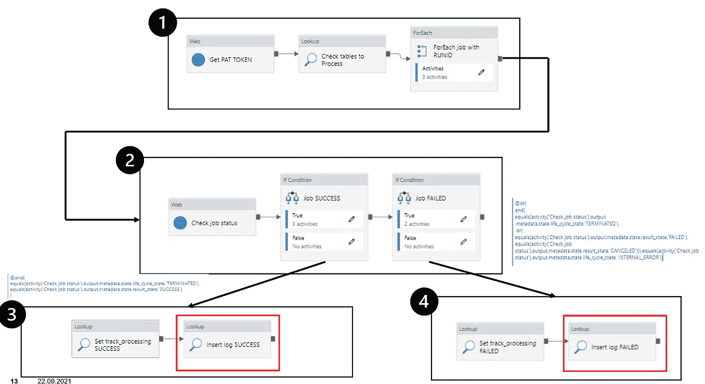
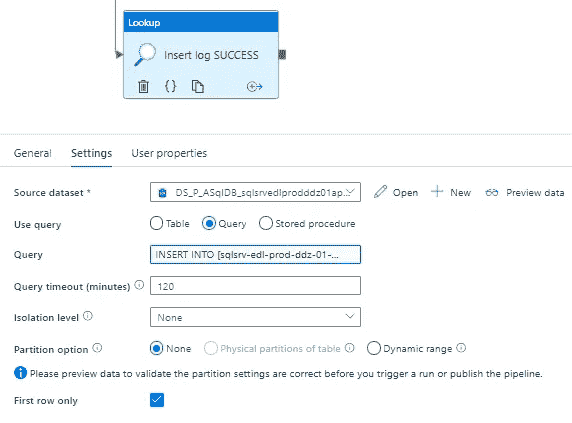
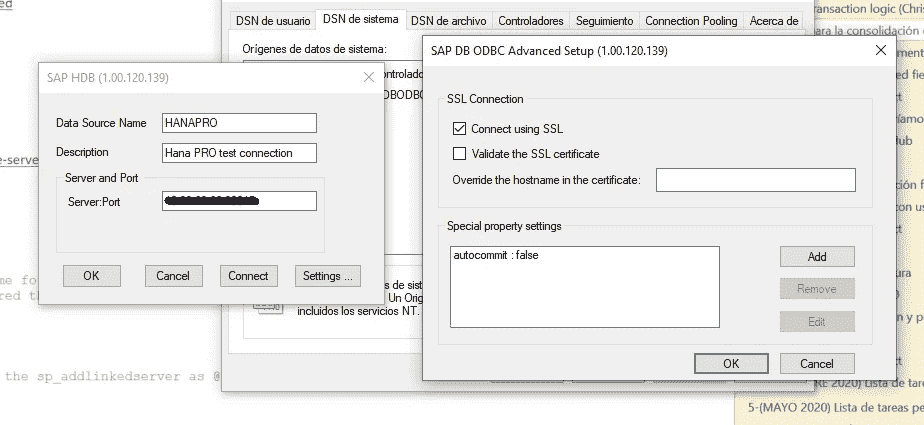

# 为什么应该存储数据管道的自定义日志，以及如何使用它们构建数据目录

> 原文：<https://towardsdatascience.com/why-you-should-store-custom-logs-of-your-data-pipelines-and-how-to-build-a-data-catalog-with-them-ee96a99a1c96?source=collection_archive---------14----------------------->

## 如何使用 Azure Data Factory、Databricks 和 SQL Server 实现这一点的分步指南。


[Unsplash 的 Sunder Muthukumaran](https://unsplash.com/photos/n7eJHQwefeI)

```
“An ounce of prevention is worth a pound of cure.”   
  ― **Benjamin Franklin**
```

**简介**

在 Azure Data Factory 的 [Monitor 选项卡中，可以看到许多关于所有执行状态的信息。这是一种简单且图形化的方法来检查某个东西是否失败以及失败的原因。](https://docs.microsoft.com/en-us/azure/data-factory/monitor-visually)

显然，当管道没有问题，但数据有问题时，问题就来了( *EX* : *Delta 数据比平时少，巨大的结构变化……*)。这种类型的信息不能仅通过监控您的管道来获得。这就是为什么有必要构建一个特定的监控系统来存储每个执行的特定信息。

## 为什么您的数据管道需要定制日志？

*   **故障排除**。您可以跟踪表的问题是何时开始的，并复制环境来研究问题。
*   **统计**。能够用简单的 SQL 查询解决关于元存储的问题:每天处理多少行？你的桌子有多大？你每小时执行多少工作？
*   **监控**。您可以很容易地看到所有执行的状态，或者您可以实现 [Cron jobs](https://en.wikipedia.org/wiki/Cron) 来持续监控几个指标，以便发出警报。
*   **数据质量检测**使用简单的指标(表时间戳、行数、结构变化……)。

## 记录表的结构示例:

```
CREATE TABLE logs.EXAMPLE_LOG_TABLE (ID bigint IDENTITY(1,1) NOT NULL,ID_TRACK_PROCESSING bigint NOT NULL,TABLE_NAME nvarchar(MAX) COLLATE SQL_Latin1_General_CP1_CI_AS NOT NULL,SCHEMA_NAME nvarchar(50) COLLATE SQL_Latin1_General_CP1_CI_AS NOT NULL,PRIMARY_KEYS nvarchar(MAX) COLLATE SQL_Latin1_General_CP1_CI_AS NULL,STATUS nvarchar(10) COLLATE SQL_Latin1_General_CP1_CI_AS NOT NULL,TIME_TAKEN bigint NOT NULL,RUN_DT datetime NOT NULL,CREATED_BY_ID nvarchar(50) COLLATE SQL_Latin1_General_CP1_CI_AS NOT NULL,CREATED_TS datetime NOT NULL,DATABRICKS_JOB_URL nvarchar(MAX) COLLATE SQL_Latin1_General_CP1_CI_AS NULL,DATAFACTORY_PIPELINE_URL nvarchar(MAX) COLLATE SQL_Latin1_General_CP1_CI_AS NULL,LAST_DSTS nvarchar(20) COLLATE SQL_Latin1_General_CP1_CI_AS NULL,LIVE_ROWS nvarchar(100) COLLATE SQL_Latin1_General_CP1_CI_AS NULL,REPLICATION_ROWS nvarchar(20) COLLATE SQL_Latin1_General_CP1_CI_AS NULL,DELTA_VERSION nvarchar(10) COLLATE SQL_Latin1_General_CP1_CI_AS NULL,COLUMNS nvarchar(MAX) COLLATE SQL_Latin1_General_CP1_CI_AS NULL,**CONSTRAINT** PK__EX_LOG__YYY432 PRIMARY KEY (ID))
```

*   **ID** :日志的 ID。这将是一个自动生成的值(参见*约束*)。
*   **ID_TRACK_PROCESSING** :触发作业执行的摄取表的 ID(在 TRACK_PROCESSING 表中)。
*   **模式名&表名**:被插入/处理的表的模式和表名。
*   **PRIMARY_KEYS** :如果表格有主键，并且这些主键正被用于执行合并。
*   **状态**:流程状态(成功或失败)。
*   **RUN_DT** :作业开始时的时间戳。
*   **耗时**:工作完成所需的时间。
*   **CREATED_BY_ID** :标识创建日志的工具(在我们的例子中是 *Azure 数据工厂*)。
*   **CREATED_TS** :日志创建时的时间戳。
*   **DATABRICKS_JOB_URL** : URL，在其中可以找到执行的每一步的代码和阶段。
*   **DATAFACTORY_JOB_URL** :标识作业已完成的 *ADF* 管道的 URL。
*   **LAST_DSTS** :表格的最新时间戳。
*   **LIVE_ROWS** :作业执行后表格的行数。
*   **REPLICATION_ROWS** :最近一次执行中插入/处理的行数(如果满载，将等于 LIVE_ROWS)。
*   **DELTA_VERSION** : [数据块摄取作业后表格的 DELTA 版本](https://databricks.com/blog/2017/10/25/databricks-delta-a-unified-management-system-for-real-time-big-data.html)。
*   **列**:摄取作业后表格的结构(列名和类型)。

**您可以使用任何您认为对您的用例有用的字段。我选择的字段是我的上下文中需要的字段。**

## 如何生成日志

每个数据作业都应该生成关于它刚刚完成的过程的元数据。按照我的另一篇文章中描述的例子:

[](https://medium.com/@ivangomezarnedo/how-to-orchestrate-databricks-jobs-from-azure-data-factory-using-databricks-rest-api-4d5e8c577581) [## 如何使用 Databricks REST API 编排 Azure 数据工厂中的 Databricks 作业

### 比使用 Azure Data Factory 官方 Databricks 笔记本更好(也更便宜)的控制工作的方式…

medium.com](https://medium.com/@ivangomezarnedo/how-to-orchestrate-databricks-jobs-from-azure-data-factory-using-databricks-rest-api-4d5e8c577581) 

**(图片作者)**红色表示写日志的活动。

一旦作业被标识为完成(成功或失败)，将执行一个活动，该活动将从执行中收集数据并将其写入相应的日志表(日志生成):



**(图片由作者提供)**确保在重试策略中使用较高的数字，以确保活动将被执行

**使用的查询:**

```
INSERT INTO logs.EXAMPLE_LOG_TABLE
(ID_TRACK_PROCESSING, TABLE_NAME, SCHEMA_NAME, PRIMARY_KEYS, STATUS, TIME_TAKEN, RUN_DT, CREATED_BY_ID, CREATED_TS, DATABRICKS_JOB_URL, DATAFACTORY_PIPELINE_URL, LAST_DSTS, LIVE_ROWS, REPLICATION_ROWS, DELTA_VERSION, COLUMNS)
 VALUES(
**-- Data from the table that triggers the execution.**
  @{item().ID},
 '@{item().TABLE_NAME}',
 '@{item().SCHEMA_NAME}',
 '@{item().PRIMARY_KEY}',
 'SUCCESS',
**-- Statistics and metadata of the execution.**
@{activity('Check job status').output.metadata.execution_duration}/1000,
 DATEADD(SECOND , -@{activity('Check job status').output.metadata.execution_duration}/1000,CURRENT_TIMESTAMP),
 'AZURE DATA FACTORY',
 CURRENT_TIMESTAMP, 
'@{activity('Check job status').output.metadata.run_page_url}',
 '[https://adf.azure.com/monitoring/pipelineruns/@{pipeline().RunId}...',](https://adf.azure.com/monitoring/pipelineruns/@{pipeline().RunId}?factory=%2Fsubscriptions%2Ff772839c-a925-4576-80fc-b8cb60966326%2FresourceGroups%2FRG_EDL_COREDLZ_01_PROD%2Fproviders%2FMicrosoft.DataFactory%2Ffactories%2Fedlproddlzadf01',)
**-- Output from the execution.**
'@{split(activity('Check job status').output.notebook_output.result,'|')[0]}', --Table timestamp
'@{split(activity('Check job status').output.notebook_output.result,'|')[1]}', --Table nº of rows
'@{split(activity('Check job status').output.notebook_output.result,'|')[2]}', --Rows ingested/updated in the job
'@{split(activity('Check job status').output.notebook_output.result,'|')[3]}', --Databricks Delta version.
'@{split(activity('Check job status').output.notebook_output.result,'|')[4]}' --Schema of the table.
); SELECT 1+1
```

日志由以下内容生成:

*   **触发执行的表中的数据。**
*   **统计和元数据的执行。**
*   **从执行中输出。**

为了从执行中提取输出，由于*数据块*被用作核心处理工具，数据作业中执行的最新命令将是:

```
dbutils.notebook.exit(string)
```

并非所有的进程都必须向同一个日志表中写入新条目，不同的进程可能有不同的需求，并且可能需要在其日志表中存储不同的信息。如果您想将所有日志写到同一个表中，那么一个好的选择是添加一个新字段来标识生成它们的进程。

# 使用日志创建数据目录

```
“Simplicity is a great virtue but it requires hard work to achieve it and education to appreciate it. And to make matters worse: complexity sells better.”
― **Edsger Wybe Dijkstra**
```

**这里建立的数据目录是一个简单的解决方案，并不意味着要取代一个更完整的解决方案( *EX* :** [**Linkedin 数据中心**](https://datahubproject.io/) **)，但在大多数情况下，这已经足够了。**

一旦我们在日志表中有了足够多的条目，我们就可以创建一个视图来使用这些信息，并生成一个包含元存储完整快照的“数据目录”。

**好处**:

*   不要重新发明轮子:已经用于其他目的(故障排除、统计……)的东西将被重新用于创建数据目录。
*   当一个视图被使用时，“数据目录”将总是尽可能地更新，并且不需要其他管道/过程。

```
CREATE VIEW logs.all_tables_data_catalog AS
SELECT id,
       schema_name,
       table_name,
       status ,
       time_taken ,
       created_ts ,
       databricks_job_url ,
       datafactory_pipeline_url,
       'SAP_INGESTION' AS type,
       last_dsts ,
       columns,
       *Cast*(live_rows AS *DECIMAL*) AS "LIVE_ROWS",
       delta_version
FROM   (
                SELECT   *,
                         Row_number() OVER (partition BY table_name, schema_name ORDER BY created_ts DESC ) AS row_no
                FROM     [logs].[SAP_INGESTION_LOG_TABLE]
                WHERE    status ='SUCCESS') logs_SAP
WHERE  row_no=1
UNION
SELECT id,
       schema_name,
       table_name ,
       status ,
       time_taken_copy+time_taken_merge AS "TIME_TAKEN" ,
       created_ts ,
       databricks_job_url ,
       datafactory_pipeline_url,
       'MYSQL_INGESTION' AS type,
       last_dsts,
       columns,
       *Cast*(live_rows AS *DECIMAL*) AS "LIVE_ROWS",
       delta_version
FROM   (
                SELECT   *,
                         **Row_number**() OVER (partition BY table_name, schema_name ORDER BY created_ts DESC ) AS row_no
                FROM     [logs].[MYSQL_INGESTION_LOG_TABLE]
                WHERE    status ='SUCCESS') logs_MYSQL
WHERE  row_no=1
UNION
SELECT id,
       schema_name,
       table_name ,
       status ,
       time_taken ,
       created_ts ,
       databricks_job_url ,
       datafactory_pipeline_url,
       'ORACLE_INGESTION' AS type,
       last_dsts,
       columns,
       *Cast*(live_rows AS *DECIMAL*) AS "LIVE_ROWS",
       delta_version
FROM   (
                SELECT   *,
                         **Row_number**() OVER (partition BY table_name, schema_name ORDER BY created_ts DESC ) AS row_no
                FROM     [logs].[ORACLE_INGESTION_LOG_TABLE]
                WHERE    status ='SUCCESS') logs_HANA
WHERE  row_no=1
where  status ='SUCCESS') x WHERE row_no=1
```

从每个日志表中只选择公共字段(只能对相同数量的列执行 union)，只搜索成功的摄取，并使用 r *ow_number 窗口函数*提取每个表的最新日志(由其模式和名称标识)。

这为用户提供了一种方法来检查元存储中的每个表，其中包括:

*   表的结构(列名和类型)。
*   上次更新的时间。
*   表行的最新时间戳(可能表加载成功，但数据已经过期)。
*   行数。

它还可以用来轻松检测整个元存储中的数据质量问题。

这个视图可以在不同的仪表板中使用，这些仪表板可以向用户显示相同的信息，但是以一种更“*美化*的方式。这个简单的“数据目录”可以解决大部分考虑购买第三方数据目录解决方案的团队的需求。

## 如果您的日志表在不同的数据库实例中会怎样？

如果您想要在“数据目录”中显示的数据在不同的系统中(*例如* : SQL Server、Azure SQL 和 HANA)，您可以使用 [SQL Server 链接服务器](https://docs.microsoft.com/en-us/sql/relational-databases/linked-servers/create-linked-servers-sql-server-database-engine?view=sql-server-ver15)查询其他系统，就好像它们的表属于第一个系统一样。

**好处**:

*   避免不必要的数据移动，因为数据是直接从源系统查询的。
*   数据总是尽可能地更新(因为没有使用源表的快照，而是查询活动表)。
*   在网络受限或需要查询大量外部资源的情况下，可以实现类似于[物化视图](https://docs.microsoft.com/en-us/sql/t-sql/statements/create-materialized-view-as-select-transact-sql?view=azure-sqldw-latest)的东西，但是显示的数据可能不是最新的。

**SQL Server 与 HANA 的连接:**

[](https://komport.medium.com/if-you-need-access-you-data-stored-in-sap-hana-database-from-mssql-database-server-you-can-add-877e8793acf7) [## 将您的 SAP HANA 数据库添加为 MSSQL Server 链接服务器。

### 如果您需要从 MSSQL 数据库服务器访问存储在 SAP HANA 数据库中的数据，您可以添加…

komport.medium.com](https://komport.medium.com/if-you-need-access-you-data-stored-in-sap-hana-database-from-mssql-database-server-you-can-add-877e8793acf7) 

首先[从 SAP 官方网站](https://help.sap.com/viewer/647582cc310341319e6e8d6f23f1f230/2.00.2.0/en-US/63ee40091a1847b886e3bcfe71ecb91a.html)下载必要的 ODBC 驱动，然后按照上一篇文章的步骤操作。在安装了 HANA 实例的机器上完成安装后，ODBC 将如下所示:



**作者图片**

链接服务器是使用 SQL Server 中的以下命令创建的:

```
EXEC sp_addlinkedserver@server='HANA_PRO', -- this is just a descriptive name@srvproduct='HANA1.0',  -- this is just a descriptive name@provider='MSDASQL',   -->This is a fixed value as this is the standard name for this type of provider connection@datasrc='HANAPRO';  -->Here needs the Data Source Name to be entered that was created beforeEXEC sp_addlinkedsrvlogin@useself = 'FALSE',@rmtsrvname = 'HANA_PRO',  -- You need to use the name that you have used in the sp_addlinkedserver as @server name@locallogin = NULL,@rmtuser = 'YOUR HANA USER',@rmtpassword = 'YOUR HANA PASSWORD';
```

在完成所有上述步骤后，通过在 SQL Server 中运行以下查询来执行系统之间的连接检查:

```
SELECT * FROM(SELECT *  FROM OPENQUERY([HANA_PRO],'SELECT * FROM LOGS.HANA_LOG_TABLE;')) a;
```

**SQL Server 与 Azure SQL 的连接:**

这是一个更简单的过程，因为不需要 ODBC:

[](https://www.sqlshack.com/create-linked-server-azure-sql-database/) [## 如何创建到 Azure SQL 数据库的链接服务器

### 2017 年 9 月 27 日通过链接服务器允许从另一个 SQL Server 或另一个数据源(如 Excel)访问数据…

www.sqlshack.com](https://www.sqlshack.com/create-linked-server-azure-sql-database/) 

最后，由于使用*链接的服务器*就像在 SQL Server 中添加其他 DB 系统作为新的 DB，视图的代码将与前面的非常相似(视图只从同一个 DB 实例中读取数据):

```
CREATE VIEW logs.all_tables_data_catalog
AS
  SELECT id,
         schema_name,
         table_name,
         status,
         time_taken,
         created_ts,
         databricks_job_url,
         datafactory_pipeline_url,
         'SAP_INGESTION'            AS TYPE,
         last_dsts,
         columns,
         *Cast*(live_rows AS *DECIMAL*) AS "LIVE_ROWS",
         delta_version
  FROM   (SELECT *,
                 Row_number()
                   OVER (
                     partition BY table_name, schema_name
                     ORDER BY created_ts DESC ) AS row_no
          FROM   **[logs].[sap_ingestion_log_table] -- Query to an internal table**
          WHERE  status = 'SUCCESS') sql_server_row_no
  WHERE  row_no = 1 
  UNION
  SELECT id,
         schema_name,
         table_name,
         status,
         time_taken_copy + time_taken_merge AS "TIME_TAKEN",
         created_ts,
         databricks_job_url,
         datafactory_pipeline_url,
         'MYSQL_INGESTION'                  AS TYPE,
         last_dsts,
         columns,
         *Cast*(live_rows AS *DECIMAL*)         AS "LIVE_ROWS",
         delta_version
  FROM   (SELECT *,
                 Row_number()
                   OVER (
                     partition BY table_name, schema_name
                     ORDER BY created_ts DESC ) AS row_no
          FROM   [**AZURE SQL (PROD)].[BD].[logs].[azure_sql_ingestion_log] -- Query to an external table in AZURE SQL.**
          WHERE  status = 'SUCCESS') azure_sql_row_no
  WHERE  row_no = 1
  UNION
  SELECT id,
         schema_name,
         table_name,
         status,
         time_taken,
         created_ts,
         databricks_job_url,
         datafactory_pipeline_url,
         type,
         last_dsts,
         columns,
         *Cast*(live_rows AS *DECIMAL*) AS "LIVE_ROWS",
         delta_version
  FROM   (SELECT *,
                 Row_number()
                   OVER (
                     partition BY table_name, schema_name
                     ORDER BY created_ts DESC ) AS row_no
          FROM   (SELECT *
                  FROM   ***Openquery*([hana_pro], 'SELECT ID,SCHEMA_NAME, TABLE_NAME,STATUS , TIME_TAKEN , CREATED_TS , DATABRICKS_JOB_URL ,DATAFACTORY_PIPELINE_URL, ''HANA_INGESTION'' as TYPE, LAST_DSTS ,COLUMNS, CAST(LIVE_ROWS as decimal) as "LIVE_ROWS", DELTA_VERSION, STATUS  FROM LOGS.HANA_INGESTION_LOG 
WHERE  STATUS= 'SUCCESS' ;') ) hana1) hana_row_no -- Query to an external table in HANA.**
  WHERE  row_no = 1*-- Note that the Row_function could be implemented directly in the source system being queried, but has been left as is for code clarity*.
```

## 结论

在本文中，我们看到:

*   为什么自定义日志是对数据管道的一个很好的补充。
*   如何在完成数据管道执行之前生成自定义日志。
*   创建数据目录的好处。
*   如何使用自定义日志创建数据目录。
*   如何在没有 ETL 的情况下组合来自不同源系统的日志？

尽管给出了关于如何使用某些工具开始创建定制日志的具体示例，但是该概念可以应用于其他编排器和其他处理工具。

仅此而已。我希望这对您有用，并且您不必像我一样花费时间。

感谢阅读。**你可以在**[**Linkedin**](https://www.linkedin.com/in/ivan-gomez-arnedo/)**上找到我。**

```
“The success formula: solve your own problems and freely share the solutions.”
― [**Naval Ravikant**](https://twitter.com/naval/status/1444741381579177984)
```