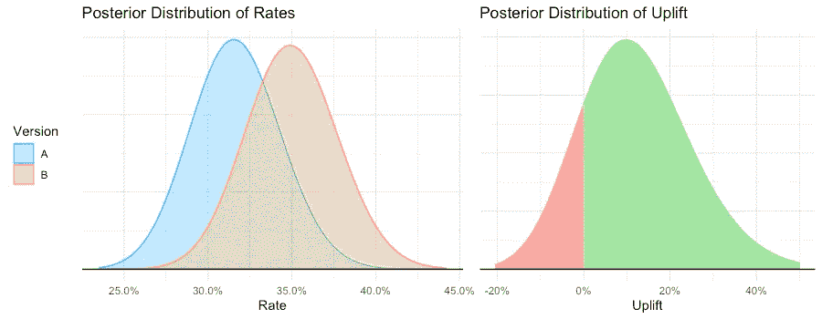
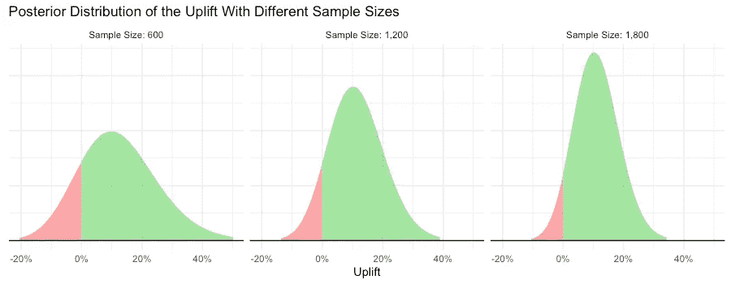

# 为什么你应该转向贝叶斯 A/B 测试

> 原文：<https://towardsdatascience.com/why-you-should-switch-to-bayesian-a-b-testing-364557e0af1a?source=collection_archive---------8----------------------->

## [实践教程](https://towardsdatascience.com/tagged/hands-on-tutorials)

## 当统计和商业使用同一种语言

# 什么是 A/B 测试？

几乎每个人都讨厌学习统计学(嗯，也许除了*的一些*统计学家)。由于我们需要记住所有这些分布和临界值，我们最终感到头疼。你可以发誓再也不碰这个话题；直到你不得不分析 A/B 测试。

A/B 测试是[随机控制试验](http://en.wikipedia.org/wiki/Randomized_controlled_trial)的“有趣”名称，我们将用户随机分配到两个(或更多)组，并测量每个组的指标( *KPI* )。例如，我们可以随机呈现给用户一个绿色的“立即购买！”按钮还是红色的，衡量一下其中一个的点击率(或者购买率)是否更高。

*作者图片*

最终，当我们分析两组之间的差异时，我们需要统计数据。当我们看到一个按钮表现更好的时候，我们无法知道这是“真实”的，还是只是偶然；因为即使颜色根本不影响点击率，我们也不期望各组的点击率*完全*相同。统计数据有助于我们区分这两种选择。

我们问 A/B 测试的问题是“哪个版本更好？”。如果你正在使用一个 [Frequentist](http://en.wikipedia.org/wiki/Frequentist_inference) 框架，当查看 P 值时，你将得到的答案是“嗯，如果按钮之间没有差异，那么看到像你这样的上升(或更极端)的概率是 *x%* ”。

第一次听到 P 值的定义时的典型反应。图片取自 [en.meming.world](https://en.meming.world/wiki/Confused_Nick_Young)

# 不一定要复杂

统计学没必要那么复杂。事实证明，一个可供选择的框架可以给我们以下答案:“绿色按钮更好的概率是 *y%* 。这就是你选择它的风险”。这个框架被称为[贝叶斯](http://en.wikipedia.org/wiki/Bayesian_inference)框架，它在在线行业中越来越受欢迎。

> 贝叶斯统计最重要的优点是可以理解

贝叶斯 A/B 测试结果的可视化。左图:利率的不确定性很容易想象(“曲线较高的地方更有可能出现**实际**利率”)。右图:B 获胜的*概率很容易理解(“绿色区域比红色区域大得多，但后者不可忽略”)。*作者图片。**

虽然这个框架有很多优点(也有一些缺点)，但我认为贝叶斯 A/B 测试最重要的优点是它是*可理解的*。它准确地回答了我们在不确定的情况下需要知道的问题:我们出错的可能性有多大，以及在这种情况下的风险有多大。

# 有什么区别？

简而言之，在频率主义者的框架中，我们假设有两个可供选择的世界:一个是红色和绿色按钮之间没有区别(*零假设*)，另一个是有区别的。我们假设我们生活在第一个世界中(*我们* ***假设*** *零假设是真的*)，并且我们想要用一定程度的确定性来反驳这一点(*显著性水平*)。如果我们无法证明呢？这并不一定意味着我们在第一世界(*一个无关紧要的结果并不能证明无效假设*)。

贝叶斯框架的观点完全不同。我们先说“*红色和绿色按钮的点击率可以是 0%到 100%之间的任何比率，机会均等*”(这就是我们所说的*先验*)。这意味着每个按钮最初有 50%的机会比另一个更好。随着我们开始收集数据，我们更新了我们的知识，我们可以说这样的话“*根据我观察到的数据，我现在认为有 70%的可能性绿色按钮更好*”。我们称这个*为后*。

A 和 b 之间上升的后验分布(比率之间的百分比差异)。样本大小从左到右增加。即使提升保持不变，样本量的增加也会使我们的结果更有信心。使用贝叶斯 A/B 测试，很容易传达这种信心。*图片作者。*

我喜欢贝叶斯框架是因为它包含了不确定性。在我看来，通常对频繁主义者推论的解释几乎是“确定性的”。在统计框架上这么说很搞笑，但是想想我们*解读*假设检验的方式——如果 P 值低于. 05，结果就是显著的(“真实”)；如果更高，那么结果“不是真实的”。但是现实生活*是*不确定的；我们不能只设定一个 0.05 的阈值，然后说“P 值告诉我们的”。贝叶斯框架包含了不确定性——并告诉你“有 95%的可能性绿色按钮更好——但有 5%的可能性不是。选择权在你”。

# 贝叶斯度量

有趣的是，至少在 A/B 测试环境中，这两种方法之间的大多数度量在数字上并没有太大的不同；然而，他们的解释完全不同。在频率主义方法中，我们有一个置信区间；匹配的贝叶斯度量是可信度区间。我个人认为“概率 B 更好”是 P 值的匹配度量:两者的计算非常相似，但它们的意义完全不同！

然而，贝叶斯 A/B 测试确实有一个在 frequentist 框架中没有可比性的度量:T4 风险。我们计算 A 和 B 的风险，它的解释是:“*如果我选择 B，而 B 实际上比 A 差，我会损失多少？*”。该指标也用作 A/B 测试中的决策规则。

与 P 值相比，这种风险有两大优势。首先，它的门槛是商业行话(“如果我错了，我愿意付出的代价是什么？”)，而频率主义者的显著性水平是统计学上的胡言乱语(“我愿意接受的 I 型错误率是多少？”).第二，与 P 值相比，它对顺序检查(“峰化”)更加稳健，因此在使用贝叶斯框架 时 ***不必预先确定样本大小。这也是贝叶斯 A/B 测试的一大优势。***

# 摘要

A/B 测试不一定要混淆。使用贝叶斯框架，我们可以准确地回答我们在需要做出决定时问自己的问题:“哪个版本更好，我错的可能性有多大，如果是这样，我将付出什么代价”。这个回答更具商业导向性，我们公司的任何同事都很容易理解，不管他们是什么角色或专业知识。

人是贝叶斯。我们问自己"*小鸡会过马路吗？*"，而不是"*我是在鸡不过马路的虚无现实中，还是在鸡至少有 95%把握过马路的替代现实中？*”。为什么要区别对待在线 A/B 测试？

# 参考

我真的试着在这篇文章中保持简单，不要太深入数学。如果你想(稍微)深入挖掘，我真的推荐这些帖子:

*   *[*贝氏 A/B 测试的力量*](https://medium.com/convoy-tech/the-power-of-bayesian-a-b-testing-f859d2219d5)*迈克尔·弗拉斯科著**
*   ***[*贝叶斯 A/B 测试——模拟实践探索*](/exploring-bayesian-a-b-testing-with-simulations-7500b4fc55bc)*布莱克·阿诺德****

## ***戏弄者***

***请继续关注我的下一篇文章，在那里我将描述我们如何在 Wix 实现贝叶斯 A/B 测试，在这里大规模的性能是至关重要的。***