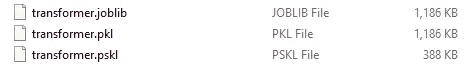

# 为什么应该使用 Piskle 导出您的 Scikit-Learn 模型

> 原文：<https://towardsdatascience.com/why-you-should-switch-to-piskle-for-exporting-your-scikit-learn-models-87028ad83ed?source=collection_archive---------60----------------------->

## 文件大小最多减少 2/3

*作者:* [*阿迈勒哈斯尼*](https://medium.com/u/d38873cbc5aa?source=post_page-----87028ad83ed--------------------------------)*&*[*Dhia Hmila*](https://medium.com/u/7f47bdb8b8c0?source=post_page-----87028ad83ed--------------------------------)


Jonathan Pielmayer 在 [Unsplash](https://unsplash.com/?utm_source=unsplash&utm_medium=referral&utm_content=creditCopyText) 上的照片

在训练阶段之后导出拟合的模型是每个数据科学项目的最后一个关键步骤。然而，同样重要的是，我们用来存储模型的方法并不是专门为数据科学设计的。

事实上，python 的 `pickle`或者我们经常在 `Scikit-learn`中使用的成熟的 `joblib`包，是通用的标准序列化方法，适用于任何 python 对象。因此，它们没有像我们希望的那样优化。

在这篇文章之后，您将看到我们在内存和时间效率方面可以做得更好。

## 目录

[什么是积少成多](#a882)
[什么是积少成多特殊](#c06b)
[如何使用积少成多](#b06a)
[支持的估算器(到目前为止)](#e4c0)
[效率明智的话，你应该对数字有什么期望](#e75e)

# piskle 是什么

`Piskle`是我们创建的 python 包，允许您以优化的方式序列化 Scikit-learn 的最终模型。如果你不熟悉这个术语，下面是维基百科对它的定义:

> 序列化是将数据结构或对象状态转换成可以存储或传输并在以后重新构建的格式的过程

如果您有大量的估算器要存储(可能是同一模型的更新版本)，或者如果您想将它存储在云上用于 web 应用程序或 API，这就特别有用。

如果你想知道命名的选择，`piskle`是`pickle`和`scikit-learn`的组合😉

# 是什么让 piskle 与众不同

Piskle 提供了足够高效地存储 Scikit-learn 模型(以及一般的 python 对象)的可能性，以便有选择地保留需要保留的部分。换句话说，像预测方法 一样，piskle 只存储某个动作使用的属性 ***。一旦模型被重新加载，这些是执行所需操作所必需的唯一属性。***

# 如何使用 piskle

要使用 `piskle`，首先需要使用以下命令进行 pip 安装:

```
pip install piskle
```

接下来您需要的是一个要导出的模型。你可以以此为例:

导出模型就像下面这样简单:

```
import pisklepiskle.dump(model, 'model.pskl')
```

加载它甚至更容易:

```
model = piskle.load('model.pskl')
```

如果想要更快的序列化，可以禁用 `optimize`特性。请注意，此功能进一步减小了导出文件的大小，并缩短了加载时间。

```
piskle.dump(model, 'model.pskl', optimize=False)
```

# 支持的估计量(到目前为止)

到目前为止，piskle 支持 **23 scikit-learn 估计器和变压器**。包含的模型已经使用最新版本的 Scikit-learn(目前为 0.24.0)进行了测试。你可以点击查看完整列表[。](https://github.com/hmiladhia/piskle)

# 就效率而言，你对数字有什么期望

为了展示 piskle 的潜力，我们可以进行一个简单的实验。我们将使用三种不同的方法导出同一个模型，并比较结果文件的大小。

在我们开始导出 scikit-learn 的模型之前，让我们首先获得一个足够大的数据集，我们可以用它来突出 piskle 的使用可以带来的不同。为了方便起见，我们将使用一个名为 `datasets`的 python 包，它允许您轻松下载 500 多个数据集。我们选择的数据集名为 [Amazon Us Reviews](https://huggingface.co/datasets/viewer/?dataset=amazon_us_reviews&config=Video_Games_v1_00) ，它具有我们可以与 TF-IDF 一起使用的文本属性，如下所示:

为了将 piskle 与 joblib 和 pickle 进行比较，我们使用这三个包导出我们的模型，并使用以下代码行观察结果文件:

以下是由此产生的三种文件大小的概述:



作者图片

```
+----------+----------+----------+
|  Pickle  |  Joblib  |  Piskle  |
+----------+----------+----------+
| 1186 KB  | 1186 KB  | 388 KB   |
+----------+----------+----------+
```

我们可以观察到，与 pickle 和 joblib 相比，使用 piskle 时文件大小显著减小:**文件大小增加了近 67%**。

💡请注意，我们可以对这三个包使用压缩算法来进一步优化。

# 最后的想法

Piskle 的诞生源于对一种有效方式的实际需求，这种方式可以为一个 [Web 应用](https://spot-language.herokuapp.com/)的创建导出一个 [scikit-learn 模型](/classification-model-for-source-code-programming-languages-40d1ab7243c2)。迄今为止，它已在测试的模型上证明了显著的效率，因此证明了它的高附加值。不要犹豫尝试一下，特别是如果您打算将模型存储在云上和/或您缺少空间的话。

由于 piskle 仍然是一项正在进行的工作，计划进行许多潜在的改进，我们将很高兴收到您的反馈和/或建议:

[链接到 GitHub 知识库](https://github.com/hmiladhia/piskle)

感谢您坚持到现在，也感谢您的关注。注意安全，我们将在下一篇文章中再见😊！