# 为什么您应该使用谷歌驱动和 Colab 来尝试 Rclone

> 原文：<https://towardsdatascience.com/why-you-should-try-rclone-with-google-drive-and-colab-753f3ec04ba1?source=collection_archive---------22----------------------->

## 如果你在 Google Colab 上从未丢失过你训练过的 ML 模型，那不是很好吗？克隆来救援了。


图片作者。

你有没有在 Google Colab 上开始训练一个机器学习模型，而运行时在你保存结果之前断开连接？这种事过去常常发生在我身上，我会感到沮丧。我会离开我的模型训练，几个小时后回来，发现它没有保存就完成了！

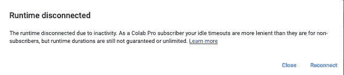

图片作者。

那么你对此能做些什么呢？将 Rclone、Google Drive 和 Google Colab 与以下三个主要步骤结合使用:

**1)安装 Rclone。**

***2)配置 Rclone。***

***3)用 Rclone 导出。***

# **第一步。安装 Rclone。**

在你的 Google Colab Jupyter 笔记本的第一个单元格中这样做。

```
! curl https://rclone.org/install.sh | sudo bash
```

# 第二步。配置 Rclone。

配置新安装的 Rclone。

```
!rclone config
```

## **步骤 2.1。制作新遥控器**

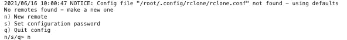

## 步骤 2.2。将其命名为“远程”


## 第 2.3 步。为 Google Drive 输入“15”

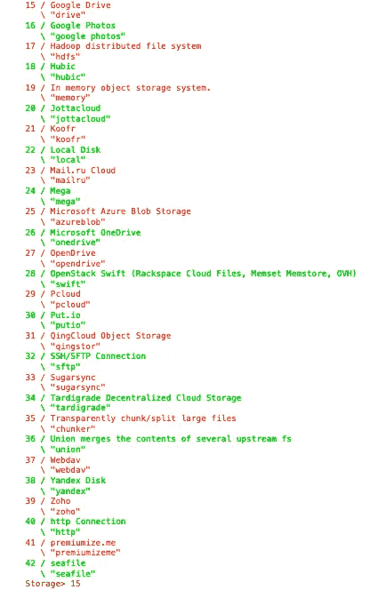

## 第 2.4 步。在客户端 id 上按 Enter 键作为默认值

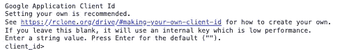

## 第 2.5 步。对于 client_secret 的默认值，请按 Enter 键

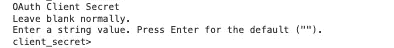

## 第 2.6 步。输入“1”可完全访问 Google Drive 上的所有文件。

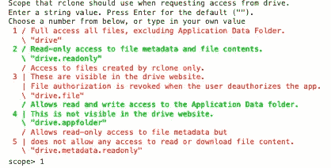

## 第 2.7 步。按 Enter 键作为 root_folder_id 的默认值。

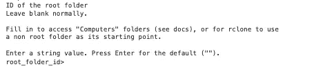

## 第 2.8 步。在 service_account_file 上按 Enter 键获得默认值。

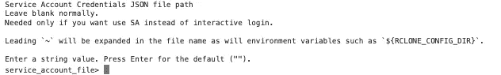

## 第 2.9 步。输入“n”作为高级配置的默认值。

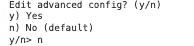

## 第 2.10 步。输入“n”表示远程配置上的非默认设置。

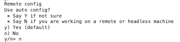

转到它为您生成的链接。

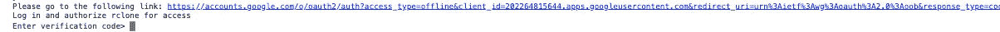

从您的 Google Drive 中复制代码，登录以访问 Rclone。

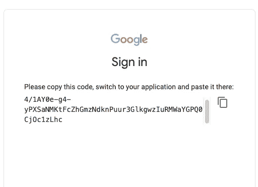

粘贴到它告诉你输入验证码的地方

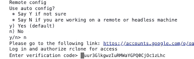

## 步骤 2.11。输入“n”作为共享驱动器上的默认值。

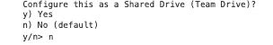

## 步骤 2.12。输入“y”作为远程设置的默认值。

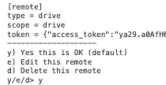

## 步骤 2.13。输入“q”退出配置。

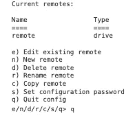

# 第三步。使用 Rclone 导出。

在模型完成训练后添加导出。

通过我们刚刚建立的 Rclone 远程路径，将 Google Colab 中当前的“/content/”目录复制到 Google Drive 中您想要的任何位置。

```
!rclone copy "/content/"  remote:"/YOUR_PATH_TO_GDRIVE_DESIRED_LOCATION/"
```

# 摘要

因此，在完成上述 3 个主要步骤后，你应该能够用 Google Colab 备份你正在训练的任何模型(假设它们已经完成)。

这里有一个例子 [Jupyter Notebook](https://nbviewer.jupyter.org/github/stevensmiley1989/TensorFlow_Examples/blob/main/TF_TimeSeries_Custom_TFDataset/TF_TimeSeries_Custom_TFDataset.ipynb) 从头到尾实现了这些步骤。

举个例子，你可以看到我的 Google Drive 在*内容*下存储了训练好的模型:

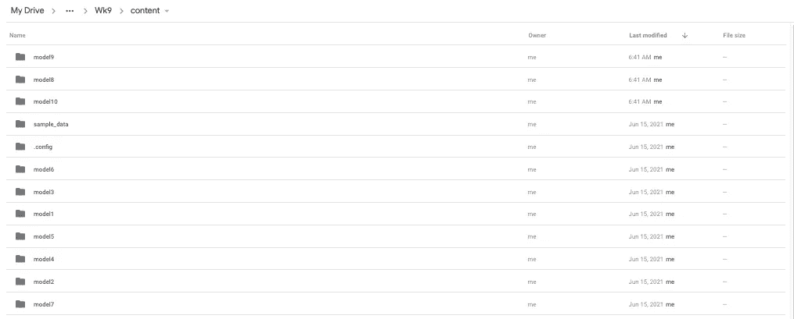

图片作者。

你可以在我为各种 TensorFlow 机器学习问题笔记本做的这个 [Github 资源库](https://github.com/stevensmiley1989/TensorFlow_Examples)里找到更多例子。

我希望这篇文章对你有帮助！谢谢你的阅读，如果喜欢就点击。请关注我，更多基于机器学习的内容即将推出！

你也可以在 LinkedIn 上关注我:[https://www.linkedin.com/in/stevensmiley1989/](https://www.linkedin.com/in/stevensmiley1989/)

# 参考

1.  Rclone。https://rclone.org/
2.  谷歌驱动。https://g.co/kgs/qu7aAY
3.  谷歌 Colab。https://colab.research.google.com/
4.  张量流。马丁·阿巴迪、阿希什·阿加瓦尔、保罗·巴勒姆、尤金·布莱夫多、陈质枫、克雷格·西特罗、格雷格·科拉多、安迪·戴维斯、杰弗里·迪恩、马蒂厄·德文、桑杰·格玛瓦特、伊恩·古德菲勒、安德鲁·哈普、杰弗里·欧文、迈克尔·伊萨德、拉斐尔·约泽福维茨、杨青·贾、卢卡斯·凯泽、曼朱纳斯·库德鲁尔、乔希·莱文伯格、丹·曼内、迈克·舒斯特、拉杰特·蒙加、雪莉·穆尔、德里克·默里、克里斯·奥拉、黄邦贤·施伦斯、伯努瓦·施泰纳 TensorFlow:异构系统上的大规模机器学习，2015。tensorflow.org[公司](http://tensorflow.org)提供的软件。