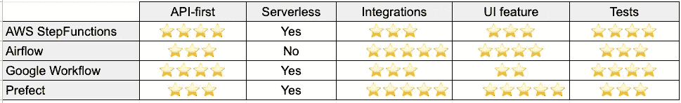

# 为什么您应该尝试使用气流以外的方式来进行数据管道编排

> 原文：<https://towardsdatascience.com/why-you-should-try-something-else-than-airflow-for-data-pipeline-orchestration-7a0a2c91c341?source=collection_archive---------4----------------------->

## 下面我们来评价一下气流旁边的 [AWS step 函数](https://aws.amazon.com/step-functions/)、 [Google workflows](https://cloud.google.com/workflows) 、[提督](https://www.prefect.io/)。

范【数码影像】作者 rajat sarki，

虽然就使用和社区规模而言，Airflow 作为一种数据编排管道占据了市场主导地位，但它已经相当陈旧，最初的设计并不能满足我们今天的一些需求。Airflow 仍然是一个很棒的产品，但本文的目标是提高对替代产品的认识，以及对于您的数据用例，什么是完美的编排工具。下面我们来评价一下气流旁边的 [AWS 步骤功能](https://aws.amazon.com/step-functions/)、 [Google workflows](https://cloud.google.com/workflows) 、[提督](https://www.prefect.io/)。

那么，如今好的数据编制工具的标准是什么呢？

# API-第一设计⚙

由于云提供商是 API 优先的，所以您希望您的编排工具是相同的。理想情况下，您希望能够通过 API 完成几件事情:

*   创建/删除工作流
*   非静态/不断发展的工作流的简单 DAG 序列化和反序列化。
*   运行参数化工作流
*   处理访问管理
*   通过 IaC 框架(Terraform/Pulumi)部署编排工具(如果不是无服务器的话)

所有这些特性将使您能够连接到所有现有的云服务，同时最大限度地利用事件驱动管道。

Airflow DAGs 的创建是非常静态的，与其他工具相比，API 仍然非常有限。虽然您可以有一个策略来自动化 Dag 的部署，但是您仍然需要在最后生成一个静态文件。

提督似乎没有完全适应动态 dag 创建，并有一点相同的模式，为 DAG 创建气流，见问题[这里](https://github.com/PrefectHQ/prefect/discussions/3772)。

# 无服务器&运行时☁️的关注点分离

无服务器总是有一个悖论。一方面，我们不想管理服务，而更愿意关注我们的用例。另一方面，当出现问题或我们需要定制功能时，这是一个黑盒地狱。

然而，在过去管理一个 Airflow 集群是一件痛苦的事情，Kubernetes 借助 Airflow v2 解决了许多问题。但是，我们不应该低估 Kubernetes 集群的维护成本。除此之外，您还需要添加一些东西来确保它能够顺利工作，例如，认证、秘密管理和 K8s 集群的监控。使用您所在的云提供商提供的无服务器编排工具，这是非常平滑和内置的。使用 Kubernetes 集群，您可以独自维护或启用这些功能。

无服务器 orchestrator 工具的另一个特点是，您必须清楚地分离关注点，并且只将它用于编排任务，而不是实际运行它们。有气流的一个危险路径就是把它当运行时。同样，Kubernetes 在解决这个问题上帮了很大的忙(参见本文[这里](https://medium.com/bluecore-engineering/were-all-using-airflow-wrong-and-how-to-fix-it-a56f14cb0753))，但这仍然是在您的集群上，维护依赖于您已经部署的监控这个集群的工具。

# 整合能力⛓

你想触发什么？有没有什么“连接器”可以让你在没有任何自定义层的情况下触发目标运行时？

气流有很多运营商。如果你没有找到你所需要的，你可以随时建立你自己的。提督也有一个很好的[集成列表](https://docs.prefect.io/api/latest/tasks/airtable.html#writeairtablerow)。

步骤功能[有几个与 AWS 服务的集成](https://docs.aws.amazon.com/step-functions/latest/dg/concepts-service-integrations.html)，甚至提供同步作业或等待回调。

谷歌工作流也开始添加与 GCP 服务的连接器。

# 用户界面功能🔮

当运行复杂的工作流时，有一个清晰的地方来观察哪里出错并快速采取行动是非常重要的。

您还想轻松地回滚或重试特定的任务/子任务，尤其是在数据管道环境中。请注意，最佳实践应该使您的数据幂等。

然而，如今，管道仪表板甚至还不够。问题是您可能有一个无声的失败，并且您可能需要在一个中心工具中输入其他警报/信息。例如，您有一个总是丢弃任何不符合模式的数据的管道。在这种情况下，您需要另一个监控工具，比如用于数据可观察性的数据质量工具。

# 测试🏗

作为开发人员，您希望有一种简单的方法来测试您的管道，并且开发周期尽可能短。乍一想，我们可能会认为可以在任何地方运行的数据编制器(如 airflow/Prefect)会提供最佳和流畅的测试体验，对吗？不尽然，因为在本地运行它们可能会折磨你的笔记本电脑的 CPU，增加你的风扇产生疯狂的气流😏).

使用 managed Airflow(AWS/astronomy ),您可以出于开发原因动态创建 air flow 实例(并通过代码使其自动化),但启动时间是不可忽略的。是的，对于一个开发者来说，哪怕一两分钟都是一生。

因此，最终，如果您利用 IaC 框架，拥有像 AWS Step 函数/工作流这样的完整无服务器编排器将使您能够快速测试您的管道。此外，您是在目标环境中直接测试它，几乎没有副作用。

请注意，AWS 提供了一个用于测试目的的阶跃函数仿真器[，这里是](https://docs.aws.amazon.com/step-functions/latest/dg/sfn-local.html)。

# 总之，还是放点星星吧！🌟

这个表只是一个高层次的评价。当然，您应该考虑其他因素，如您团队的当前知识、您现有的基础架构，并制定您自己的基准！虽然我真的很喜欢并且一直是(并且仍然是)Airflow 的长期用户，但我必须说，我对大多数新用例的首选是 AWS 步骤功能/ GCP 工作流，具体取决于用例。

[Dagster](https://dagster.io/) 是另一个值得考虑的好工具，但是我没有这方面的经验，而且因为他们不提供云托管版本(虽然根据他们的网站，这正在进行中)，我没有花时间去投资它。

# 迈赫迪·瓦扎又名迈赫迪欧·🧢

感谢阅读！🤗 🙌如果你喜欢这个，**跟随我上**🎥 [**Youtube**](https://www.youtube.com/channel/UCiZxJB0xWfPBE2omVZeWPpQ) ，✍️ [**中型**](https://medium.com/@mehdio) ，或者🔗 [**LinkedIn**](https://linkedin.com/in/mehd-io/) 了解更多数据/代码内容！

**支持我写作** ✍️通过加入媒介通过这个[**链接**](https://mehdio.medium.com/membership)