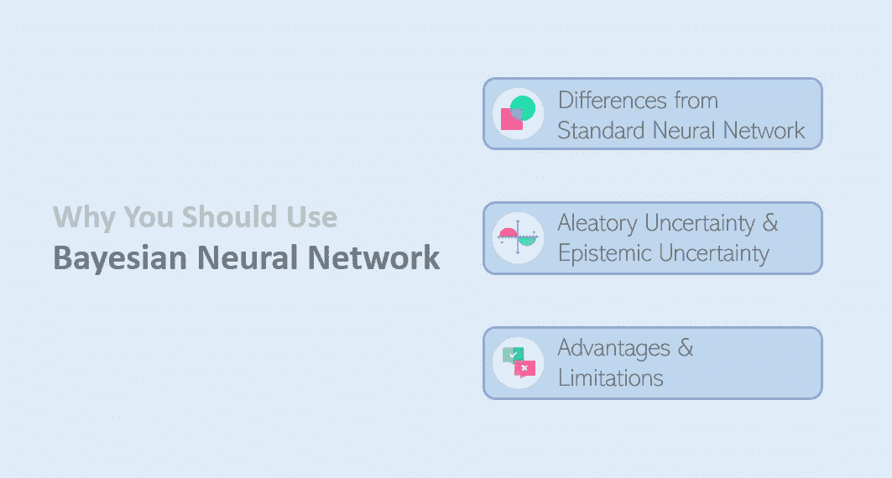
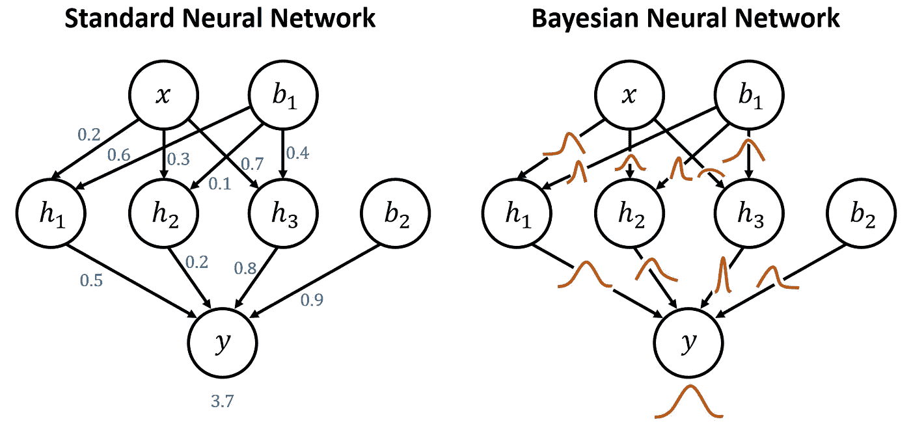
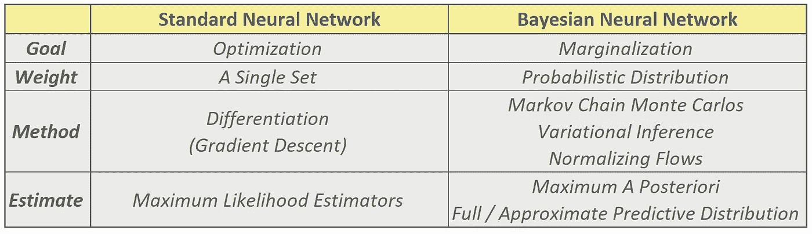
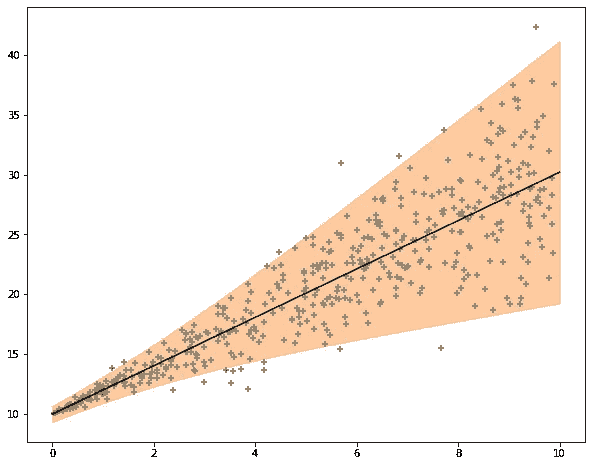
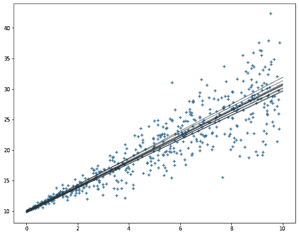

# 为什么应该使用贝叶斯神经网络

> 原文：<https://towardsdatascience.com/why-you-should-use-bayesian-neural-network-aaf76732c150?source=collection_archive---------1----------------------->

## 贝叶斯神经网络解释了模型中的不确定性，并提供了权重和输出的分布。

照片由 [cyda](http://blog.cyda.hk/)

# 目标

本文旨在帮助那些对贝叶斯神经网络没有经验的人，并用于以下目的:

1.  举例说明标准神经网络和贝叶斯神经网络之间的**关键差异**
2.  解释不同类型的**不确定性**
3.  讨论贝叶斯神经网络的**优势**和**局限**

# 什么是贝叶斯神经网络？

贝叶斯神经网络(BNN)结合了神经网络和贝叶斯推理。简单地说，在 BNN，我们将权重和产出视为变量，我们正在寻找最适合数据的边际分布。BNN 的最终目标是量化模型在输出和权重方面引入的不确定性，以解释预测的可信度。

# 标准神经网络和贝叶斯神经网络的区别

对我来说，我认为贝叶斯神经网络是标准神经网络的扩展。下面，我总结了这两种神经网络之间的三个关键点。

照片由 [cyda](http://blog.cyda.hk/)

1.  **目标—** SNN 专注于**优化**，而 BNN 专注于**边缘化**。优化会找到一个最佳点来代表一个权重，而边缘化会将每个权重视为一个变量，并找到其分布。
2.  **估计—**SNN 的参数估计是**最大似然估计(MLE)** ，而 BNN 的估计是**最大后验概率(MAP)** 或**预测分布**。
3.  **方法—** 基本上，SNN 会用**微分**来寻找最优值，比如梯度下降。在 BNN，由于复杂的积分很难确定，科学家或研究人员总是依赖于**马尔可夫链蒙特卡罗(MCMC)** 、**变分推断**和**归一化流**这类技术。

cyda 拍摄的照片

# 运气不确定性和认知不确定性

所以现在你能够区分 SNN 和 BNN，并知道它们之间的区别。如前所述，BNN 用于衡量模型的不确定性。事实上，有两种不确定性。

**偶然的不确定性**

随机不确定性也称为统计不确定性。在统计学中，它代表每次运行相同实验(训练模型)时不同的未知量。在深度学习中，是指模型输出的不确定性。如下图所示，假设黑线是预测，橙色区域是偶然的不确定性。你可以把它当作预测的置信水平。换句话说，它告诉你你的预测结果有多有把握。如果间隔很小，实际值更有可能接近您的预测值。反之，如果区间较大，实际值可能与你的预测值有较大出入。

由 [cyda](http://blog.cyda.hk/) 拍摄

**认知的不确定性**

认知不确定性也称为系统不确定性。在深度学习中，认知不确定性是指模型权重的不确定性。如下图所示，每次我们训练模型时，权重可能会略有不同。这种变化实际上是认知的不确定性。

照片由 [cyda](http://blog.cyda.hk/)

# 贝叶斯神经网络的优势

通过使用贝叶斯神经网络，您可以受益于

**1。训练健壮模型**

BNN 不是只考虑一组重量，而是寻找重量的分布。通过迎合概率分布，它可以通过解决正则化属性来避免过拟合问题。

**2。获得预测区间**

BNN 模型提供了预测的全貌，允许您在处理未知目标时自动计算与您的预测相关的不确定性。

# 贝叶斯神经网络的局限性

尽管 BNN 在解决不确定性问题上是有用的，但有几个限制值得注意。

**1。要求数学&统计知识**

理解 BNN 背后的所有理论和公式不是一件容易的事情。你需要在统计分布方面有很强的背景，以便应用适当的先验和后验函数。

**2。更长的训练时间收敛**

由于模型架构要复杂得多(你可以想象 SNN 只训练一个点，而 BNN 在训练分布参数)，它需要长得多的时间来收敛训练。

# 结论

通过这篇文章，我希望你们对 BNN 有一个基本的了解，并对它如何工作以及为什么有用有了第一感觉。在下一篇文章中，我将解释 BNN 的细节和概念。敬请关注，希望你喜欢阅读这篇文章。=)

***现在，你可以在这里查看下一篇*******。****

* [## 关于贝叶斯神经网络你应该知道的 8 个术语

### 先验，后验，贝叶斯定理，负对数似然，KL 散度，替代，变分…

towardsdatascience.com](/8-terms-you-should-know-about-bayesian-neural-network-467a16266ea0)*