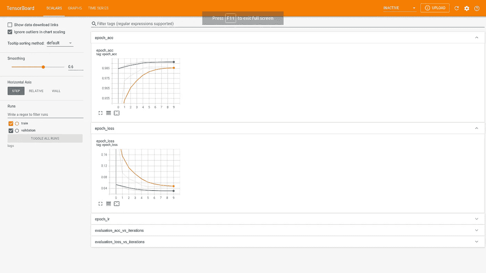

# 为什么应该在 TensorFlow 2 中使用回调

> 原文：<https://towardsdatascience.com/why-you-should-use-callbacks-in-tensorflow-2-a634e2c54465?source=collection_archive---------16----------------------->

## 定制你的深度神经网络训练-实用指南


约翰·施诺布里奇在 [Unsplash](https://unsplash.com?utm_source=medium&utm_medium=referral) 上的照片

当你想控制一个模型的训练时，回调是必不可少的。

而你*难道*想控制训练…

回调帮助我们防止过度拟合，可视化我们的训练进度，节省检查点等等。

# 张量流

但是为什么是 TensorFlow 呢？

TensorFlow 是世界上很多公司首选的深度学习 API。

由谷歌内部维护和大量使用，这是最先进的技术。

这一成功的原因之一无疑是其生态系统中可用的大量工具和库，使公司和个人能够轻松访问其产品和系统的研究和技术。

当然，它是一个 *Python 库*会有所帮助，因为 *Python* 是数据科学中最常用的编程语言。

今天我们来看看一个特别有用的工具。如果使用得当，它会让你的生活变得更加轻松。

# 建立模型

回调是您可以在模型训练中使用的函数。

例如，如果您希望基于高精度停止训练，或者当您的损失函数曲线开始变平时，可以使用它们。

在本文中，我不会过多关注实际的模型，而是看看我们如何通过回调来控制培训过程。

我假设读者知道如何在 TensorFlow 中构建一个简单的模型，因此我不会详细介绍代码。

让我们通过编写一个简单的 CNN 预测一些手写数字来热身。

让我们导入一些库并加载数据。我们将在这里使用 MNIST 数据集。

以上是非常标准的东西。我们加载(或多或少)原始数据，通过将所有像素值除以最大值 255 来对其进行整形和归一化。

请注意，当您将 NumPy 数组除以一个数字时，您会将所有条目除以该数字。

接下来，我们对目标进行一次热编码，这基本上意味着将数字 n 转换成一个向量，除了第 *n* 个条目外，其他地方都为零。

让我们来定义这个模型。

我不会详细介绍卷积神经网络，但这是一个非常标准的网络，它使用成对的 conv 池层，中间有一些脱落层以避免过度拟合。

在生成特征之后，它们被分别输入到具有 ReLu 和 Softmax 激活的密集神经网络中。

最后的 softmax 层输出对应于一位热码编码目标的 10 个值。

我们希望添加一个回调，而不仅仅是按原样训练模型。

# 复试

在 TensorFlow 中，回调有两种使用方式。我们可以使用现成的内置回调函数，也可以自己构建回调函数。

我将通过一些例子向您展示如何做到这两点。

## 学习率计划程序

假设我们想在训练中对学习速度有更多的控制。

我们知道，在追求使用梯度达到损失函数的最小值时，当我们足够接近时，我们可能会采取太宽的跳跃。

我们可以通过改变训练时的学习率来调整这些跳跃！

我们使用`tensorflow.keras.callbacks`中可用的 LearningRateScheduler 来实现。

看看下面的片段。

这样，我们在 3 个时期后调整学习率。

但是，我们仍然不知道什么时候能达到可接受的精度。如果我们想在达到 98%的准确率后停止训练呢？

## 自定义回拨

让我们为这个场景构建一个定制的回调类。

请注意，我已经将自定义回调添加到回调列表中，该列表现在包含两个回调。这完全没问题。

这段代码的输出如下。

非常好！

当使用自定义回调时，您可以指定在培训中您想要挖掘和更改的地方。

我们可以通过使用`on_train_begin`、`on_epoch_begin`、`on_epoch_end`、`on_train_end`等函数来实现。

## 提前停止

大多数情况下，我们没有特定的度量目标，而是希望避免过度拟合。

一种方法是使用内置的*提前停止*回调。你可以创建如下:`early_stopping = tf.keras.callbacks.EarlyStopping(patience=1)`例如，这在一般情况下非常方便。

## 模型检查点

使用早期停止回调是好的，但是如果退出训练前的最后一个时期打乱了我们在最后通过过度适应努力获得的重量，那就糟了。

这就是模型检查点发挥作用的地方。基本上，这个回调让您为每个时期保存一个模型版本，这样您就可以选择具有最高验证准确性的版本。

语法和其他的类似:`tf.keras.callbacks.ModelCheckpoint`。您需要知道您想要将保存的模型放在哪里，您可以使用 *filepath* 参数来指定。

例如，您可以这样做:

```
checkpoint = tf.keras.callbacks.ModelCheckpoint(filepath='model.{epoch:02d}-{val_loss:.2f}.h5')
```

将它保存在当前文件夹中。更明智的选择可能是将其保存在一个名为`checkpoints`的文件夹中。

## 张量板

我要展示的最后一个回调是 *TensorBoard* 。

TensorBoard 用于可视化您的训练进度，这在实验情况下非常方便。

如果你开始训练，然后从*终端*或 *cmd* 将 *cd* 你自己放入你的模型所在的文件夹，并输入:`tensorboard --logdir='logs'`，那么终端会引导你进入 [http://localhost:6006/](http://localhost:6006/#scalars) 。

在那里你会看到如下的训练进度。



作者图片

# 结论

如果您在阅读过程中忘记了编码，我在这里为您收集了代码:

注意，我们并不真正使用训练的输出，而是将它存储在*历史*中。欢迎您编码并保存模型，绘制度量标准等等。

回调比我在这里介绍的多得多，但我们必须在某个时候停下来。但这并不意味着它们不重要。

他们是！请看这里的。

## 总结

回调是一个强大的工具，用于定制和控制深度学习工具箱中的训练过程。

从基于一些定制逻辑的调试和停止训练到可视化，*回调*应该是每个数据科学家在建模和实验时最好的朋友。

喜欢在 Medium 上阅读像这样的文章？ [*获得会员资格*](https://kaspermuller.medium.com/membership) *获得完全权限。*

如果您有任何问题、意见或顾虑，请通过 LinkedIn 联系我:

<https://www.linkedin.com/in/kasper-m%C3%BCller-96ba95169/> 