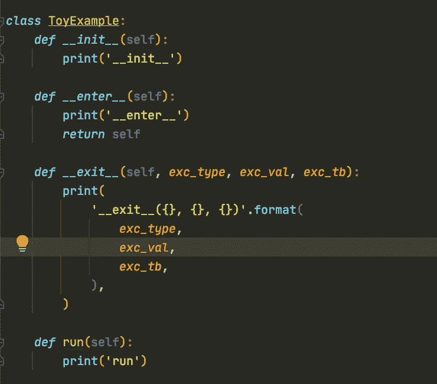
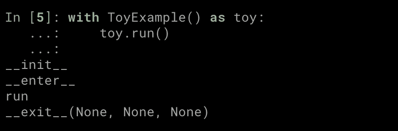
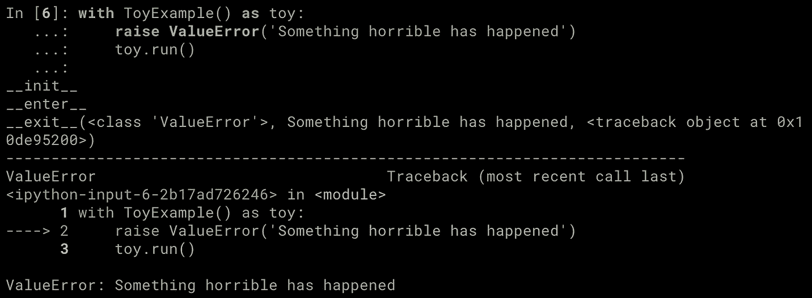
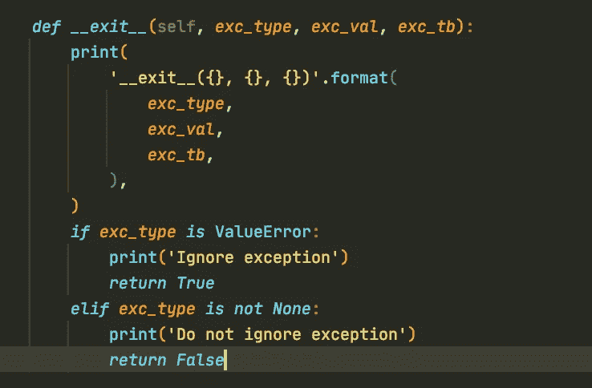
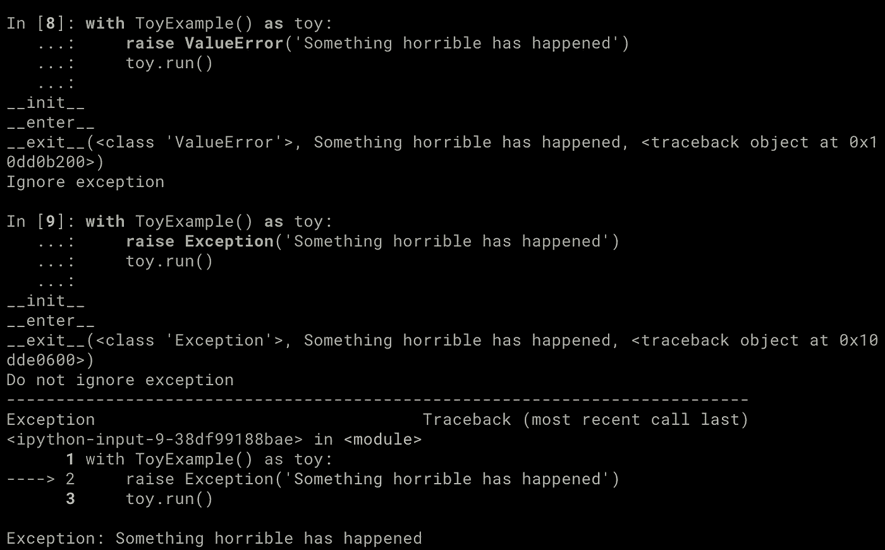
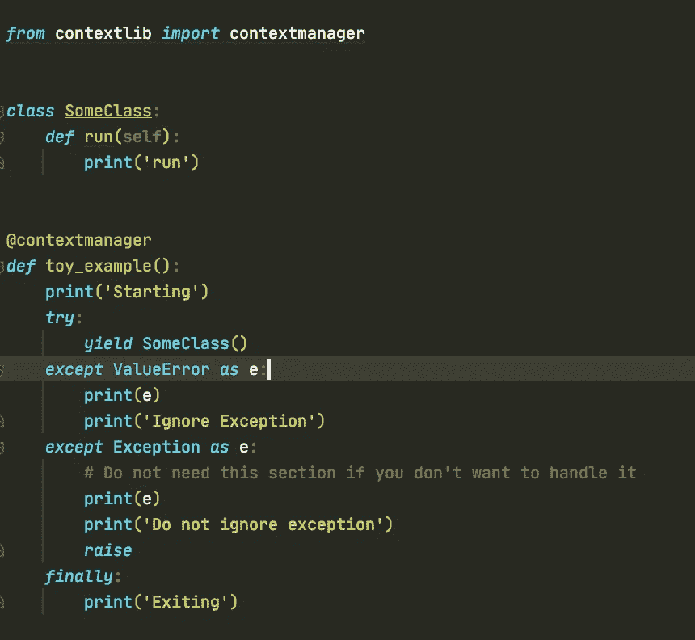
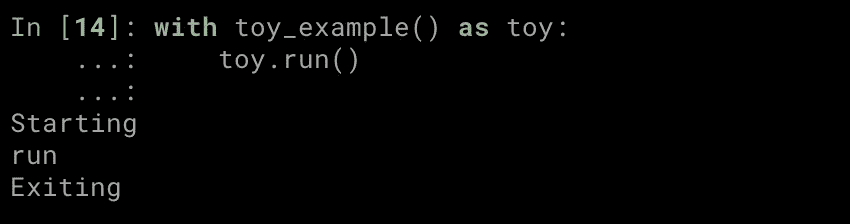
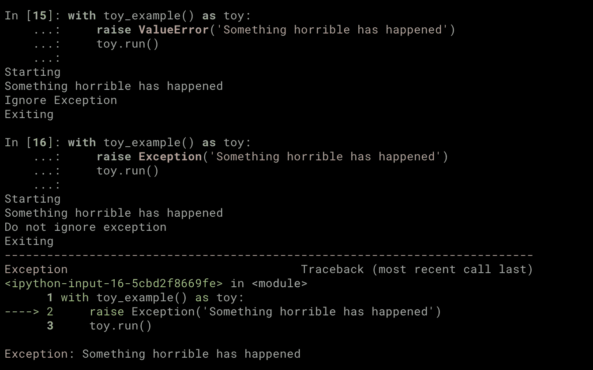

# 为什么应该在 Python 中使用上下文管理器

> 原文：<https://towardsdatascience.com/why-you-should-use-context-managers-in-python-4f10fe231206?source=collection_archive---------3----------------------->


图片由 [Anas Alshanti](https://unsplash.com/@anasalshanti?utm_source=unsplash&utm_medium=referral&utm_content=creditCopyText) 在 [Unsplash](https://unsplash.com/s/photos/code?utm_source=unsplash&utm_medium=referral&utm_content=creditCopyText) 上拍摄

# 什么是上下文管理器

如果您在 Python 中使用过`with`语句，那么您很可能已经使用过上下文管理器。

上下文管理器通常负责设置一些资源，例如打开一个连接，并在我们完成后自动处理清理工作。

可能，最常见的用例是打开一个文件。

```
**with open('/path/to/file.txt', 'r') as f**:
  for line in f:
    print(line)
```

上面的代码将打开文件，并保持打开状态，直到我们退出`with`语句。然后它会关闭它。整洁，对吗？

# 你为什么要在乎？

现在，你可以不用`with`打开一个文件，但是你必须自己清理。

```
f = open('/path/to/file.txt', 'r')
for line in f:
    print(line)
f.close()  # must remember to close f
```

除了这需要一行额外的代码之外，还有一些其他的缺点。也就是说，

*   很容易忘记关闭文件，
*   `f.close()`如果在代码的前面某处有异常，就不会被调用。

为了准确地复制使用`with`语句打开文件，我们需要更多的代码来确保即使在出现异常的情况下也能关闭文件。

```
f = open('/path/to/file.txt', 'r')try:
  for line in f:
    print(line)
finally:
  f.close()  # runs no matter what happens
```

你应该关心正确地关闭文件，因为，在其他事情中，如果你打开太多文件，你会得到一个`OSError`。

意识到什么是上下文管理器，可以帮助你决定如果你计划实现的东西被构造成上下文管理器的话，什么时候会更容易阅读和使用。让我们来学习如何实现它们！

# 如何实现上下文管理器

有两种方法可以实现上下文管理器。第一个是定义一个实现了`__enter__`和`__exit__`方法的类。第二种方法是创建一个生成器并使用`contextlib.contextmanager`装饰器。

## 定义类别

正如我们之前提到的，为了能够使用一个类作为上下文管理器，你需要实现`__enter__`和`__exit__`。



上下文管理器的玩具示例。图片由作者提供。

您会注意到，`__exit__`方法以`exc_type`、`exc_val`、`exc_tb`作为参数。这些用于传递关于发生在`with`语句中的潜在异常的信息。

好的，让我们看看当我们使用它时会发生什么。



使用上下文管理器。图片由作者提供。

首先，对象被实例化，然后调用`__enter__`方法。此时，我们在`with`语句内部。其中的任何代码都会被执行，在我们的例子中，它只是`toy.run()`。在运行完`with`中的所有代码后，调用`__exit___`方法。

让我们看看当出现异常时会发生什么。



发生异常时使用上下文管理器。图片由作者提供。

这次`toy.run()`没有运行，但是我们仍然进入`__exit__`，现在它的参数不是`None`，而是包含了关于异常的信息。在我们离开`__exit__`之后，异常被引发。

您可能想知道为什么将关于异常的信息传递给`__exit__`是有用的。是给你处理的选择权。



__exit__ 中的处理值错误。图片由作者提供。

当出现异常时，如果`__exit__`方法返回`True`，那么这意味着它已经被处理了，所以不会被引发。如果它返回任何其他内容，那么它将由`with`引发。



处理 ValueError 但引发所有其他异常。图片由作者提供。

## 使用发电机+ `contextlib.contextmanager`

接下来，让我们看看如何使用生成器实现类似的东西。



作为生成器实现的上下文管理器。图片由作者提供。

在到达`yield`之前，`toy_example`内的代码将一直运行。在这一点上，我们将进入`with`声明。如果发生任何异常，它们可以像在`try-except-finally`程序块中一样被处理。



使用上下文管理器——没有例外。图片由作者提供。

您可以认为`except`和`finally`模块中发生的事情等同于`__exit__`中发生的事情。



出现异常时使用上下文管理器。图片由作者提供。

这种方法可能更容易理解，但了解这两种方法将有助于您选择最合适的方法。

# 结论

在这篇文章中，我们讨论了上下文管理器，为什么它们有用，以及如何实现它们。

[](https://eminik355.medium.com/subscribe) [## 每当阿耳忒弥斯·卡尼出版时，就收到一封电子邮件。

### 每当阿耳忒弥斯·卡尼出版时，就收到一封电子邮件。注册后，如果您还没有，您将创建一个中型帐户…

eminik355.medium.com](https://eminik355.medium.com/subscribe) 

**出自同一作者。**

[](/how-not-to-use-python-lists-d06cbe8e593) [## 如何不使用 Python 列表

### 理解 Python 中的可变对象。

towardsdatascience.com](/how-not-to-use-python-lists-d06cbe8e593) [](https://medium.com/analytics-vidhya/multi-armed-bandits-part-1-epsilon-greedy-algorithm-with-python-code-534b9e2abc9) [## 多臂强盗:Epsilon-Greedy 算法和 Python 代码

### 了解 Epsilon-Greedy 的工作原理。为所有实验提供完整的 python 代码。

medium.com](https://medium.com/analytics-vidhya/multi-armed-bandits-part-1-epsilon-greedy-algorithm-with-python-code-534b9e2abc9) [](/going-bayesian-testing-rate-metrics-82e872b79175) [## 走向贝叶斯:测试速率度量

### 如何在没有 p 值和置信区间的情况下运行速率度量的 A/B 测试？

towardsdatascience.com](/going-bayesian-testing-rate-metrics-82e872b79175) [](/how-to-use-abstract-classes-in-python-d4d2ddc02e90) [## 如何在 Python 中使用抽象类

towardsdatascience.com](/how-to-use-abstract-classes-in-python-d4d2ddc02e90) 

# 参考

[1]https://book.pythontips.com/en/latest/context_managers.html

[2][https://stack overflow . com/questions/7395542/is-explicitly-closing-files-important](https://stackoverflow.com/questions/7395542/is-explicitly-closing-files-important)

[3][https://docs . sqlalchemy . org/en/14/ORM/session _ transaction . html](https://docs.sqlalchemy.org/en/14/orm/session_transaction.html)

[https://realpython.com/python-with-statement/](https://realpython.com/python-with-statement/)

[5][https://stack overflow . com/questions/17577137/do-files-get-closed-during-an-exception-exit](https://stackoverflow.com/questions/17577137/do-files-get-closed-during-an-exception-exit)

[6][https://docs.python.org/3/library/io.html#io.IOBase](https://docs.python.org/3/library/io.html#io.IOBase)