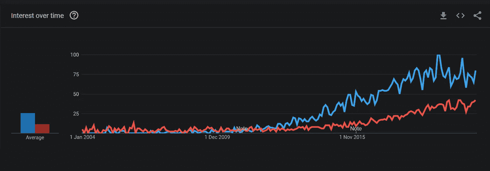

# 为什么你不应该雇佣更多的数据科学家

> 原文：<https://towardsdatascience.com/why-you-shouldnt-hire-more-data-scientists-3188a1597fa3?source=collection_archive---------8----------------------->

## 通过考虑数据团队中分析师、数据工程师和软件工程师的角色来节省资金和减少挫折。

停止雇佣数据科学家——你可能不需要他们

# 不适合这份工作的人

在我的职业生涯中，我在我工作过和咨询过的许多公司中都看到过这种情况——我们没有为这项工作雇用合适的人！

我仍然听到许多关于数据科学团队表现不佳、管理层普遍对数据科学失去信心，或者数据科学家对自己的角色感到沮丧的可怕故事。当你深入观察时，你会发现一个共同的模式。

> 我们一直在雇佣数据科学家，却没有真正理解他们在哪里能带来最大的价值。

对于许多组织来说，真正需要的是分析师和数据工程师。有时候，工作的核心甚至不是数据或见解，你最好和软件工程师和开发人员在一起。

数据科学家有一个危险的属性组合，加剧了这个问题:

*   **广泛的技能组合**意味着数据科学家通常拥有解决大多数问题的基本能力——尽管比一些专家更慢、更昂贵。
*   一份奖励天生好奇者的职业意味着许多数据科学家将热衷于探索他们职责范围之外的挑战。
*   对于一些人来说，获得数据科学职位的竞争意味着他们仍然渴望取悦和乐于接受不太适合他们的任务，以便成为一名好公民。
*   **数据科学家和管理人员在早期职业生涯中缺乏经验**，再加上混乱的、**定义不清的角色**(似乎没有人同意数据科学家是/不是什么)导致资源错误分配到正确的任务。

这个名单还可以继续下去。当我遇到数据科学家在过去 18 个月里除了 BI 或基础数据库开发什么都不做时，我不会感到惊讶，这些任务更适合专家。

组织需要交付的东西和他们为完成工作而引入的技能之间存在巨大的不匹配。

# 你可能需要一个分析师

你是在做实验来引导业务和做出改变，还是在业务中支持日常决策？(图片由 [Unsplash](https://unsplash.com?utm_source=medium&utm_medium=referral) 上的[卢克·切瑟](https://unsplash.com/@lukechesser?utm_source=medium&utm_medium=referral)拍摄)

很难知道什么是正确的技能组合——很少做对，每个组织、行业、职能、团队和个人性格的具体情况意味着永远不会有简单的公式来解决这个问题。不过，总的来说，你需要更多的分析师——雇佣数据科学家来构建关于业务指标的基本报告并不是对技能和资源的最佳利用。

如今统计学家是一种罕见的人才。有很多人在做伟大的工作，而这些正是组织渴望的技能。根据 Glassdoor 和 Stack Overflow 等网站，数据科学家[的平均薪资比统计学家](https://www.glassdoor.co.uk/Salaries/data-scientist-salary-SRCH_KO0,14.htm)[的平均薪资高出约 21%。许多数据科学家都是多面手，因此，对于一个在统计学方面有扎实基础的人来说，学习数据管理和处理的基础知识并获得大幅加薪是相当容易的。](https://www.glassdoor.co.uk/Salaries/statistician-salary-SRCH_KO0,12.htm)

然而，找到新工作只是问题的一半。新发现的统计学家转变为数据科学家发现自己处于一个完全不同的世界-这是为什么这些数据科学家拥有如此广泛的技能组合的原因。以前，你一天中的大部分时间都花在运行统计模型、解释数据、构建报告以从公司数据中获得洞察力上。现在，你的工资上涨了 20%,你几乎把所有的时间都花在了寻找数据、构建数据管道、编写简单的报告和幻灯片、编写 SQL 以获得开始分析所需的基本资料上。这不是你技能的核心所在。您现在做的是入门级数据分析师的工作，通过简单的分析和报告支持日常业务功能，因为没有合适的人来做这件事。

分析师的价值与统计学家或数据科学家的价值之间的主要区别。分析师对于确保正确的见解和信息在正确的时间到达正确的人手中是绝对必要的。日复一日。大多数组织发现自己身处 Excel 电子表格的地狱——分析师在那里引导人们回归理智。

然而，数据科学家和统计学家应该提供长期的转型服务。作为长期研究计划的一部分，开启全新的理解，精心设计实验以测试新的假设，开发预测能力和全新的模型。有能力做好这一点是数据科学职位报酬更高的原因，它应该需要大量的时间和实践来获得这些技能。这使得数据科学家即使对行业没有深刻的理解，也能对组织有用。

没有谁比谁更好，他们都有自己的位置和服务于不同的目的。

> 如此多的技能和微妙的工作角色汇聚到数据科学的浑水中，导致许多组织遭受损失。

这些技术工人现在可能赚了更多的钱，但他们做的工作远不如以前有成就感。此外，该组织为其真正需要的技能支付了高于市场价值的费用，甚至可能雇佣一些不太熟练的人来完成特定的任务。

# 你可能需要一名数据工程师

如果你在连接管道，你会需要一个管道工(照片由[郭锦恩](https://unsplash.com/@spacexuan?utm_source=medium&utm_medium=referral)在 [Unsplash](https://unsplash.com?utm_source=medium&utm_medium=referral) 上拍摄)

当我开始研究数据科学时，很少听说数据工程师。如果你看看下面的谷歌趋势图，你会看到受欢迎程度(炒作)的差异，以及红色的“数据工程师”一词直到 2014 年才真正与蓝色的“数据科学家”相关联。当然，围绕数据工程有很多讨论，许多数据科学家(包括我自己)不得不自己动手。

Google Trends 对搜索词'`Data Scientist' in blue vs.` ' `Data Engineer' in red ([source](https://trends.google.com/trends/explore?date=all&geo=US&q=data%20scientist,data%20engineer)).`'的长期兴趣

不过现在已经不是 2014 年了。事实上，我很惊讶今天仍然有这么大的差距。

> 与数据科学家相比，绝大多数组织雇佣数据工程师会更好。

让数据科学家尽早参与进来确实有助于形成围绕数据和分析职能的一些需求，因为它们通常会触及业务的许多领域。数据科学家通常擅长于宽松的范围和软需求。但是，当知道了这些要求后，你会很快到达一个有大量数据管理和处理工作要做的地方。

即使是最简单的需求，建立数据平台的基础也需要几个月的时间。随着平台的增长，新的需求会出现，维护开销也会增加。我强烈建议尽早找一个好的数据工程师。尽管许多数据科学家都是优秀的数据工程师，但在架构和设计数据解决方案时，您通常会获得技能和最佳实践意识的混合。此外，当涉及到将解决方案与 CI/CD、构建测试以及我们逐渐依赖的所有良好的工程材料集成在一起时，数据工程师往往会更好，因为数据科学家应该真正专注于一次性工作和实验，以提供最大的价值。

强大的数据工程对支持整个企业的功能也有很大的价值。许多数据工程师都有 BI 背景，对业务用户和分析师的数据需求有详细的了解。

# 你可能需要一名软件工程师

把构建可扩展软件的任务留给专家吧(图片由 [Unsplash](https://unsplash.com?utm_source=medium&utm_medium=referral) 上的 [Yancy Min](https://unsplash.com/@yancymin?utm_source=medium&utm_medium=referral) 拍摄)

将高级分析和机器学习作为大规模应用的核心变得越来越普遍。这导致数据团队处于开发过程的核心，形成应用程序的路径，并与其他团队一起交付。

然而，这正是许多组织失败的地方。

> 仅仅因为一个应用程序中有**一些**机器学习并不意味着你需要一个只有**数据科学家的团队。**

数据科学家不(或者至少不应该)在那里开发健壮的、可伸缩的、交互式的、可运输的软件。你能从数据科学家那里获得的最大价值是给他们一个问题，一个清晰的、可衡量的交付物和一些数据，让他们迭代出某种答案。当然，他们将在翻译和向更广泛的团队移交任何粗略的概念验证解决方案方面发挥关键作用。将它们作为更大项目的依赖项，是另一种严重的资源分配不当。

你真正需要的是强大的软件工程师团队。是的，一个数据科学家可能会开发出某种交互式 GUI，但是如果由前端开发人员来处理会好得多。是的，数据科学家可以为你建立一个管道，将数据从源端到汇点，但后端开发人员、数据工程师和测试人员将会做出更加健壮和可伸缩的东西。

您不需要理解如何对作品建模，以使其成为一个可交付的、可伸缩的软件，与您的应用程序的其余部分很好地配合。

> 让您的数据科学家专注于问题导向、工作的科学方面，将工程留给工程师。

您将获得更多的参与度、满意度、更高性能的代码、更强的协作、更多的边缘案例、更少的不愉快和挫折。数据科学家在某些情况下可能是必不可少的，但在其他情况下可能是彻底的障碍。

# 最后的想法

随着如此多的人热衷于成为数据科学家，我们已经失去了其他数据相关角色的一些细微差别。此外，许多招聘经理不了解也没有经验知道一个好的数据科学家能做出什么贡献，或者什么时候需要一个好的数据科学家。这导致许多人处于错误的角色中，并感到沮丧。

下一次，当你渴望发布一份数据科学家的新招聘广告时，请认真思考一下——这个职位的核心是什么？他们会做研究和科学，塑造未来的旅行方向，还是会像往常一样做基础工程或支持业务？