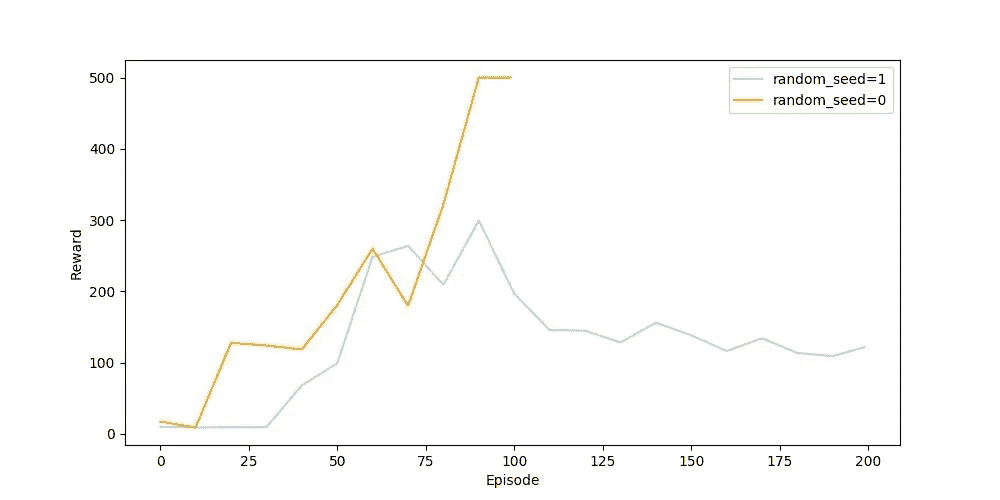
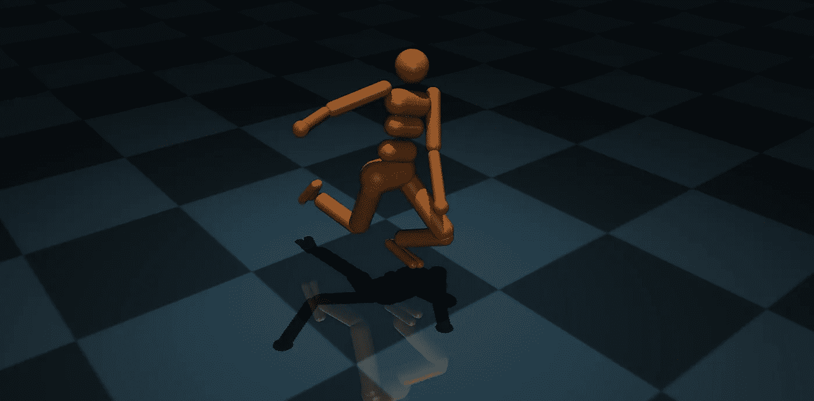
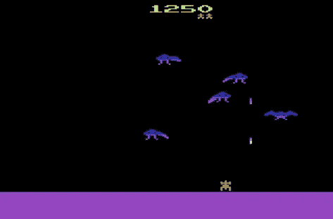
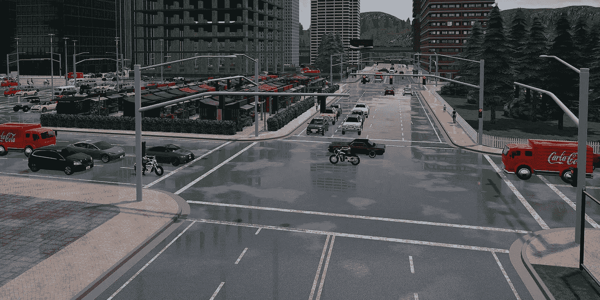

# 为什么你(可能)不应该使用强化学习

> 原文：<https://towardsdatascience.com/why-you-shouldnt-use-reinforcement-learning-163bae193da8?source=collection_archive---------12----------------------->

## [行业笔记](https://towardsdatascience.com/tagged/notes-from-industry)

围绕这项技术有很多炒作。有充分的理由…这很可能是实现通用人工智能的最重要的机器学习进步之一。但是在一般的兴趣之外，你可能最终会想到这样一个问题，“它适合你的应用吗”？

我目前在一个视觉机器人团队工作，作为 RL 的一名前研究员，我被要求为我的团队回答这个问题。下面，我概述了我认为你可能不想在应用程序中使用强化学习的一些原因，或者至少在走这条路之前要三思。让我们开始吧！

加利福尼亚州城堡石。作者图片

## 极其嘈杂

下面是一个最高分为 500 的游戏中的两个学习情节。那么哪种学习算法更好呢？恶作剧问题。它们完全一样，第二次运行只是第一次的重新运行。一次训练完全震撼了它并学到了一个完美的政策，而另一次，悲惨地失败了，唯一的区别就是随机种子。

DQN 在横撑上的训练曲线。作者图片

*   随机初始化中的微小变化会极大地影响训练性能，因此实验结果的可重复性具有挑战性。
*   噪音使得比较算法、超参数设置等变得非常困难，因为你不知道性能的提高是因为你所做的改变还是仅仅是一个随机的人为因素。
*   您需要在完全相同的条件下进行 20 次以上的训练，以获得一致/稳健的结果。这使得迭代你的算法非常具有挑战性(参见下面关于这些实验需要多长时间的注释！)

## 大量超参数

目前市场上最成功的算法之一是软演员评论家(SAC)，它有近 20 个超参数可以调整。[自己查吧！](https://github.com/DLR-RM/stable-baselines3/blob/master/stable_baselines3/sac/sac.py)但这还不是结束……

*   在 deep RL 中，你拥有了所有与网络架构相关的正常深度学习参数:层数、每层节点数、激活函数、最大池、dropout、批量归一化、学习速率等。
*   此外，您有 10+个特定于 RL 的超参数:缓冲区大小、熵系数、gamma、动作噪声等
*   此外，你有奖励形成(RewardArt)形式的“超参数”来让代理按照你想要的那样行动。
*   即使是其中的一个也很难调整！见笔记关于极度嘈杂，训练时间长…想象调 30+。
*   与大多数超参数调优一样，并不总是有直观的设置或简单的方法来最有效地找到最佳超参数。你真的只是在瞎猜，直到事情似乎有了转机。

## 仍在研发中

由于 RL 实际上仍处于萌芽阶段，研究社区仍在解决如何验证和共享进步的问题。这让我们这些想要使用这些发现并重现结果的人感到头疼。

*   论文在实施细节上含糊不清。你不可能总是找到代码，也不总是清楚如何将一些复杂的损失函数转化为代码。报纸似乎也忽略了他们用来获得卓越性能的手工小调整。
*   一旦一些代码出现在互联网上，由于上面列出的原因，这些代码在实现上会略有不同。这使得你很难将自己的搜索结果与别人的进行比较。我相对糟糕的表现是因为我引入了一个 bug 还是因为他们使用了一个我不知道的技巧？

## 难以调试

*   最近的方法使用技术的厨房水槽得到尖端的结果。这使得很难有干净的代码，从而很难跟踪别人的代码，甚至你自己的代码！
*   另一方面，因为有如此多的活动部件，所以很容易引入 bug，并且很难找到它们。RL 经常有多个网络学习。而且在学习过程中有很多随机性，所以这一次可能行得通，下一次可能行不通。是因为你引入的一个 bug 还是因为随机种子中的一个侥幸？不进行更多的实验很难说。这需要…时间。

## 样品效率极低

无模型学习意味着我们不试图建立/学习环境的模型。所以我们了解政策的唯一方法是直接与环境互动。基于策略意味着我们只能利用从我们当前策略的行为中获取的样本来学习/改进我们的策略，即我们必须丢弃所有这些样本，并且在我们运行单个反向梯度更新时立即收集新的样本。例如，PPO 是一种无模型、符合政策的最新算法。所有这些都意味着，在学习一项政策之前，我们必须与环境进行大量的互动(比如数百万步)。

如果我们在相对低保真度的模拟器中具有高级特征，这可能是可行的。举个例子，

人形环境的图像由[https://gym.openai.com/](https://gym.openai.com/)

*   人形机器人需要 5 个小时来学习如何行走(2 英里的步伐)

但是，一旦我们转移到低层次的功能，如图像空间，我们的状态空间增长很多，这意味着我们的网络必须增长很多，例如，我们必须使用 CNN 的。

雅达利凤凰。图片由 mybrainongames.com 的[提供](https://mybrainongames.com/)

*   凤凰等雅达利游戏需要 12(？)小时(40-200 密耳步)

当我们开始引入像 CARLA 这样的 3D 高保真模拟器时，事情变得更糟。

卡拉驾驶模拟器。图像由[虚幻引擎](https://www.unrealengine.com/)

*   用 GPU 训练一辆汽车在卡拉驾驶需要大约 3-5 天(200 万步)

如果政策非常复杂，情况会更糟。

*   2018 年，OpenAI 培养了一个在 DOTA 2 上击败世界冠军的代理人。你问代理培训花了多长时间？十个月🙊

如果我们想在真实世界而不是模拟器中训练呢？这里，我们受到实时时间步长的限制(而以前我们可以比实时更快地模拟步长。).这可能需要几个星期，甚至更糟，完全难以处理。关于这方面的更多信息，请查阅“RL 的致命三重奏”。

## Sim 2 真实差距

如果我们想在模拟器中训练，然后在现实世界中部署呢？大多数机器人应用都是如此。然而，即使代理在模拟器中学习玩得很好，也不一定意味着它会转移到现实世界的应用中。取决于模拟器有多好。理想情况下，我们会让模拟器尽可能接近真实生活。但是看最后一节就知道高保真模拟器的问题了。

## 不可预测性和不可解释性

*   即使是训练有素的 RL 特工在野外也是不可预测的。我们可能试图严厉惩罚灾难性的行为，但我们仍然不能保证代理人不会仍然选择这种行为，因为最终，我们只是优化了总回报的期望。
*   可解释性:一般来说，这是 DL 的一个问题，但在强化学习中，这个问题变得更加重要，因为网络经常选择如何移动可能对人或财产造成物理损害的物理机器(如自动驾驶或机器人)。RL 代理可能会做出灾难性的控制决策，而我们不知道确切的原因，这反过来意味着我们不知道如何在未来防止它。

## 结论

我不知道你读了会不会觉得压抑或者扫兴。我的意思是这是一个现实的检查，以减少炒作，所以我真的很努力。但我也应该否认所有这些观点，因为这些问题正是它成为如此热门的研究领域的原因，人们正在积极解决许多(如果不是所有)这些棘手问题。这让我对 RL 的未来感到乐观，但意识到这些仍然是问题，这让我成为一个现实的乐观主义者。

信不信由你，我不会完全不相信 RL 在工业应用中的价值…当它工作的时候真的很棒。我只是想确保你知道你正在做什么，这样你就不会过度承诺和低估时间表。:)