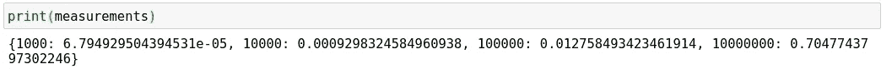
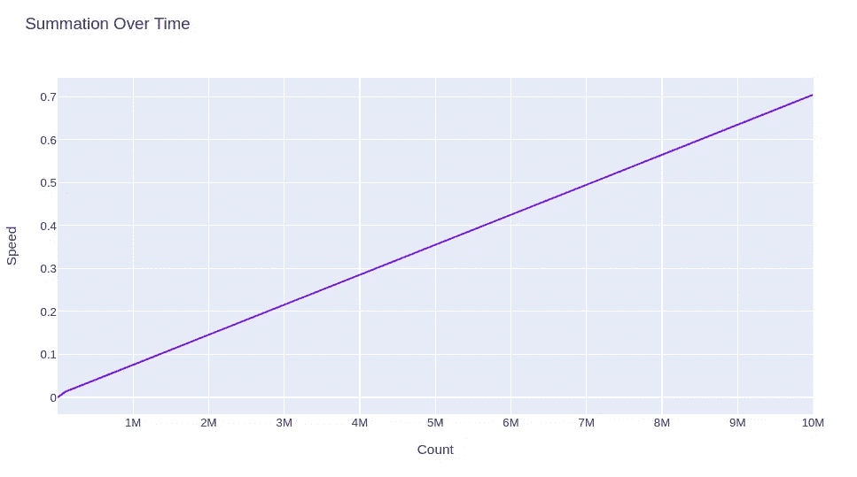

# 为什么你的循环这么慢

> 原文：<https://towardsdatascience.com/why-your-loops-are-so-slow-166ec67db47d?source=collection_archive---------24----------------------->

## 编写循环算法和“大 O 符号”概述


(src =[https://pixabay.com/images/id-1113799/](https://pixabay.com/images/id-1113799/)

# 介绍

在这个令人惊叹、有时甚至令人恐惧的编程世界里，有许多工具可供程序员用来帮助他们解决问题。数据结构上经常使用的一种工具是循环。循环当然可以指 while-looping、for-looping 和勉强；递归循环。循环的问题是它们可能是严重的性能障碍，然而它们是许多编程操作不可或缺的。

不管你在编程什么，肯定会有多种不同的方式来完成。虽然最终目标可能会被保留，但几乎可以肯定的是，为了实现这一目标，将会有一条不同的道路要走。这也意味着不同的方法可能要花费更多的时间和内存才能得到相同的解决方案。这些都是程序员应该意识到的事情，尽管很难使用尽可能少的内存来实现高性能的完美函数，但是有一些方法可以改进它们的循环，从而提高性能。此外，在计算机科学中有一个公式化的属性，我们可以用它来评估一个函数的效率，这就是所谓的

> 大 O 符号。

# 大 O 符号

那么到底什么是大 O 符号，我们如何使用它来提高我们的编程技能呢？大 O 符号是一种数学形式，它描述了一个参数在数值上增加时函数的行为。例如，假设我们在 Python 中有一个基本的求和函数:

```
def summation(n):
    total = 0
    for number in n:
        total += number
    return(total)
```

列表“n”越长，这个函数循环执行加法和断言操作的次数就越多。你可以想象，在这个列表中很可能有一个非常线性的方程来增加新的迭代。随着 n 范围的增长，编译的时间也会增长。我决定把这个带进 Jupyter，以便更好地形象化，所以如果你想看我用的笔记本，你可以在这里:

<https://github.com/emmettgb/Emmetts-DS-NoteBooks/blob/master/Python3/big%20o%20notation.ipynb>  

这是我用来测试通过这个函数传递的不同数量的数字的函数:

```
def test_speed(numbers):
    results = {}
    for number in numbers:
        start = time.time()
        total = summation(list(range(1, number)))
        end = time.time()
        results[number] = end - start
    return(results)
```

该函数使用时间模块来获取每次求和所花费的时间。它传递了一个范围在 1 和数字之间的列表，这意味着我们将能够通过向数字列表中添加新的数字来确定循环了多少个值。让我们来试试吧！

```
measurements = test_speed([1000, 10000, 100000, 10000000])
print(measurements)
```



作者图片

现在我们将使用 Plot.ly 对此进行可视化。首先，我们需要将我们的数据放入 DataFrame 中。如果我们只是将这种类型投射到我们的数据上，我们的速度值将是一串数字列中的一个单独的观察值，因此在使用 Plot.ly 之前，我们需要做一些基本的字典到数据帧的处理。首先，我将从字典中取出我们的数据:

```
speeds = measurements.values()
ns = measurements.keys()
```

现在，我将使用该数据创建一个数据框架:

```
import pandas as pd
df = pd.DataFrame({"Speed": speeds, "Count": ns})
```

最后，我将使用 Plot.ly 绘制它:

```
import plotly.express as px
fig = px.line(df, x="Count", y="Speed", title='Summation Over Time')
fig.show()
```



(图片由作者提供)

我们的功能实际上是线性繁重的，至少在处理时间方面是如此。在大 O 符号中，这被称为 O(n)。O 代表我们的运营成本，在本例中，因为我们的大 O 符号是 O(n ),所以我们可以通过减去我们函数中运行的两个数字来获得给定总和的运营成本，这两个数字相距一个数值步长。

还有一些其他流行的大 O 符号，在计算机编程中非常常见。O(1)是基线，意味着输入的数量无关紧要。这是你创建任何函数的基线，例如，如果没有循环，也许一个操作，很可能是 O(1)是你要处理的。另一个是 O(log n)，这里的税收稍微多一点，但是随着迭代次数的增加，循环趋于平稳。这在需要大量初始化的循环方法中很流行，但每个周期不需要那么多操作。

下一个 O 符号是 O(n log n)，O(n log n)通常也是线性的，但通常比 O(n)的斜率更陡。O(n)是指数增长，这意味着每次迭代都要花费前 n 次运行成本的平方。然后是 O(2^n)，这更糟糕，通常是指数增长，只是斜率更陡，因为指数现在是迭代次数。最后还有 O(n！).这是 n 的阶乘，阶乘的问题在于它们很快就会失控。虽然计算 5 的阶乘可能需要几秒钟，但计算一个非常大的数的阶乘可能需要几年时间。在计算机编程中，阶乘的典型递归实现更是如此。正如你可能想象的那样，这意味着计算时间随着 n 的增加而急剧增加。我在网上找到了一个很棒的可视化，但我无法在不侵权的情况下将其添加到这项工作中，因此我将提供一个链接来查看它[这里](https://danielmiessler.com/images/big-o-chart-tutorial-bazar-aymptotic-notations-1.png)。可视化很好地展示了每个符号的样子，并真正揭示了它们之间的差异。

# 结论

大 O 符号是现代计算的主要元素，因为它非常常用于分析函数的效率。大 O 提供的信息可以做什么？当涉及到处理更多的值时，随着符号的急剧增加，某些函数有一些明显的缺点。当然，有一些函数的行为方式是这样的，它们取的值比其他函数少得多，所以使用该函数的意图以及该函数的实际用途对大 O 是否是你要可视化的函数的一个真正重要的部分起着很大的作用。

也就是说，大 O 符号当然是一个有价值的工具。它可以用来分析一个函数的状态有多关键，并且通常被用来判断一个函数是否是可伸缩的。可伸缩性对大企业来说很重要，而本质上不可伸缩的功能在扩展到更大规模时可能会出现问题，因此像这样检查性能指标无疑是有价值的，这样可以更好地了解特定功能对给定问题的应用情况。感谢您的阅读！