# 熊猫融化，堆叠，宽变长，把列变成行

> 原文：<https://towardsdatascience.com/wide-to-long-data-how-and-when-to-use-pandas-melt-stack-and-wide-to-long-7c1e0f462a98?source=collection_archive---------1----------------------->

## 使用实例了解如何重塑熊猫数据框架


照片由 [**Pixabay**](https://www.pexels.com/@pixabay?utm_content=attributionCopyText&utm_medium=referral&utm_source=pexels) 来自 [**像素**](https://www.pexels.com/photo/multi-colored-folders-piled-up-159519/?utm_content=attributionCopyText&utm_medium=referral&utm_source=pexels)

重塑数据帧通常需要将列转换为行，反之亦然。

重塑数据帧有几个原因:

*   整理混乱的数据集，使每个变量都在其列中，每个观察值都在其行中。
*   为分析或可视化准备数据集的一部分。

每当我需要使用这些功能并复制粘贴解决方案时，我通常会使用谷歌。谢谢 stackoverflow！

在这篇文章中，我谈论熊猫。melt()，。stack()和。wide_to_long()。这些函数用于将列转换为行，也称为将数据帧从**宽格式转换为长格式。**

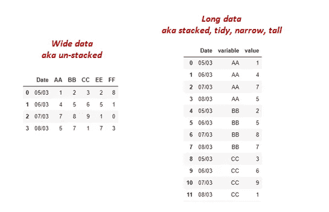

作者提供的宽而长的数据

希望读完这篇文章后，现在唯一的谷歌搜索将是官方文档和语法！

对于前两个函数，我们将使用下面的数据集。

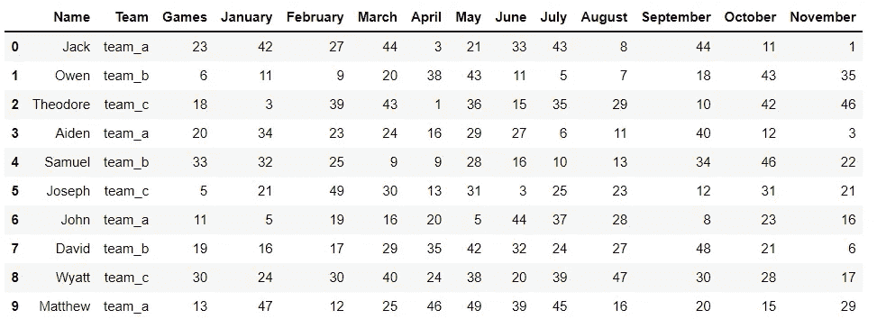

作者的广泛数据框架

**任务:**将所有月份列移动到一个名为`‘Month’`的列下。其单元格中的值将被放入另一个名为`‘Score’.`的列中

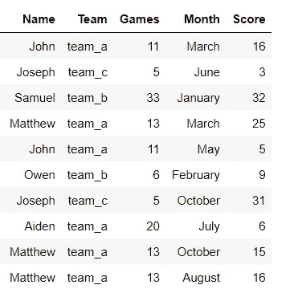

作者提供的预期数据框架示例

## 1.融化()

熊猫`[.melt()](https://pandas.pydata.org/pandas-docs/stable/reference/api/pandas.DataFrame.melt.html)`通常是将宽数据帧转换成长数据帧的首选函数，因为它既灵活又简单。

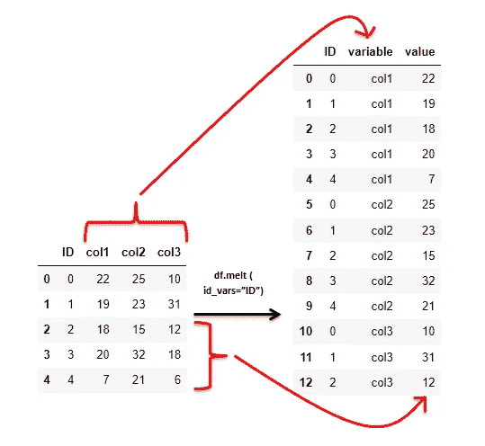

。作者的熔化演示

`df.melt()`将具有公共值的相关列捆绑到**一个**列中，称为“变量”。最初在这些列中的值存储在另一个名为“value”的列中。

`.melt()`句法。

`df.melt(*id_vars=None*, *value_vars=None*, *var_name=None*, *value_name='value'*, *col_level=None*, *ignore_index=True*)`

所有这些参数都是可选的。让我们看看他们是什么意思。

`id_vars` —列名列表，将保持不变，不会被改变形状，也称为标识符变量。如果没有提供，*所有的*列将堆叠成一列。

`value_vars` —要堆叠成一列的列的列表。

`var_name`–新列的首选名称，用于保存重新调整后的列名。如果未提供，默认名称为“变量”。

`value_name`–列的首选名称，其中包含来自重新调整的列的值。如果未提供，默认名称为“值”。

让我们探索不同参数的`.melt()`。

**df.melt() — *未提供参数***

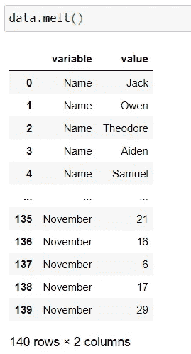

所有的列都被重新整形

**df.melt ( id_vars= …)**

这里，我们提供了一个我们不想堆叠的标识符列的列表(你也可以在这里提供一个单独的列)。所有其他列都将被重塑。

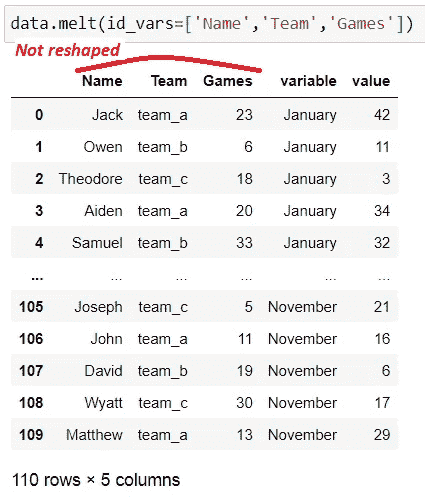

注意，这些*标识符列*将对每个重新整形的列重复。例如，播放器 `names, team, and games`每隔`month`重复一次。

**df.melt ( id_vars = …，value_vars = …)**

`value_vars`保存要堆叠的列(或列列表)。下面，只重塑了两列；`‘February’ and ‘June’`还有一个 id 变量`‘Name’`。其余的从结果数据帧中删除。

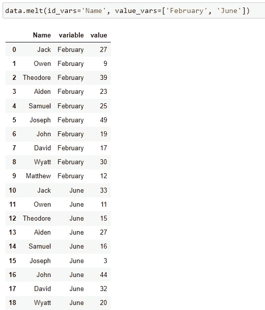

**df.melt ( id_vars = …，value_vars = …，var_name = …，value_name = …)**

`var_name`和`value_name`分别提供堆叠列的名称及其对应的值。默认名称为“变量”和“值”。

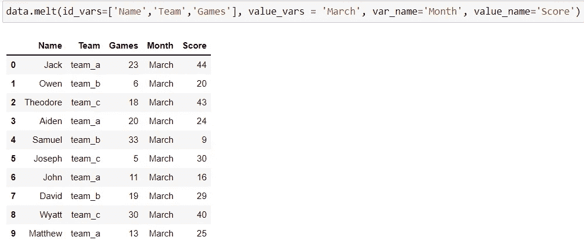

**我们的预期任务结果:**这里不提供要堆叠的`value_vars`。因此，*而非* `id_vars`的所有列将被堆叠。我们还传递堆叠列的名称。

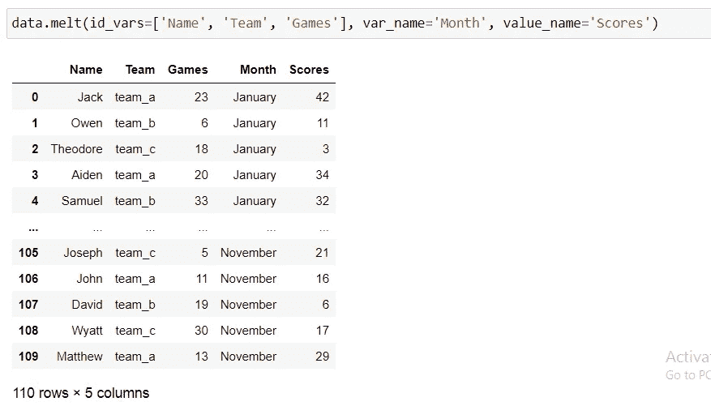

**融化后保存指数()**

`ignore_index = True`是融化功能的默认值。这意味着旧的索引被删除并用从 0 开始的[范围索引](https://pandas.pydata.org/docs/reference/api/pandas.RangeIndex.html)代替。

如果索引对数据帧有意义(例如，它包含每个玩家的实际 id)，首先重置索引。原始索引变成一列，并创建一个新的 RangeIndex。

第 1 步:使用`reset_index()`将索引释放到名为“index”的列中。然后将此列重命名为“ID”。

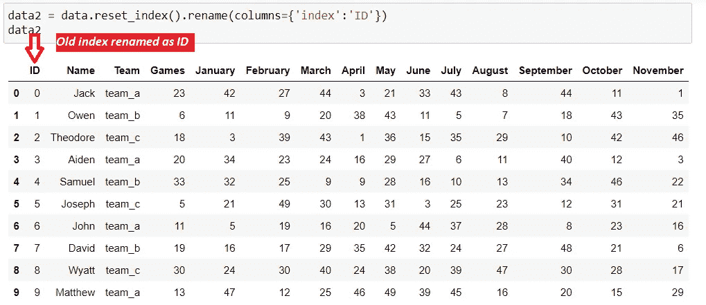

第二步:`melt()`数据框。包括“ID”作为标识符变量，以便它不被整形。

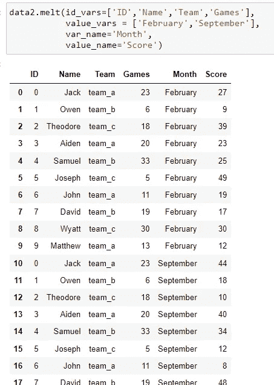

## **2。stack()**

熊猫的`.stack()`方法也将宽数据帧转换成高数据帧。

最大的不同是`.stack()` **利用了索引**，对所有不是索引的列进行了整形。

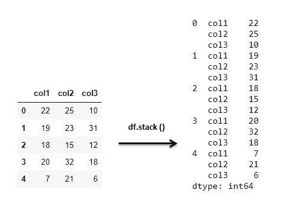

作者演示的 df.stack()

让我们来看看我们的原始玩家分数数据集。

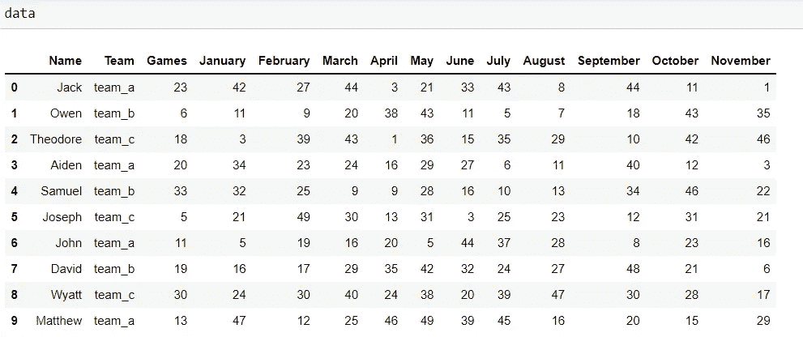

原始宽数据集

现在让我们把它叠起来。

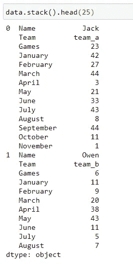

每个索引的所有列都已堆叠。结果是一个[多级索引](https://pandas.pydata.org/pandas-docs/stable/user_guide/advanced.html) **系列**对象。

`.stack()`方法获取所有的列，并将它们放到最内层的索引中。

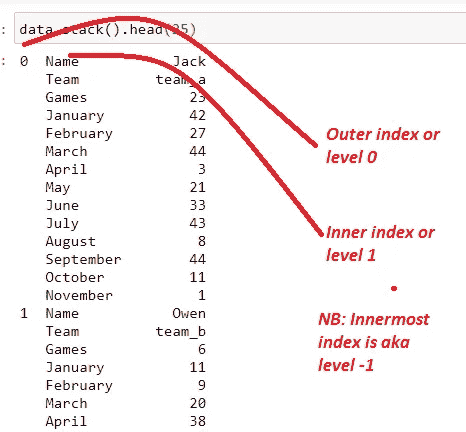

现在，如果我们想要再现与上面的熔化函数相同的输出，我们需要经历一系列的步骤；

1.  `set_index()`。将索引设置为我们的标识符变量；`Name, team,`和数量`games`。

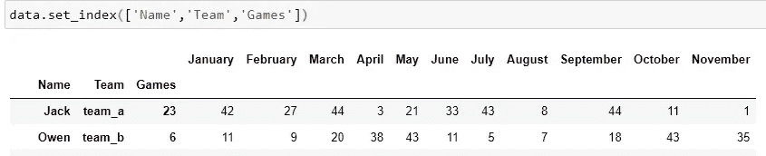

2.`stack()`。这将产生一个多级索引数据框架。

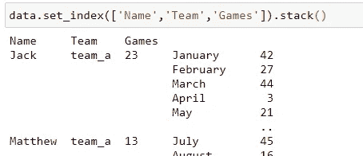

3.`reset_index()`。这将释放多级索引并创建一个新的 [RangeIndex。](https://pandas.pydata.org/docs/reference/api/pandas.RangeIndex.html)

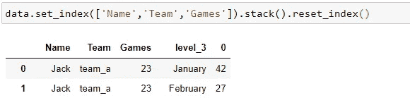

4.`rename`与`‘Month’`和`‘Score’`匹配的列

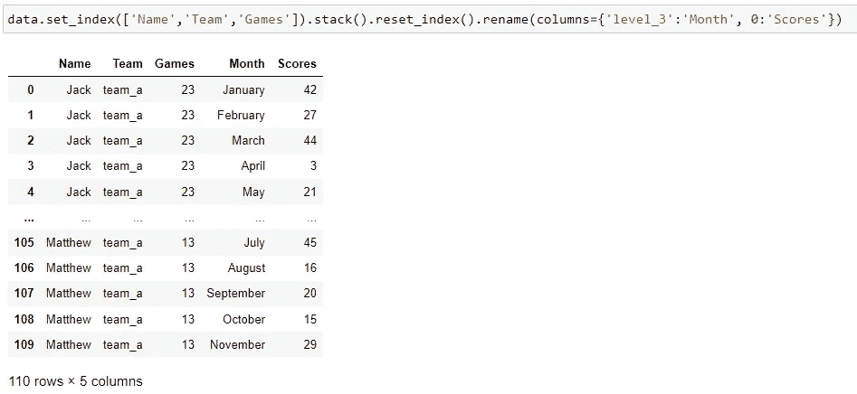

**另一个**的例子`**df.stack()**`

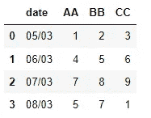

**任务:**将`AA, BB and CC`列堆叠在一个名为`‘Labels’`的列下。`Date`不应被整形，因为它是标识符变量。

```
df1 = df.set_index('date')
df1 = df1.stack()
df1 = df1.reset_index()
df1 = df1.rename(columns = {'level_1':"Labels",
                   0: 'Values'})
df1
```

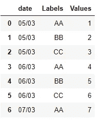

**同样的例子使用** `**df.melt()**`

```
df.melt(id_vars = 'date', 
       var_name = 'Labels',
       value_name = 'Values')
```

## 3.wide_to_long()

melt()和 stack()函数获取几列并将它们堆叠到一个列中。

如果我们希望将几个列捆绑成两个有意义的列呢？例如，我们不再像以前那样按月分组分数，而是按月分组**分数**和按月分组**游戏**。

输入熊猫`[.wide_to_long()](https://pandas.pydata.org/pandas-docs/stable/reference/api/pandas.wide_to_long.html)`。

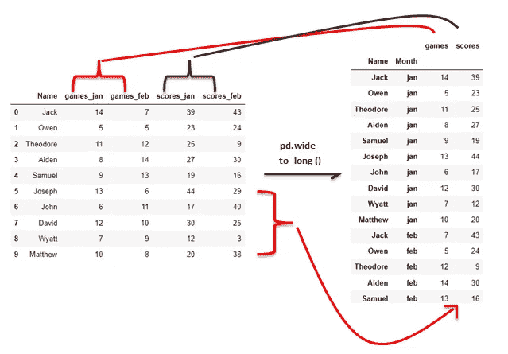

pd.wide_to_long()作者演示

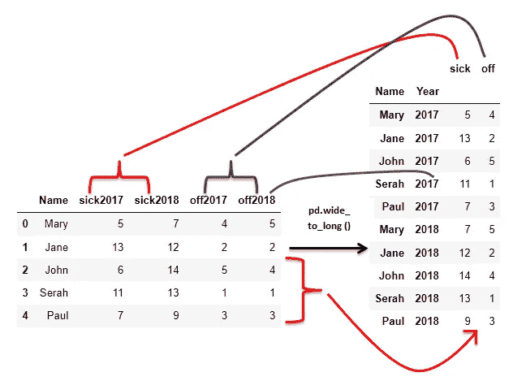

作者演示 pd.wide_to_long 的另一个例子

`wide_to_long()`以一种非常特殊的方式工作，它实际上利用了熊猫的`.melt()`。它需要四个必要的参数，但最重要的方面是列名的显示方式。

**要堆叠的列名**必须是特定的格式。

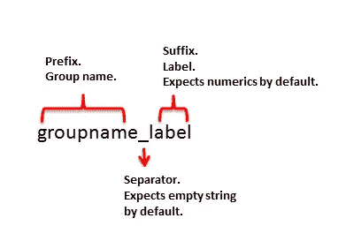

wide_to_long()函数的列格式

例如，对于上面的数据框架，下面是列。

*   要堆叠的 df_1 列；`games_jan, games_feb, scores_jan, scores_feb.`
*   df_2 列；`sick2017, sick2018, off2017, off2018`

群组名称为`'games', ‘scores’, ‘sick’, ‘off’.`

标签是`‘jan’, ‘feb’, ‘2017’, ’2018'`。

分隔符是`‘_’ and empty string ''.`

如果它们的格式不同，您需要[重命名列](https://www.geeksforgeeks.org/how-to-rename-columns-in-pandas-dataframe/)。

**语法**

`pandas.wide_to_long(*df*, *stubnames*, *i*, *j*, *sep=''*, *suffix='\\d+'*)`

前四个参数*必须*提供。

1.  `df` —要整形的数据帧。
2.  `stubnames` —相关列的组(前缀)。以这些字符串开头的列将被组合在一起。
3.  `i` —标识符变量，或不堆叠的列。
4.  `j` —包含列的后缀或标签的列的名称。

可选参数

5. `sep` -分隔组名(前缀)和列名标签(后缀)的字符。默认分隔符是空字符串。

6.`suffix` —后缀的格式(正则表达式)。默认情况下，该函数接受数字字符；后缀= `‘\d+’`。如果后缀包含非数字字符，例如上面例子中的“jan”和“feb ”,使用正则表达式`’.+’`搜索后缀中的任意数字字符。

让我们来探究熊猫的几个例子

**例 1。**

考虑下面数据帧；

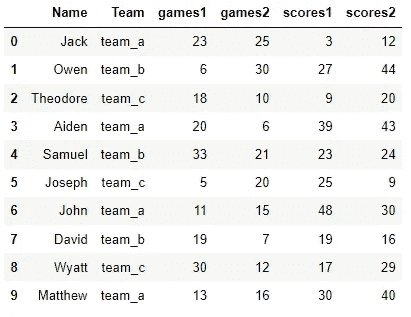

**任务:**这两个组(`games` 和`scores`)每个都有自己的列保存值。季节标签(后缀 1 和 2)位于“季节”一栏下。

```
pd.wide_to_long(data_d, 
                stubnames=['games','scores'], 
                i=['Name','Team'], 
                j='Season')
```

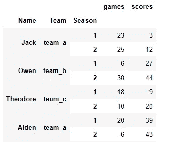

注意，我们没有提供参数`sep`和`suffix`，因为缺省值适用于我们的数据帧。

最后一步是重置索引以消除 multiIndex。

```
wtl.reset_index()
```

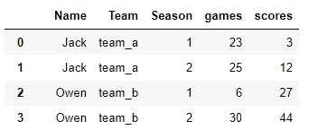

**例 2**

这里我们有第一季和第二季玩家获得的奖牌。

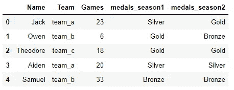

每个赛季的奖牌数据框架

**任务:**将`medals`列聚合成一个名为‘奖牌’的列。标签堆叠在另一个名为“季节”的栏中。只显示***一个** id 变量的‘名称’。*

```
*pd.wide_to_long(data_g,
               stubnames=['medals'],
               i=['Name'],
               j='Season',
               sep = '_',
               suffix='.+')*
```

*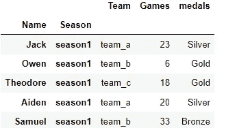*

*只有一个群体；`‘medals’`。我们还提供了`sep` 和`suffix` 参数，因为它们不同于缺省值。*

*注意:我们使用了一个标识符列`i= ‘Names’`，但是所有其他列仍然显示在结果中。当将`df`参数传递给函数时，我们可以删除不需要的列。*

```
*pd.wide_to_long(df = data_g.drop(['Team','Games'],axis=1) ,
               stubnames=['medals'],
               i=['Name'],
               j='Season',
               sep = '_',
               suffix='.+').reset_index()*
```

*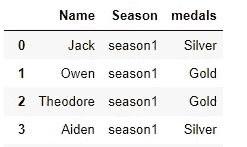*

***例 3:***

*我在 stackoverflow [这里](https://stackoverflow.com/questions/53509471/stacking-pandas-dataframe?utm_source=pocket_mylist)发现了这个问题。*

*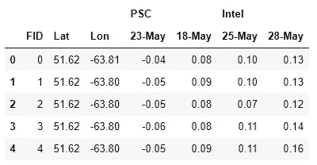*

***任务:**将顶层列`‘PSC’`和`‘Intel’`调整到一个名为‘SAT’的列下。日期也应该堆叠在它们自己的称为“日期”的列中。他们的价值归入“NVAL”一栏。 *id 变量*是`‘FID’, ‘Lat’, and ‘Long’.`*

*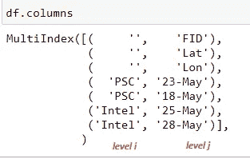*

*按作者的多索引列*

*步骤 1:通过连接名称来合并两个列级别。请参见上面的列级别。我们需要`PCS`和`Intel`(级别 I)作为列名的后缀(最后一部分),因此在下面的代码中是`‘{j}{i}’`。*

```
*#List comprehension.
#every column has 2 names 
#on different levels.
#return names joineddf.columns = [f'{j}{i}' for i,j in df.columns]
df*
```

*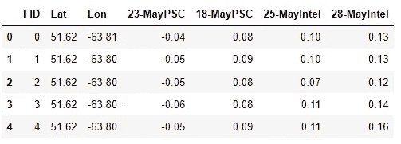*

*第二步:使用`wide_to_long`将标签`PSC`和`Intel` 转换到一列“SAT”下。日期都不同，因此在`‘stubnames’` 参数下有四组。*

```
*df_wtl = pd.wide_to_long(df, 
                stubnames = ['23-May','18-May','25-May','28-May'], 
                i=['FID','Lat','Lon'], 
                j='SAT', 
                suffix= '.+', 
                sep='')*
```

*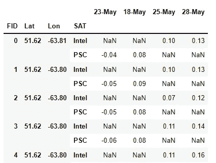*

*我们看到很多“不”,因为`Intel` 和`PSC` 都适用于特定的日期。*

*第三步:使用`df.melt`将日期堆叠在一个名为`‘Date’`的列下。这些值进入另一个名为`‘NVAL’`的栏目。记得在`.melt()`前`reset_index()`，在`dropna()`后。上面创建的`SAT`现在是标识符列之一。*

```
*#reset the index 
#melt
#drop Nans df_wtl = df_wtl.reset_index()df_wtl.melt(id_vars =['FID','Lat','Lon','SAT'],
            var_name = 'Date',
            value_name = 'NVAL').dropna()*
```

*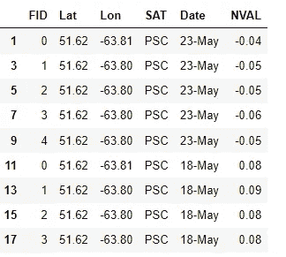*

*最后，调用`df.reset_index(drop=True)`从 0 开始创建一个新索引，并删除上图中的现有索引。*

## *结论*

*在本文中，我们研究了三种将列转换为行的方法。*

*我们注意到`df.melt()`和`df.stack()`函数通过将几列捆绑成一列来做同样的事情。*

*`df.stack()`获取列并将它们转置为最内层索引，保留原始索引，创建多级索引。不应堆叠的列应设置为索引。*

*`df.melt()`提供了选择要重塑的列以及结果列的名称的灵活性。但是，它会删除现有的索引并用新的索引替换它。*

*`pd.wide_to_long()`将多组列捆绑成两列或更多列。它还要求列名采用特定的格式。*

*在这里找到包含所有代码[的 Jupyter 笔记本。感谢您的阅读！](https://github.com/suemnjeri/medium-articles/blob/e9f7672d6976189c6751ebb19f3134452a0f38bc/reshaping%20dataframes/Wide%20to%20long%20with%20melt,%20stack%20and%20wide_to_long-medium.ipynb)*