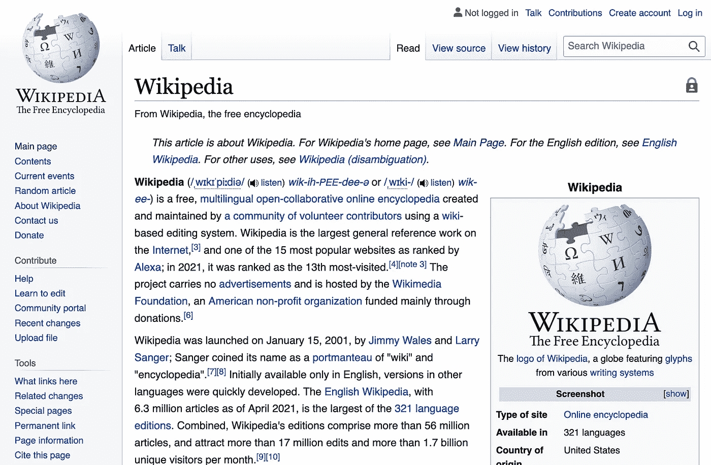

# 维基百科是一个有价值的数据科学工具

> 原文：<https://towardsdatascience.com/wikipedia-as-a-valuable-data-science-tool-6769991b43b7?source=collection_archive---------25----------------------->

## 参考书目

## 关于维基百科的 TDS 文章集

作者图片

几天前，我在编辑队列中偶然看到了由[尼古拉·梅鲁索](https://medium.com/u/c332152df1b3?source=post_page-----6769991b43b7--------------------------------)撰写的[这篇文章](/boosting-natural-language-processing-with-wikipedia-b779103ba396),并立即被吸引住了——维基百科是世界上最大的公共信息平台，但我很少遇到使用这个平台进行各种分析、教程等的 TDS 文章。我试图找到并编辑 TDS 文章和教程，这些文章和教程将维基百科扩展为数据科学项目的宝贵资源和工具。

# 用维基百科推进自然语言处理

Melluso 的帖子很好地概述了如何使用维基百科来改进自然语言处理任务，如命名实体识别和主题建模。

> “十多年来，维基百科一直被用作知识来源，并在各种应用中反复使用:文本注释、分类、索引、聚类、搜索和自动分类生成。事实上，维基百科的结构有许多有用的功能，使其成为这些应用的良好候选。”

他通过他的文本分类项目以及几个可视化的结果来扩展维基百科的优点。

 [## 用维基百科推进自然语言处理

### 使用维基百科改进自然语言处理任务，如命名实体识别和主题建模

towardsdatascience.com](/boosting-natural-language-processing-with-wikipedia-b779103ba396) 

# 维基百科中冠状病毒的语言-可视化

回到 2020 年 2 月， [Felipe Hoffa](https://medium.com/u/279fe54c149a?source=post_page-----6769991b43b7--------------------------------) 发表了[这篇文章](/coronavirus-interest-inwikipedia-by-language-1b3e6562040d)在维基百科中追踪新冠肺炎新闻的全球传播和趋势。这篇文章短小精悍，包含了视觉效果来补充他的分析。费利佩发现，普通话中的“冠状病毒”比任何其他语言都早 9 天开始流行，日语和韩语是最先赶上普通话的语言，意大利语、挪威语和波斯语的反弹力度最大。通过维基百科追踪新闻本身就很令人满意，但当考虑到涉及疫情在几天内接管世界的页面变化时，这尤其有趣。

 [## 维基百科中冠状病毒的语言-可视化

### 通常我会写更长的帖子，但是今天让我给你一个快速的指引。先看看我是如何提取数据的…

towardsdatascience.com](/coronavirus-interest-inwikipedia-by-language-1b3e6562040d) 

# 维基百科数据科学:与世界上最大的百科全书合作

2018 年， [Will Koehrsen](https://medium.com/u/e2f299e30cb9?source=post_page-----6769991b43b7--------------------------------) 写了一篇关于与维基百科合作的更一般的[文章](/wikipedia-data-science-working-with-the-worlds-largest-encyclopedia-c08efbac5f5c)，因为其庞大和扩张的性质可能会让许多人感到害怕。这篇文章为那些学习如何以编程方式下载所有英语维基百科的人提供了一个教程，以高效的方式解析数据，并行运行操作以充分利用我们的硬件，并设置和运行基准测试以找到高效的解决方案。Will 写道:“拥有大量数据是没有用的，除非我们能够理解它们，因此我们开发了一套方法来有效地处理我们项目所需信息的所有文章。

 [## 维基百科数据科学:与世界上最大的百科全书合作

### 如何以编程方式下载和解析维基百科

towardsdatascience.com](/wikipedia-data-science-working-with-the-worlds-largest-encyclopedia-c08efbac5f5c) 

# Python 的维基百科 API

[Tanu N Prabhu](https://medium.com/u/7edbfdf1201d?source=post_page-----6769991b43b7--------------------------------) 在 2020 年撰写了[这篇文章](/wikipedia-api-for-python-241cfae09f1c)简单概述了如何使用维基百科的 API 以及 GitHub 知识库。本文是访问和解析大量可用信息的简明基础教程。

 [## Python 的维基百科 API

### 在本教程中，让我们了解维基百科 API 的用法。

towardsdatascience.com](/wikipedia-api-for-python-241cfae09f1c)