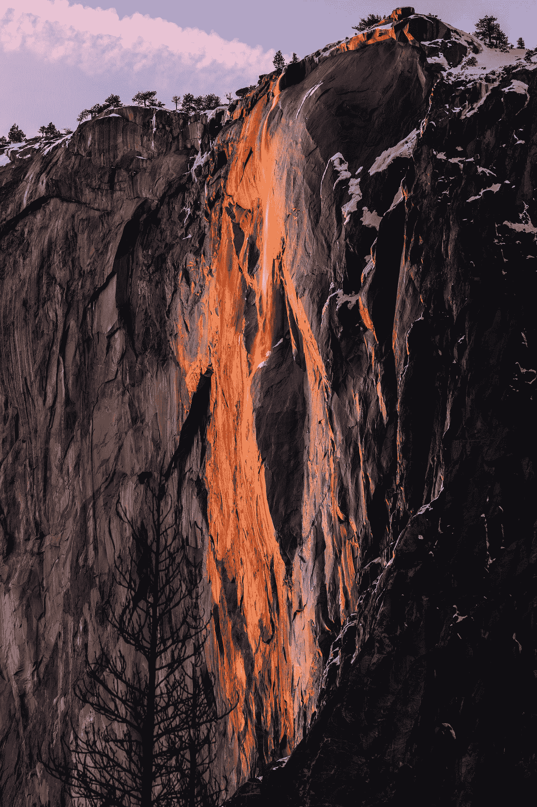

# 🔥约塞米蒂国家公园的野火建模

> 原文：<https://towardsdatascience.com/wildfire-modeling-in-yosemite-national-park-666f45c9a0a0?source=collection_archive---------21----------------------->



[李晟](https://unsplash.com/@parachutel_?utm_source=medium&utm_medium=referral)在 [Unsplash](https://unsplash.com?utm_source=medium&utm_medium=referral) 上拍照

这篇文章将重点介绍我们在 [Jupyter 笔记本](https://jupyter.org/)中使用[谷歌地球引擎](https://earthengine.google.com/) (GEE)、 [geemap、](https://geemap.org/) [GeoPandas](https://geopandas.org/) 和 [GRASS GIS](https://grass.osgeo.org/) 对野火事件建模的教程中最重要的部分。通过我们的教程，你可以在 2020 年夏季在美国加州约塞米蒂国家公园的三个区域进行火灾模拟(`from 2020-06-20 through 2020-09-22`)。它有三个主要部分:**获取数据、导入数据和 Wildfire 模拟。**

本教程源于[**Mario Gulich 高级空间研究所**](https://ig.conae.unc.edu.ar/) 组织的使用 GRASS GIS 软件进行地理空间数据处理和分析研讨会的最终工作，由 [Veronica Andreo 博士授课。](https://veroandreo.gitlab.io/)

> 我们教程的完整代码可以在:[https://github.com/acoiman/wildfire_modeling](https://github.com/acoiman/wildfire_modeling)找到

# 1.获取数据

获取模型所需的数据可能是一项艰巨的任务。有时，数据不容易获得，因为它们很少或分散在广泛的来源中。在本节中，我们将向您展示一种为 wildfire 建模目的轻松收集数据的方法。下表显示了本教程中使用的数据。

本教程假设您正在一个 Jupyter 笔记本和一个 Python 环境中工作，其中包含所有必需的包。您还需要安装最新版本的 GRASS GIS 并拥有一个有效的 GEE 帐户。我们的 Python 环境基于 Ubuntu 20.04 上的 Anaconda 安装。您需要安装以下不包含在 Anaconda 中的包:Geopandas、GEE Python API、eeconvert、geemap。

# 1.2 从 GEE 下载数据

我们将调用 WDPA 要素集合(FC)并提取约塞米蒂国家公园多边形。我们将把提取的 FC 转换为地理数据框架(GDF ),并将其作为 shapefile 保存到我们的工作目录中。

```
# get World Data Protected Areas (WDPA) FeatureCollection
pa = ee.FeatureCollection("WCMC/WDPA/current/polygons")# Yosemite National Park polygon
filter = ee.Filter.inList('NAME', ['Yosemite National Park'])
yosemite = pa.filter(filter)# transform Yosemite fc into gdf
yosGDF = eeconvert.fcToGdf(yosemite)# convert gdf into shp
yosGDF.to_file("gisdata/yosemite/shp/yosemite.shp")
```


作者照片

为了从 GEE 获得 100 小时的燃料湿度、风向和风速数据，我们首先需要调用 GRIDMET ImageCollection 并按日期过滤。其次，我们将创建一个矩形，用于裁剪数据。接下来，我们将选择所需的数据并计算模式。生成的图像将被裁剪为之前创建的多边形。之后，我们将创建 2000 个随机点，用于使用平均值对图像进行采样。最后，生成的 FC 将被转换为地理数据框架，并作为 shapefile 保存到我们的工作目录中。

```
# load GRIDMET ImageCollection
gridmet = ee.ImageCollection('IDAHO_EPSCOR/GRIDMET').filter(ee.Filter.date('2020-06-20', '2020-09-22'));# create a rectangle
coords = [-120.10157709250639,37.36645735913506,-118.99122199244081,38.31280791348237]
bbox = ee.Geometry.Rectangle(coords)# select 100-hour dead fuel moisture (fm100) and calculate the mode
fm100 = gridmet.select('fm100').mode()
# clip data to rectangle
fm100_clip =fm100.clip(bbox)# create 2000 random points
fm100_points = ee.FeatureCollection.randomPoints(bbox, 2000);
# sample points using the mean
samplefm100 = fm100_clip.reduceRegions(**{
  'collection':fm100_points,
  'reducer':ee.Reducer.mean(), 
  'scale': 4000, 
  });# transform fc into gdf
samplefm100GDF = eeconvert.fcToGdf(samplefm100)# convert gdf into shp
samplefm100GDF.to_file("gisdata/yosemite/shp/samplefm100.shp")
```

我们将通过调用 Landsat 8 Collection 1 Tier 1 32 天 EVI 合成图从 GEE 下载 [EVI](https://en.wikipedia.org/wiki/Enhanced_vegetation_index#:~:text=The%20enhanced%20vegetation%20index%20(EVI,a%20reduction%20in%20atmosphere%20influences.) 数据，使用 Yosemite FC 按日期和边界过滤。接下来，我们将计算一个平均图像，并使用之前创建的多边形对其进行裁剪。最后，剪辑后的图像将被导出到我们的 Google Drive 存储器中，然后我们将它下载到我们的工作目录中。

为了运行我们的火灾模拟，我们需要一个由美国农业部林务局定义的燃料模型。在这种情况下，我们将使用 https://landfire.cr.usgs.gov/fbfm13.php 的[提供的 13 Anderson Fire Behavior 燃料模型。该模型有 13 类燃料，其负载、分布和颗粒大小各不相同(Petrasova 等人，2018 年)。](https://landfire.cr.usgs.gov/fbfm13.php)

# 2.导入数据

现在，我们将继续导入从 GEE 和其他来源下载的数据。这一部分包括设置我们的 GRASS GIS 环境和导入数据本身。

当在 Jupyter 笔记本中设置 GRASS 时，我们使用 Python 来初始化 GRASS GIS。首先，我们创建一个 GRASS GIS 运行时环境，方法是传递一个变量 GRASS GIS“所在”的目录，并将其绑定到 Python 目录。接下来，我们导入 GRASS GIS 包。之后，我们设置默认字体显示和覆盖行为，以避免每次执行命令时添加`— overwrite '标志。

```
# create GRASS GIS runtime environment
gisbase = subprocess.check_output(["grass", "--config", "path"], text=True).strip() # directory where GRASS GIS lives
os.environ['GISBASE'] = gisbase
sys.path.append(os.path.join(gisbase, "etc", "python"))# import grass gis package
import grass.script as gs
import grass.script.setup as gsetup
from grass.pygrass.modules import Module
from grass import script
from grass.pygrass.modules.shortcuts import raster as r, vector as v, general as g, display as d
from grass.pygrass.modules import Module as run_command
import grass.imaging as imaging# default font displays
os.environ['GRASS_FONT'] = 'sans'# overwrite existing maps
os.environ['GRASS_OVERWRITE'] = '1'
gs.set_raise_on_error(True)
gs.set_capture_stderr(True)
```

我们之前需要使用 GUI 在 GRASS GIS 中创建一个位置来运行以下单元。在我们的例子中，我们创建了一个名为 yosemite_3310_2 的位置和一个名为 wf_mod_2 的地图集。

```
# set GRASS GIS session data
cfile = gsetup.init(gisbase, "grassdata", "yosemite_3310_2", "PERMANENT")# create a new maset inside yosemite_3310_2 location
g.mapset(flags='c', mapset='wf_mod_2', location='yosemite_3310_2')# set GRASS GIS session data
cfile = gsetup.init(gisbase, "grassdata", "yosemite_3310_2", "wf_mod_2");
```

# 2.2 加载数据

在这一小节中，我们将上传运行火灾模拟所需的所有数据集。

```
# import Yosemite National Park vector
script.run_command('v.import', input='gisdata/yosemite/shp/yosemite.shp',output='yosemite')# import evi raster
script.run_command('r.import', input='gisdata/yosemite/raster/evi.tif', output='evi',resolution='value', resolution_value=30.0)# import fm 100h samples
script.run_command('v.import', input='gisdata/yosemite/shp/samplefm100.shp',output='samplefm100')# import vs (wind velocity) samples
script.run_command('v.import', input='gisdata/yosemite/shp/samplevs.shp', output='samplevs')# import th (wind direction) samples
script.run_command('v.import', input='gisdata/yosemite/shp/sampleth.shp',output='sampleth')# import landsat image
script.run_command('r.import', input='gisdata/yosemite/raster/landsat/landsat.tif',output='landsat',resolution='value', resolution_value=30.0);
```

GRASS GIS 最大的特点之一是有一个不断增长的[插件列表](https://grass.osgeo.org/download/addons/)，可以很容易地安装在您本地的 GRASS GIS 中，并用于执行特定的分析。在我们的例子中，我们没有从 GEE 下载 DEM，而是使用了 [*模块。*](https://grass.osgeo.org/grass78/manuals/addons/r.in.nasadem.html)

```
r.in.nasadem user="my_nasa_user" password="my_nasa_pw" output=dem memory=2000 resolution=30
```

# 3.野火模拟

在我们的教程中，我们模拟了约塞米蒂国家公园三个地区的野火蔓延，见下图。我们将从每个区域的导入数据中获取新数据，模拟不同持续时间的火灾事件，并可视化野火传播。这篇文章只向你展示了我们如何在第三个研究区域模拟野火。


作者照片

# 3.1 研究区域 3

3 号研究区位于约塞米蒂国家公园的中东部。主要的可燃物类型是覆盖面积为 29.70%的封闭木材凋落物和覆盖面积为 21.67%的木材(草地和林下植被)。要了解更多关于燃料种类的信息，请点击[这里](https://iftdss.firenet.gov/firenetHelp/help/pageHelp/content/10-mapstudio/files/fbfmsummaries.htm)。根据:USGS 国家土地覆盖数据库(Yang et al .，2018)，该地区主要由常绿林(51%)、灌木/灌丛(34%)和草地/草本(5%)覆盖。

# 3.2 计算数据

野火事件建模分为两步。首先，我们执行 GRASS [r.ros](https://grass.osgeo.org/grass78/manuals/r.ros.html) 模块，该模块生成扩展率(ros)栅格地图。其次，我们运行 GRASS [r.spread](https://grass.osgeo.org/grass79/manuals/r.spread.html) 模块来模拟椭圆各向异性扩散。

由于我们假设有风且地形陡峭，r.ros 模块需要以下输入:

> - moisture_1h: *包含 1 小时燃油湿度(%)的光栅图。*
> - moisture_live: *包含 live 燃料水分(%)的栅格地图。
> -* 速度:*包含风速的栅格地图(英尺/分钟)。* -方向:*包含风向(度)的栅格地图。* -坡度:*包含坡度(度)的栅格地图。* -坡向:*包含坡向度数的光栅地图。*

为了完成这项工作，我们将创建并应用一个 Python 函数。

```
caldata('sa_2R', '_sa_2')
```

# 3.3 建模

现在，我们将为我们的研究区域 3 运行 *r.ros* 模块。

```
# generates rate of spread raster map
r.ros(model='fuel', moisture_1h='moisture_1h_sa_3', moisture_live='lfm_sa_3_scaled', velocity='wind_speed_sa_3', direction='wind_dir_sa_3', slope='slope_sa_3', aspect='aspect_sa_3',elevation='dem', base_ros='out_base_ros',max_ros='out_max_ros',direction_ros='out_dir_ros',spotting_distance='out_spotting');
```

接下来，我们将创建一个点栅格地图，它将被用作我们的火焰模拟的源。

```
# create a vector map from an ASCII points 
script.run_command('v.in.ascii',input='gisdata/yosemite/csv/source_3.txt',output='source_3', separator='comma')# rasterize vector map 
script.run_command('v.to.rast', input='source_3', output='source_3', type='point', use='cat');
```

通过 r.spread 模块，我们将模拟 32 小时的野火事件。我们的第一个模拟周期是 480 分钟(8 小时)，因为当前模拟的初始时间是 0(默认值)，我们的滞后是 480 分钟。请注意，我们使用“s”标志，因为我们正在考虑[定位距离](https://www.nwcg.gov/publications/pms437/crown-fire/spotting-fire-behavior#TOC-Estimating-Maximum-Spotting-Distance)。

```
# elliptically anisotropic spread simulation 8 hours source 3
r.spread(flags="s", base_ros='out_dir_ros', max_ros='out_max_ros',direction_ros='out_dir_ros', start='source_3',spotting_distance='out_spotting', wind_speed='wind_speed_sa_3', fuel_moisture='moisture_1h_sa_3', output='spread_8h_s3', lag=480)# elliptically anisotropic spread simulation 24 hours source 3
script.run_command('r.spread', flags='si', base_ros='out_dir_ros', max_ros='out_max_ros',direction_ros='out_dir_ros', start='spread_16h_s3',spotting_distance='out_spotting', wind_speed='wind_speed_sa_3',fuel_moisture='moisture_1h_sa_3', output='spread_24h_s3', lag=480, init_time=960);
```

执行 r.ros 和 r.spread 模块后，我们现在可以可视化我们的结果。在这种情况下，我们将使用 GRASS GIS 命令创建四个框架。每一帧将包含每个时间滞后的扩散栅格的速率、指示模拟源的矢量、Landsat 图像的 CIR(彩色红外)合成以及相应的标题、图例、比例和指北针。

```
# display monitor and save image file
d.mon(start='cairo', output='gisdata/yosemite/images/sa_3_frame.png', width=800, height=700)# remove all frames
d.frame(flags='e')# frame spread_8h_s3# create upper-left frame
d.frame(flags='c', frame='first', at=(50,100,0,50))# add raster map landsat cir
d.rast(map='landsat_cir_sa_3')# add raster map spread_8h_s3
d.rast(map='spread_8h_s3')# add vector map source_3
d.vect(map='source_3', size=25, icon='basic/pin_dot', color='green',legend_label='Source 3')# add title
d.text(text='Fire Spread 8h', bgcolor=('255:255:204'),color='black', size=6)# add north arrow
script.run_command('d.northarrow', flags='t', style='9',at=(85,85), fill_color=('0:0:0'),color='none')# add raster legend
script.run_command('d.legend', flags='sb', raster='spread_32h_s3_reclass',at=(5,60, 81, 83), title='Spread (%)', title_fontsize= 7, bgcolor=('255:255:204'), border_color='none')# add vector legend
script.run_command('d.legend.vect', flags='b', at=(7,15), symbol_size=10, fontsize=12,border_color='none', bgcolor=('255:255:204'))# add bar scale
script.run_command('d.barscale', bgcolor=('255:255:204'), at=(40,10), style='line',length=2, units='kilometers', width_scale=0.5)
...
```


作者照片

最后，我们将使用 GRASS GIS 图像包创建可视化的动画 gif 图像。

```
# create the animated gif with GRASS Python imaging package
imaging.images2gif.writeGifPillow('gisdata/yosemite/images/Animation_Sa_3_2.gif',images, duration=2, repeat=True)
```


作者照片

# 4.结论

本教程演示了我们可以将 GRASS GIS、Google Earth Engine 和 Jupyter Notebook 集成到一个独特的开发环境中。但是，为了将 GEE 和 Geopandas 对象传递到 GRASS GIS 模块中，还需要做更多的工作。

我们可以模拟受过去火灾事件影响的地区的野火，以比较模拟和真实的火灾。

火灾模拟的结果表明，输出栅格不会与非植被区域重叠。在我们的例子中，火灾模拟在大区域表现更好，因为我们的基本空间分辨率是 30 米，这适合于区域尺度的研究。

> 一如既往，欢迎任何与此相关的反馈！

# 5.参考

彼得拉索娃、哈蒙、佩特拉什、大不里士和米塔索娃(2018 年)。野火蔓延模拟。开源 GIS 的有形建模(第 155-163 页)。斯普林格，查姆。

杨、l、金、s、丹尼尔森、p、霍默、c、加斯、l、凯斯、a、科斯特洛、c、德维茨、j、弗莱、j、芬克、m、格兰内曼、b、里格、m 和 g .西安。2018，新一代美国国家土地覆盖数据库:需求、研究重点、设计和实施策略，第 108–123 页。