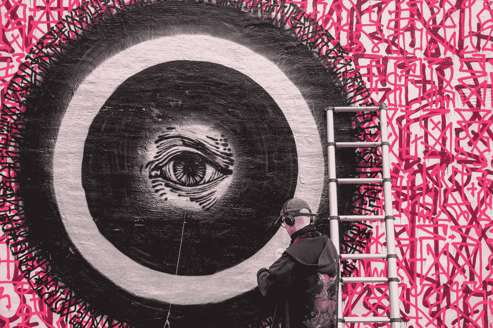
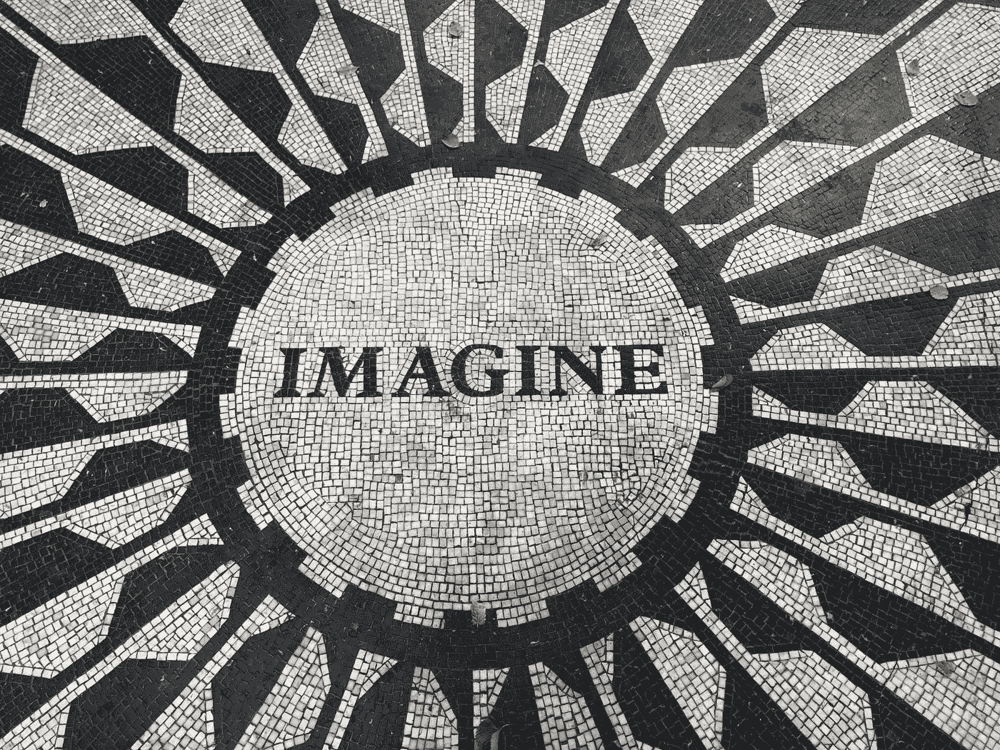
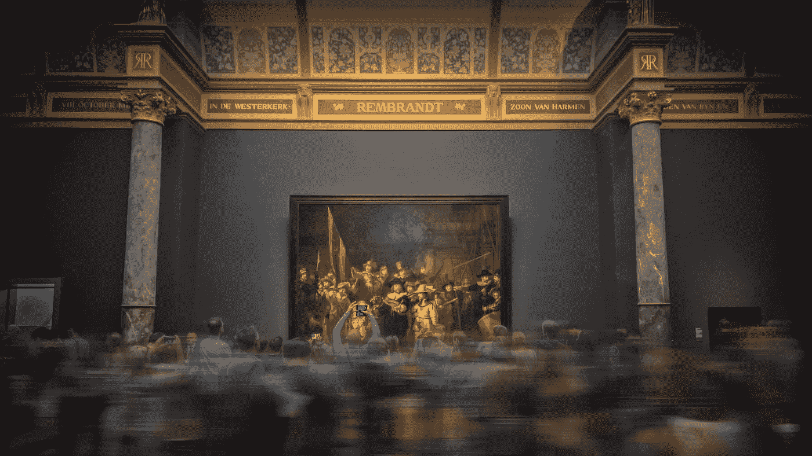
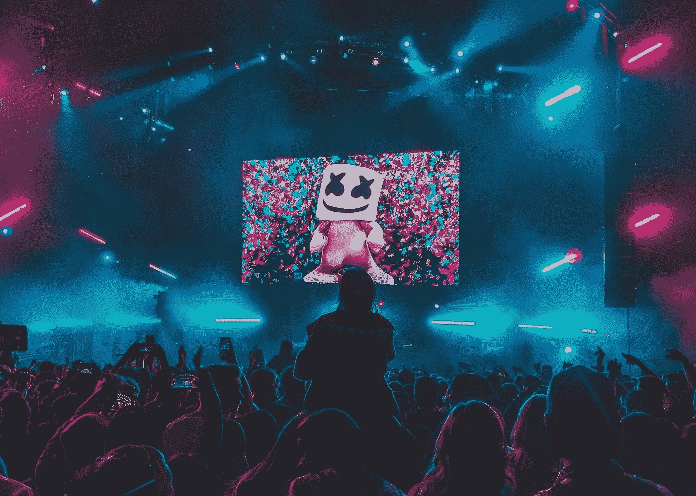
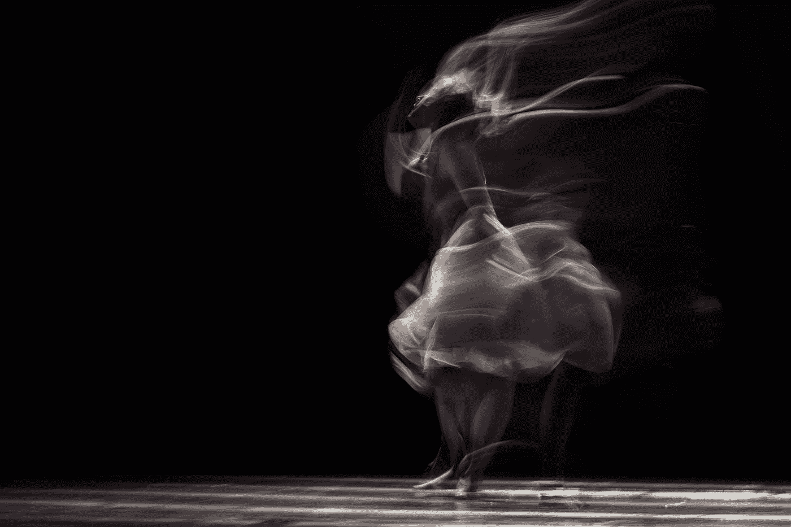
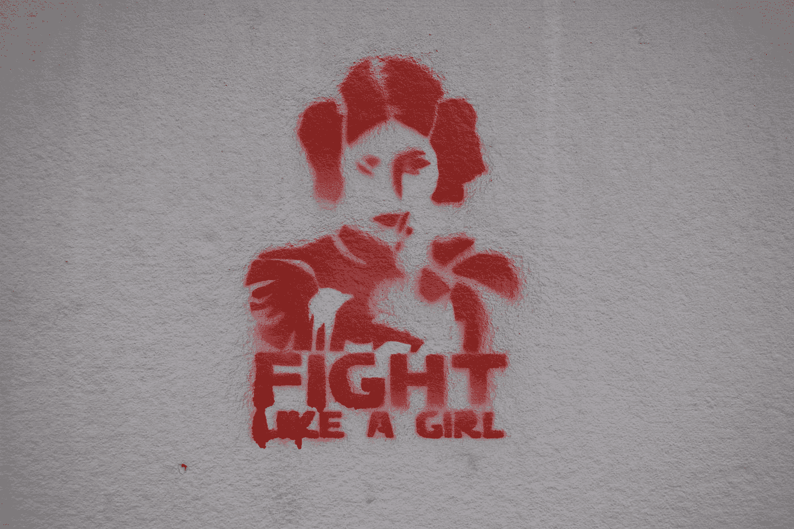
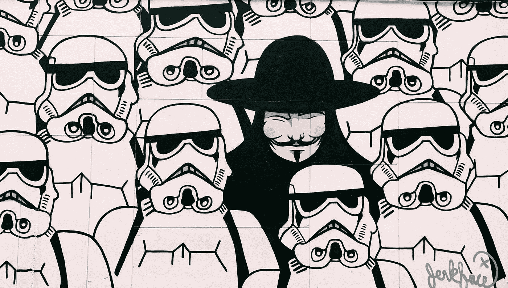

# 人工智能会很快取代我们的艺术家吗？

> 原文：<https://towardsdatascience.com/will-ai-replace-our-artists-any-time-soon-81433ebc62a?source=collection_archive---------28----------------------->

## 超越创造力前沿的人工智能之旅

尼古拉·约翰尼·米尔科维奇在 [Unsplash](https://unsplash.com?utm_source=medium&utm_medium=referral) 上的照片

人类的创造力似乎是人工智能(AI)的最后一个前沿。许多人声称人工智能擅长各种事情，它的表现超出了人类的预期，但展示创造力将是一个挑战。创作过程仍然神秘莫测。我们可以使用技术来培养创新思维，但最终，我们并不完全确定它是如何发生的。由于缺乏对我们自身生物过程的了解，科学家很难在机器上复制它们。尽管有这些限制，我们在使用人工智能创造创新杰作方面还没走多远。

照片由[杰瑞米·贝克](https://unsplash.com/@beckchileno?utm_source=medium&utm_medium=referral)在 [Unsplash](https://unsplash.com?utm_source=medium&utm_medium=referral) 拍摄

当涉及到文本内容时，AI 非常擅长处理文字。我们可以列出过去的各种例子，人工智能诗歌与人类创作的诗歌难以区分。很好奇的是，2016 年，一篇名为《电脑写小说的那一天》的文字曾被提交给日本的一个短篇小说比赛。这部小说遵循一个计算机程序，因为它实现了作为作家的能力，同时放弃了预编程的职责。该文本完全是使用人工智能编写的，并成功通过了第一轮比赛。

由[瓦茨拉夫·pluhař](https://unsplash.com/@vaclavpluhar?utm_source=medium&utm_medium=referral)在 [Unsplash](https://unsplash.com?utm_source=medium&utm_medium=referral) 上拍摄的照片

绘画也是由人工智能产生的。2018 年，佳士得拍卖行收到了一幅名为《爱德蒙·德·贝拉米的肖像》的画作。令人难以置信的是，它是由一个人工智能系统使用模仿人类认知的过程创建的。人工智能最初接触了数百幅风格相似的绘画，然后被要求生成数百幅潜在的图片。最终选择了符合这种风格但又与其他作品有很大不同的图片。尽管它的创作者最初认为他们可以从中赚几千美元，但实际上，这幅画以近 50 万美元的价格售出，今天被认为是第一件由机器创作的艺术品。

Aditya Chinchure 在 [Unsplash](https://unsplash.com?utm_source=medium&utm_medium=referral) 上拍摄的照片

使用人工智能创作数字音乐甚至歌曲已经被研究了很长时间。音乐相对简单，因为系统可以从各种可用的曲调中获得灵感。事实上，近年来已经有很多创造 AI 曲调的尝试。英国国王学院(King's College)一个名为“反馈循环”(Feedback Loops)的令人兴奋的项目使用人工智能来看一名舞蹈演员，并以旋律的形式解释她的动作。但是用歌词创作一首真正的歌完全是另一回事。几个月前，多伦多大学创建了一个人工智能系统，其任务是听 100 个小时的在线圣诞音乐，并创作第一首人工智能圣诞颂歌。结果被描述为有点乏味，不合节日气氛，令人不安。因此，人工智能凭借其首支圣诞单曲将玛丽亚·凯瑞挤出前 10 名还需要一段时间。

照片由 [Ahmad Odeh](https://unsplash.com/@aoddeh?utm_source=medium&utm_medium=referral) 在 [Unsplash](https://unsplash.com?utm_source=medium&utm_medium=referral) 上拍摄

舞蹈和戏剧也是艾的拿手好戏。我们看过各种艾积极参与表演的节目。马耳他大学创造了虚拟化身与人类舞者共舞。在 2020 年的新年前夕，波士顿动力公司——生产世界上最先进的机器人的公司——发布了一套独特的舞蹈设计。它的四个机器人正在表演 Contours 的热门歌曲“你爱我吗？”结果是相当了不起的，超出了大多数人的能力。更令人印象深刻的可能是无人机展示，它使用大约 500 架无人机在空中创建移动的 3D 形状。它们被用来庆祝 2020 年的苏格兰新年前夜和其他重大的世界性事件。

如今，剧院背景也是由人工智能生成的。被操纵的图像已经存在很多年了。Photoshop(用来编辑图片的最有效的程序之一)可以修改现有的场景，甚至通过一些努力创建假的场景。然而，就在去年，Nividia 宣布了 GauGAN，这是一个令人印象深刻的人工智能系统，能够将孩子们喜欢的涂鸦转换成高分辨率的照片。一条简单的带圆圈的线变成了湖边瀑布的逼真图片。从而创建高分辨率，逼真的动态背景。

照片由 [Marija Zaric](https://unsplash.com/@simplicity?utm_source=medium&utm_medium=referral) 在 [Unsplash](https://unsplash.com?utm_source=medium&utm_medium=referral) 上拍摄

计算机生成图像(或 CGI)已被广泛用于电影中，以创建从灾难性灾难到动画角色的各种重建。最近的时尚似乎是创造虚拟演员。这些演员是为了取代真正的演员，他们可能因为太贵而无法合作，并且不严格按照导演的指示行事。在某些情况下，他们被用来代替死去的或年纪太大的演员。据说，60 多年前去世的神话演员詹姆斯·迪恩将出演一部名为《寻找杰克》的电影。在《星球大战》电影《星球大战外传：侠盗一号》中，由于凯丽·费雪(莱娅公主的原始女演员)已经衰老，年轻公主的数字身体被创造出来，她的面部表情保持不变。然后人工智能被用来简单地填充这些点。

照片由[乔恩·泰森](https://unsplash.com/@jontyson?utm_source=medium&utm_medium=referral)在 [Unsplash](https://unsplash.com?utm_source=medium&utm_medium=referral) 拍摄

所以在合成中，人工智能既可以是艺术的天才创造者，也可以仅仅是艺术家使用的工具。当然，这引发了很多问题，比如人工智能艺术的功劳归谁？是程序的问题吗？但是它没有法人实体！程序员呢？程序员创造了算法，它可以指导人工智能获取新知识。但是就像师傅带徒弟一样，它并不能决定学习什么！当然，这场辩论没有结论，并将在未来几年继续激烈进行。但我们应该以开放的观点来看待它，拥抱技术，并接受我们可以通过将人工智能与艺术相结合来达到新的不可想象的高度。

*如果您喜欢这篇文章，并想联系我，请联系我🐦*<https://twitter.com/alexieidingli>**，🔗*[*LinkedIn*](https://www.linkedin.com/in/alexieidingli/)*，📷*[*insta gram*](https://www.instagram.com/alexieidingli/)*或者😊* [*脸书*](https://www.facebook.com/alexieidingli/) *。**

*</a-new-culture-time-f555fcd351aa>  </fake-new-world-876a633e86c9>  </printing-my-takeout-7abfc28ce415>  

[**阿列克谢·丁力教授**](http://www.dingli.org/) 是马耳他[大学](https://www.um.edu.mt/)的 AI 教授。二十多年来，他一直在人工智能领域进行研究和工作，协助不同的公司实施人工智能解决方案。他的工作被国际专家评为世界级，并赢得了几个当地和国际奖项(如欧洲航天局、世界知识产权组织和联合国等)。他已经出版了几本同行评审的出版物，并成为马耳他[的一员。由马耳他政府成立的人工智能特别工作组，旨在使马耳他成为世界上人工智能水平最高的国家之一。](https://malta.ai/)*