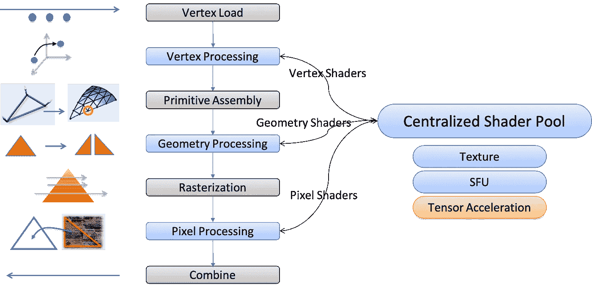
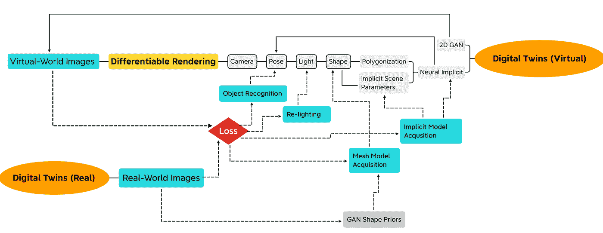

# GPU 会开创计算机架构的新黄金时代吗？

> 原文：<https://towardsdatascience.com/will-the-gpu-star-in-a-new-golden-age-of-computer-architecture-3fa3e044e313?source=collection_archive---------22----------------------->

[米凯拉](https://unsplash.com/@m_hampi?utm_source=unsplash&utm_medium=referral&utm_content=creditCopyText)在 [Unsplash](https://unsplash.com/collections/90388524/landscape-/f8af6073bc11a14f44ab5228968c2f04?utm_source=unsplash&utm_medium=referral&utm_content=creditCopyText) 上拍照

## 促进人工智能软件进一步发展的架构选择

2018 年 6 月 4 日，作为 2017 年图灵奖的获奖者，约翰·汉尼斯和大卫·帕特森在他们的图灵讲座[上讲述了计算机架构的新黄金时代](https://cacm.acm.org/magazines/2019/2/234352-a-new-golden-age-for-computer-architecture/fulltext)。讲座的三个关键观点是:

1.  软件进步可以激发架构创新。
2.  提升硬件/软件接口为架构创新创造了机会。
3.  市场最终解决了架构争论。

我想用第四个观点来修正这三个关键观点，从而完成这个循环:

> 获胜的架构促进了随后的软件进步。

自轩尼诗/帕特森讲座以来，市场可以说已经实现了人工智能的洞察#3，并决定将图形处理单元(GPU)作为促进人工智能革命的获胜架构。在这篇文章中，我探索了人工智能革命如何激发架构创新和重新发明 GPU。我希望回答我自己的一个重要问题:

> GPU 会开创计算机架构的新黄金时代吗？

# 特定领域架构

Henessy 和 Patterson 提出了特定领域体系结构(DSA ),以创新计算机体系结构，并努力迈向新的黄金时代。顾名思义，GPU 是 3D 图形的 DSA。它旨在渲染 3D 虚拟世界的照片级逼真图像；然而，几乎所有的人工智能研究人员都使用 GPU 来探索 3D 图形以外的想法，在人工智能“软件”，也就是神经网络架构方面取得突破。虽然在 3D 中仍然不可或缺，但 GPU 已经成为人工智能的“CPU”，因为它促进了人工智能的软件创新。除了 3D 用途之外，GPU 架构师一直在为非 3D 用途提供 GPU 的计算资源。我们称这种设计理念为通用 GPU (GPGPU)。

如今，我们看到 AI DSAs 取代 GPGPU 的激增，试图用更好的性能取代 GPU。就连 GPU 本身也在双重人格之间挣扎:AI DSA 和 3D DSA。原因是 AI DSA 需要加速张量运算，这在 AI 中很丰富，在 3D 中却没有。同时，3D 固定功能的硬件听起来对 AI 来说是不必要的。

因此，主要架构的争论似乎在问

1.  GPU 会保住 AI“CPU”的宝座吗？
2.  GPU 会不会分叉成两个 DSA，一个用于 AI，一个用于 3D？

我的预测如下:

1.  GPU 硬件/软件接口将使 GPU 成为人工智能的“CPU”。
2.  基于人工智能的渲染将使张量加速成为 GPU 的中流砥柱。
3.  虚拟世界和现实世界相互映射的数字孪生将主宰市场，最终解决架构之争。

# GPU 硬件/软件接口

我们可以将 GPU 在 3D 领域的主导地位和在 AI 领域的巨大成功归因于其硬件/软件接口，这是 GPU 和 3D 图形软件架构师努力拥抱的。这个接口是解决以下矛盾的关键。虽然 GPU 社区继续使 GPU 更加通用，但行业的其他人已经转向更专业的硬件来解决摩尔定律的消亡。

GPU 管道(图片由作者提供)

## 双层可编程性

从概念上讲，GPU 是处理阶段的长线性流水线。不同类型的工作项在管道中流动时被处理。在早期，每个处理阶段都是一个固定功能块。程序员对 GPU 的唯一控制是调整每个块的参数。如今，GPU 硬件/软件接口让程序员可以随心所欲地处理每个工作项目，无论是顶点还是像素。不需要在每个顶点或像素循环中处理循环头，因为 GPU 架构师在固定的函数中实现它。这种架构选择让程序员有责任关注循环体或“着色器”，它通常以工作项的类型命名，例如用于处理顶点的“顶点着色器”和用于处理像素的“像素着色器”。

现代游戏如何用这样的线性流水线制作出惊艳的画面？除了在一次通过管道时控制不同类型的着色器之外，程序员还可以多次渐进地通过管道来产生中间图像，最终产生在屏幕上看到的最终图像。程序员有效地创建计算图，描述中间图像之间的关系。图中的每个节点代表一次通过 GPU 管道。

## 通用计算资源的集中池

通用计算资源的集中池在处理阶段之间共享，并承担繁重的工作。这种方案的最初动机是负载平衡；在不同的使用场景中，处理阶段的工作负载可能会有很大的不同。被称为着色器核心的计算资源已经变得更加通用，以实现灵活性和产品差异化。

GPU 架构师抓住机会将集中式着色器池作为 GPGPU 提供给非 3D 应用程序。这种设计方案使 GPU 能够在运行人工智能任务方面实现突破，即使是作为兼职。

## 平衡专业化

GPU 架构师通过在不改变硬件/软件接口的情况下添加协处理单元来定期“加速”或“指定域”着色器池。纹理单元就是这样一个协处理单元，纹理贴图中的纹理元素通过它被提取并过滤到着色器池。特殊功能单元(SFU)是另一个协同处理单元，执行超越数学功能，如对数、平方根倒数等。虽然拥有多个功能听起来类似于 CPU 中的超标量设计，但有一个显著的区别:GPU 架构师根据“平均”着色器程序使用它的频率来分配协处理单元的吞吐量。例如，我们可以给纹理单元着色器池吞吐量的八分之一，假设纹理操作平均八分之一的时间出现在基准测试或游戏中。当一个协处理单元繁忙时，GPU 会切换任务以保持自己忙碌。

# 三维张量加速

在我的介绍中，我指出 GPU 难以在 3D 中采用张量加速。让我们看看，如果我们改变 GPU 渲染典型游戏帧的方式，这种趋势会如何逆转。GPU 首先为每个像素生成并在 **G-buffer** 中存储着色像素所需的所有信息。从 G 缓冲区，我们计算如何照亮一个像素，然后是几个处理步骤，包括

1.  移除锯齿状边缘(抗锯齿(AA))
2.  将低分辨率图像放大到更高的分辨率(超分辨率(SR))
3.  为整个帧添加特定的视觉效果，如环境遮挡、运动模糊、高光滤镜或景深。

我们称这种渲染方案为[延迟着色](https://en.wikipedia.org/wiki/Deferred_shading)，因为对一个像素的着色是“延迟”的，直到每个像素都得到它需要的信息。我们将光照后的处理步骤称为后处理。今天，后期处理消耗了大约 90%的渲染时间，这意味着 GPU 的屏幕时间主要花在 2D 而不是 3D 上！

英伟达已经展示了基于人工智能的 DLSS 2.0，据称它可以产生比没有 DLSS 2.0 时更好看的图像。此外，NVIDIA 还为光线跟踪提供了基于人工智能的蒙特卡罗去噪，通过它，我们可以使用少量光线来实现只有使用更多光线才能实现的质量。此外，人工智能激发了许多其他类型的后处理的新解决方案，例如用于环境遮挡的 [NNAO](http://daniel-holden.com/media/uploads/other_stuff/nnao.pdf) 和用于景深的 [DeepLens](http://export.arxiv.org/pdf/1810.08100) 。

> 如果基于人工智能的后处理成为主流，张量加速将成为 GPU 个性的 3D 方面的支柱。GPU 分化成 3D DSA 和 AI DSA 的可能性会变小。

# 3D/AI 融合

为了解决架构的争论，我们想要解决最后一个难题:我们是否应该最终移除 3D 渲染中的固定功能硬件，尤其是对 AI 而言？请注意，通过 GPGPU，GPU 可以作为纯“软件”进行 3D 渲染，而无需使用任何固定功能的硬件。

在严格意义上，给定场景参数，3D 渲染模拟光子如何从光源传输通过空间，以与 3D 虚拟世界中的对象进行交互。由 GPU 进行的传统 3D 渲染是这一过程的非常粗略的近似。因此，微软在[公告](https://devblogs.microsoft.com/directx/announcing-microsoft-directx-raytracing/)中称“[传统的基于光栅化的] 3D 图形是一个谎言”，以促进光线跟踪成为“未来的完整 3D 效果”然而，一个 3D 渲染纯粹主义者可能仍然会拒绝光线追踪，在光线追踪中，我们通过追踪光线从像素向后进入 3D 虚拟世界来实现 3D 渲染，这也是不真实的。

这两种方法都近似于基于模拟的 3D 渲染。无论哪种情况，我们都将 3D 虚拟世界的建模或内容创建从渲染中分离出来。在第一种情况下，建模 3D 虚拟世界需要工程师和艺术家进行大量艰苦和创造性的工作来描述每个对象及其与光交互的物理属性。在第二种情况下，关于渲染，完全真实是不可能的，因为我们需要大幅简化 3D 渲染，以满足资源预算内的不同性能目标。

与用最知名的科学知识和数学理论为给定问题找到解决方案相反，人工智能方法是关于从数据中“学习”计算模型或神经网络。我们通过试错法反复调整网络参数。我们通过先前的参数估计向前运行网络，并测量不匹配或“损失”然后，我们根据其梯度调整参数以减少损失，有效地在梯度的相反方向上导航损失景观。这种机制被称为反向传播，它要求沿正向路径的所有计算都是可微分的，以便参与计算梯度。

[神经渲染](https://www.neuralrender.com/assets/downloads/TewariFriedThiesSitzmannEtAl_EG2020STAR.pdf)是一个新兴的人工智能研究领域，使用上述方法研究 3D 渲染。下面是我跟踪神经渲染进展的思维导图:

作者图片

这个 3D 虚拟世界的模型被隐含地表示为神经网络参数(参见 [NeRF](https://www.matthewtancik.com/nerf) 、[格拉夫](https://autonomousvision.github.io/graf/)、[长颈鹿](https://m-niemeyer.github.io/project-pages/giraffe/index.html))，这些参数是我们通过比较真实世界的图像和我们从虚拟世界渲染的图像而推断出来的。然后我们反向传播比较的梯度来调整神经网络参数。可选地，我们可以从数据中学习显式 3D 网格(参见[深度行进立方体](https://openaccess.thecvf.com/content_cvpr_2018/papers/Liao_Deep_Marching_Cubes_CVPR_2018_paper.pdf)、 [GAN2Shape](https://xingangpan.github.io/projects/GAN2Shape.html) )。实际上，建模 3D 虚拟世界与学习神经网络参数是一回事。这一过程要求我们在前进路径中包括 3D 渲染管道，并在紧密循环中集成 3D 虚拟世界的建模和渲染。通过反复渲染和测试真实世界的图像，我们获得了所需的模型和场景参数，我们可以用它们来渲染虚拟世界的新视图。

在这个框架内，我们可以选择不调整每个参数的整体，例如，保持一个物体的形状不变，但估计它的位置(见 [iNeRF](http://yenchenlin.me/inerf/) )。通过这种方式，我们可以有效地识别和定位有问题的对象，而不是对其进行建模。建模和识别任务之间不再有区别。相反，这是一个我们想要“学习”或“估计”哪些场景参数的问题

# 结论

因此，在人工智能问题解决范式下，3D 渲染不仅是关于产生 3D 虚拟世界的照片级逼真图像，而且是为了从真实世界构建虚拟世界。此外，新框架在以下方面重新定义了 3D 和 AI:

1.  3D 渲染成为人工智能训练循环中的一个基本操作
2.  训练，或“梯度下降”，过去只发生在云中训练神经网络，现在是推理的一部分。
3.  照片写实主义和保持真实世界和虚拟世界的一致性一样重要。

数字双胞胎将要求把巨大的和不断变化的真实世界带给它的未开发的双胞胎，并不断保持双胞胎之间的一致性。通过神经渲染获得的虚拟对象需要与经典构建的对象共存。因此，我相信神经渲染和传统渲染将在 GPU 上融合，利用其成熟和高性能的 3D 管道。数字双胞胎的需求将落在未来 GPU 的肩上。为了参与 AI 训练循环的梯度计算，需要在 GPU 端完成工作以变得“可微分”。

假设 GPU 变得天生可微分和张量加速，以响应 3D 中人工智能的进步，我预见 GPU 的双重人格将成为一个。

> 然后，GPU 保持了其作为首选架构的地位，以促进人工智能中的进一步软件进步，并最终开启了计算机架构的新黄金时代。