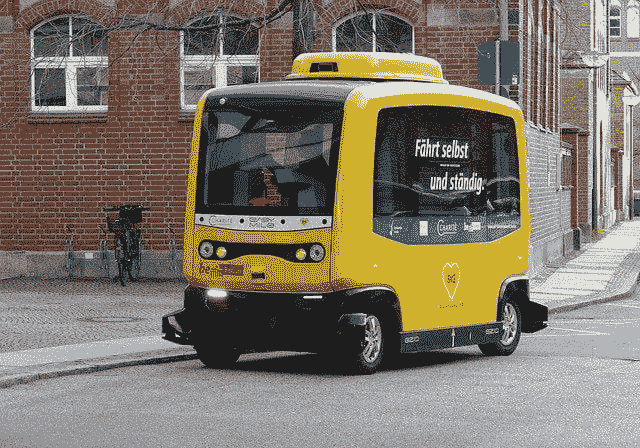
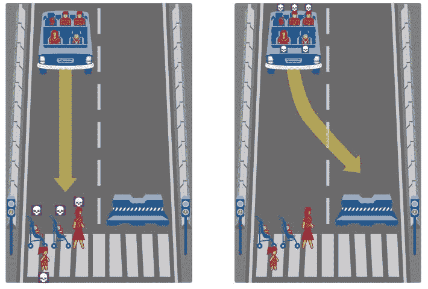
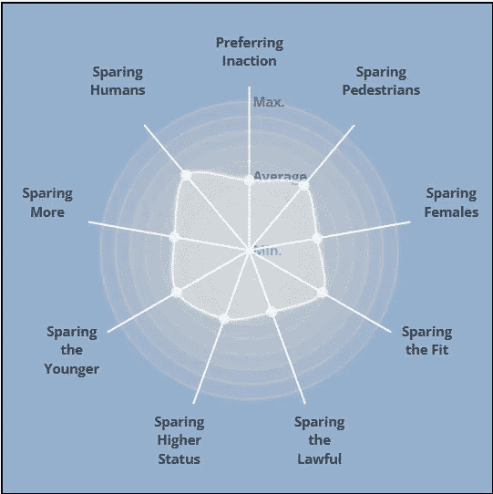

# 你会让自动驾驶汽车做出道德决定吗？

> 原文：<https://towardsdatascience.com/will-you-let-self-driving-cars-make-moral-decisions-43f23139ba5c?source=collection_archive---------31----------------------->

## 重要的是要思考为什么无人驾驶汽车如此难以实现

来源: [pixabay](https://pixabay.com/photos/vehicle-autonomous-4759347/)

无论你对自动驾驶汽车(AV)有什么感觉，世界上最大的公司似乎都无法投入足够的资金来实现它们。被认为处于领先地位的 Waymo 公司已经花费了惊人的[~ 35 亿美元](https://www.caranddriver.com/news/a30857661/autonomous-car-self-driving-research-expensive/)！这是将极大改变我们日常生活方式的事情之一。

随着 AVs 的出现，我们希望看到交通流量效率的提高和更低的碳排放。想想基本上有很多拼车，它们不会在路上暴怒，以非常可预测的方式行动，并能在突发情况下做出瞬间决定。这对鹿来说可能更好🦌宾夕法尼亚州的人口也是如此。

对于像优步这样的公司来说，这意味着更可预测的司机供应，而对于司机来说，这可能意味着大规模的失业和再培训需求。但是，在我们超越自我，开始担心我们的工作，或者为路上少了一些人而庆祝之前，思考一下为什么无人驾驶汽车如此难以实现是至关重要的。

# 进退两难

几十年前，即使是今天的智能手机也会被认为是“不可能的”。回顾技术的巨大飞跃，我们有时会忘记引领我们走到今天的渐进式变革。因此，唯一合理的假设是汽车也将演变成 AVs，甚至可能是我们甚至不认为是汽车的东西。

问题并不在于制造无人驾驶汽车的技术方面。那就是我们大多数人现在生活的这个世界，并不是用来对付他们的。我们设计这个世界的思想是让人们来做决定，而不是**机器。**

## 快速决策意味着什么

让我们假设我们有一辆汽车，一辆自动驾驶的汽车，或者一辆安全的汽车。现在 *Sav* 基本上能做你作为司机能做的事，但它能做到精准，不累，用心。基本上 Sav 是最好的驱动。它没有任何瑕疵，它做的每一件事，采取的每一个行动都没有随机性。

一天，你在 *Sav* 里开车，突然，刹车失灵了。 *Sav* ，虽然是个完美的驾驶员，但也不是神仙，只能反应。但你应该庆幸不是你在开车，因为作为人类，我们往往会很恐慌。有压力的情况不是快速做出决定的最佳场所，尤其是那些涉及我们生活的情况。

啊哦，你看到前面有一条人行横道，上面有一些人。 *Sav* 也看到了这一点，并且* **哔哔** *之后，它意识到它只有两种可能的结果。要么转向一边，避免撞到行人，但对你造成致命伤害，要么直行，对随机出现的人造成致命伤害，但救了你的命。

谁应该优先选择生命的道德困境？如果它真的做出了选择，我们作为社会将如何应对？

## 为什么这么重要？

如果你或我在这种情况下，我们会怎么做？很有可能我们甚至无法想到所有可能的结果或确定幸存的概率。我们很可能会等太久才做出决定，然后最终做出一个不合格的决定，很可能伤害到所有相关人员。

那么，如果 *Sav* 做了更优化的事情，为什么会有问题呢？首先，最优是非常主观的。在这种情况下，每个人的最佳选择至少是他们自己的生存。问题不在于我们做了一个糟糕的决定，而在于我们决定背后的意图和推理。

不可否认的事实是，作为人类，我们不擅长做决定。幸运的是，Sav 没有得到同样的好处。当它做出决定时，我们确切地知道它为什么做出决定。不存在随机性。如果它选择拯救一个生命而不是另一个，我们知道它做了一个计算，在那里它赋予人的生命价值。

你希望这些车出现在你的街道上吗？你坐在车里舒服吗？如果 Sav 的公司要求你签署一份免责声明，免除他们的任何责任，你会这样做吗？或者你想预先选择 Sav 应该如何做出这些决定？

# 把道德还给人民？

好的，我们知道 *Sav* 只能根据它的算法来决定生死。我们可以让 Sav 在只有一两个选择的情况下随机行动。但我真的不认为我们作为社会会真的对一些被建造得更加准确和决定性的东西感到高兴，突然选择让生活在一个它完全控制的地方由随机机会决定。

回车，<https://www.moralmachine.net/>****。****

****

**你会选择什么？ *来源* [*刻字机*](https://www.media.mit.edu/projects/moral-machine/overview/)**

**MoralMachine 是麻省理工学院媒体实验室建立的一个平台，用来收集关于我们如何做出艰难决定的观点。这个想法是在我们处于能够正确思考的精神状态时问我们这些问题，就像计算机不会受到周围发生的事情的情绪影响一样。**

**该平台为每个人提供了一组场景，一个接一个，询问汽车应该采取什么行动。无论是两组行人，还是乘客对行人，每一个动作都会导致某种形式的死亡。**

**它变得更加有趣(或令人震惊)的地方是我们被测试我们会赋予什么更多价值的地方。我们是否经常选择去拯救那些更年轻的人？我们区分动物和人类的生命吗？有人乱穿马路有关系吗？**

**由此产生的问题是，政策制定者和汽车制造商是否应该合作使用这些数据，民主地选择 Sav 的行为方式。在一个民主国家，我们投票给我们的政治领袖，以及他们所代表的价值观。即使这些价值观并不适合所有人，也没关系。如果大多数人希望以某种方式实现，他们就赢了。**

> **“但是，当连伦理学家都不能就基本真理——或其近似值——达成一致时，社会怎么能达成一致呢”**
> 
> *****“道德机器”的阴暗面和自动驾驶汽车计算伦理决策的谬误*****

**这就是为什么让道德机器用于任何形式的政策制定都不是一个好主意。当然，我们可以让每个人在人口统计学上做出选择，但这总是会让一些人比其他人更不安全。根据该平台目前的结果，年轻人口可能从中受益。人们基本上不再走在马路旁边。因为总会有比你年轻的人出现在 AV 中，对他们来说你的生命就没那么重要了。**

****

**我们看重什么？来源: [MoralMachine](https://www.media.mit.edu/projects/moral-machine/overview/)**

**同样，人们必须首先权衡进入汽车的风险。这样做，他们冒着让一个更年轻的行人来到车前的风险，触发 *Sav* 的生命价值分配算法，让你知道你的生命价值降低了。**

**这只是我在这里关注的一个特征，想象一下其他少数民族会是什么样子？我们将开始需要一个早晨提醒，提醒我们开车或走路的风险，这取决于我们周围当前的社会人口统计。这太荒谬了。**

# **自驾只是白日梦吗？**

**人工智能中的伦理和道德已成为将越来越多的人工智能融入我们生活的最大挑战之一。公司有盈利的倾向，个人有不同的价值观，他们希望保持真实。任何可用的技术都会有一定的偏见，无论是基于工程师还是组织。**

**对于自动驾驶汽车，我们需要改变设置和评估其行为的框架。**

## **1.重新设计结构**

**当我们想到自动驾驶时，我们想象的是世界的样子，区别在于自动驾驶汽车。相反，也许解决方案还在于更新世界，或者至少交通部门，需要看起来有点不同。人行横道、道路、交通信号灯、停车标志，所有这些都是基于这样一种假设，即人类需要相互协作来维护安全。无人驾驶汽车不一定需要同样的基础设施。类似于地铁系统如何与道路并行，也许我们也需要重新设计城市，以不同于我们目前的方式融入行人。**

## **2.重塑我们的思维方式**

**值得注意的是，尽管道德机器让我们相信 AV 必须基于道德做出决定，但试图将道德和伦理纳入机器并没有真正的好处。因为我们作为人类还不能弄清楚什么是道德上正确的，我们没有办法实际上把它结合到机器中去执行。**

> **问题不在于一辆汽车是否应该为了救五个人而杀死一个人，而是这项技术的引入将如何塑造和改变周围所有人的权利、生活和利益。**
> 
> **[*无轨电车的愚蠢:伦理挑战与自动驾驶汽车*](https://www.brookings.edu/research/the-folly-of-trolleys-ethical-challenges-and-autonomous-vehicles/)**

**这里的论点是，AI 的行为使用概率来确定要做什么。它将基于事件的不同概率，以及采取这些行动的结果的价值，试图最大化总收益。我们不应该也不能将不同人口统计或人口的生活价值观模型化到它的决策中。**

**如果你看过任何机器人试图保护人类免受其害的科幻电影，如“瓦力”，给 AI 分配道德任务通常是事情开始出错的地方。**

**因此，与其关注 *Sav* 在这些一次性情况下会做什么，我们需要了解 *Sav* 实际上是如何做出决策的，并从中消除尽可能多的偏见。思考《道德机器》中提出的道德问题会分散注意力。**

# **资源**

*   **[人们想要有功利主义道德观的无人驾驶汽车，除非他们是乘客](https://spectrum.ieee.org/people-want-driverless-cars-with-utilitarian-ethics-unless-theyre-a-passenger)**
*   **无人驾驶汽车的困境揭示了道德选择并不普遍**
*   **[无轨电车的愚蠢:伦理挑战和自动驾驶汽车](https://www.brookings.edu/research/the-folly-of-trolleys-ethical-challenges-and-autonomous-vehicles/)**
*   **[“道德机器”的阴暗面和自动驾驶汽车计算伦理决策的谬误](https://www.tandfonline.com/doi/abs/10.1080/17579961.2021.1898310?journalCode=rlit20)**

***原载于 2021 年 9 月 28 日 https://wordsbywaseh.com*<https://wordsbywaseh.com/will-you-let-self-driving-cars-make-moral-decisions/>**。****