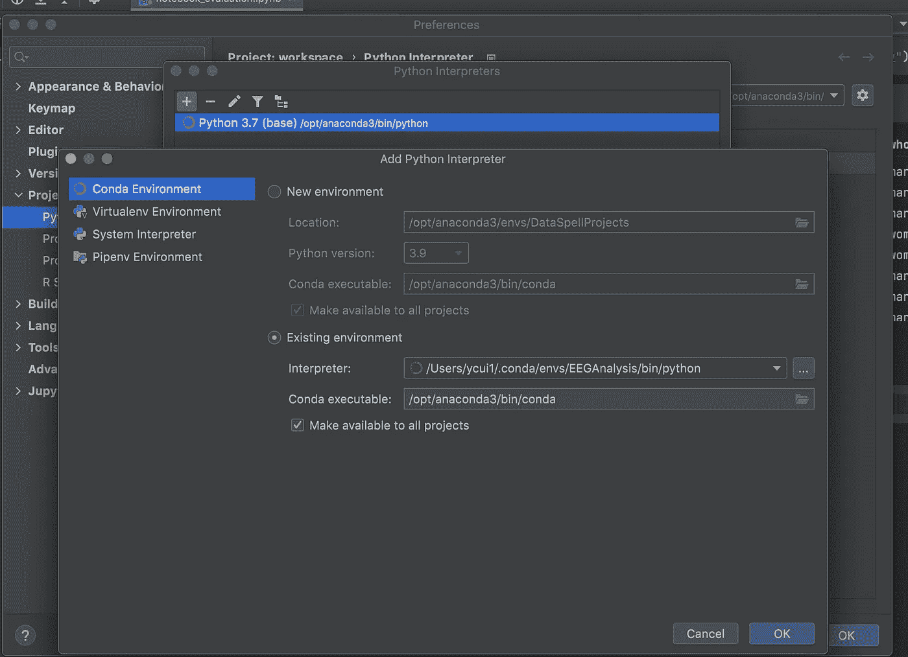

# 你会从 PyCharm 转向 JetBrains 的最新数据科学 IDE DataSpell 吗？

> 原文：<https://towardsdatascience.com/will-you-switch-from-pycharm-to-dataspell-the-latest-data-science-ide-from-jetbrains-ab2a0ef70504?source=collection_archive---------2----------------------->

## 回顾 DataSpell IDE 的主要功能

照片由 [Unsplash](https://unsplash.com?utm_source=medium&utm_medium=referral) 上的[尼克·费因斯](https://unsplash.com/@jannerboy62?utm_source=medium&utm_medium=referral)拍摄

在常见的 Python IDEs 中，PyCharm 是我的最爱，原因有几个:1)。PyCharm 给了我更连贯的用户体验，因为我以前经常使用 AndroidStudio2).出色的自动完成智能，可提高生产率；3).版本控制工具的原生集成(例如 GitHub)；4).虚拟环境易于管理；5)重构和调试是没有痛苦的。

虽然不如其他大型科技企业知名，但 JetBrains 是一家高度创新的公司，它支持广受好评的 Python IDE——py charm，以及其他专业开发的几个行业领先的 IDE，如 WebStorm for web development。

作为一名使用 Python 进行数据处理和分析的科学家，我是 PyCharm 的忠实用户，py charm 支持数据科学家寻找的所有基本特性。我最近得知 JetBrains 发布了一个专门针对数据科学项目的 IDE—[DataSpell](https://www.jetbrains.com/dataspell/)。当然，我试了一下。下面是 DataSpell 必须提供的关键特性的快速总结。

在你决定继续阅读之前，有一点很重要，DataSpell 不会像其他 JetBrains IDEs 一样是免费产品。然而，我猜想他们可能会提供一个教育或社区版本，可以对一些人免费。现在，JetBrains 正在为 DataSpell 运行一个早期访问程序，如果你愿意，你可以[下载](https://www.jetbrains.com/dataspell/)进行评估。

## 整体更好的笔记本电脑体验

虽然 PyCharm 支持 Jupyter 笔记本，但我很少在 PyCharm 中编辑或运行笔记本，因为它肯定不会像其他笔记本编辑器一样提供最佳的笔记本体验，例如 JupyterLab，甚至是在 Python 扩展中正式集成了笔记本支持的 VS Code。PyCharm 的一个特别的缺点是它的接口将代码单元从输出中分离出来，提供了一种支离破碎的体验。

DataSpell 通过提供一个类似于 JupyterLab 的接口解决了这个问题。本质上，输出就在电池的正下方——非常简单。此外，常见的快捷键与 JupyterLab 或 VS 代码对单元格的操作相同，如 a 在当前单元格之前添加一个单元格，b 在当前单元格之后添加一个单元格，shift + enter 运行当前单元格并添加一个新单元格。

## 与数据框的良好互动

当您将数据帧显示为输出时，DataSpell 可以显示整个数据帧，而不会在数据帧很大时屏蔽一些数据，这与其他笔记本编辑器不同。当数据帧很大时，DataSpell 会自动添加一个滚动条，允许您滚动查看整个数据集。

同时，您可以通过单击列名轻松地对数据进行排序，这将使用该列按升序或降序对数据帧进行排序(如果您单击它两次)。

如果希望在单个框架中查看更多数据，可以选择在单独的选项卡中打开数据框架。下图向您展示了这些功能。

数据帧交互性

## 智能编码辅助

正如我前面提到的，我非常欣赏 PyCharm 对编码智能的支持，比如有效的自动完成建议。DataSpell 完全继承了这个特性。当您在单元格中编写代码时，您可以获得与在 PyCharm 中编写 Python 脚本文件相同的待遇。

我知道 JupyterLab 通过第三方插件提供了相同的编码支持，但并不总是有效，而且很慢(当它有效时)。从动画图像中可以看到，DataSpell 几乎是立即快速提示可能的候选对象。您的编码生产率可以显著提高。

编码帮助

## 版本控制集成

有专业软件开发团队工作经验的人应该熟悉版本控制系统。然而，对于一些独立工作的数据科学家来说，这不一定是真的。如果你还没有开始使用版本控制工具，你必须查找它们。其中，最常见的是 GitHub。要开始创建主分支，您只需点击 GitHub 上的 VCS ->共享项目，系统会提示您输入您的帐户。

GitHub 上的共享项目

## 虚拟环境管理

当您使用 Python 一段时间后，您应该已经意识到为您的每个项目设置虚拟环境的重要性。如果您选择编写代码来管理这些环境，那就不太容易了。DataSpell 通过提供一个设置页面，让我们可以轻松地为任何数据科学项目配置虚拟环境，如下所示。值得注意的是，它内置了对 Conda 环境的支持，这是许多数据科学家做出的选择，因此大多数人都不会感到陌生。

使用现有环境

## 数据库连接

没有数据，数据科学家无法开展工作。一个基本的数据源是各种数据库。随着技术的发展，出现了许多不同种类的数据库，如 SQLite、Microsoft SQL 数据库、Oracle 和 PostgreSQL。所有这些主要类型都由 DataSpell 通过点击和连接步骤来支持。

数据库连接

## 终端、Python 控制台等等

你并不总是在 Jupyter 笔记本或 Python 脚本上工作。有时，您可能会发现打开终端或 Python 控制台来执行一些其他工作非常方便。例如，当我使用 Streamlit 构建一个网站时，我需要使用终端来启动网站进行测试。DataSpell 通过提供终端的内置支持，让我们变得很容易。

同样重要的是可以方便地访问 Python 控制台。这在您编写 Python 脚本时非常有用，您可以在控制台中请求某些代码行，这样您就可以快速评估性能，而无需运行整个脚本。与此功能相关的是，DataSpell 和 PyCharm 一样支持科学模式，在这种模式下，您可以在脚本中启用“类似细胞”的功能，一次运行一个细胞。

在您找到终端和 Python 控制台的地方，您会注意到还有许多其他方便的工具，包括 Python 包和问题，您可以在其中查看当前项目中的潜在问题。

底部工具

## 结论

我对 DataSpell 的总体印象是积极的，因为它从 PyCharm 中提取了数据科学项目所需的所有关键功能。换句话说，如果您使用 PyCharm professional 版本，您就拥有了 DataSpell 提供的几乎所有东西——只有一个例外。DataSpell 让笔记本体验好了很多。

虽然这里没有涉及，但同样重要的是 DataSpell 也支持 R，JetBrains 团队正在改进他们对 R 语言的支持，对其他数据科学相关语言的支持，如 Julia，也在计划中。

基于以上种种原因，我一定会在 DataSpell 正式发布时尝试一下。我的数据科学家朋友们，你们呢？