# 威廉姆斯 F1:车队回到正轨了吗？

> 原文：<https://towardsdatascience.com/williams-f1-is-the-team-getting-back-on-track-4f88eca8d33c?source=collection_archive---------20----------------------->

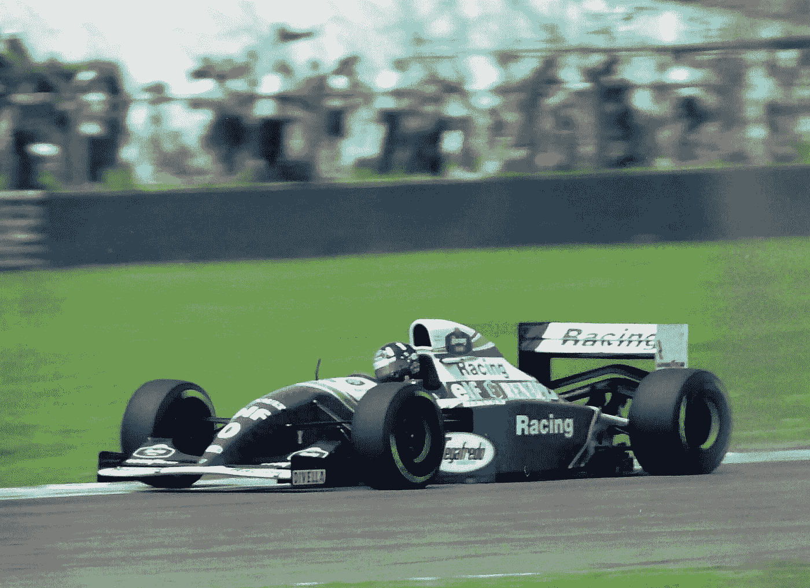

[维基媒体](https://upload.wikimedia.org/wikipedia/commons/d/d6/Damon_Hill_-_Williams_FW16_at_the_1994_British_Grand_Prix_%2832541472155%29.jpg)

## 探索性数据分析

一小群车队对赛车迷的集体想象有着巨大的影响。

当我们想到驱动器、电路，甚至几十年时，某些图像会跃入脑海。90 年代威廉姆斯赛车的霸主地位，加上罗斯曼的车身和雷诺的引擎，就属于这一类。

记忆的直接性不可避免地会消失。如果库存得不到补充，兴奋就会让位于略带褐色的怀旧情绪。

威廉姆斯车队是赢得 1979 年至 2008 年间所有车队冠军和 1984 年至 2008 年所有车手冠军的五支车队之一。它在这项运动遗产中的地位是毋庸置疑的；正如我们所知，车队的辉煌岁月塑造了 f1 的轮廓。

该团队最近的困境与这些令人振奋的成就形成了鲜明的对比。威廉姆斯上一次夺冠是在 2012 年。之前的胜利是在 2004 年。

谷歌在回复关于“威廉姆斯赛车”的查询时给出了这些无情的建议:

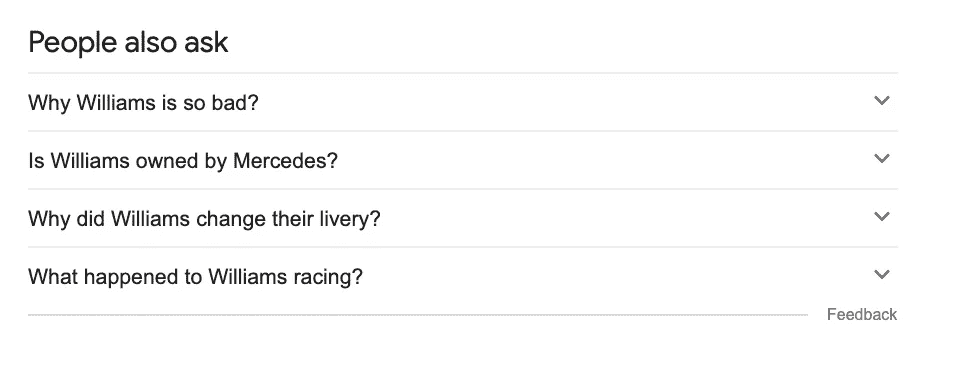

这个由弗兰克·威廉姆斯爵士于 1977 年创建的团队现在由多利顿资本管理。最近的收购提供了所需的资金和战略方向的改变，导致许多人问威廉姆斯是否回到正轨。

我看了看他们远近闻名的过去，看看数据是否表明他们早该回到领先的行列。

# 威廉姆斯赛车:过去

威廉姆斯一共获得了 9 个车队冠军，仅次于法拉利。

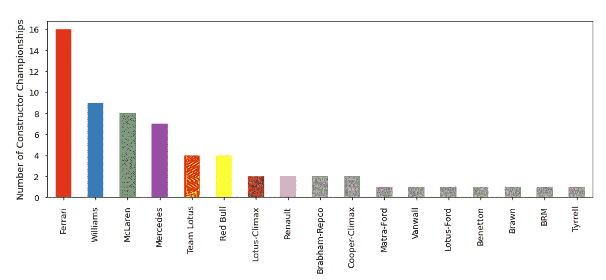

图片:克拉克·博伊德；数据:[卡格尔](https://www.kaggle.com/rohanrao/formula-1-world-championship-1950-2020)

威廉姆斯显然是这里精英俱乐部的一员，与法拉利和迈凯轮一样——但前者保持着健康的领先优势。

自 1950 年 F1 成立以来，法拉利是唯一一支在每届锦标赛中都有赛车参赛的车队，尽管他们因与组织者发生争执而错过了第一场比赛。

自 1977 年以来，威廉姆斯驾驶赛车参加了 754 场比赛，引人注目的是，他们以第一名的成绩结束比赛的次数比其他任何位置都多。威廉姆斯有 114 场比赛的胜利，相当于 15%的比赛胜率。

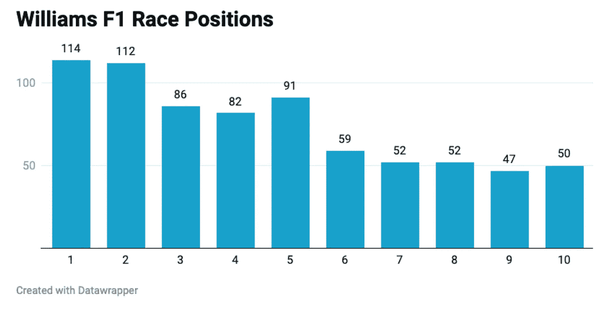

加上 128 个杆位，车队的血统变得更加清晰。

下面的图表显示了历年来每支车队赢得的累计冠军数，包括车手和车队冠军。

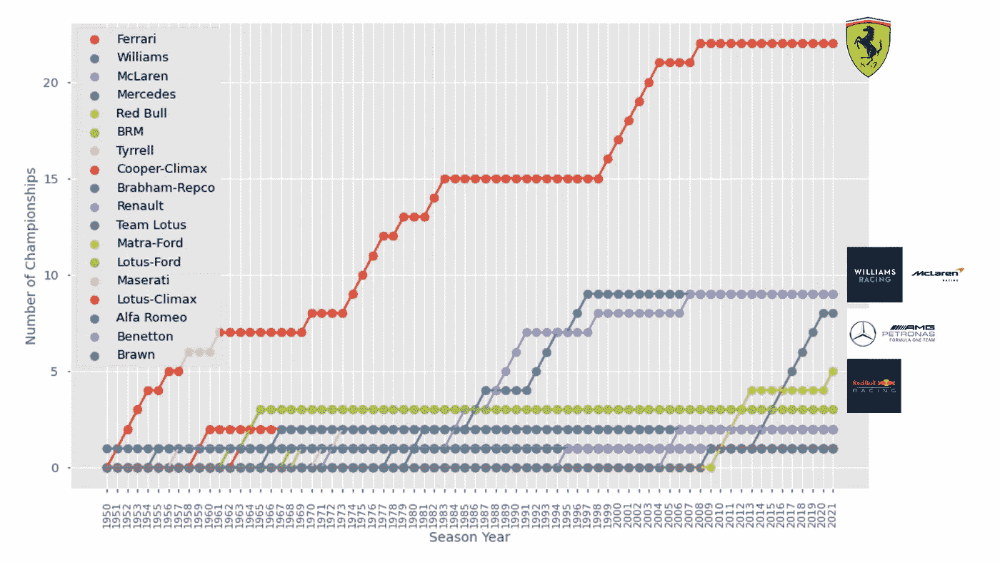

图片:克拉克·博伊德；数据:[卡格尔](https://www.kaggle.com/rohanrao/formula-1-world-championship-1950-2020)

从这张图表中，我们可以看到 F1 过去的一个简化故事。

法拉利在 20 世纪 50 年代赢得了多个车手冠军，但由于其不存在，在那些年里没有赢得车队冠军。车队冠军是在 1958 年才出现的。这有助于解释它在这里的 22 个标题的扩展计数。

威廉姆斯在 20 世纪 90 年代有一个非常多产的时期，用雷诺提供的引擎在六个赛季的时间里获得了五个车队冠军。

2013 年后，我们可以看到主宰 v6 turbo 时代的梅赛德斯车队令人印象深刻的崛起。自 2010 年以来，红牛和梅赛德斯赢得了所有车队的冠军。

2009 年，布朗赢得了冠军，然后梅赛德斯买下了他们，以启动他们的 F1 入口。

## 我们也可以注意到所有球队都经历的休整期。法拉利在 1961 年至 1974 年、1979 年至 2000 年和 2007 年至 2020 年期间表现不佳。老实说，他们很快就会把 2021 年加到这个名单上。

毫无疑问，威廉姆斯现在正经历着这样一个时期。下图显示了本世纪车队在车队积分榜上的位置频率。

第三是最常见的位置(4 次)，最后一次获得第三名是在 2015 年:

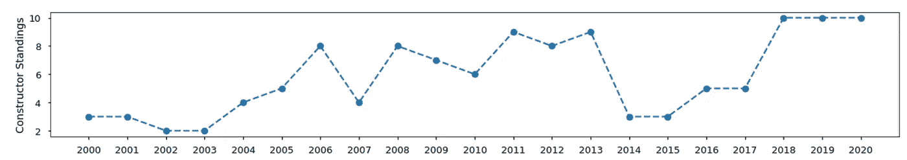

这只是故事的一小部分。两支车队(梅塞德斯和红牛)在这个领域遥遥领先，第三名可能并不意味着第三名的车队就在咫尺之遥。

下面的图表显示了每年领先的车队与威廉姆斯车队之间的差距:

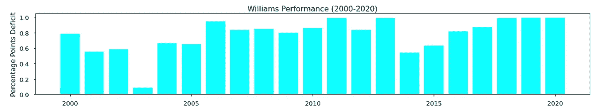

2015 年，威廉姆斯以 257 分获得第三名。奔驰以 703 分夺冠。

威廉姆斯因此获得了梅赛德斯 36.5%的积分，从领先者到威廉姆斯之间产生了 63.5%的差距。

2003 年，威廉姆斯以 142 分获得第二名，紧随法拉利 158 分之后。很重要的一点是，今天一场胜利所获得的分数明显不同(当时一场胜利只有 10 分)，但百分比赤字的计算仍然描绘了一幅有代表性的画面。

我们可以看看威廉姆斯每个赛季如何对抗领先的球队，以获得对球队停滞不前的进步的不同看法:

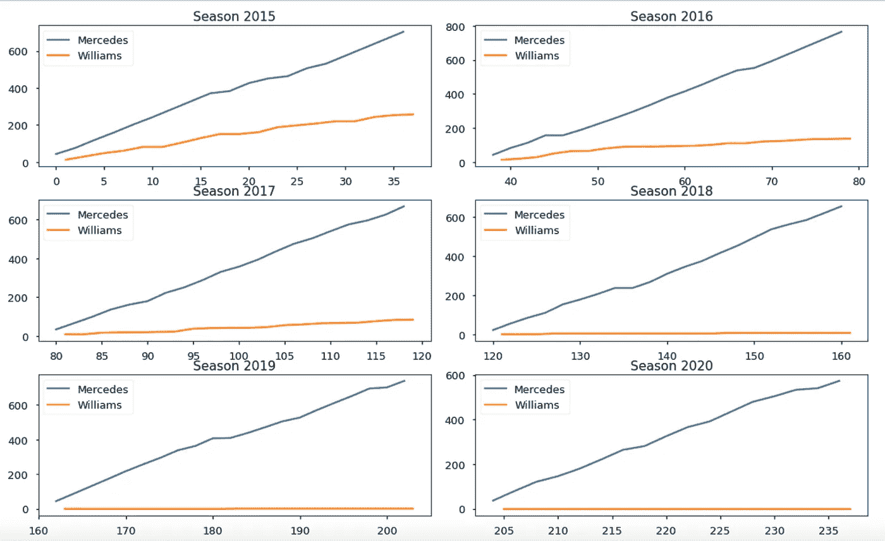

这些图表显示了每个赛季的积分累积情况。梅赛德斯以可靠、快速的速度获得积分，而威廉姆斯则在最近停滞不前。

正如詹姆斯·特洛曼的一些优秀作品[中所强调的，这种模式在本季再次上演:](https://www.kaggle.com/jtrotman/f1-race-traces-2021)

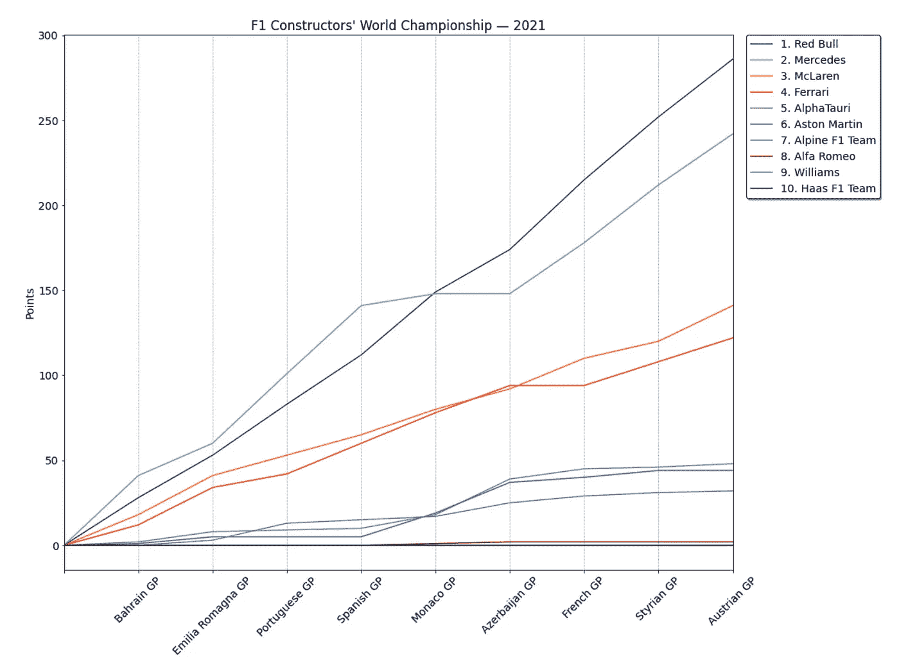

Trotman 也展示了一些来自各个种族的有启发性的图表。例如，我们可以在这里看到领先的车队如何脱离其他车队，并在 2020 年法国大奖赛上扩大其领先优势:

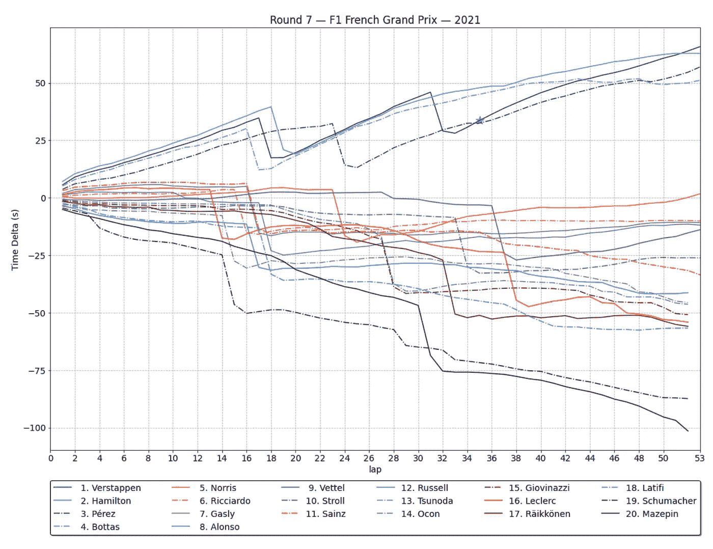

## 当然，只有戴上金融的帽子，你才能真正理解 F1。

最近几个赛季，威廉姆斯车队的预算是发车区最小的，这与它在方格旗的表现密切相关。

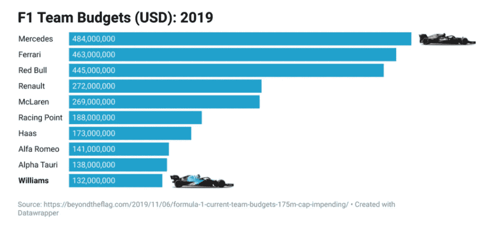

威廉姆斯怎么了？那发生了。

新的 1.45 亿美元的年度预算上限激励了较小的团队留在这项运动中，最终应该会导致更激烈的竞争。

不可否认的是，一些项目不受这一上限的限制，包括营销、司机工资和大约 20 个其他项目。

# 威廉姆斯:进步的迹象

随着 F1 即将发生翻天覆地的变化(更多内容见下文)，威廉姆斯将渴望在本赛季展示进步的迹象。

到目前为止，这种进步在排位赛中已经很明显了——特别是乔治·拉塞尔:

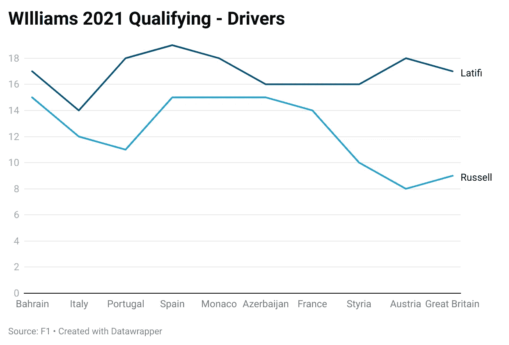

事实上，拉塞尔是今年迄今为止唯一一位在排位赛中击败队友(加拿大人尼古拉斯·拉蒂菲)的车手。

然而，当灯光熄灭时，威廉姆斯面临的挑战也随之增加。拉塞尔仅在第一圈就平均失去了 1.44 个位置，这或许表明他正在为一个出色的排位赛圈竭尽全力。

到目前为止，拉塞尔在今年的第一圈比赛中总共失去了 13 个位置。

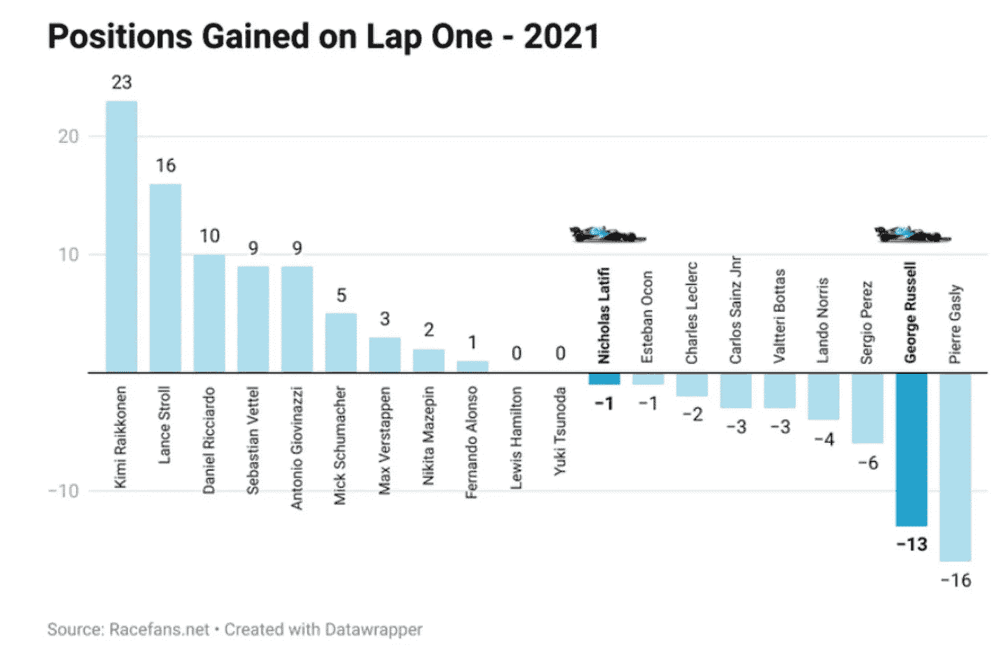

尽管如此，威廉姆斯车队确实在英国大奖赛上完成了最快的进站，所以他们在那里补上了一点时间。

下面，我画出了四位车手(汉密尔顿、维斯塔彭、拉塞尔、拉蒂菲)本赛季在每个位置上的总圈数:

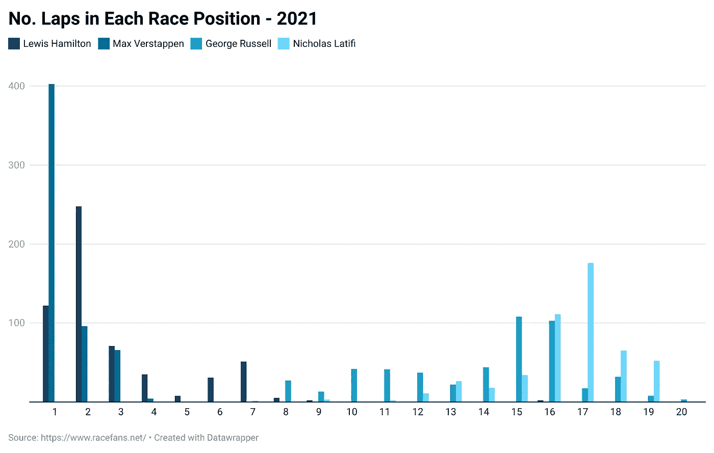

做这样的比较似乎很残酷，但我被 Verstappen 对今年比赛的指挥所打动。他本赛季领先了总圈数的 70%,如果不是因为第一圈与汉密尔顿的事故，他肯定会在英国大奖赛上增加总圈数。

再往下，我们看到罗素经常胜过他的队友拉蒂菲。据传闻，26 岁的拉蒂菲每年可获得 2000 万至 4000 万美元的赞助费。他的父亲是加拿大第三大食品公司 Sofina 的创始人。他不是一个糟糕的司机，但罗素显然是卓越的人才。

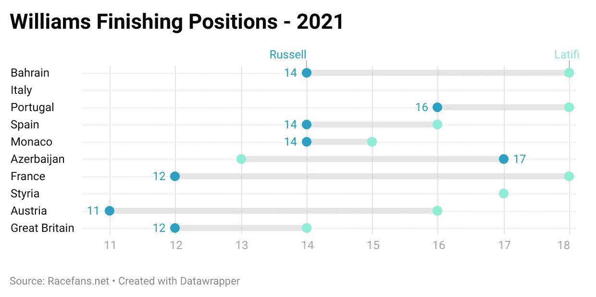

如果拉塞尔继续他最近的状态，他只会吸引梅赛德斯车队更多的关注。

威廉姆斯车队与其引擎供应商(梅赛德斯)建立了更紧密的联系，关于拉塞尔将成为汉密尔顿车队二号车手的传言也越来越多。

## 然而拉塞尔的状态对威廉姆斯来说可能是双赢的。

他们的头号车手可能会离开，但他会在这个过程中展示赛车的能力。威廉姆斯对明年有着雄心勃勃的计划，这将由本赛季剩下的比赛中更好的表现来推动。如果拉塞尔获得了梅塞德斯的驾驶权，那么从逻辑上来说，瓦尔特利·博塔斯(前威廉姆斯车手)将会接受报价。

# 2022 赛季

2022 赛季将会看到 F1 赛车的大量变化，许多人认为这是这项运动历史上最大的改革。正如我们在上面看到的，有一小群资金极其充足的车队主导着今天的 F1。一旦他们到了前面，超车是有限的。

这限制了这项运动对更广泛观众的吸引力，无论是观众还是赞助商。

预算上限将迫使团队创造性地思考，但 2022 年也带来了新的技术规则，试图改善这一奇观。

正如 f1 首席技术官帕特·西蒙兹最近所说:

> “‘尾流’是超车问题的关键。当高速行驶时，F1 赛车会产生湍流空气，并向外扩散，以免干扰尾翼。由此产生的尾流会显著降低后车的下压力(将汽车“粘”在路面上)，并导致重要系统过热，从而影响后车。因此，很难靠得足够近来尝试超车，甚至在弯道中跟随另一辆车。”

f1 还聘请了一名首席设计师来帮助提升赛车的美学吸引力。F1 网站上有一篇关于新车[的精彩报道。](https://www.formula1.com/en/latest/article.10-things-you-need-to-know-about-the-all-new-2022-f1-car.4OLg8DrXyzHzdoGrbqp6ye.html)

我们从 F1 赛车的历史开始，这表明规则的重大变革会动摇秩序。当新规则开始生效时，各队尽可能地争取优势。布朗在 2009 年做到了这一点，梅赛德斯从 2014 年开始在新时代掌握了主动权。

如果我们看看 2014 年的锦标赛，我们可以看到每支球队的表现与他们对上一年锦标赛的预测表现的对比。

线以上的人表现超出预期:

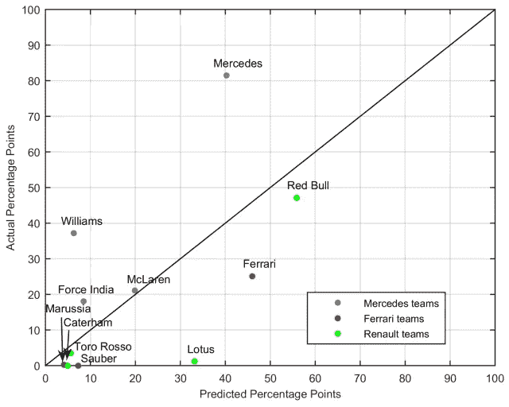

这并不是说奔驰这次会重复这一壮举；更确切地说，一家制造商可能会比其他制造商更早地破解代码。

威廉姆斯可能不再位于发车区的前面，但它可以在 2022 年利用梅赛德斯赛车后面改进的滑流。

## 如果它能在 2021 年继续取得积极的成绩——不仅在排位赛中，而且在比赛中——2022 年可能是威廉姆斯复兴的真正开始。